# 如何在 Windows 上为 Java 安装 Selenium WebDriver？

> 原文:[https://www . geesforgeks . org/如何安装-selenium-web driver-on-windows-for-Java/](https://www.geeksforgeeks.org/how-to-install-selenium-webdriver-on-windows-for-java/)

[Selenium](https://www.geeksforgeeks.org/selenium-python-tutorial/) 是一个用于自动化测试 web 应用程序的开源工具，是免费的，它支持各种编程语言，如 C#、Java、Perl、PHP、Python 和 Ruby。Selenium Webdrive 最为人所知，或者你可以说是以 Java 闻名至今。

在本文中，我们将研究如何在 Windows 操作系统上安装 selenium Webdriver。

硒网络驱动程序的安装可以分三步完成:

*   [下载安装 Java](https://www.geeksforgeeks.org/how-to-download-and-install-java-for-64-bit-machine/)
*   [下载安装 Eclipse IDE](https://www.geeksforgeeks.org/how-to-download-and-install-eclipse-on-windows/)
*   下载并安装硒网络驱动程序

## 下载和安装 Java:

按照以下步骤在您的 Windows 系统上安装 Java:

**第一步:**首先去  甲骨文[官网](https://www.oracle.com/java/technologies/javase-downloads.html)下载 Java。

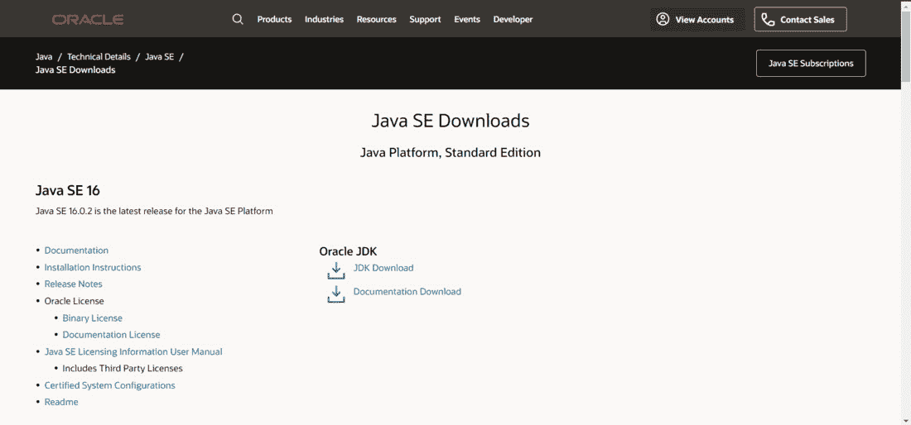

点击 JDK 下载

**第二步:**然后点击 JDK 下载下载，然后根据你的系统点击你想下载的那个，即 32 位或 64 位版本。

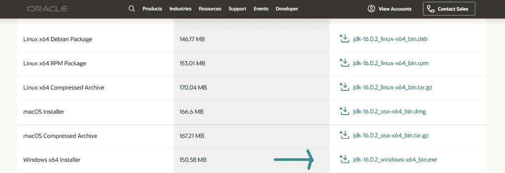

选择版本

**第三步:**然后只要执行安装程序，Java 就会下载到你的系统中。

### **下载并安装 Eclipse IDE:**

按照以下步骤下载并安装 Eclipse 集成开发环境:

**第一步:**第一步，前往[Eclipse 官方网站](https://www.eclipse.org/)点击下载按钮。

点击“下载”

**第二步:**现在，点击**下载 x86_64** 按钮。

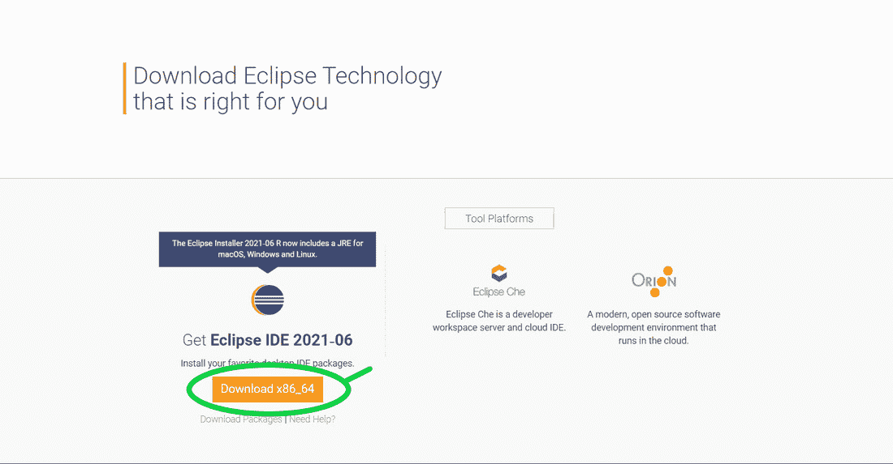

下载 x86_64

**第三步:**下载完成后，安装时点击**【Java 开发者 Eclipse】**，之后点击**安装**，安装后会是这个样子。

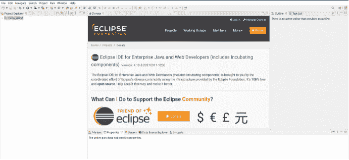

Eclipse 集成开发环境主页

### **下载安装 Selenium 网络驱动程序:**

按照以下步骤为 java 安装 selenium webdriver:

**第一步:**首先打开浏览器，使用此链接进入[硒官方网站](https://www.selenium.dev/downloads/):

**第二步:**现在下载 Selenium WebDriver Java 客户端，如下图所示。

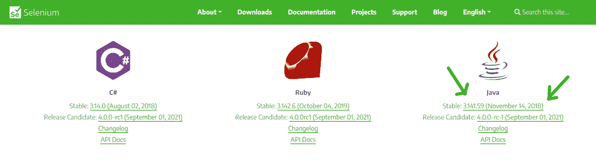

下载 Java 客户端

**第三步:**下载完 zip 文件后**解压**文件。

**第四步:**点击左上角**文件**在 Eclipse IDE 中创建新的 java 项目，然后点击**【新建】**按钮，点击**【java 项目】**创建新的 Java 项目，如下图所示:

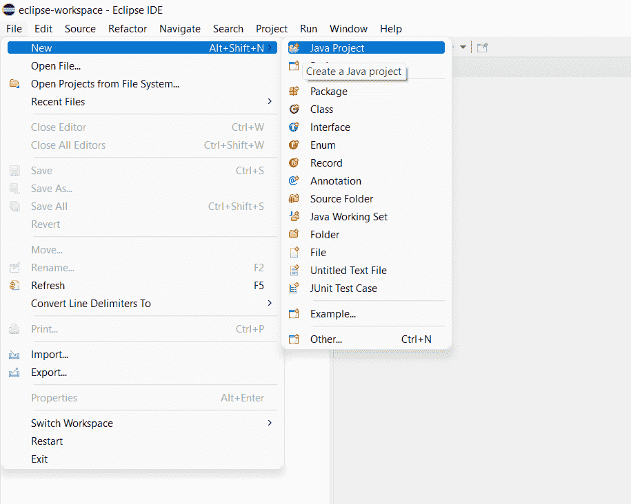

创建 java 项目

**第五步:**现在在**【项目名称】**部分输入 Java 项目的名称，选择要保存项目文件的目录，并保持不变，如图所示:

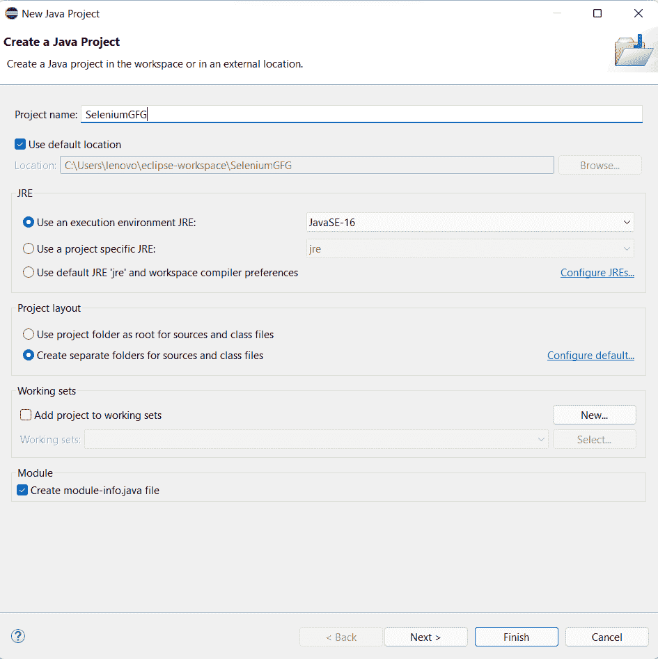

硒的项目配置

**第 6 步:**现在通过右键单击*项目名称- >新建- >类*创建一个 java 类，并创建一个任意名称的类，例如 Demo。这里，我们用类名*【GFG】:*创建

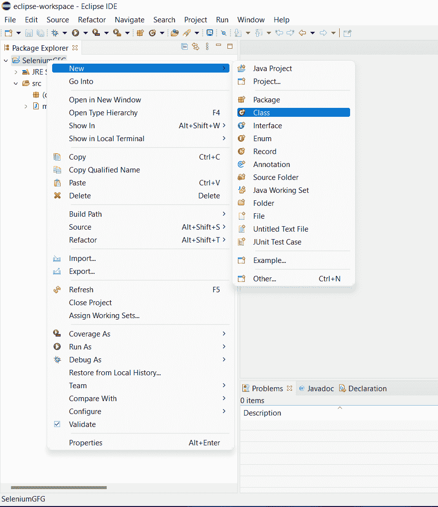

5.接下来，点击您的*项目- >构建路径- >配置构建路径*并添加*外部 JARs* ，如图所示。

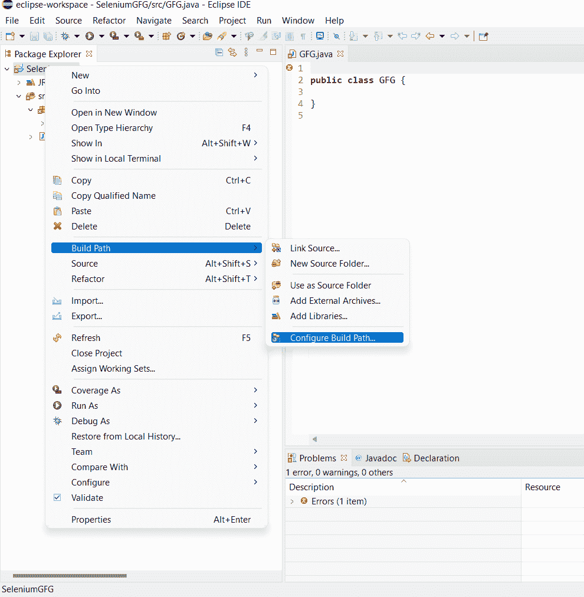

配置生成路径

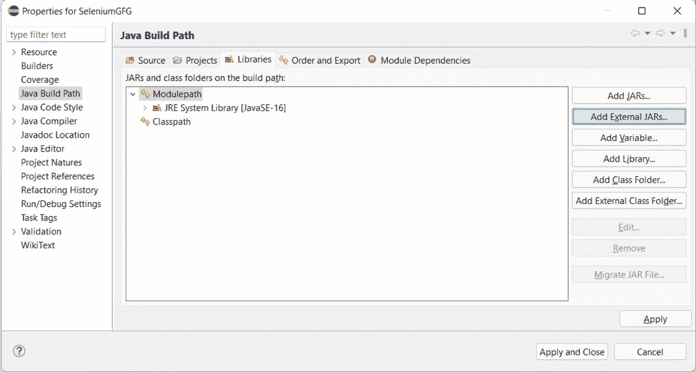

Java 路径构建

**第六步:**现在，转到你为 java 下载的文件 Selenium 解压的文件夹，选择名为***【lib】的文件夹中存在的所有 jar 文件。***

**第 7 步:**然后只需点击**应用**并在插入所有的 jar 文件后关闭，您就可以开始了，因为您已经成功地在项目中添加了 Selenium jars。

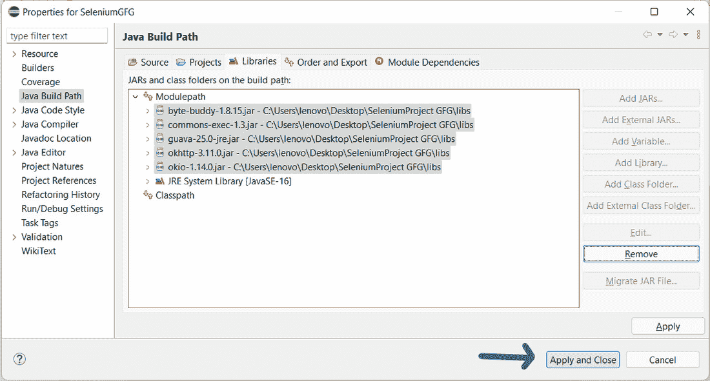

在您的项目中成功添加了硒罐

因此，我们已经通过 Eclipse IDE 成功地配置了 Selenium 网络驱动程序。现在，我们可以在 Eclipse 中编写测试脚本，并在网络驱动程序中运行它们。