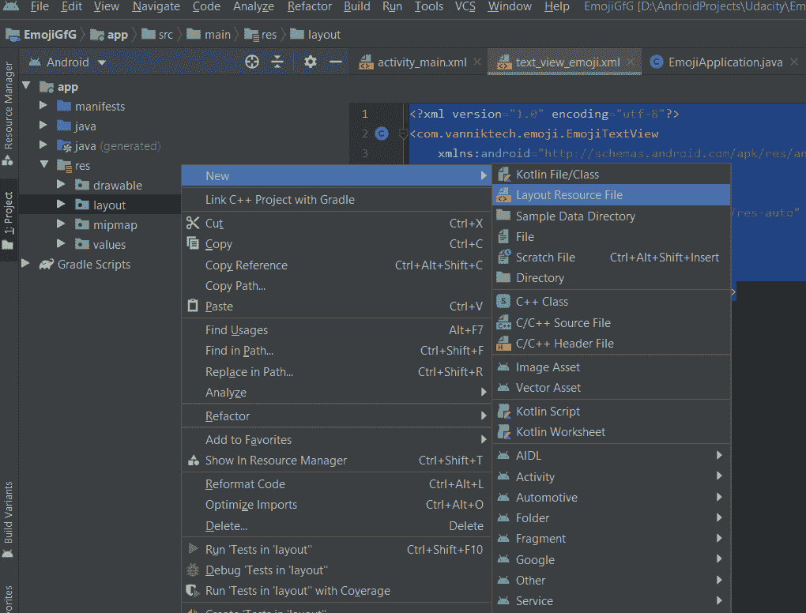
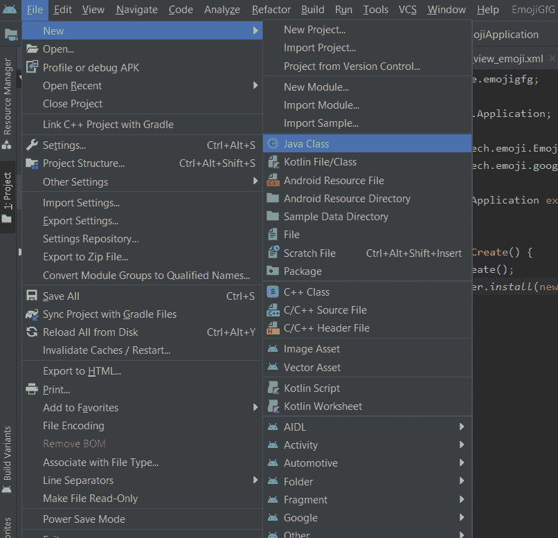

# 如何在安卓应用中集成表情符号？

> 原文:[https://www . geesforgeks . org/how-integrate-emo jis in a-Android-app/](https://www.geeksforgeeks.org/how-to-integrate-emojis-in-an-android-app/)

**表情符号**当然会让 app 的互动更加有趣好玩。在本文中，让我们学习如何通过创建一个看起来像消息应用程序的简单应用程序，在我们自己的安卓应用程序中添加表情符号。

**我们为什么需要表情符号？**

*   它使应用程序看起来更加用户友好和有趣。
*   如果应用功能用于建立交流，表情符号肯定有助于表达用户的感受。
*   它可以用来询问用户对应用程序的反馈。


### **接近**

**第一步:新建安卓工作室项目**

在安卓工作室创建新项目请参考 [**【如何在安卓工作室创建/启动新项目】**](https://www.geeksforgeeks.org/android-how-to-create-start-a-new-project-in-android-studio/) 。**注意，选择** [**Java**](https://www.geeksforgeeks.org/java/) **作为编程语言。**

**第二步:添加以下依赖项进行构建. gradle(:app)**

为了在 app 中使用表情符号，将其依赖项添加到 [build.gradle(:app)](https://www.geeksforgeeks.org/android-build-gradle/) 文件中。添加三个依赖项中的任意一个**:**

> 实现' com . vanniktech:emoji-Google:0 . 6 . 0 '
> 
> 实现' com.vanniktech:emoji-ios:0.6.0 '
> 
> 实现' com . vanniktech:emoji-Twitter:0 . 6 . 0 '

每个依赖项表示我们正在导入的表情集。也就是说，要么来自 **ios** ，要么来自**谷歌**，要么来自**推特**。

**第三步:使用 activity_main.xml 文件**

在本例中，让应用程序看起来像聊天应用程序。为此，使用两个 [**按钮**](https://www.geeksforgeeks.org/button-in-kotlin/) 。一个添加表情符号，一个发送信息。另外添加一个 [**编辑文本**](https://www.geeksforgeeks.org/edittext-widget-in-android-using-java-with-examples/) ，用户可以在其中输入消息。这就是 **activity_main.xml** 的样子:

## activity_main.xml

```java
<?xml version="1.0" encoding="utf-8"?>
<androidx.constraintlayout.widget.ConstraintLayout 
    xmlns:android="http://schemas.android.com/apk/res/android"
    xmlns:app="http://schemas.android.com/apk/res-auto"
    xmlns:tools="http://schemas.android.com/tools"
    android:id="@+id/rootView"
    android:layout_width="match_parent"
    android:layout_height="match_parent"
    android:background="#43a047"
    android:padding="8dp"
    tools:context=".MainActivity">

    <LinearLayout
        android:id="@+id/llTextViews"
        android:layout_width="match_parent"
        android:layout_height="0dp"
        android:orientation="vertical"
        app:layout_constraintBottom_toTopOf="@id/etEmoji"
        app:layout_constraintTop_toTopOf="parent"
        app:layout_constraintStart_toStartOf="parent"
        app:layout_constraintEnd_toEndOf="parent">
    </LinearLayout>

    <com.vanniktech.emoji.EmojiEditText
        android:id="@+id/etEmoji"
        android:layout_width="0dp"
        android:layout_height="wrap_content"
        android:hint="Say something to GeeksForGeeks..."
        app:emojiSize="30sp"
        android:textColor="@android:color/white"
        app:layout_constraintBottom_toBottomOf="parent"
        app:layout_constraintEnd_toStartOf="@id/btnEmojis"
        app:layout_constraintStart_toStartOf="parent"/>

    <Button
        android:id="@+id/btnEmojis"
        android:layout_width="wrap_content"
        android:layout_height="wrap_content"
        android:text="Emojis"
        app:layout_constraintEnd_toStartOf="@id/btnSend"
        app:layout_constraintTop_toTopOf="@id/etEmoji"
        app:layout_constraintBottom_toBottomOf="@id/etEmoji"/>

    <Button
        android:id="@+id/btnSend"
        android:layout_width="wrap_content"
        android:layout_height="wrap_content"
        android:text="Send"
        app:layout_constraintEnd_toEndOf="parent"
        app:layout_constraintTop_toTopOf="@id/etEmoji"
        app:layout_constraintBottom_toBottomOf="@id/etEmoji"/>

</androidx.constraintlayout.widget.ConstraintLayout>
```

**第四步:创建一个名为 text_view_emoji.xml 的布局文件**

创建一个布局来定义表情应该是什么样子。它的主要目的是定义表情符号的大小。它还会显示我们发送的信息。点击**app**->**RES**->**布局**(右键)- > **新建** - > **布局资源文件，新建布局。**



将其命名为 **text_view_emoji** 。这就是**的样子:**

## text_view_emoji.xml

```java
<?xml version="1.0" encoding="utf-8"?>
<com.vanniktech.emoji.EmojiTextView
    xmlns:android="http://schemas.android.com/apk/res/android"
    android:layout_width="wrap_content"
    android:layout_height="wrap_content"
    xmlns:app="http://schemas.android.com/apk/res-auto"
    android:layout_marginBottom="16dp"
    app:emojiSize="30sp"
    android:textSize="30sp"
    android:textColor="@android:color/white"/>
```

**第五步:创建一个名为 EmojiApplication** 的类

根据用户想要的表情集，在这里设置相应的提供。通过在这里设置**表情管理器**，确保用户可以在应用的任何地方使用它们。要创建一个新类，点击:**文件** - > **新** - > **Java 类**。



将其命名为 **EmojiApplication** 。这就是**EmojiApplication.java**的样子:

## EmojiApplication.java

```java
import android.app.Application;

import com.vanniktech.emoji.EmojiManager;
import com.vanniktech.emoji.google.GoogleEmojiProvider;

public class EmojiApplication extends Application {

    @Override
    public void onCreate() {
        super.onCreate();
        EmojiManager.install(new GoogleEmojiProvider());
    }
}
```

**注意:**不要忘记在[**androidmanifest . XML**](https://www.geeksforgeeks.org/application-manifest-file-android/)文件中添加这个新类。这就是 **AndroidManifest.xml** 添加后的样子:

## AndroidManifest.xml

```java
<manifest xmlns:android="http://schemas.android.com/apk/res/android"
    package="com.example.emojigfg">

    <application
        android:name=".EmojiApplication"
        android:allowBackup="true"
        android:icon="@mipmap/ic_launcher"
        android:label="@string/app_name"
        android:roundIcon="@mipmap/ic_launcher_round"
        android:supportsRtl="true"
        android:theme="@style/AppTheme">
        <activity android:name=".MainActivity">
            <intent-filter>
                <action android:name="android.intent.action.MAIN" />

                <category android:name="android.intent.category.LAUNCHER" />
            </intent-filter>
        </activity>
    </application>

</manifest>
```

**步骤 6:使用 MainActivity.java 文件**

在这里，编写一个函数来膨胀 **EmojiTextView** 。**layoutinfoalter**用于将用 XML 编写的**视图**或 [**视图组**](https://www.geeksforgeeks.org/android-ui-layouts/) 转换为可以在代码中使用的 Java 视图。另外，在这里设置 **onCreate()** 功能。经历了所有这些变化后，这就是**MainActivity.java**的样子:

## MainActivity.java

```java
import androidx.appcompat.app.AppCompatActivity;
import android.os.Bundle;
import android.view.LayoutInflater;
import android.view.View;
import android.widget.Button;
import android.widget.EditText;
import android.widget.LinearLayout;
import com.vanniktech.emoji.EmojiPopup;
import com.vanniktech.emoji.EmojiTextView;

public class MainActivity extends AppCompatActivity {
    EditText etEmoji;
    LinearLayout llTextViews;

    @Override
    protected void onCreate(Bundle savedInstanceState) {
        super.onCreate(savedInstanceState);
        setContentView(R.layout.activity_main);
        etEmoji=findViewById(R.id.etEmoji);
        llTextViews=findViewById(R.id.llTextViews);

        final EmojiPopup popup = EmojiPopup.Builder
                .fromRootView(findViewById(R.id.rootView)).build(etEmoji);

        Button btnEmojis=findViewById(R.id.btnEmojis);
        btnEmojis.setOnClickListener(new View.OnClickListener() {
            @Override
            public void onClick(View view) {
                popup.toggle();
            }
        });

        Button btnSend=findViewById(R.id.btnSend);
        btnSend.setOnClickListener(new View.OnClickListener() {
            @Override
            public void onClick(View view) {
                llTextViews.addView(getEmojiTextView());
                etEmoji.getText().clear();
            }
        });
    }

    private EmojiTextView getEmojiTextView() {
        EmojiTextView tvEmoji = (EmojiTextView) LayoutInflater
                .from(getApplicationContext())
                .inflate(R.layout.text_view_emoji, llTextViews,false);
        tvEmoji.setText(etEmoji.getText().toString());
        return tvEmoji;
    }
}
```

### **输出:在仿真器上运行**

<video class="wp-video-shortcode" id="video-481197-1" width="640" height="360" preload="metadata" controls=""><source type="video/mp4" src="https://media.geeksforgeeks.org/wp-content/uploads/20200902133350/Android-Emulator---Pixel_2_API_29_5554-2020-09-02-13-30-43_Trim.mp4?_=1">[https://media.geeksforgeeks.org/wp-content/uploads/20200902133350/Android-Emulator---Pixel_2_API_29_5554-2020-09-02-13-30-43_Trim.mp4](https://media.geeksforgeeks.org/wp-content/uploads/20200902133350/Android-Emulator---Pixel_2_API_29_5554-2020-09-02-13-30-43_Trim.mp4)</video>