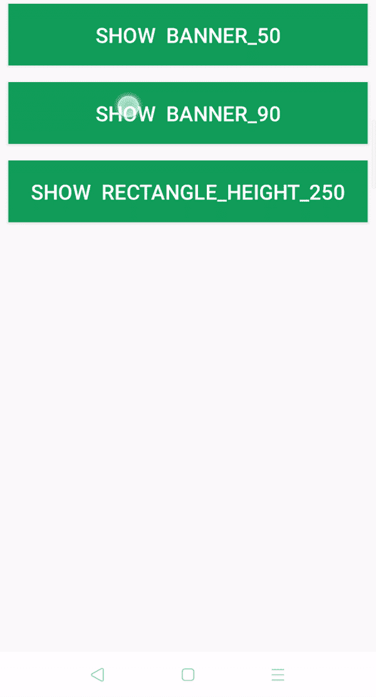

# 如何在安卓系统中整合脸书观众网(FAN)横幅广告？

> 原文:[https://www . geesforgeks . org/如何整合-Facebook-受众-网络-粉丝-横幅-安卓广告/](https://www.geeksforgeeks.org/how-to-integrate-facebook-audience-network-fan-banner-ads-in-android/)

为了从[安卓](https://www.geeksforgeeks.org/android-app-development-fundamentals-for-beginners/)应用或游戏中赚钱，有很多方式，如应用内购买、赞助、广告等。但是还有一种从安卓应用中赚钱的流行方法是整合第三方广告，例如名为 [**的脸书观众网络。**](https://developers.facebook.com/products/audience-network/) 脸书观众网旨在帮助用户体验货币化。通过使用高价值的格式、高质量的广告、和创新的出版商工具，它有助于在保持人们参与的同时发展业务。

#### **为什么是脸书观众网？**

*   脸书观众网是谷歌广告业务货币化安卓或 IOS 应用的最佳选择之一。
*   最低支付额为 **$100**
*   广泛的广告格式
*   最大填充率
*   高 **eCPM** (每千分之一有效成本)
*   优质广告
*   个性化广告

#### **脸书观众网**业态

在脸书观众网络中，主要有五种灵活、高性能的格式

*   **原生:**你设计的适合应用的广告，无缝衔接
*   **间隙:**吸引眼球并成为体验一部分的全屏广告。
*   **横幅:**传统业态多种摆放。
*   [**有奖视频**](https://www.geeksforgeeks.org/how-to-integrate-facebook-audience-network-fan-rewarded-video-ads-in-android/) **:** 一款沉浸式、用户发起的视频广告，奖励用户观看。
*   **Playables:** 先试后买的广告体验，允许用户在安装前预览游戏。

在本文中，让我们将**脸书观众网络横幅广告**整合到安卓应用中。**横幅广告**是一个矩形的图像或文字广告，在应用布局中占据很小的空间。横幅广告易于实现，不影响用户界面，逐渐增加收入。



### 方法

#### **第一步:创建**新的**项目**

要在安卓工作室创建新项目，请参考[如何在安卓工作室创建/启动新项目。](https://www.geeksforgeeks.org/android-how-to-create-start-a-new-project-in-android-studio/)注意选择 **Java** 作为语言，虽然我们要用 Java 语言实现这个项目。

#### **第二步:**去编码区之前先做一些前置任务

*   转到**应用程序->RES->values->colors . XML**文件，为应用程序设置颜色。

## colors.xml

```
<?xml version="1.0" encoding="utf-8"?>
<resources>
    <color name="colorPrimary">#0F9D58</color>
    <color name="colorPrimaryDark">#0F9D58</color>
    <color name="colorAccent">#05af9b</color>
</resources>
```

*   转到**Gradle Scripts->**[**build . Gradle(模块:app)**](https://www.geeksforgeeks.org/android-build-gradle/) 部分，导入以下依赖项，点击上方弹出的“**立即同步”**。

> 实现' com.facebook.android:受众-网络-sdk:5。+'

*   转到 **app - >清单- > AndroidManifests.xml** 部分，允许“[互联网许可](https://www.geeksforgeeks.org/android-how-to-request-permissions-in-android-application/)”。

#### **第三步:设计 UI**

在 **activity_main.xml** 文件中，只使用了三个 Buttons。因此，每当用户点击该按钮时，所需的横幅广告就会弹出。为了包含横幅广告，在 XML 文件中添加了一个[线性布局](https://www.geeksforgeeks.org/android-linearlayout-in-kotlin/)。这是**活动文件的代码。**

## activity_main.xml

```
<?xml version="1.0" encoding="utf-8"?>
<RelativeLayout xmlns:android="http://schemas.android.com/apk/res/android"
    xmlns:tools="http://schemas.android.com/tools"
    android:layout_width="match_parent"
    android:layout_height="match_parent"
    tools:context=".MainActivity">

    <!-- Button to Show BANNER_50 Ad By Clicking it -->
    <Button
        android:id="@+id/banner_50"
        android:layout_width="match_parent"
        android:layout_height="wrap_content"
        android:layout_margin="40dp"
        android:background="@color/colorPrimary"
        android:padding="16dp"
        android:text="Show  BANNER_50"
        android:textColor="#ffff"
        android:textSize="24dp" />

    <!-- Button to Show BANNER_90 Ad By Clicking it -->
    <Button
        android:id="@+id/banner_90"
        android:layout_width="match_parent"
        android:layout_height="wrap_content"
        android:layout_below="@id/banner_50"
        android:layout_margin="40dp"
        android:background="@color/colorPrimary"
        android:padding="16dp"
        android:text="Show  BANNER_90"
        android:textColor="#ffff"
        android:textSize="24dp" />

    <!-- Button to Show RECTANGLE_HEIGHT_250 Ad By Clicking it -->
    <Button
        android:id="@+id/banner_250"
        android:layout_width="match_parent"
        android:layout_height="wrap_content"
        android:layout_below="@id/banner_90"
        android:layout_margin="40dp"
        android:background="@color/colorPrimary"
        android:padding="16dp"
        android:text="Show  RECTANGLE_HEIGHT_250"
        android:textColor="#ffff"
        android:textSize="24dp" />

    <!-- LinearLayout to contain the Banner Ads -->
    <LinearLayout
        android:id="@+id/fb_banner_ad_container"
        android:layout_width="match_parent"
        android:layout_height="wrap_content"
        android:layout_alignParentBottom="true"
        android:orientation="vertical" />

</RelativeLayout>
```

#### **第四步:使用 MainActivity.java 文件**

*   打开类内的 MainActivity.java 文件，首先创建**按钮**类的对象。

> //创建按钮类的对象
> 
> 按钮 fbBanner_50、fbBanner_90、fbbanner _ 250

*   现在在 **onCreate()** 方法中，将这些对象与在 **activity_main.xml** 文件中给出的它们各自的标识链接起来。

> //将这些对象与我们在 activity_main.xml 文件中给出的它们各自的 id 链接起来
> 
> fbBanner_50 = （Button）findViewById（R.id.banner_50）;
> 
> fbBanner_90 = （Button）findViewById（R.id.banner_90）;
> 
> fbBanner_250 = （Button）findViewById（R.id.banner_250）;

*   现在在 **onCreate()** 方法里面，初始化**脸书观众网 SDK**

> //初始化受众网络软件开发工具包
> 
> audiencenetworkads . initialize(this)；

*   在 **之外创建一个私有虚空 **showBanner()** 方法并定义它。**
*   **【showBanner()**方法以 AdSize 为自变量，展示不同广告大小的横幅

> 私有 void showBanner(AdSize adSize)
> 
> {
> 
> //创建 AdView 的对象
> 
> adview bannerad
> 
> //初始化 AdView 对象
> 
> // AdView 构造函数接受 3 个参数
> 
> // 1)上下文
> 
> // 2)放置标识
> 
> // 3)AdSize
> 
> bannerAd = new AdView(此“IMG _ 16 _ 9 _ APP _ INSTALL # YOUR _ PLACEMENT _ ID”，adSize)；
> 
> //创建和初始化包含广告的线性布局
> 
> linear layout adlline container =(linear layout)findviewbyid(r . id . FB _ banner _ ad _ container)；
> 
> //删除线形布局中的视图
> 
> adlinecontainer . removeall viewsinlayout()；
> 
> //向 linearLayoutContainer 添加广告
> 
> adlline container . add view(banner ad)；
> 
> //加载 Ad
> 
> bannerad.loadad()：
> 
> }

> **注:**将“**IMG _ 16 _ 9 _ APP _ INSTALL # YOUR _ PLACEMENT _ ID”**替换为自己的 placement id，展示真实广告。

*   所以接下来就是当用户点击相应的横幅广告按钮时，调用**【showBanner()**方法。
*   现在在 **oncreate()** 方法中创建一个 **ClickListener** 为所有三个按钮并调用**showBanner()****用不同的 **AdSize。****

> **//单击监听器显示 Banner_50 Ad**
> 
> **fbbanner _ 50 . setonclicklistener(新视图)。onclicklistener()& gt**
> 
> **@覆盖**
> 
> **公共空间单击(查看视图){ 0**
> 
>  **showBanner(AdSize。BANNER _ HEIGHT _ 50)；
> 
> }
> 
> });
> 
> //单击监听器显示 Banner_90 Ad
> 
> fbbanner _ 90 . setonclicklistener(新视图)。onclicklistener()& gt
> 
> @覆盖
> 
> 公共空间单击(查看视图){ 0
> 
> showBanner(AdSize。BANNER _ HEIGHT _ 90)；
> 
> }
> 
> });
> 
> //单击监听器显示 Banner_250 Ad
> 
> fbbanner _ 250 . setonclicklistener(新视图)。onclicklistener()& gt
> 
> @覆盖
> 
> 公共空间单击(查看视图){ 0
> 
> showBanner(AdSize。矩形 _ 高度 _ 250)；
> 
> }
> 
> });**

*   **现在调用**setAdListener()****进行 Banner Ad，这样用户就知道广告的状态了。要添加 **adListener** 打开**showBanner()****方法，在 **bannerAd.loadAd()前添加以下代码；********

> ****adlistener 横幅****
> 
> ****banner ad . setdlistener(new adllister())。****
> 
> ****@覆盖****
> 
>  ****public void onerror(例如 aderor ader error)}
> 
> //显示祝酒词
> 
> 吐司. makeText(MainActivity.this，“onError”，吐司。LENGTH_SHORT)。show()；
> 
> }
> 
> @覆盖
> 
> 公共 void OnAdloaded(Ad Ad){ 0
> 
> //显示祝酒词
> 
> 吐司. makeText(MainActivity.this，“onAdLoaded”，吐司。LENGTH_SHORT)。show()；
> 
> }
> 
> @覆盖
> 
> 公共空间
> 
> //显示祝酒词
> 
> 吐司. makeText(MainActivity.this，“onAdClicked”，吐司。LENGTH_SHORT)。show()；
> 
> }
> 
> @覆盖
> 
> public 请参阅 onlogingimpression(ad)}
> 
> //显示祝酒词
> 
> Toast . make text(main activity . this，“onLoggingImpression”，Toast。LENGTH_SHORT)。show()；
> 
> }
> 
> });****

*   ****并且在**广告监听器**里面覆盖方法显示[敬酒信息](https://www.geeksforgeeks.org/android-what-is-toast-and-how-to-use-it-with-examples/)让用户知道广告的状态。下面是 MainActivity.java 文件的完整代码。****

## ****MainActivity.java****

```
**package org.geeksforgeeks.project;

import android.os.Bundle;
import android.view.View;
import android.widget.Button;
import android.widget.LinearLayout;
import android.widget.Toast;
import androidx.appcompat.app.AppCompatActivity;
import com.facebook.ads.Ad;
import com.facebook.ads.AdError;
import com.facebook.ads.AdListener;
import com.facebook.ads.AdSize;
import com.facebook.ads.AdView;
import com.facebook.ads.AudienceNetworkAds;

public class MainActivity extends AppCompatActivity {

    // Creating a objects of Button class
    Button fbBanner_50, fbBanner_90, fbBanner_250;

    @Override
    protected void onCreate(Bundle savedInstanceState)
    {
        super.onCreate(savedInstanceState);
        setContentView(R.layout.activity_main);

        // link those objects with their respective id's
        // that we have given in activity_main.xml file
        fbBanner_50 = (Button)findViewById(R.id.banner_50);
        fbBanner_90 = (Button)findViewById(R.id.banner_90);
        fbBanner_250
            = (Button)findViewById(R.id.banner_250);

        // initializing the Audience Network SDK
        AudienceNetworkAds.initialize(this);

        // click listener to show Banner_50 Ad
        fbBanner_50.setOnClickListener(
            new View.OnClickListener() {
                @Override public void onClick(View view)
                {
                    showBanner(AdSize.BANNER_HEIGHT_50);
                }
            });

        // click listener to show Banner_90 Ad
        fbBanner_90.setOnClickListener(
            new View.OnClickListener() {
                @Override public void onClick(View view)
                {
                    showBanner(AdSize.BANNER_HEIGHT_90);
                }
            });

        // click listener to show Banner_250 Ad
        fbBanner_250.setOnClickListener(
            new View.OnClickListener() {
                @Override public void onClick(View view)
                {
                    showBanner(AdSize.RECTANGLE_HEIGHT_250);
                }
            });
    }

    private void showBanner(AdSize adSize)
    {
        // creating object of AdView
        AdView bannerAd;

        // initializing AdView Object
        // AdView Constructor Takes 3 Arguments
        // 1)Context
        // 2)Placement Id
        // 3)AdSize
        bannerAd = new AdView(
            this, "IMG_16_9_APP_INSTALL#YOUR_PLACEMENT_ID",
            adSize);

        // Creating and initializing LinearLayout which
        // contains the ads
        LinearLayout adLinearContainer
            = (LinearLayout)findViewById(
                R.id.fb_banner_ad_container);

        // removing the views inside linearLayout
        adLinearContainer.removeAllViewsInLayout();

        // adding ad to the linearLayoutContainer
        adLinearContainer.addView(bannerAd);

        // banner AdListener
        bannerAd.setAdListener(new AdListener() {
            @Override
            public void onError(Ad ad, AdError adError)
            {
                // Showing a toast message
                Toast
                    .makeText(MainActivity.this, "onError",
                              Toast.LENGTH_SHORT)
                    .show();
            }

            @Override public void onAdLoaded(Ad ad)
            {
                // Showing a toast message
                Toast
                    .makeText(MainActivity.this,
                              "onAdLoaded",
                              Toast.LENGTH_SHORT)
                    .show();
            }

            @Override public void onAdClicked(Ad ad)
            {
                // Showing a toast message
                Toast
                    .makeText(MainActivity.this,
                              "onAdClicked",
                              Toast.LENGTH_SHORT)
                    .show();
            }

            @Override public void onLoggingImpression(Ad ad)
            {
                // Showing a toast message
                Toast
                    .makeText(MainActivity.this,
                              "onLoggingImpression",
                              Toast.LENGTH_SHORT)
                    .show();
            }
        });

        // loading Ad
        bannerAd.loadAd();
    }
}**
```

#### ******输出:在仿真器上运行******

****<video class="wp-video-shortcode" id="video-473382-1" width="640" height="360" preload="metadata" controls=""><source type="video/mp4" src="https://media.geeksforgeeks.org/wp-content/uploads/20200902210442/Facebook-Audience-Network-Banner.mp4?_=1">[https://media.geeksforgeeks.org/wp-content/uploads/20200902210442/Facebook-Audience-Network-Banner.mp4](https://media.geeksforgeeks.org/wp-content/uploads/20200902210442/Facebook-Audience-Network-Banner.mp4)</video>****