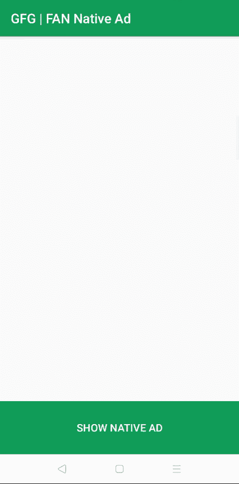

# 如何将脸书观众网(FAN)原生广告融入安卓？

> 原文:[https://www . geesforgeks . org/如何整合-Facebook-受众-网络-粉丝-原生-安卓广告/](https://www.geeksforgeeks.org/how-to-integrate-facebook-audience-network-fan-native-ads-in-android/)

为了从[安卓](https://www.geeksforgeeks.org/android-app-development-fundamentals-for-beginners/)应用或游戏中赚钱，有很多方式，如应用内购买、赞助、广告等。但是还有一种从安卓应用中赚钱的流行方法是整合第三方广告，例如名为[的脸书观众网络(FAN)](https://developers.facebook.com/products/audience-network/) 。脸书观众网络旨在帮助用户体验货币化。通过使用高价值的格式、高质量的广告和创新的出版商工具，它有助于在保持人们参与的同时发展业务。

### **为什么是脸书观众网？**

*   脸书观众网是谷歌广告收入安卓或 IOS 应用的最佳选择之一。
*   最低支付额为 100 美元
*   广泛的广告格式
*   最大填充率
*   每百万有效成本高
*   优质广告
*   个性化广告

### **脸书观众网业态**

在脸书观众网络中，主要有五种灵活、高性能的格式

*   **原生**:你设计的适合应用的广告，无缝衔接
*   [**【间质】**](https://www.geeksforgeeks.org/how-to-integrate-facebook-audience-network-fan-interstitial-ads-in-android/) :吸引眼球并成为体验一部分的全屏广告。
*   [**横幅**](https://www.geeksforgeeks.org/how-to-integrate-facebook-audience-network-fan-banner-ads-in-android/) :多种摆放方式的传统业态。
*   [**有奖视频**](https://www.geeksforgeeks.org/how-to-integrate-facebook-audience-network-fan-rewarded-video-ads-in-android/) :沉浸式、用户发起的视频广告，奖励用户观看。
*   **Playables** :先试后买的广告体验，允许用户在安装前预览游戏。

在本文中，让我们将**脸书受众网络原生广告**整合到安卓应用中。

**原生广告:**

一个**原生广告**广告用于为应用的广告构建定制的体验。**原生广告**的 **eCPM(每百万有效成本)**相对高于横幅广告，也导致了更高的**点击率**，从而从该应用中获得更多收益。下面给出了一个 GIF 示例，来了解一下我们在本文中要做什么。注意，我们将使用 **Java** 语言来实现这个项目。



### **接近**

**步骤 1:创建新项目**

要在安卓工作室创建新项目，请参考[如何在安卓工作室创建/启动新项目](https://www.geeksforgeeks.org/android-how-to-create-start-a-new-project-in-android-studio/)。请注意，选择 **Java** 作为语言，尽管我们要用 Java 语言实现这个项目。

**第二步:去编码区之前先做一些前置任务**

*   转到**应用程序>RES>values>colors . XML**文件，为应用程序设置颜色。

## 可扩展标记语言

```java
<?xml version="1.0" encoding="utf-8"?>
<resources>

    <color name="colorPrimary">#0F9D58</color>
    <color name="colorPrimaryDark">#0F9D58</color>
    <color name="colorAccent">#05af9b</color>

</resources>
```

*   转到**梯度脚本>** [**构建.梯度(模块:app)**](https://www.geeksforgeeks.org/android-build-gradle/) 部分，导入以下依赖项，点击上方弹出的“**同步** **现在**”。

> 实现' com.facebook.android:受众-网络-sdk:5。+'

*   转到 **app >舱单> AndroidManifest.xml** 部分，允许[互联网权限](https://www.geeksforgeeks.org/android-how-to-request-permissions-in-android-application/)。

**第三步:设计 UI**

*   创建新布局，其中包含原生广告的布局。转到 **app > res >布局>右键>新建>布局资源文件**并将文件命名为 **fan_native_ad_layout。**
*   下面是 **fan_native_ad_layout.xml** 文件的代码。代码中添加了注释，以更详细地理解代码。

## 可扩展标记语言

```java
<?xml version="1.0" encoding="utf-8"?>
<LinearLayout 
    xmlns:android="http://schemas.android.com/apk/res/android"
    android:id="@+id/ad_unit"
    android:layout_width="match_parent"
    android:layout_height="wrap_content"
    android:background="@android:color/white"
    android:orientation="vertical"
    android:padding="10dp">

    <!-- Liner layout which contain icon,
         title, sponsored text, ad choices -->
    <LinearLayout
        android:layout_width="match_parent"
        android:layout_height="wrap_content"
        android:orientation="horizontal"
        android:paddingTop="10dp"
        android:paddingBottom="10dp">

        <!-- MediaView to show icon of the ad -->
        <com.facebook.ads.MediaView
            android:id="@+id/native_ad_icon"
            android:layout_width="35dp"
            android:layout_height="35dp" />

        <LinearLayout
            android:layout_width="wrap_content"
            android:layout_height="wrap_content"
            android:orientation="vertical"
            android:paddingLeft="5dp"
            android:paddingRight="5dp">

            <!-- TextView to show title of the ad -->
            <TextView
                android:id="@+id/native_ad_title"
                android:layout_width="wrap_content"
                android:layout_height="wrap_content"
                android:ellipsize="end"
                android:lines="1"
                android:textColor="@android:color/black"
                android:textSize="15sp" />

            <!-- TextView  to show Sponsored Text -->
            <TextView
                android:id="@+id/native_ad_sponsored_label"
                android:layout_width="wrap_content"
                android:layout_height="wrap_content"
                android:ellipsize="end"
                android:lines="1"
                android:textColor="@android:color/darker_gray"
                android:textSize="12sp" />

        </LinearLayout>

        <!-- Ad choice container -->
        <LinearLayout
            android:id="@+id/ad_choices_container"
            android:layout_width="match_parent"
            android:layout_height="wrap_content"
            android:gravity="end"
            android:orientation="horizontal" />

    </LinearLayout>

    <!-- Media view to show ad -->
    <com.facebook.ads.MediaView
        android:id="@+id/native_ad_media"
        android:layout_width="match_parent"
        android:layout_height="wrap_content"
        android:gravity="center" />

    <LinearLayout
        android:layout_width="match_parent"
        android:layout_height="wrap_content"
        android:orientation="horizontal"
        android:padding="5dp">

        <LinearLayout
            android:layout_width="wrap_content"
            android:layout_height="wrap_content"
            android:layout_weight="3"
            android:orientation="vertical">

            <!-- textView of ad social context -->
            <TextView
                android:id="@+id/native_ad_social_context"
                android:layout_width="match_parent"
                android:layout_height="wrap_content"
                android:ellipsize="end"
                android:lines="1"
                android:textColor="@android:color/darker_gray"
                android:textSize="12sp" />

            <!-- textView of ad body -->
            <TextView
                android:id="@+id/native_ad_body"
                android:layout_width="match_parent"
                android:layout_height="wrap_content"
                android:ellipsize="end"
                android:gravity="center_vertical"
                android:lines="2"
                android:textColor="@android:color/black"
                android:textSize="12sp" />

        </LinearLayout>

        <!-- install or download button -->
        <Button
            android:id="@+id/native_ad_call_to_action"
            android:layout_width="100dp"
            android:layout_height="30dp"
            android:layout_gravity="center_vertical"
            android:layout_weight="1"
            android:background="#4286F4"
            android:paddingLeft="3dp"
            android:paddingRight="3dp"
            android:textColor="@android:color/white"
            android:textSize="12sp"
            android:visibility="gone" />

    </LinearLayout>

</LinearLayout>
```

*   下面是 **activity_main.xml** 文件的代码。代码中添加了注释，以更详细地理解代码。

## 可扩展标记语言

```java
<?xml version="1.0" encoding="utf-8"?>
<RelativeLayout 
    xmlns:android="http://schemas.android.com/apk/res/android"
    xmlns:tools="http://schemas.android.com/tools"
    android:layout_width="match_parent"
    android:layout_height="match_parent"
    tools:context=".MainActivity">

    <!-- Simple Scroll View -->
    <ScrollView
        android:layout_width="match_parent"
        android:layout_height="match_parent"
        android:layout_marginBottom="80dp">

        <!-- NativeAdLayout -->
        <com.facebook.ads.NativeAdLayout
            android:id="@+id/native_ad_container"
            android:layout_width="match_parent"
            android:layout_height="wrap_content"
            android:orientation="vertical" />
    </ScrollView>

    <!-- Button  to show  ad when clicked  -->
    <Button
        android:id="@+id/showNativeAdBtn"
        android:layout_width="match_parent"
        android:layout_height="80dp"
        android:layout_alignParentBottom="true"
        android:background="@color/colorPrimary"
        android:text="Show Native Ad"
        android:textColor="#ffffff" />

</RelativeLayout>
```

**第四步:使用 MainActivity.java 文件**

*   打开**MainActivity.java**类内的文件那里，首先创建对象**nativelayout、**T4**linear layout****、**T10【native EAD】类。

> //创建 NativeAdLayout 对象
> 
> 私人国家/地区布局；
> 
> //创建线形布局对象
> 
> private LinearLayout adView
> 
> //创建 NativeAd 对象
> 
> 私有 NativeAd nativeAd

*   现在在 **onCreate()** 方法里面，初始化**脸书观众网 SDK。**

> //初始化受众网络软件开发工具包
> 
> audiencenetworkads . initialize(this)；

*   在**之外创建一个**私有 void loadnativehead()**方法，并定义它。**
*   在**loadnativeread()**中，向原生广告添加广告监听器，并显示相关的[吐司](https://www.geeksforgeeks.org/android-what-is-toast-and-how-to-use-it-with-examples/)消息。
*   而在**内部的 onAdLoaded()** 方法调用**充气头()，**我们稍后创建。

> //加载本地广告
> 
> private void loadnatived(){ 0
> 
> //初始化 nativeAd 对象
> 
> nativeAd = new NativeAd(这个，“YOUR _ PLACEMENT _ ID”)；
> 
> //创建 NativeAdListener
> 
> NativeAdListener nativeAdListener = new NativeAdListener（） {
> 
> @覆盖
> 
> 公共 void OnMediaDownloaded(Ad Ad){ 0
> 
> //显示 Toast 消息
> 
> Toast . make text(main activity . this，“onMediaDownloaded”，Toast。LENGTH_SHORT)。show()；
> 
> }
> 
> @覆盖
> 
> public void onerror(例如 aderor ader error)}
> 
> //显示 Toast 消息
> 
> 吐司. makeText(MainActivity.this，“onError”，吐司。LENGTH_SHORT)。show()；
> 
> }
> 
> @覆盖
> 
> 公共 void OnAdloaded(Ad Ad){ 0
> 
> //显示 Toast 消息
> 
> 吐司. makeText(MainActivity.this，“onAdLoaded”，吐司。LENGTH_SHORT)。show()；
> 
> if(native = = null | | native！=收件人:>
> 
> 返回；
> 
> }
> 
> //将本地广告膨胀到容器中
> 
> 充气头(native head)；
> 
> }
> 
> @覆盖
> 
> 公共空间
> 
> //显示 Toast 消息
> 
> 吐司. makeText(MainActivity.this，“onAdClicked”，吐司。LENGTH_SHORT)。show()；
> 
> }
> 
> @覆盖
> 
> public 请参阅 onlogingimpression(ad)}
> 
> //显示 Toast 消息
> 
> Toast . make text(main activity . this，“onLoggingImpression”，Toast。LENGTH_SHORT)。show()；
> 
> }
> 
> };
> 
> //加载广告
> 
> nativeAd.loadAd(
> 
> nativeAd.buildLoadAdConfig()
> 
> 。带监听器(本机监听器)
> 
> 。build())；
> 
> }

> **注:**
> 
> *   将“ **YOUR_PLACEMENT_ID** ”替换为自己的 placement id，展示真实广告。
> *   脸书不提供任何测试 id，因此您必须创建 FAN 帐户，然后创建新的放置 id，然后在 FAN 中添加您的设备测试 AD id，以在您的应用程序中获取广告。

*   现在创建一个**void BuildIng head**，它将对来自 **fan_native_ad_layout.xml** 和 **activity_main.xml** 文件的视图进行扩展，并将广告显示给用户。

> //夸大广告
> 
> void inflatead(原生)
> 
> //取消注册本机广告视图
> 
> native EAD . unregistereview()；
> 
> //将广告视图添加到广告容器中。
> 
> nativelayout = FindViewByID(r . id . native _ ad _ container)；
> 
> LayoutInflater 充气机= layout info water . from(main activity . this)；
> 
> //扩大广告视图。
> 
> adView = (LinearLayout)充气器.充气(R.layout.fan_native_ad_layout，nativeAdLayout，false)；
> 
> //添加视图
> 
> native layout . add view(建议)：
> 
> //添加采用视图
> 
> linear layout adchocescontainer = findviewbyid(r . id . ad _ choices _ container)；
> 
> adoptiveview adoptiveview = new adoptiveview(main activity . this，nativead，nativedad layout)；
> 
> adchoice container . removeall view()；
> 
> adchocescontainer . add view(adoptiveview，0)；
> 
> //使用广告元数据创建本机用户界面。
> 
> MediaView native icon = adview . findwiewbyid(r . id . native _ ad _ icon)；
> 
> TextView natived title = adview . findwiewbyid(r . id . native _ ad _ title)；
> 
> MediaView native media = adview . findwiewbyid(r . id . native _ ad _ media)；
> 
> TextView nativesocialcontext = adview . findwiewbyid(r . id . native _ ad _ social _ context)；
> 
> TextView native body = adview . findwiewbyid(r . id . native _ ad _ body)；
> 
> TextView responsoredlabel = adview . findwiewbyid(r . id . native _ ad _ substanted _ label)；
> 
> button native calltoaction = adview . findwiewbyid(r . id . native _ ad _ call _ to _ action)；
> 
> //设置文本。
> 
> nativeAdTitle.setText(原生. getads name())的缩写形式：
> 
> native adbody . settext(native ad . getadbodytext())；
> 
> nativesocksubassemblystemtext . settext(原生. getAdSocialContext())：
> 
> nativeadcalltoaction . set visibility(nativead . hascalltoaction()？查看。可见:视图。不可见)；
> 
> native ADC alltoaaction . settext(native ad . getadca lltoaaction())；
> 
> patredabel . settext(native ad . getsponsoredtransaction())；
> 
> //创建可点击视图的列表
> 
> 列表<view>点击可查看=新数组列表<>()；</view>
> 
> 单击 able views . add(natived title)；
> 
> 单击 bleviews . add(nativeAdCallToAction)；
> 
> //注册标题和按钮来收听点击。
> 
> native EAD . registereviewporinteraction(
> 
> 咨询、国家媒体、国家电台、点击新闻；
> 
> }

*   以下是**MainActivity.java**文件的完整代码。代码中添加了注释，以更详细地理解代码。

## Java 语言(一种计算机语言，尤用于创建网站)

```java
import android.os.Bundle;
import android.view.LayoutInflater;
import android.view.View;
import android.widget.Button;
import android.widget.LinearLayout;
import android.widget.TextView;
import android.widget.Toast;
import androidx.appcompat.app.AppCompatActivity;
import com.facebook.ads.Ad;
import com.facebook.ads.AdError;
import com.facebook.ads.AdOptionsView;
import com.facebook.ads.AudienceNetworkAds;
import com.facebook.ads.MediaView;
import com.facebook.ads.NativeAd;
import com.facebook.ads.NativeAdLayout;
import com.facebook.ads.NativeAdListener;
import java.util.ArrayList;
import java.util.List;

public class MainActivity extends AppCompatActivity {
    // creating NativeAdLayout object
    private NativeAdLayout nativeAdLayout;
    // creating  LinearLayout object
    private LinearLayout adView;
    // creating  NativeAd object
    private NativeAd nativeAd;

    @Override
    protected void onCreate(Bundle savedInstanceState) {
        super.onCreate(savedInstanceState);
        setContentView(R.layout.activity_main);

        // initialize the FACEBOOK Audience Network SDK
        AudienceNetworkAds.initialize(this);

        // getting reference of button from activity_main.xml and setting  OnClickListener
        findViewById(R.id.showNativeAdBtn).setOnClickListener(new View.OnClickListener() {
            @Override
            public void onClick(View view) {
                // load Native Ad on button click
                loadNativeAd();
            }
        });

    }

    // loadinng native Ad
    private void loadNativeAd() {

        // initializing nativeAd object
        nativeAd = new NativeAd(this, "YOUR_PLACEMENT_ID");

        // creating  NativeAdListener
        NativeAdListener nativeAdListener = new NativeAdListener() {

            @Override
            public void onMediaDownloaded(Ad ad) {
                // showing Toast message
                Toast.makeText(MainActivity.this, "onMediaDownloaded", Toast.LENGTH_SHORT).show();
            }

            @Override
            public void onError(Ad ad, AdError adError) {
                // showing Toast message
                Toast.makeText(MainActivity.this, "onError", Toast.LENGTH_SHORT).show();
            }

            @Override
            public void onAdLoaded(Ad ad) {

                // showing Toast message
                Toast.makeText(MainActivity.this, "onAdLoaded", Toast.LENGTH_SHORT).show();

                if (nativeAd == null || nativeAd != ad) {
                    return;
                }

                // Inflate Native Ad into Container
                inflateAd(nativeAd);
            }

            @Override
            public void onAdClicked(Ad ad) {
                // showing Toast message
                Toast.makeText(MainActivity.this, "onAdClicked", Toast.LENGTH_SHORT).show();
            }

            @Override
            public void onLoggingImpression(Ad ad) {
                // showing Toast message
                Toast.makeText(MainActivity.this, "onLoggingImpression", Toast.LENGTH_SHORT).show();
            }
        };

        // Load an ad
        nativeAd.loadAd(
                nativeAd.buildLoadAdConfig()
                        .withAdListener(nativeAdListener)
                        .build());
    }

    // inflating the Ad
    void inflateAd(NativeAd nativeAd) {

        // unregister the native Ad View
        nativeAd.unregisterView();

        // Add the Ad view into the ad container.
        nativeAdLayout = findViewById(R.id.native_ad_container);

        LayoutInflater inflater = LayoutInflater.from(MainActivity.this);

        // Inflate the Ad view.
        adView = (LinearLayout) inflater.inflate(R.layout.fan_native_ad_layout, nativeAdLayout, false);

        // adding view
        nativeAdLayout.addView(adView);

        // Add the AdOptionsView
        LinearLayout adChoicesContainer = findViewById(R.id.ad_choices_container);
        AdOptionsView adOptionsView = new AdOptionsView(MainActivity.this, nativeAd, nativeAdLayout);
        adChoicesContainer.removeAllViews();
        adChoicesContainer.addView(adOptionsView, 0);

        // Create native UI using the ad metadata.
        MediaView nativeAdIcon = adView.findViewById(R.id.native_ad_icon);
        TextView nativeAdTitle = adView.findViewById(R.id.native_ad_title);
        MediaView nativeAdMedia = adView.findViewById(R.id.native_ad_media);
        TextView nativeAdSocialContext = adView.findViewById(R.id.native_ad_social_context);
        TextView nativeAdBody = adView.findViewById(R.id.native_ad_body);
        TextView sponsoredLabel = adView.findViewById(R.id.native_ad_sponsored_label);
        Button nativeAdCallToAction = adView.findViewById(R.id.native_ad_call_to_action);

        // Setting  the Text.
        nativeAdTitle.setText(nativeAd.getAdvertiserName());
        nativeAdBody.setText(nativeAd.getAdBodyText());
        nativeAdSocialContext.setText(nativeAd.getAdSocialContext());
        nativeAdCallToAction.setVisibility(nativeAd.hasCallToAction() ? View.VISIBLE : View.INVISIBLE);
        nativeAdCallToAction.setText(nativeAd.getAdCallToAction());
        sponsoredLabel.setText(nativeAd.getSponsoredTranslation());

        // Create a list of clickable views
        List<View> clickableViews = new ArrayList<>();
        clickableViews.add(nativeAdTitle);
        clickableViews.add(nativeAdCallToAction);

        // Register the Title and  button to listen for clicks.
        nativeAd.registerViewForInteraction(adView, nativeAdMedia, nativeAdIcon, clickableViews);
    }
}
```

### **输出:**

> **再次记住这一点:**脸书不提供任何测试 id，因此您必须创建一个 FAN 帐户，然后创建一个新的放置 id，然后在 FAN 中添加您的设备测试 AD id，以在您的应用程序中获取广告。

<video class="wp-video-shortcode" id="video-497281-1" width="640" height="360" preload="metadata" controls=""><source type="video/mp4" src="https://media.geeksforgeeks.org/wp-content/uploads/20201013222926/facebook-audience-network-native.mp4?_=1">[https://media.geeksforgeeks.org/wp-content/uploads/20201013222926/facebook-audience-network-native.mp4](https://media.geeksforgeeks.org/wp-content/uploads/20201013222926/facebook-audience-network-native.mp4)</video><video class="wp-video-shortcode" id="video-497281-2" width="640" height="360" preload="metadata" controls=""><source type="video/mp4" src="https://media.geeksforgeeks.org/wp-content/uploads/20201013223033/facebook-audience-network-native-small.mp4?_=2">[https://media.geeksforgeeks.org/wp-content/uploads/20201013223033/facebook-audience-network-native-small.mp4](https://media.geeksforgeeks.org/wp-content/uploads/20201013223033/facebook-audience-network-native-small.mp4)</video>