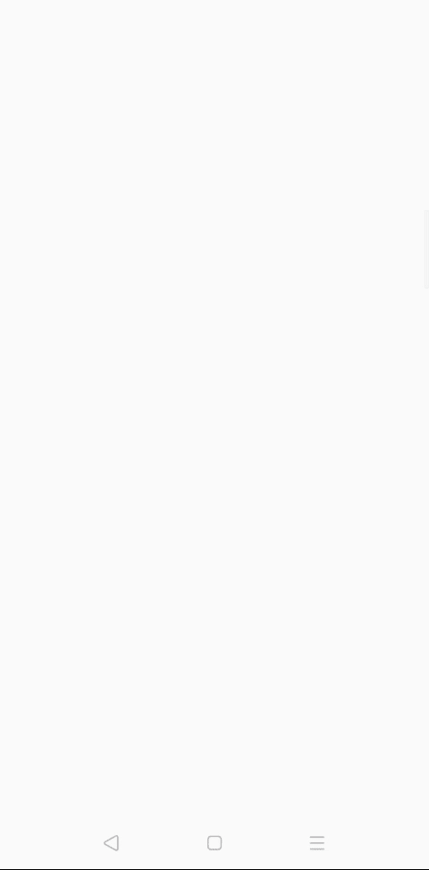

# 如何将谷歌 Admob 有奖视频广告整合到安卓？

> 原文:[https://www . geesforgeks . org/如何集成-Google-admob-rewarded-video-ads-in-Android/](https://www.geeksforgeeks.org/how-to-integrate-google-admob-rewarded-video-ads-in-android/)

为了从[安卓](https://www.geeksforgeeks.org/android-app-development-fundamentals-for-beginners/)应用或游戏中赚钱，有很多方式，如应用内购买、赞助、广告等。但是还有另一种从安卓应用中赚钱的流行方法，就是整合一个广告，例如名为 [**的谷歌广告发布平台**](https://admob.google.com/home/) 。谷歌 AdMob 是为开发人员设计的，AdMob 有助于赚取更多的应用收入，提供更好的用户体验，并通过自动化工具为您提供可行的见解。

#### **为什么是谷歌 Admob 网络？**

*   最低支付额为 100 美元
*   广泛的广告格式
*   最大填充率
*   每百万有效成本高
*   优质广告
*   个性化广告

#### 谷歌 AdMob 的格式

Google AdMob 中主要有四种灵活、高性能的格式

*   **原生:**你设计的适合应用的广告，无缝衔接
*   [**【间质】**](https://www.geeksforgeeks.org/admob-interstitial-ads-android-studio/?ref=rp) **:** 吸引眼球并成为体验一部分的全屏广告。
*   [**横幅**](https://www.geeksforgeeks.org/android-admob-banner-ads-android-studio/?ref=rp) **:** 传统业态多种摆放。
*   **奖励视频:**一款沉浸式、用户发起的视频广告，奖励用户观看。

在本文中，让我们集成**谷歌 Admob SDK** 在安卓应用中显示奖励视频广告。

**有奖视频:**

*   有奖视频广告是覆盖 app 整个 UI 的全屏广告。奖励视频广告的 **eCPM** (每千分之一的有效成本)相对高于横幅广告和间隙广告，也导致更高的**点击率**(点击率)，从而从您的应用程序中获得更多收益。
*   当用户从头到尾观看奖励视频时，他们会获得应用内奖励。这类广告多用于游戏，也可以用于 app。



### 方法

#### **第一步:创建**新的**项目**

要在安卓工作室创建新项目，请参考[如何在安卓工作室创建/启动新项目。](https://www.geeksforgeeks.org/android-how-to-create-start-a-new-project-in-android-studio/)注意选择 **Java** 作为语言，虽然我们要用 Java 语言实现这个项目。

#### **第二步:**去编码区之前先做一些前置任务

*   转到**应用程序->RES->values->colors . XML**文件，为应用程序设置颜色。

## colors.xml

```
<?xml version="1.0" encoding="utf-8"?>
<resources>
    <color name="colorPrimary">#0F9D58</color>
    <color name="colorPrimaryDark">#0F9D58</color>
    <color name="colorAccent">#05af9b</color>
</resources>
```

*   转到**Gradle Scripts->**[**build . Gradle(模块:app)**](https://www.geeksforgeeks.org/android-build-gradle/) 部分，导入以下依赖项，点击上方弹出的“**立即同步”**。

> 实现' com . Google . Android . GMS:play-services-ads:19 . 3 . 0 '

*   转到 **app - >清单- > AndroidManifests.xml** 部分，允许“[互联网许可](https://www.geeksforgeeks.org/android-how-to-request-permissions-in-android-application/)”。

*   转到 **app- >清单- > AndroidManifest.xml** 部分，在 **<应用程序>** 标签中添加元数据标签。

> 安卓:name = " com . Google . Android . GMS . ads . APPLication _ ID "
> 
> 安卓:value = " ca-app-pub-3940256099942544 ~ 3347511713 "
> 
> />

#### **第三步:设计 UI**

在 **activity_main.xml** 中添加一个按钮，这样当用户点击该按钮时，屏幕上将播放奖励视频。

## activity_main.xml

```
<?xml version="1.0" encoding="utf-8"?>
<RelativeLayout 
    xmlns:android="http://schemas.android.com/apk/res/android"
    xmlns:tools="http://schemas.android.com/tools"
    android:layout_width="match_parent"
    android:layout_height="match_parent"
    tools:context=".MainActivity">

    <!-- Button to Show Rewarded Video Ad By Clicking it -->
    <Button
        android:id="@+id/showVideoBtn"
        android:layout_width="match_parent"
        android:layout_height="wrap_content"
        android:layout_centerInParent="true"
        android:layout_margin="8dp"
        android:background="@color/colorPrimary"
        android:padding="16dp"
        android:text="Show  Rewarded  Video Ad "
        android:textColor="#ffff"
        android:textSize="20dp" />

</RelativeLayout>
```

#### **步骤 4:** 使用 MainActivity.java 文件

*   打开类内的**MainActivity.java**文件，首先创建 Button 类的对象。

> //创建按钮类的对象
> 
> 按钮显示视频广告;

*   现在在 **onCreate()** 方法中，将这些对象与在 **activity_main.xml** 文件中给出的它们各自的标识链接起来。

> //将这些对象与我们在 activity_main.xml 文件中给出的它们各自的 id 链接起来
> 
> showVideoAdBtn=（Button）findViewById（R.id.showVideoBtn）;

*   现在在 **onCreate()** 方法里面，初始化**谷歌 Admob SDK**

> //初始化谷歌 Admob SDK
> 
> mobileads . initialize(this)；

*   在**MainActivity.java**类中创建一个**重发视频加载**的对象

> //创建 RewardedVideoAd 的对象
> 
> private rewarddvidload admewarddvidload；

*   在**MainActivity.java**班级内创建 AdMob 奖励**视频广告标识**

> // AdMob 奖励视频广告 Id
> 
> private String ADid = " ca-app-pub-3940256099942544/5224354917 "；

*   接下来创建一个私有虚空**loadrewardevideoad()**法外 **onCreate()** 法并定义它。

> 请参阅 loadrewardedvideoad()
> 
> {
> 
> //正在初始化 RewardedVideoAd 对象
> 
> //rewardedvideload 构造函数以上下文为参数
> 
> admobrewardedvideload = mobileads . getrewardedvideloadinstance(this)；
> 
> //加载奖励视频广告
> 
> admobrewardedvideload . loadad(ADid，new AdRequest。Builder()。build())；
> 
> }

*   在初始化 SDK 后，调用 **内部的**loadRewardeDivideoad()**oncreate()**方法。

> **注**:用自己的 app 广告 Id 替换“ **AdId** ，展示真实广告。

*   接下来创建一个空**showrewardevideoad()**方法在之外 **onCreate()** 方法，我们稍后称之为 show ad。

> public void showRewardedVideoAd()
> 
> {
> 
> If(admobrewardedvideload . isloaded())//检查 Ad 是否已加载
> 
> {
> 
> //显示视频广告
> 
> admobewarddvidload . show()；
> 
> }
> 
> 其他
> 
> {
> 
> //加载奖励视频广告
> 
> admobrewardedvideload . loadad(ADid，new AdRequest。Builder()。build())；
> 
> }
> 
> }

*   所以接下来的事情就是调用**showrewardevideoad()**的方法了。现在在 **oncreate()** 方法中创建一个**点击监听器**为按钮并调用**showrewardedvideload()。**

> //单击监听器显示奖励视频广告
> 
> showvideoadbtn . setonclicklistener(新视图)。onclicklistener()& gt
> 
> @覆盖
> 
> 公共空间单击(查看视图){ 0
> 
> showrewardedvideload()；
> 
> }
> 
> });

*   现在为奖励视频广告添加**rewardedvideoalistener**，这样用户就会知道广告的状态。
*   要添加**rewardevideoalistener**打开**loadrewardevideoad()**方法，在**admobrewardevideoad . loadad(ADid，new AdRequest)前添加下面的代码。Builder()。build())****；**

> //奖励视频广告收听者
> 
> AdMobrewardedVideoAd.setRewardedVideoAdListener（new RewardedVideoAdListener（） {
> 
> @覆盖
> 
> public void onreaddvideloadloaded(){ 0
> 
> //显示祝酒词
> 
> Toast . make text(main activity . this，“onRewardedVideoAdLoaded”，Toast。LENGTH_SHORT)。show()；
> 
> }
> 
> @覆盖
> 
> public void onreaddvideloadopen(){ 0
> 
> //显示祝酒词
> 
> Toast . make text(main activity . this，“onRewardedVideoAdOpened”，Toast。LENGTH_SHORT)。show()；
> 
> }
> 
> @覆盖
> 
> public void on rewardevideostarded(){ 0
> 
> //显示祝酒词
> 
> Toast . make text(main activity . this，“onRewardedVideoStarted”，Toast。LENGTH_SHORT)。show()；
> 
> }
> 
> @覆盖
> 
> public void onrewardevideoaclosed(){ 0
> 
> //显示祝酒词
> 
> Toast . make text(main activity . this，“onRewardedVideoAdClosed”，Toast。LENGTH_SHORT)。show()；
> 
> }
> 
> @覆盖
> 
> 公共 void on Rewarded(RewardeTem RewardeTem){ 0
> 
> //显示祝酒词
> 
> 吐司. makeText(MainActivity.this，“onRewarded”，吐司。LENGTH_SHORT)。show()；
> 
> }
> 
> @覆盖
> 
> public 查看 onrewarddvidadeleftappplication()±
> 
> //显示祝酒词
> 
> Toast . make text(main activity . this，“OnRewardeVideLoadLeftapplication”，Toast。LENGTH_SHORT)。show()；
> 
> }
> 
> @覆盖
> 
> public 查看 onrewarddvidfailedtolload(int I)}
> 
> //显示祝酒词
> 
> Toast . makefile(main activity . this，“onrewardedvideoadfailedtoload”，toast)。S7-1200 可编程控制器。show()；
> 
> }
> 
> @覆盖
> 
> public void onreaddvideocomplete(){ 0
> 
> //显示祝酒词
> 
> Toast . make text(main activity . this，“onRewardedVideoCompleted”，Toast。LENGTH_SHORT)。show()；
> 
> }
> 
> });

*   而在**rewardedvideloadlistener**内，Override 方法会显示一条[祝酒信息](https://www.geeksforgeeks.org/android-what-is-toast-and-how-to-use-it-with-examples/)，让用户知道广告的状态。以下是**MainActivity.Java**文件的完整代码。

## MainActivity.Java

```
package org.geeksforgeeks.project;

import android.os.Bundle;
import android.view.View;
import android.widget.Button;
import android.widget.Toast;
import androidx.appcompat.app.AppCompatActivity;
import com.google.android.gms.ads.AdRequest;
import com.google.android.gms.ads.MobileAds;
import com.google.android.gms.ads.reward.RewardItem;
import com.google.android.gms.ads.reward.RewardedVideoAd;
import com.google.android.gms.ads.reward.RewardedVideoAdListener;

public class MainActivity extends AppCompatActivity {

    // Creating a object of Button class
    Button showVideoAdBtn;

    @Override
    protected void onCreate(Bundle savedInstanceState)
    {
        super.onCreate(savedInstanceState);
        setContentView(R.layout.activity_main);

        // link those objects with their respective id's
        // that we have given in activity_main.xml file
        showVideoAdBtn
            = (Button)findViewById(R.id.showVideoBtn);

        // initializing the Google Admob  SDK
        MobileAds.initialize(this);

        // loading Video Ad
        loadRewardedVideoAd();

        // click listener to show Rewarded Video  Ad
        showVideoAdBtn.setOnClickListener(
            new View.OnClickListener() {
                @Override public void onClick(View view)
                {
                    // showing Ad
                    showRewardedVideoAd();
                }
            });
    }

    // creating RewardedVideoAd object
    private RewardedVideoAd AdMobrewardedVideoAd;

    // AdMob Rewarded Video Ad Id
    private String AdId
        = "ca-app-pub-3940256099942544/5224354917";

    void loadRewardedVideoAd()
    {
        // initializing RewardedVideoAd Object
        // RewardedVideoAd  Constructor Takes Context as its
        // Argument
        AdMobrewardedVideoAd
            = MobileAds.getRewardedVideoAdInstance(this);

        // Rewarded Video Ad Listener
        AdMobrewardedVideoAd.setRewardedVideoAdListener(
            new RewardedVideoAdListener() {
                @Override
                public void onRewardedVideoAdLoaded()
                {
                    // Showing Toast Message
                    Toast
                        .makeText(MainActivity.this,
                                  "onRewardedVideoAdLoaded",
                                  Toast.LENGTH_SHORT)
                        .show();
                }

                @Override
                public void onRewardedVideoAdOpened()
                {
                    // Showing Toast Message
                    Toast
                        .makeText(MainActivity.this,
                                  "onRewardedVideoAdOpened",
                                  Toast.LENGTH_SHORT)
                        .show();
                }

                @Override
                public void onRewardedVideoStarted()
                {
                    // Showing Toast Message
                    Toast
                        .makeText(MainActivity.this,
                                  "onRewardedVideoStarted",
                                  Toast.LENGTH_SHORT)
                        .show();
                }

                @Override
                public void onRewardedVideoAdClosed()
                {
                    // Showing Toast Message
                    Toast
                        .makeText(MainActivity.this,
                                  "onRewardedVideoAdClosed",
                                  Toast.LENGTH_SHORT)
                        .show();
                }

                @Override
                public void onRewarded(
                    RewardItem rewardItem)
                {
                    // Showing Toast Message
                    Toast
                        .makeText(MainActivity.this,
                                  "onRewarded",
                                  Toast.LENGTH_SHORT)
                        .show();
                }

                @Override
                public void
                onRewardedVideoAdLeftApplication()
                {
                    // Showing Toast Message
                    Toast
                        .makeText(
                            MainActivity.this,
                            "onRewardedVideoAdLeftApplication",
                            Toast.LENGTH_SHORT)
                        .show();
                }

                @Override
                public void onRewardedVideoAdFailedToLoad(
                    int i)
                {
                    // Showing Toast Message
                    Toast
                        .makeText(
                            MainActivity.this,
                            "onRewardedVideoAdFailedToLoad",
                            Toast.LENGTH_SHORT)
                        .show();
                }

                @Override
                public void onRewardedVideoCompleted()
                {
                    // Showing Toast Message
                    Toast
                        .makeText(
                            MainActivity.this,
                            "onRewardedVideoCompleted",
                            Toast.LENGTH_SHORT)
                        .show();
                }
            });

        // Loading Rewarded Video Ad
        AdMobrewardedVideoAd.loadAd(
            AdId, new AdRequest.Builder().build());
    }

    public void showRewardedVideoAd()
    {
        // Checking If Ad is Loaded or Not
        if (AdMobrewardedVideoAd.isLoaded()) {
            // showing Video Ad
            AdMobrewardedVideoAd.show();
        }
        else {
            // Loading Rewarded Video Ad
            AdMobrewardedVideoAd.loadAd(
                AdId, new AdRequest.Builder().build());
        }
    }
}
```

#### 步骤 5: AndroidManifest.xml 文件

下面是 **AndroidManifest.xml** 文件的完整代码。

## AndroidManifest.xml

```
<?xml version="1.0" encoding="utf-8"?>
<manifest xmlns:android="http://schemas.android.com/apk/res/android"
    package="org.geeksforgeeks.project">

    <uses-permission android:name="android.permission.INTERNET"/>

    <application
        android:allowBackup="true"
        android:icon="@mipmap/ic_launcher"
        android:label="@string/app_name"
        android:roundIcon="@mipmap/ic_launcher_round"
        android:supportsRtl="true"
        android:theme="@style/AppTheme">
        <activity android:name=".MainActivity">
            <intent-filter>
                <action android:name="android.intent.action.MAIN" />

                <category android:name="android.intent.category.LAUNCHER" />
            </intent-filter>
        </activity>

        <!-- meta data  tag for admob Note:replace below app id 
             value to your own app id -->
        <meta-data
            android:name="com.google.android.gms.ads.APPLICATION_ID"
            android:value="ca-app-pub-3940256099942544~3347511713"/>

    </application>

</manifest>
```

#### **输出:在仿真器上运行**

<video class="wp-video-shortcode" id="video-474819-1" width="640" height="360" preload="metadata" controls=""><source type="video/mp4" src="https://media.geeksforgeeks.org/wp-content/uploads/20200826063519/Google-Admob-Rewarded-Video-Ad.mp4?_=1">[https://media.geeksforgeeks.org/wp-content/uploads/20200826063519/Google-Admob-Rewarded-Video-Ad.mp4](https://media.geeksforgeeks.org/wp-content/uploads/20200826063519/Google-Admob-Rewarded-Video-Ad.mp4)</video>