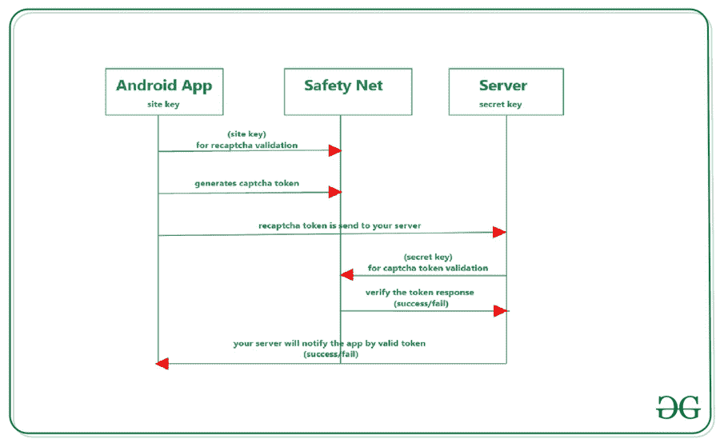
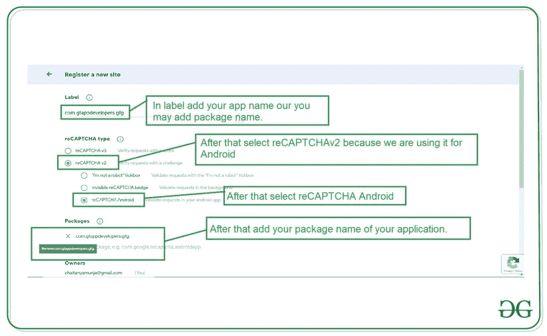

# 如何在安卓系统中集成谷歌 reCAPTCHA？

> 原文:[https://www . geeksforgeeks . org/如何集成-Google-recaptcha-in-Android/](https://www.geeksforgeeks.org/how-to-integrate-google-recaptcha-in-android/)

[**Google reCAPTCHA**](https://www.geeksforgeeks.org/captcha-recaptcha-and-related-things/) 是 Google 提供的服务之一，用于验证用户是否为机器人。在许多网站和应用程序中都可以看到谷歌注册卡来验证用户。在本文中，我们将看看谷歌 reCAPTCHA 在安卓系统中的实现。

### 我们将在本文中构建什么？

我们将构建一个简单的应用程序，其中我们将显示一个谷歌注册验证用户按钮，点击该按钮后，我们将向我们的用户显示谷歌注册并验证他们。下面给出了一个示例视频，让我们了解一下在本文中要做什么。请注意，我们将使用 **Java** 语言来实现这个项目。

<video class="wp-video-shortcode" id="video-547011-1" width="640" height="360" preload="metadata" controls=""><source type="video/mp4" src="https://media.geeksforgeeks.org/wp-content/uploads/20210118125901/Screenrecorder-2021-01-18-12-37-14-912.mp4?_=1">[https://media.geeksforgeeks.org/wp-content/uploads/20210118125901/Screenrecorder-2021-01-18-12-37-14-912.mp4](https://media.geeksforgeeks.org/wp-content/uploads/20210118125901/Screenrecorder-2021-01-18-12-37-14-912.mp4)</video>

### **谷歌 reCAPTCHA 的工作**

当使用 reCAPTCHA 时，它会从您的应用程序向安全网服务器进行多次调用，并从安全网服务器向您的应用程序进行多次调用。因此，您可以在下图中更详细地了解这些调用。

**我们进行 API 调用的步骤:**

*   为了在您的应用程序中使用 reCAPTCHA，我们必须生成一个站点密钥和密钥，并将其添加到我们的应用程序中。站点密钥用在我们的安卓应用程序中，密钥存储在服务器上。
*   在这个网站的帮助下，将生成密钥 reCAPTCHA，它将验证用户是否是机器人。
*   在通过 reCAPTCHA 进行验证后，我们的应用程序将与我们的验证码服务器通信，它将使用您的站点密钥返回响应。
*   现在，我们的应用程序将向我们的服务器发送一个令牌，然后我们的服务器将使用我们的密钥向 reCAPTCHA 服务器发送一个令牌。然后 reCAPTCHA 服务器将向我们的服务器发送成功响应，服务器将向我们的应用程序发送成功响应。



### **分步实施**

**第一步:创建新项目**

要在安卓工作室创建新项目，请参考[如何在安卓工作室创建/启动新项目](https://www.geeksforgeeks.org/android-how-to-create-start-a-new-project-in-android-studio/)。注意选择 **Java** 作为编程语言。

**第二步:添加凌空和安全网的依赖关系**

因为我们将使用谷歌提供的应用编程接口。因此，为了使用这个应用编程接口，我们将使用凌空来处理我们的 HTTP 请求，并使用安全网来连接到谷歌 reCAPTCHA。

> 实现‘com . Android .凌空:凌空:1 . 1 . 1’
> 
> 实现' com . Google . Android . GMS:play-services-safety net:15 . 0 . 1 '

添加这个依赖项后，现在同步你的项目，现在我们将创建我们的应用编程接口密钥，我们将需要谷歌重新注册。

**第三步:生成使用谷歌 reCAPTCHA 的 API 密钥**

为了使用 Google reCAPTCHA，我们必须建立两个密钥，比如站点密钥和站点秘密密钥，我们必须使用它们来进行身份验证。要创建一个新的应用编程接口键，导航到这个谷歌开发者[网站](https://www.google.com/recaptcha/admin/create)。并参考下图生成 API 密钥。



添加此数据后，接受注册条款，然后单击提交选项。

**第四步:添加互联网权限**

因为我们正在为谷歌 reCAPTCHA 调用 API，所以我们必须在我们的 **AndroidManifest.xml** 中添加对互联网的权限。导航至**应用程序>安卓清单. xml** ，并添加以下代码。

## 可扩展标记语言

```
<uses-permission android:name="android.permission.INTERNET"/>
```

**第 5 步:使用 activity_main.xml 文件**

导航到**应用程序> res >布局> activity_main.xml** 并将下面的代码添加到该文件中。下面是 **activity_main.xml** 文件的代码。

## 可扩展标记语言

```
<?xml version="1.0" encoding="utf-8"?>
<RelativeLayout 
    xmlns:android="http://schemas.android.com/apk/res/android"
    xmlns:tools="http://schemas.android.com/tools"
    android:layout_width="match_parent"
    android:layout_height="match_parent"
    android:orientation="vertical"
    tools:context=".MainActivity">

    <!--button for displaying our
        reCAPTCHA dialog box-->
    <Button
        android:id="@+id/button"
        android:layout_width="wrap_content"
        android:layout_height="wrap_content"
        android:layout_centerInParent="true"
        android:text="Verify captcha" />

</RelativeLayout>
```

**第 6 步:使用****MainActivity.java 文件**

转到**MainActivity.java**文件，参考以下代码。以下是**MainActivity.java**文件的代码。代码中添加了注释，以更详细地理解代码。

## Java 语言(一种计算机语言，尤用于创建网站)

```
import android.os.Bundle;
import android.util.Log;
import android.view.View;
import android.widget.Button;
import android.widget.Toast;

import androidx.annotation.NonNull;
import androidx.appcompat.app.AppCompatActivity;

import com.android.volley.DefaultRetryPolicy;
import com.android.volley.Request;
import com.android.volley.RequestQueue;
import com.android.volley.Response;
import com.android.volley.VolleyError;
import com.android.volley.toolbox.StringRequest;
import com.android.volley.toolbox.Volley;
import com.google.android.gms.common.api.ApiException;
import com.google.android.gms.common.api.CommonStatusCodes;
import com.google.android.gms.safetynet.SafetyNet;
import com.google.android.gms.safetynet.SafetyNetApi;
import com.google.android.gms.tasks.OnFailureListener;
import com.google.android.gms.tasks.OnSuccessListener;

import org.json.JSONObject;

import java.util.HashMap;
import java.util.Map;

public class MainActivity extends AppCompatActivity {
    // variables for our button and 
    // strings and request queue.
    Button btnverifyCaptcha;
    String SITE_KEY = "Enter Your Site Key Here";
    String SECRET_KEY = "Enter Your Secret Key Here";
    RequestQueue queue;

    @Override
    protected void onCreate(Bundle savedInstanceState) {
        super.onCreate(savedInstanceState);
        setContentView(R.layout.activity_main);
        queue = Volley.newRequestQueue(getApplicationContext());
        btnverifyCaptcha = findViewById(R.id.button);
        btnverifyCaptcha.setOnClickListener(new View.OnClickListener() {
            @Override
            public void onClick(View v) {
                verifyGoogleReCAPTCHA();
            }
        });
    }

    private void verifyGoogleReCAPTCHA() {

        // below line is use for getting our safety 
        // net client and verify with reCAPTCHA
        SafetyNet.getClient(this).verifyWithRecaptcha(SITE_KEY)
                // after getting our client we have
                // to add on success listener.
                .addOnSuccessListener(this, new OnSuccessListener<SafetyNetApi.RecaptchaTokenResponse>() {
                    @Override
                    public void onSuccess(SafetyNetApi.RecaptchaTokenResponse response) {
                        // in below line we are checking the response token.
                        if (!response.getTokenResult().isEmpty()) {
                            // if the response token is not empty then we
                            // are calling our verification method.
                            handleVerification(response.getTokenResult());
                        }
                    }
                })
                .addOnFailureListener(this, new OnFailureListener() {
                    @Override
                    public void onFailure(@NonNull Exception e) {
                        // this method is called when we get any error.
                        if (e instanceof ApiException) {
                            ApiException apiException = (ApiException) e;
                            // below line is use to display an error message which we get.
                            Log.d("TAG", "Error message: " +
                                    CommonStatusCodes.getStatusCodeString(apiException.getStatusCode()));
                        } else {
                            // below line is use to display a toast message for any error.
                            Toast.makeText(MainActivity.this, "Error found is : " + e, Toast.LENGTH_SHORT).show();
                        }
                    }
                });
    }

    protected void handleVerification(final String responseToken) {
        // inside handle verification method we are
        // verifying our user with response token.
        // url to sen our site key and secret key 
        // to below url using POST method.
        String url = "https://www.google.com/recaptcha/api/siteverify";

        // in this we are making a string request and 
        // using a post method to pass the data.
        StringRequest request = new StringRequest(Request.Method.POST, url,
                new Response.Listener<String>() {
                    @Override
                    public void onResponse(String response) {
                        // inside on response method we are checking if the 
                        // response is successful or not.
                        try {
                            JSONObject jsonObject = new JSONObject(response);
                            if (jsonObject.getBoolean("success")) {
                                // if the response is successful then we are
                                // showing below toast message.
                                Toast.makeText(MainActivity.this, "User verified with reCAPTCHA", Toast.LENGTH_SHORT).show();
                            } else {
                                // if the response if failure we are displaying 
                                // a below toast message.
                                Toast.makeText(getApplicationContext(), String.valueOf(jsonObject.getString("error-codes")), Toast.LENGTH_LONG).show();
                            }
                        } catch (Exception ex) {
                            // if we get any exception then we are 
                            // displaying an error message in logcat.
                            Log.d("TAG", "JSON exception: " + ex.getMessage());
                        }
                    }
                },
                new Response.ErrorListener() {
                    @Override
                    public void onErrorResponse(VolleyError error) {
                        // inside error response we are displaying
                        // a log message in our logcat.
                        Log.d("TAG", "Error message: " + error.getMessage());
                    }
                }) {
            // below is the getParamns method in which we will 
            // be passing our response token and secret key to the above url.
            @Override
            protected Map<String, String> getParams() {
                // we are passing data using hashmap 
                // key and value pair.
                Map<String, String> params = new HashMap<>();
                params.put("secret", SECRET_KEY);
                params.put("response", responseToken);
                return params;
            }
        };
        // below line of code is use to set retry 
        // policy if the api fails in one try.
        request.setRetryPolicy(new DefaultRetryPolicy(
                // we are setting time for retry is 5 seconds.
                50000,

                // below line is to perform maximum retries.
                DefaultRetryPolicy.DEFAULT_MAX_RETRIES,
                DefaultRetryPolicy.DEFAULT_BACKOFF_MULT));
        // at last we are adding our request to queue.
        queue.add(request);
    }
}
```

添加这段代码后，请确保添加我们在您的应用程序中生成的密钥。添加密钥后，运行您的应用程序并查看应用程序的输出。

### **输出:**

<video class="wp-video-shortcode" id="video-547011-2" width="640" height="360" preload="metadata" controls=""><source type="video/mp4" src="https://media.geeksforgeeks.org/wp-content/uploads/20210118125901/Screenrecorder-2021-01-18-12-37-14-912.mp4?_=2">[https://media.geeksforgeeks.org/wp-content/uploads/20210118125901/Screenrecorder-2021-01-18-12-37-14-912.mp4](https://media.geeksforgeeks.org/wp-content/uploads/20210118125901/Screenrecorder-2021-01-18-12-37-14-912.mp4)</video>