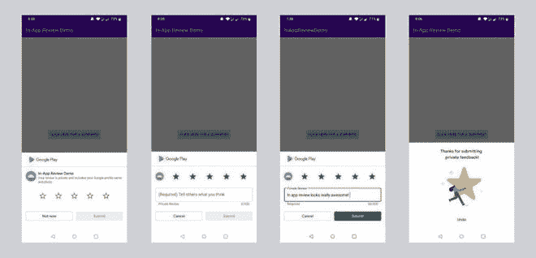

# 如何将 App 内审核 API 集成到安卓 App 中？

> 原文:[https://www . geeksforgeeks . org/如何在 app-review-API-进入 android-app/](https://www.geeksforgeeks.org/how-to-integrate-in-app-review-api-into-android-app/)

一旦我们在 PlayStore 上发布我们的应用程序，当它在那里上线时，应用程序评级和评论对于吸引观众和下载您的应用程序变得非常重要。为了提高这一点，我们要求用户通过弹出窗口对应用进行评分，并将他们重定向到 PlayStore。但是现在这产生了一些小问题，一旦用户去了 PlayStore，他们可能就不会再来我们的应用了。为了克服这个问题，谷歌提供了一个名为**的应用内审查**的应用编程接口，以显示应用本身的评级弹出窗口，这样用户就不必离开应用。

### **关于应用内审查应用编程接口的要点**

1.  安卓 5(应用编程接口级别 21)或更高版本的设备支持应用内审查，并且设备上安装了谷歌 PlayStore。
2.  应用编程接口本身决定了评论小部件应该多久向用户显示一次，我们不应该频繁调用这个应用编程接口，因为一旦用户达到最大限制，小部件就不应该向用户显示，否则可能会影响用户体验。
3.  审查流程是由 API 本身控制的，我们不应该试图改变它的设计。
4.  评论流并不表明用户是否评论过我们的应用，也不告诉我们评论小部件向用户显示了什么。

### **分步实施**

**第一步:创建新项目**

要在安卓工作室创建新项目，请参考[如何在安卓工作室创建/启动新项目](https://www.geeksforgeeks.org/android-how-to-create-start-a-new-project-in-android-studio/)。注意选择 **Java** 作为编程语言。

**第二步:添加依赖关系**

应用内审查应用编程接口是**播放核心应用编程接口**的一部分。为了在我们的应用中使用应用内审查应用编程接口，我们需要添加播放核心应用编程接口的依赖性。转到**梯度脚本>构建.梯度(模块:应用)**并添加以下依赖项。添加这些依赖项后，您需要点击**立即同步**。

> 依赖项{
> 
> 实现“com.google.android.play:核心:1.8.0”
> 
> }

**步骤 3:使用 MainActivity.java 文件**

在这一步中，我们将创建一个**评审管理**界面的实例，它提供了启动评审流程的必要方法。一旦创建了实例，我们需要调用 **requestReviewFlow()** 方法，该方法在成功完成时返回 **ReviewInfo** 对象。使用 ReviewInfo 对象，我们调用**launchereviewflow()**方法来启动审查流。

## Java 语言(一种计算机语言，尤用于创建网站)

```
import android.os.Bundle;
import androidx.appcompat.app.AppCompatActivity;
import com.google.android.material.dialog.MaterialAlertDialogBuilder;
import com.google.android.play.core.review.ReviewInfo;
import com.google.android.play.core.review.ReviewManager;
import com.google.android.play.core.review.ReviewManagerFactory;
import com.google.android.play.core.tasks.Task;

public class MainActivity extends AppCompatActivity {

    private ReviewManager reviewManager;

    @Override
    protected void onCreate(Bundle savedInstanceState) {
        super.onCreate(savedInstanceState);
        setContentView(R.layout.activity_main);

        // Calling init() method
          // for initialization
        init();
    }

    // Initializing method
    private void init() {
        reviewManager = ReviewManagerFactory.create(this);
        // Referencing the button
        findViewById(R.id.rateBtn).setOnClickListener(view -> showRateApp());
    }

    // Shows the app rate dialog box using In-App review API
    // The app rate dialog box might or might not shown depending
      // on the Quotas and limitations
    public void showRateApp() {
        Task <ReviewInfo> request = reviewManager.requestReviewFlow();
        request.addOnCompleteListener(task -> {
            if (task.isSuccessful()) {
                // Getting the ReviewInfo object
                ReviewInfo reviewInfo = task.getResult();

                Task <Void> flow = reviewManager.launchReviewFlow(this, reviewInfo);
                flow.addOnCompleteListener(task1 -> {
                    // The flow has finished. The API does not indicate whether the user
                    // reviewed or not, or even whether the review dialog was shown.
                });
            }
        });
    }
}
```

**第 4 步:测试应用内审查**

为了测试应用内审查，您的申请必须已经获得 **PlayStore** 的批准。它不要求应用公开，但至少你应该有一个**内部测试**(用于发布赛道和测试应用内审核流程)或**内部应用共享**(用于测试应用内审核流程)的普利亚斯特账户。您可以找到应用内审查的示例图像。

