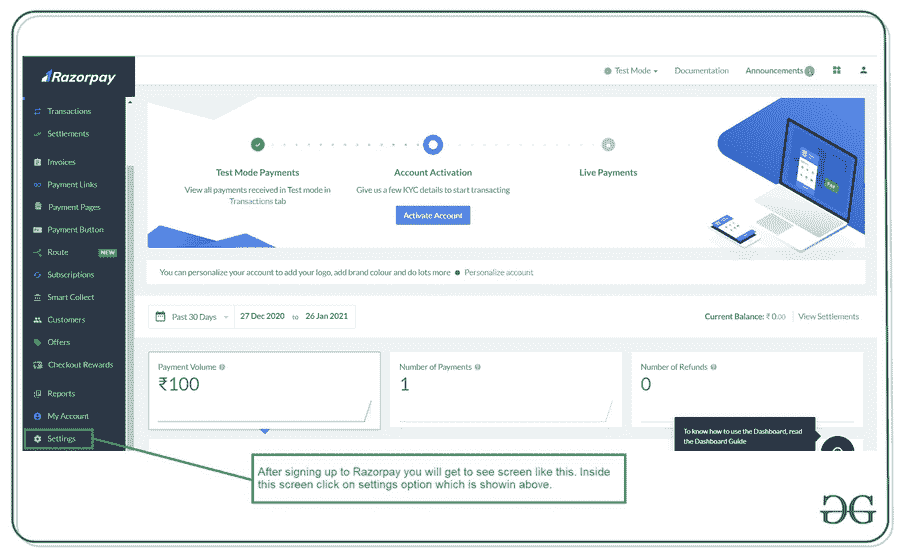
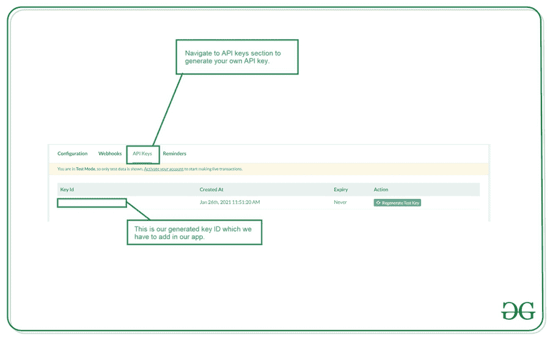

# 如何在安卓系统中集成 Razorpay 支付网关？

> 原文:[https://www . geeksforgeeks . org/如何集成-razor pay-支付-安卓网关/](https://www.geeksforgeeks.org/how-to-integrate-razorpay-payment-gateway-in-android/)

如今，许多应用程序要求在其应用程序中有一个支付网关，以便用户可以在应用程序中进行任何交易来购买任何产品或任何服务。许多应用程序使用支付网关功能，但在安卓应用程序中，集成该支付网关是一项困难的任务。因此，为了使这项任务变得简单易行 **Razorpay** 已经提供了一项服务，借助这项服务，我们可以非常轻松地在我们的应用程序中集成支付解决方案，并且我们还可以在我们的应用程序中管理所有支付方式。在这篇文章中，我们将看看在我们的安卓应用程序中支付网关的实现。

### 我们将在本文中构建什么？

我们将构建一个简单的安卓应用程序，其中我们将显示一个[编辑文本](https://www.geeksforgeeks.org/edittext-widget-in-android-using-java-with-examples/)和一个按钮。在这个屏幕中，我们必须添加要支付的金额，点击按钮后，我们将打开 Razorpay 支付网关并进行支付。在本文中，我们将添加在安卓系统中实现 Razorpay 的测试凭证。下面给出了一个示例视频，让我们了解一下在本文中要做什么。注意，我们将使用 **Java** 语言来实现这个项目。

<video class="wp-video-shortcode" id="video-550758-1" width="640" height="360" preload="metadata" controls=""><source type="video/mp4" src="https://media.geeksforgeeks.org/wp-content/uploads/20210126121644/Screenrecorder-2021-01-26-11-58-19-46.mp4?_=1">[https://media.geeksforgeeks.org/wp-content/uploads/20210126121644/Screenrecorder-2021-01-26-11-58-19-46.mp4](https://media.geeksforgeeks.org/wp-content/uploads/20210126121644/Screenrecorder-2021-01-26-11-58-19-46.mp4)</video>

### **分步实施**

**第一步:创建新项目**

要在安卓工作室创建新项目，请参考[如何在安卓工作室创建/启动新项目](https://www.geeksforgeeks.org/android-how-to-create-start-a-new-project-in-android-studio/)。注意选择 **Java** 作为编程语言。

**第二步:在 build.gradle 文件**中添加 Razor 支付库的依赖关系

导航到**渐变脚本>构建.渐变(模块:应用)**，并在依赖项部分添加以下依赖项。

> 实现' com.razorpay:checkout:1.6.4 '

添加这个依赖项后，同步您的项目，现在我们将转向 XML 部分。

**第三步:向互联网添加权限**

导航到**应用程序> AndroidManifest.xml** 文件，并在其中添加以下代码。

## 可扩展标记语言

```java
<uses-permission android:name="android.permission.INTERNET" />
```

**第 4 步:使用 activity_main.xml 文件**

导航到**应用程序> res >布局> activity_main.xml** 并将下面的代码添加到该文件中。下面是 **activity_main.xml** 文件的代码。

## 可扩展标记语言

```java
<?xml version="1.0" encoding="utf-8"?>
<RelativeLayout
    xmlns:android="http://schemas.android.com/apk/res/android"
    xmlns:tools="http://schemas.android.com/tools"
    android:layout_width="match_parent"
    android:layout_height="match_parent"
    tools:context=".MainActivity">

    <!--EditText text to enter amount-->
    <EditText
        android:id="@+id/idEdtAmount"
        android:layout_width="match_parent"
        android:layout_height="wrap_content"
        android:layout_centerInParent="true"
        android:layout_margin="20dp"
        android:hint="Enter amount to be payed"
        android:inputType="number" />

    <!--button to make payment-->
    <Button
        android:id="@+id/idBtnPay"
        android:layout_width="wrap_content"
        android:layout_height="wrap_content"
        android:layout_below="@id/idEdtAmount"
        android:layout_centerHorizontal="true"
        android:layout_marginTop="20dp"
        android:text="Pay using RazorPay"
        android:textAllCaps="false" />

</RelativeLayout>
```

**第五步:生成使用 Razorpay 的 API 密钥**

在谷歌浏览器上浏览 Razorpay 网站，或者点击这里的链接。点击此链接后，您只需注册您的电子邮件和密码，并添加一些基本信息，如您的电话号码。



> **注意:**这里我们正在为使用 Razor Pay 创建一个测试凭证。

在设置屏幕内，点击创建一个新的密钥选项，你的密钥将被生成。我们将在我们的应用程序中使用密钥标识来测试剃刀支付。密钥标识将以 **rzp_test** 开始



**第 6 步:使用****MainActivity.java 文件**

转到**MainActivity.java**文件，参考以下代码。以下是**MainActivity.java**文件的代码。代码中添加了注释，以更详细地理解代码。

## Java 语言(一种计算机语言，尤用于创建网站)

```java
import android.os.Bundle;
import android.view.View;
import android.widget.Button;
import android.widget.EditText;
import android.widget.Toast;

import androidx.appcompat.app.AppCompatActivity;

import com.razorpay.Checkout;
import com.razorpay.PaymentResultListener;

import org.json.JSONException;
import org.json.JSONObject;

public class MainActivity extends AppCompatActivity implements PaymentResultListener {

    // variables for our 
    // edit text and button.
    private EditText amountEdt;
    private Button payBtn;

    @Override
    protected void onCreate(Bundle savedInstanceState) {
        super.onCreate(savedInstanceState);
        setContentView(R.layout.activity_main);

        // initializing all our variables.
        amountEdt = findViewById(R.id.idEdtAmount);
        payBtn = findViewById(R.id.idBtnPay);

        // adding on click listener to our button.
        payBtn.setOnClickListener(new View.OnClickListener() {
            @Override
            public void onClick(View v) {
                // on below line we are getting 
                // amount that is entered by user.
                String samount = amountEdt.getText().toString();

                // rounding off the amount.
                int amount = Math.round(Float.parseFloat(samount) * 100);

                // initialize Razorpay account.
                Checkout checkout = new Checkout();

                // set your id as below
                checkout.setKeyID("Enter your key id here");

                // set image
                checkout.setImage(R.drawable.gfgimage);

                // initialize json object
                JSONObject object = new JSONObject();
                try {
                    // to put name
                    object.put("name", "Geeks for Geeks");

                    // put description
                    object.put("description", "Test payment");

                    // to set theme color
                    object.put("theme.color", "");

                    // put the currency
                    object.put("currency", "INR");

                    // put amount
                    object.put("amount", amount);

                    // put mobile number
                    object.put("prefill.contact", "9284064503");

                    // put email
                    object.put("prefill.email", "chaitanyamunje@gmail.com");

                    // open razorpay to checkout activity
                    checkout.open(MainActivity.this, object);
                } catch (JSONException e) {
                    e.printStackTrace();
                }
            }
        });
    }

    @Override
    public void onPaymentSuccess(String s) {
        // this method is called on payment success.
        Toast.makeText(this, "Payment is successful : " + s, Toast.LENGTH_SHORT).show();
    }

    @Override
    public void onPaymentError(int i, String s) {
        // on payment failed.
        Toast.makeText(this, "Payment Failed due to error : " + s, Toast.LENGTH_SHORT).show();
    }
}
```

现在运行您的应用程序，并查看应用程序的输出。

### **输出:**

因为我们使用的是测试证书，所以我们不会付款。为了让你的支付生效，你必须让你的应用程序在 Razorpay 控制台生效，并生成一个新的密钥。

<video class="wp-video-shortcode" id="video-550758-2" width="640" height="360" preload="metadata" controls=""><source type="video/mp4" src="https://media.geeksforgeeks.org/wp-content/uploads/20210126121644/Screenrecorder-2021-01-26-11-58-19-46.mp4?_=2">[https://media.geeksforgeeks.org/wp-content/uploads/20210126121644/Screenrecorder-2021-01-26-11-58-19-46.mp4](https://media.geeksforgeeks.org/wp-content/uploads/20210126121644/Screenrecorder-2021-01-26-11-58-19-46.mp4)</video>