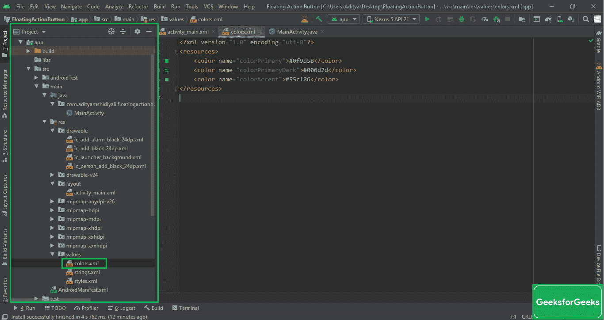
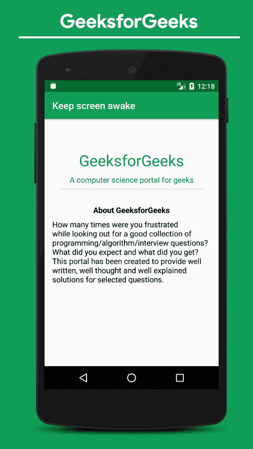

# 如何在安卓系统中保持设备屏幕开启？

> 原文:[https://www . geeksforgeeks . org/如何在安卓系统上保持设备屏幕/](https://www.geeksforgeeks.org/how-to-keep-the-device-screen-on-in-android/)

在[安卓](https://www.geeksforgeeks.org/kotlin-android-tutorial/)中看到屏幕超时会设置为 30 秒或者是用户在系统设置中手动设置，避免电池耗尽。但也有像**秒表**、**文档阅读器应用程序**、**游戏**等应用程序需要屏幕始终保持清醒的情况。本文演示了如何保持设备屏幕清醒。

### 保持设备屏幕打开的步骤

**第一步:创建新项目**

要在安卓工作室创建新项目，请参考[如何在安卓工作室创建/启动新项目](https://www.geeksforgeeks.org/android-how-to-create-start-a-new-project-in-android-studio/)。注意选择 [Java](https://www.geeksforgeeks.org/java/) 作为编程语言。

**第二步:更改应用基础主题**的 **颜色组合**

*   要更改基本应用程序主题颜色，请转到**应用程序- > res - >值- > colors.xml** ，并调用以下颜色组合。

## 可扩展标记语言

```
<?xml version="1.0" encoding="utf-8"?>
<resources>
    <color name="colorPrimary">#0f9d58</color>
    <color name="colorPrimaryDark">#006d2d</color>
    <color name="colorAccent">#55cf86</color>
</resources>
```

*   如果没有得到 **colors.xml** 文件，请参考下图:



**步骤 3:使用 activity_main.xml 文件**

在 **activity_main.xml** 文件中添加[文本视图](https://www.geeksforgeeks.org/textview-widget-in-android-using-java-with-examples/)来制作一个类似文档阅读应用程序的应用程序。

## 可扩展标记语言

```
<?xml version="1.0" encoding="utf-8"?>
<LinearLayout 
    xmlns:android="http://schemas.android.com/apk/res/android"
    xmlns:tools="http://schemas.android.com/tools"
    android:layout_width="match_parent"
    android:layout_height="match_parent"
    android:orientation="vertical"
    tools:context=".MainActivity"
    tools:ignore="HardcodedText">

    <!--This layout contains some simple text views-->
    <TextView
        android:layout_width="match_parent"
        android:layout_height="wrap_content"
        android:layout_marginTop="64dp"
        android:fontFamily="sans-serif"
        android:gravity="center"
        android:text="GeeksforGeeks"
        android:textColor="@color/colorPrimary"
        android:textSize="32sp" />

    <TextView
        android:layout_width="match_parent"
        android:layout_height="wrap_content"
        android:layout_marginTop="8dp"
        android:fontFamily="sans-serif"
        android:gravity="center"
        android:text="A Computer Science portal for geeks"
        android:textColor="@color/colorPrimary"
        android:textSize="16sp" />

    <View
        android:layout_width="300dp"
        android:layout_height="1dp"
        android:layout_gravity="center"
        android:layout_marginTop="8dp"
        android:background="@android:color/darker_gray" />

    <TextView
        android:layout_width="wrap_content"
        android:layout_height="wrap_content"
        android:layout_gravity="center"
        android:layout_marginTop="32dp"
        android:text="About GeeksforGeeks"
        android:textColor="@android:color/black"
        android:textSize="16sp"
        android:textStyle="bold" />

    <TextView
        android:layout_width="wrap_content"
        android:layout_height="wrap_content"
        android:layout_marginStart="16dp"
        android:layout_marginTop="8dp"
        android:layout_marginEnd="16dp"
        android:text="How many times were you frustrated while looking out for a good collection of programming/algorithm/interview questions? What did you expect and what did you get? This portal has been created to provide well written, well thought and well explained solutions for selected questions."
        android:textColor="@android:color/black"
        android:textSize="16sp" />

</LinearLayout>
```

**产生如下输出 UI:**



**第 4 步:保持设备屏幕清醒**

有两种方法可以实现屏幕始终保持清醒。

**方法 1:调用“保持屏幕”为真**

可以通过在应用程序的根视图中调用以下属性来保持设备屏幕唤醒。

> ***安卓:keepScreenOn =【真】***T4】

你可以看看下面的 **activity_main.xml** 代码:

## 可扩展标记语言

```
<?xml version="1.0" encoding="utf-8"?>

<!--one needs to focus on the keepScreenOn
    in the root view of the application-->
<LinearLayout 
    xmlns:android="http://schemas.android.com/apk/res/android"
    xmlns:tools="http://schemas.android.com/tools"
    android:layout_width="match_parent"
    android:layout_height="match_parent"

    android:keepScreenOn="true"

    android:orientation="vertical"
    tools:context=".MainActivity"
    tools:ignore="HardcodedText">

    <!--This layout contains some simple text views-->
    <TextView
        android:layout_width="match_parent"
        android:layout_height="wrap_content"
        android:layout_marginTop="64dp"
        android:fontFamily="sans-serif"
        android:gravity="center"
        android:text="GeeksforGeeks"
        android:textColor="@color/colorPrimary"
        android:textSize="32sp" />

    <TextView
        android:layout_width="match_parent"
        android:layout_height="wrap_content"
        android:layout_marginTop="8dp"
        android:fontFamily="sans-serif"
        android:gravity="center"
        android:text="A Computer Science portal for geeks"
        android:textColor="@color/colorPrimary"
        android:textSize="16sp" />

    <View
        android:layout_width="300dp"
        android:layout_height="1dp"
        android:layout_gravity="center"
        android:layout_marginTop="8dp"
        android:background="@android:color/darker_gray" />

    <TextView
        android:layout_width="wrap_content"
        android:layout_height="wrap_content"
        android:layout_gravity="center"
        android:layout_marginTop="32dp"
        android:text="About GeeksforGeeks"
        android:textColor="@android:color/black"
        android:textSize="16sp"
        android:textStyle="bold" />

    <TextView
        android:layout_width="wrap_content"
        android:layout_height="wrap_content"
        android:layout_marginStart="16dp"
        android:layout_marginTop="8dp"
        android:layout_marginEnd="16dp"
        android:text="How many times were you frustrated while looking out for a good collection of programming/algorithm/interview questions? What did you expect and what did you get? This portal has been created to provide well written, well thought and well explained solutions for selected questions."
        android:textColor="@android:color/black"
        android:textSize="16sp" />

</LinearLayout>
```

**方法 2:** **以编程方式保持屏幕开启**

现在，您可以从 activity_main.xml 文件中移除属性**Android:keepScreenOn = " true "**，其余所有代码保持不变，并在**MainActivity.java 文件中调用以下代码。**

> getWindow()。addFlags(WindowManager)。布局参数 FLAG_KEEP_SCREEN_ON：

完整的代码如下。

## Java 语言(一种计算机语言，尤用于创建网站)

```
import androidx.appcompat.app.AppCompatActivity;

import android.os.Bundle;
import android.view.WindowManager;

public class MainActivity extends AppCompatActivity {

    @Override
    protected void onCreate(Bundle savedInstanceState) {
        super.onCreate(savedInstanceState);
        setContentView(R.layout.activity_main);

        // setting up the flag programmatically so that the 
        // device screen should be always on
        getWindow().addFlags(WindowManager.LayoutParams.FLAG_KEEP_SCREEN_ON);
    }
}
```

### 输出

输出生成如下图(建议在物理安卓设备中测试该应用，这样无论 app 屏幕是否唤醒都可以看到结果)，两种方法的输出将保持不变:


### 推荐哪种方法？

这两种方法都是相同的，可以使用感觉更好的方法，但是推荐**以编程方式实现这一点**，因为在复杂的安卓应用程序中，开发人员在特定的活动中设置许多标志，很容易获得所有这些标志，并手动禁用和管理它们。