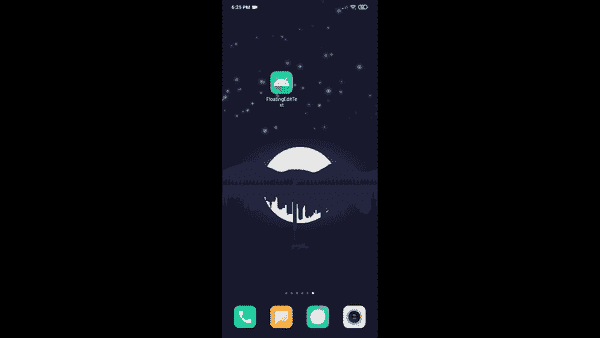

# 如何在安卓做一个浮动窗口应用？

> 原文:[https://www . geeksforgeeks . org/如何在 android 中制作浮动窗口应用程序/](https://www.geeksforgeeks.org/how-to-make-a-floating-window-application-in-android/)

嗯，在我们的台式电脑上，我们可以很容易地恢复关闭窗口，在后台做一些事情，并在任何时候最大化窗口。但是我们在安卓应用中并没有看到这个功能。如今，我们可以看到安卓提供了分屏功能，但这是操作系统提供的功能，而不是应用程序的单独功能。让我们制作一个只需点击一个按钮就能最小化和最大化自己的应用程序。这个特性可以在很多方面帮助用户。假设您正在阅读一些带有数学计算的 pdf 文档，那么 pdf 查看器应用程序上的最小化计算器将非常有帮助。有很多应用程序使用这个功能，比如剪贴板、MI 计算器等等。这是本文最后一个应用的演示。注意，我们将使用 **Java** 语言来实现这个项目。



### 逐步实施

**第一步:创建新项目**

要在安卓工作室创建新项目，请参考[如何在安卓工作室创建/启动新项目](https://www.geeksforgeeks.org/android-how-to-create-start-a-new-project-in-android-studio/)。注意选择 **Java** 作为编程语言。

**第二步:让我们制作工作平台**

*   **为应用程序**添加新颜色:转到**值- > colors.xml** 。这里可以添加任何自定义颜色。我们添加了这两种颜色。

## 可扩展标记语言

```java
<color name="gfgTheme">#FF2F8D46</color>
<color name="gfgThemeTwo">#FF098043</color>
```

*   **移除动作栏**:在安卓 Studio 4.1 中，转到**价值观- >主题**。有两个主题 XML 文件，一个用于*灯光模式*，一个用于*黑暗模式*。在这两个 XML 中，在样式块中将*父项*属性更改为**主题。材料组件。日夜。无功能栏**。
*   **更改 app 的主主题颜色**:在同一个文件中，第一个项目块必须是关于 App 的主颜色。这里添加了新添加的颜色。在项目块中添加 **@color/gfgTheme** 或 **@color/gfgThemeTwo** 。

**第三步:先做好所有的布局**

**3.a:开始处理 activity_main.xml 文件**

这个 XML 文件构成了应用程序主要活动的布局。布局没那么复杂。在约束布局中，只有一个[按钮](https://www.geeksforgeeks.org/button-in-kotlin/)、[文本视图](https://www.geeksforgeeks.org/textview-widget-in-android-using-java-with-examples/)、[编辑文本](https://www.geeksforgeeks.org/edittext-widget-in-android-using-java-with-examples/)，以及一个接一个的按钮。下面是 XML 代码。

## 可扩展标记语言

```java
<?xml version="1.0" encoding="utf-8"?>
<androidx.constraintlayout.widget.ConstraintLayout 
    xmlns:android="http://schemas.android.com/apk/res/android"
    xmlns:app="http://schemas.android.com/apk/res-auto"
    xmlns:tools="http://schemas.android.com/tools"
    android:layout_width="match_parent"
    android:layout_height="match_parent"
    android:background="@android:color/white"
    tools:context=".MainActivity">

    <Button
        android:id="@+id/buttonMinimize"
        android:layout_width="0dp"
        android:layout_height="wrap_content"
        android:layout_marginTop="20dp"
        android:text="MINIMIZE"
        android:textColor="@android:color/white"
        android:textSize="25sp"
        app:layout_constraintEnd_toEndOf="parent"
        app:layout_constraintStart_toStartOf="parent"
        app:layout_constraintTop_toTopOf="parent" />

    <TextView
        android:id="@+id/titleText"
        android:layout_width="match_parent"
        android:layout_height="70dp"
        android:gravity="center"
        android:text="GEEKS FOR GEEKS"
        android:textColor="@color/gfgTheme"
        android:textSize="30sp"
        android:textStyle="bold"
        app:layout_constraintEnd_toEndOf="parent"
        app:layout_constraintStart_toStartOf="parent"
        app:layout_constraintTop_toBottomOf="@+id/buttonMinimize" />

    <EditText
        android:id="@+id/descEditText"
        android:layout_width="match_parent"
        android:layout_height="330dp"
        android:layout_marginTop="10dp"
        android:gravity="start"
        android:hint="Description"
        android:paddingLeft="20dp"
        android:paddingTop="10dp"
        android:paddingRight="20dp"
        android:paddingBottom="10dp"
        android:textColor="@android:color/black"
        android:textSize="22sp"
        app:layout_constraintEnd_toEndOf="parent"
        app:layout_constraintStart_toStartOf="parent"
        app:layout_constraintTop_toBottomOf="@+id/titleText" />

    <Button
        android:id="@+id/saveBtn"
        android:layout_width="wrap_content"
        android:layout_height="wrap_content"
        android:layout_marginTop="20dp"
        android:text="SAVE"
        android:textColor="@android:color/white"
        android:textSize="25sp"
        app:layout_constraintEnd_toEndOf="parent"
        app:layout_constraintStart_toStartOf="parent"
        app:layout_constraintTop_toBottomOf="@+id/descEditText" />

</androidx.constraintlayout.widget.ConstraintLayout>
```

**3.b:开始处理 floating_layout.xml 文件**

转到 **res - >布局**。右键单击**布局- >新建- >布局资源文件**。在此添加布局名称(**浮动 _ 布局**)。这个 XML 文件构成了浮动窗口的布局。它具有与主布局相同的组件，但大小限制略有不同。下面是 XML 代码。

## 可扩展标记语言

```java
<?xml version="1.0" encoding="utf-8"?>
<androidx.constraintlayout.widget.ConstraintLayout 
    xmlns:android="http://schemas.android.com/apk/res/android"
    xmlns:app="http://schemas.android.com/apk/res-auto"
    android:layout_width="match_parent"
    android:layout_height="match_parent"
    android:background="@android:color/white">

    <Button
        android:id="@+id/buttonMaximize"
        android:layout_width="match_parent"
        android:layout_height="40dp"
        android:layout_marginTop="20dp"
        android:background="@color/gfgThemeTwo"
        android:text="MAXIMIZE"
        android:textColor="@android:color/white"
        android:textSize="15sp"
        app:layout_constraintEnd_toEndOf="parent"
        app:layout_constraintStart_toStartOf="parent"
        app:layout_constraintTop_toTopOf="parent" />

    <TextView
        android:id="@+id/titleText"
        android:layout_width="match_parent"
        android:layout_height="30dp"
        android:layout_marginTop="10dp"
        android:gravity="center"
        android:text="GEEKS FOR GEEKS"
        android:textColor="@color/gfgThemeTwo"
        android:textSize="18sp"
        android:textStyle="bold"
        app:layout_constraintEnd_toEndOf="parent"
        app:layout_constraintStart_toStartOf="parent"
        app:layout_constraintTop_toBottomOf="@+id/buttonMaximize" />

    <EditText
        android:id="@+id/descEditText"
        android:layout_width="match_parent"
        android:layout_height="0dp"
        android:layout_marginTop="10dp"
        android:layout_marginBottom="10dp"
        android:gravity="start"
        android:hint="Description"
        android:paddingLeft="20dp"
        android:paddingTop="10dp"
        android:paddingRight="20dp"
        android:paddingBottom="10dp"
        android:textColor="@android:color/black"
        android:textSize="16sp"
        app:layout_constraintBottom_toTopOf="@+id/saveBtn"
        app:layout_constraintEnd_toEndOf="parent"
        app:layout_constraintStart_toStartOf="parent"
        app:layout_constraintTop_toBottomOf="@+id/titleText" />

    <Button
        android:id="@+id/saveBtn"
        android:layout_width="wrap_content"
        android:layout_height="40dp"
        android:layout_marginBottom="10dp"
        android:background="@color/gfgThemeTwo"
        android:text="SAVE"
        android:textColor="@android:color/white"
        android:textSize="12sp"
        app:layout_constraintBottom_toBottomOf="parent"
        app:layout_constraintEnd_toEndOf="parent"
        app:layout_constraintStart_toStartOf="parent" />

</androidx.constraintlayout.widget.ConstraintLayout>
```

**第四步:开始开发 Java 程序**

我们在这里上了三节课。显然，第一个是**主活动**。第二个是浮动窗口服务的**浮动窗口函数**，最后一个是两个公共变量的公共类。

**4.a:让我们为公共变量**创建类

*   首先，让我们制作一个名为**的通用**包。右键单击项目包路径(**com . wheic . floating dittext【此处为 T3】)**->新建- >包**。**
*   会弹出一个窗口。写好了想要的包名(**常用**给我)。将创建一个新包。
*   右键单击**新创建的包- >新- > Java 类**。写下了预期的类名(此处为 **Common** )。
*   创建了两个公共字符串变量，一个是 **currentDesc** ，另一个是 **savedDesc** 。两者都由空字符串启动。
*   这是**Common.java**班的代码。

## Java 语言(一种计算机语言，尤用于创建网站)

```java
package com.wheic.floatingedittext.Common;

public class Common {
    // The EditText String will be 
    // stored in this variable
    // when MINIMIZE or MAXIMIZE 
    // button is pressed
    public static String currentDesc = "";

    // The EditText String will be 
    // stored in this variable
    // when SAVE button is pressed
    public static String savedDesc = "";
}
```

**4.b:开始处理 MainActivity.java 文件**

*   首先，创建组件类的引用。创建两个*按钮*，一个[按钮*按钮*按钮](https://www.geeksforgeeks.org/android-alert-dialog-box-and-how-to-create-it/)，一个*按钮*参考。
*   在转到 *onCreate()* 之前，会创建一些其他方法。
*   **isMyServiceRunning()** :这个方法有助于发现这个 app 的浮动窗口服务是否在运行。当浮动窗口已经可见时，打开同一个应用程序时需要该功能，因为这时需要停止浮动窗口服务。下面是一行行解释的代码:

## Java 语言(一种计算机语言，尤用于创建网站)

```java
private boolean isMyServiceRunning() {
       // The ACTIVITY_SERVICE is needed to retrieve a 
          // ActivityManager for interacting with the global system
       // It has a constant String value "activity".
       ActivityManager manager = (ActivityManager) getSystemService(Context.ACTIVITY_SERVICE);

          // A loop is needed to get Service information that are currently running in the System.
       // So ActivityManager.RunningServiceInfo is used. It helps to retrieve a
       // particular service information, here its this service.
       // getRunningServices() method returns a list of the services that are currently running
       // and MAX_VALUE is 2147483647\. So at most this many services can be returned by this method.
       for (ActivityManager.RunningServiceInfo service : manager.getRunningServices(Integer.MAX_VALUE)) {

             // If this service is found as a running, it will return true or else false.
           if (FloatingWindowGFG.class.getName().equals(service.service.getClassName())) {
               return true;
           }
       }
       return false;
   }
```

*   **requestOverlayDisplayPermission()**:该方法有助于将应用重定向到设置，以启用“*在其他应用上显示”*。尽管为此需要在 AndroidManifest.xml 文件中增加一行。请访问 **app - >清单- > AndroidManifest.xml** 。在应用程序块前添加此行:

## Java 语言(一种计算机语言，尤用于创建网站)

```java
private void requestOverlayDisplayPermission() {
        // An AlertDialog is created
        AlertDialog.Builder builder = new AlertDialog.Builder(this);

          // This dialog can be closed, just by 
          // taping outside the dialog-box
        builder.setCancelable(true);

        // The title of the Dialog-box is set
        builder.setTitle("Screen Overlay Permission Needed");

        // The message of the Dialog-box is set
        builder.setMessage("Enable 'Display over other apps' from System Settings.");

        // The event of the Positive-Button is set
        builder.setPositiveButton("Open Settings", new DialogInterface.OnClickListener() {
            @Override
            public void onClick(DialogInterface dialog, int which) {
                // The app will redirect to the 'Display over other apps' in Settings.
                // This is an Implicit Intent. This is needed when any Action is needed 
                  // to perform, here it is
                // redirecting to an other app(Settings).
                Intent intent = new Intent(Settings.ACTION_MANAGE_OVERLAY_PERMISSION, Uri.parse("package:" + getPackageName()));

                  // This method will start the intent. It takes two parameter, 
                  // one is the Intent and the other is
                // an requestCode Integer. Here it is -1.
                startActivityForResult(intent, RESULT_OK);
            }
        });
        dialog = builder.create();
        // The Dialog will show in the screen
        dialog.show();
    }
```

*   **checkOverlayDisplayPermission()**:这个方法实际上是检查如果 API 级别大于 23，那么在设置中是否启用了“*显示在其他应用之上*”。下面是这个函数的代码:

## Java 语言(一种计算机语言，尤用于创建网站)

```java
private boolean checkOverlayDisplayPermission() {
        // Android Version is lesser than Marshmallow 
          // or the API is lesser than 23
        // doesn't need 'Display over other apps' permission enabling.
        if (Build.VERSION.SDK_INT > Build.VERSION_CODES.M) {
            // If 'Display over other apps' is not enabled it 
              // will return false or else true
            if (!Settings.canDrawOverlays(this)) {
                return false;
            } else {
                return true;
            }
        } else {
            return true;
        }
    }
```

*   这是 MainActivity.java 文件的完整代码。

## Java 语言(一种计算机语言，尤用于创建网站)

```java
package com.wheic.floatingedittext;

import android.app.ActivityManager;
import android.content.Context;
import android.content.DialogInterface;
import android.content.Intent;
import android.net.Uri;
import android.os.Build;
import android.os.Bundle;
import android.provider.Settings;
import android.text.Editable;
import android.text.TextWatcher;
import android.view.View;
import android.widget.Button;
import android.widget.EditText;
import android.widget.Toast;

import androidx.appcompat.app.AlertDialog;
import androidx.appcompat.app.AppCompatActivity;

import com.wheic.floatingedittext.Common.Common;

public class MainActivity extends AppCompatActivity {

    // The reference variables for the
    // Button, AlertDialog, EditText 
    // classes are created
    private Button minimizeBtn;
    private AlertDialog dialog;
    private EditText descEditArea;
    private Button save;

    @Override
    protected void onCreate(Bundle savedInstanceState) {
        super.onCreate(savedInstanceState);
        setContentView(R.layout.activity_main);

        // The Buttons and the EditText are connected with
        // the corresponding component id used in layout file
        minimizeBtn = findViewById(R.id.buttonMinimize);
        descEditArea = findViewById(R.id.descEditText);
        save = findViewById(R.id.saveBtn);

        // If the app is started again while the 
        // floating window service is running
        // then the floating window service will stop
        if (isMyServiceRunning()) {
            // onDestroy() method in FloatingWindowGFG
            // class will be called here
            stopService(new Intent(MainActivity.this, FloatingWindowGFG.class));
        }

        // currentDesc String will be empty 
        // at first time launch
        // but the text written in floating 
        // window will not gone
        descEditArea.setText(Common.currentDesc);
        descEditArea.setSelection(descEditArea.getText().toString().length());

        // The EditText string will be stored in 
        // currentDesc while writing
        descEditArea.addTextChangedListener(new TextWatcher() {
            @Override
            public void beforeTextChanged(CharSequence charSequence, int i, int i1, int i2) {
                // Not Necessary
            }

            @Override
            public void onTextChanged(CharSequence charSequence, int i, int i1, int i2) {
                Common.currentDesc = descEditArea.getText().toString();
            }

            @Override
            public void afterTextChanged(Editable editable) {
                // Not Necessary
            }
        });

        // Here the save button is used just to store the 
        // EditText string in saveDesc variable
        save.setOnClickListener(new View.OnClickListener() {
            @Override
            public void onClick(View v) {
                Common.savedDesc = descEditArea.getText().toString();
                descEditArea.setCursorVisible(false);
                descEditArea.clearFocus();
                Toast.makeText(MainActivity.this, "Text Saved!!!", Toast.LENGTH_SHORT).show();
            }
        });

        // The Main Button that helps to minimize the app
        minimizeBtn.setOnClickListener(new View.OnClickListener() {
            @Override
            public void onClick(View v) {
                // First it confirms whether the
                // 'Display over other apps' permission in given
                if (checkOverlayDisplayPermission()) {
                    // FloatingWindowGFG service is started
                    startService(new Intent(MainActivity.this, FloatingWindowGFG.class));
                    // The MainActivity closes here
                    finish();
                } else {
                    // If permission is not given,
                    // it shows the AlertDialog box and
                    // redirects to the Settings
                    requestOverlayDisplayPermission();
                }
            }
        });
    }

    private boolean isMyServiceRunning() {
        // The ACTIVITY_SERVICE is needed to retrieve a
        // ActivityManager for interacting with the global system
        // It has a constant String value "activity".
        ActivityManager manager = (ActivityManager) getSystemService(Context.ACTIVITY_SERVICE);

        // A loop is needed to get Service information that 
        // are currently running in the System.
        // So ActivityManager.RunningServiceInfo is used. 
        // It helps to retrieve a
        // particular service information, here its this service.
        // getRunningServices() method returns a list of the 
        // services that are currently running
        // and MAX_VALUE is 2147483647\. So at most this many services
        // can be returned by this method.
        for (ActivityManager.RunningServiceInfo service : manager.getRunningServices(Integer.MAX_VALUE)) {
            // If this service is found as a running, 
            // it will return true or else false.
            if (FloatingWindowGFG.class.getName().equals(service.service.getClassName())) {
                return true;
            }
        }
        return false;
    }

    private void requestOverlayDisplayPermission() {
        // An AlertDialog is created
        AlertDialog.Builder builder = new AlertDialog.Builder(this);

        // This dialog can be closed, just by taping
        // anywhere outside the dialog-box
        builder.setCancelable(true);

        // The title of the Dialog-box is set
        builder.setTitle("Screen Overlay Permission Needed");

        // The message of the Dialog-box is set
        builder.setMessage("Enable 'Display over other apps' from System Settings.");

        // The event of the Positive-Button is set
        builder.setPositiveButton("Open Settings", new DialogInterface.OnClickListener() {
            @Override
            public void onClick(DialogInterface dialog, int which) {
                // The app will redirect to the 'Display over other apps' in Settings.
                // This is an Implicit Intent. This is needed when any Action is needed
                // to perform, here it is
                // redirecting to an other app(Settings).
                Intent intent = new Intent(Settings.ACTION_MANAGE_OVERLAY_PERMISSION, Uri.parse("package:" + getPackageName()));

                // This method will start the intent. It takes two parameter, one is the Intent and the other is
                // an requestCode Integer. Here it is -1.
                startActivityForResult(intent, RESULT_OK);
            }
        });
        dialog = builder.create();
        // The Dialog will 
        // show in the screen
        dialog.show();
    }

    private boolean checkOverlayDisplayPermission() {
        // Android Version is lesser than Marshmallow or
        // the API is lesser than 23
        // doesn't need 'Display over other apps' permission enabling.
        if (Build.VERSION.SDK_INT > Build.VERSION_CODES.M) {
            // If 'Display over other apps' is not enabled
            // it will return false or else true
            if (!Settings.canDrawOverlays(this)) {
                return false;
            } else {
                return true;
            }
        } else {
            return true;
        }
    }
}
```

**4.c:开始处理 FloatingWindowGFG.java 文件**

*   另一个类被创建为*浮动窗口 GFG* 。前往项目包路径(**com . wheic . floatingdittext**为我) **- > New - > Java 类**然后给出任何想要的名字( **FloatingWindowGFG** 为我)。
*   此类继承了服务类。
*   既然这个类是从服务类继承的，那么这个类可以在清单文件中用作服务。所以在 **AndroidManifest.xml** 中，在活动块之后，应用程序块结束之前添加这一行。

*   下面是***【FloatingWindowGFG.java】***的代码。添加评论是为了更好地解释:

## Java 语言(一种计算机语言，尤用于创建网站)

```java
package com.wheic.floatingedittext;

import android.app.Service;
import android.content.Context;
import android.content.Intent;
import android.graphics.PixelFormat;
import android.os.Build;
import android.os.IBinder;
import android.text.Editable;
import android.text.TextWatcher;
import android.util.DisplayMetrics;
import android.view.Gravity;
import android.view.LayoutInflater;
import android.view.MotionEvent;
import android.view.View;
import android.view.ViewGroup;
import android.view.WindowManager;
import android.view.inputmethod.InputMethodManager;
import android.widget.Button;
import android.widget.EditText;
import android.widget.Toast;

import androidx.annotation.Nullable;

import com.wheic.floatingedittext.Common.Common;

public class FloatingWindowGFG extends Service {

    // The reference variables for the
    // ViewGroup, WindowManager.LayoutParams, 
    // WindowManager, Button, EditText classes are created
    private ViewGroup floatView;
    private int LAYOUT_TYPE;
    private WindowManager.LayoutParams floatWindowLayoutParam;
    private WindowManager windowManager;
    private Button maximizeBtn;
    private EditText descEditArea;
    private Button saveBtn;

    // As FloatingWindowGFG inherits Service class, 
    // it actually overrides the onBind method
    @Nullable
    @Override
    public IBinder onBind(Intent intent) {
        return null;
    }

    @Override
    public void onCreate() {
        super.onCreate();

        // The screen height and width are calculated, cause
        // the height and width of the floating window is set depending on this
        DisplayMetrics metrics = getApplicationContext().getResources().getDisplayMetrics();
        int width = metrics.widthPixels;
        int height = metrics.heightPixels;

        // To obtain a WindowManager of a different Display,
        // we need a Context for that display, so WINDOW_SERVICE is used
        windowManager = (WindowManager) getSystemService(WINDOW_SERVICE);

        // A LayoutInflater instance is created to retrieve the 
        // LayoutInflater for the floating_layout xml
        LayoutInflater inflater = (LayoutInflater) getBaseContext().getSystemService(LAYOUT_INFLATER_SERVICE);

        // inflate a new view hierarchy from the floating_layout xml
        floatView = (ViewGroup) inflater.inflate(R.layout.floating_layout, null);

        // The Buttons and the EditText are connected with
        // the corresponding component id used in floating_layout xml file
        maximizeBtn = floatView.findViewById(R.id.buttonMaximize);
        descEditArea = floatView.findViewById(R.id.descEditText);
        saveBtn = floatView.findViewById(R.id.saveBtn);

        // Just like MainActivity, the text written 
        // in Maximized will stay
        descEditArea.setText(Common.currentDesc);
        descEditArea.setSelection(descEditArea.getText().toString().length());
        descEditArea.setCursorVisible(false);

        // WindowManager.LayoutParams takes a lot of parameters to set the
        // the parameters of the layout. One of them is Layout_type.
        if (Build.VERSION.SDK_INT >= Build.VERSION_CODES.O) {
            // If API Level is more than 26, we need TYPE_APPLICATION_OVERLAY
            LAYOUT_TYPE = WindowManager.LayoutParams.TYPE_APPLICATION_OVERLAY;
        } else {
            // If API Level is lesser than 26, then we can 
            // use TYPE_SYSTEM_ERROR,
            // TYPE_SYSTEM_OVERLAY, TYPE_PHONE, TYPE_PRIORITY_PHONE.
            // But these are all
            // deprecated in API 26 and later. Here TYPE_TOAST works best.
            LAYOUT_TYPE = WindowManager.LayoutParams.TYPE_TOAST;
        }

        // Now the Parameter of the floating-window layout is set.
        // 1) The Width of the window will be 55% of the phone width.
        // 2) The Height of the window will be 58% of the phone height.
        // 3) Layout_Type is already set.
        // 4) Next Parameter is Window_Flag. Here FLAG_NOT_FOCUSABLE is used. But
        // problem with this flag is key inputs can't be given to the EditText.
        // This problem is solved later.
        // 5) Next parameter is Layout_Format. System chooses a format that supports 
        // translucency by PixelFormat.TRANSLUCENT
        floatWindowLayoutParam = new WindowManager.LayoutParams(
                (int) (width * (0.55f)),
                (int) (height * (0.58f)),
                LAYOUT_TYPE,
                WindowManager.LayoutParams.FLAG_NOT_FOCUSABLE,
                PixelFormat.TRANSLUCENT
        );

        // The Gravity of the Floating Window is set. 
        // The Window will appear in the center of the screen
        floatWindowLayoutParam.gravity = Gravity.CENTER;

        // X and Y value of the window is set
        floatWindowLayoutParam.x = 0;
        floatWindowLayoutParam.y = 0;

        // The ViewGroup that inflates the floating_layout.xml is
        // added to the WindowManager with all the parameters
        windowManager.addView(floatView, floatWindowLayoutParam);

        // The button that helps to maximize the app
        maximizeBtn.setOnClickListener(new View.OnClickListener() {
            @Override
            public void onClick(View v) {
                // stopSelf() method is used to stop the service if
                // it was previously started
                stopSelf();

                // The window is removed from the screen
                windowManager.removeView(floatView);

                // The app will maximize again. So the MainActivity 
                // class will be called again.
                Intent backToHome = new Intent(FloatingWindowGFG.this, MainActivity.class);

                // 1) FLAG_ACTIVITY_NEW_TASK flag helps activity to start a new task on the history stack.
                // If a task is already running like the floating window service, a new activity will not be started.
                // Instead the task will be brought back to the front just like the MainActivity here
                // 2) FLAG_ACTIVITY_CLEAR_TASK can be used in the conjunction with FLAG_ACTIVITY_NEW_TASK. This flag will
                // kill the existing task first and then new activity is started.
                backToHome.addFlags(Intent.FLAG_ACTIVITY_NEW_TASK | Intent.FLAG_ACTIVITY_CLEAR_TASK);
                startActivity(backToHome);
            }
        });

        // The EditText string will be stored 
        // in currentDesc while writing
        descEditArea.addTextChangedListener(new TextWatcher() {
            @Override
            public void beforeTextChanged(CharSequence charSequence, int i, int i1, int i2) {
                // Not Necessary
            }

            @Override
            public void onTextChanged(CharSequence charSequence, int i, int i1, int i2) {
                Common.currentDesc = descEditArea.getText().toString();
            }

            @Override
            public void afterTextChanged(Editable editable) {
                // Not Necessary
            }
        });

        // Another feature of the floating window is, the window is movable.
        // The window can be moved at any position on the screen.
        floatView.setOnTouchListener(new View.OnTouchListener() {
            final WindowManager.LayoutParams floatWindowLayoutUpdateParam = floatWindowLayoutParam;
            double x;
            double y;
            double px;
            double py;

            @Override
            public boolean onTouch(View v, MotionEvent event) {

                switch (event.getAction()) {
                    // When the window will be touched, 
                    // the x and y position of that position
                    // will be retrieved
                    case MotionEvent.ACTION_DOWN:
                        x = floatWindowLayoutUpdateParam.x;
                        y = floatWindowLayoutUpdateParam.y;

                        // returns the original raw X 
                        // coordinate of this event
                        px = event.getRawX();

                        // returns the original raw Y 
                        // coordinate of this event
                        py = event.getRawY();
                        break;
                    // When the window will be dragged around, 
                    // it will update the x, y of the Window Layout Parameter
                    case MotionEvent.ACTION_MOVE:
                        floatWindowLayoutUpdateParam.x = (int) ((x + event.getRawX()) - px);
                        floatWindowLayoutUpdateParam.y = (int) ((y + event.getRawY()) - py);

                        // updated parameter is applied to the WindowManager
                        windowManager.updateViewLayout(floatView, floatWindowLayoutUpdateParam);
                        break;
                }
                return false;
            }
        });

        // Floating Window Layout Flag is set to FLAG_NOT_FOCUSABLE, 
        // so no input is possible to the EditText. But that's a problem.
        // So, the problem is solved here. The Layout Flag is 
        // changed when the EditText is touched.
        descEditArea.setOnTouchListener(new View.OnTouchListener() {
            @Override
            public boolean onTouch(View v, MotionEvent event) {
                descEditArea.setCursorVisible(true);
                WindowManager.LayoutParams floatWindowLayoutParamUpdateFlag = floatWindowLayoutParam;
                // Layout Flag is changed to FLAG_NOT_TOUCH_MODAL which 
                // helps to take inputs inside floating window, but
                // while in EditText the back button won't work and 
                // FLAG_LAYOUT_IN_SCREEN flag helps to keep the window
                // always over the keyboard
                floatWindowLayoutParamUpdateFlag.flags = WindowManager.LayoutParams.FLAG_NOT_TOUCH_MODAL | WindowManager.LayoutParams.FLAG_LAYOUT_IN_SCREEN;

                // WindowManager is updated with the Updated Parameters
                windowManager.updateViewLayout(floatView, floatWindowLayoutParamUpdateFlag);
                return false;
            }
        });

        saveBtn.setOnClickListener(new View.OnClickListener() {
            @Override
            public void onClick(View v) {
                // saves the text in savedDesc variable
                Common.savedDesc = descEditArea.getText().toString();
                descEditArea.setCursorVisible(false);
                WindowManager.LayoutParams floatWindowLayoutParamUpdateFlag = floatWindowLayoutParam;
                floatWindowLayoutParamUpdateFlag.flags = WindowManager.LayoutParams.FLAG_NOT_FOCUSABLE;

                // The Layout Flag is changed back to FLAG_NOT_FOCUSABLE. and the Layout is updated with new Flag
                windowManager.updateViewLayout(floatView, floatWindowLayoutParamUpdateFlag);

                // INPUT_METHOD_SERVICE with Context is used 
                // to retrieve a InputMethodManager for
                // accessing input methods which is the soft keyboard here
                InputMethodManager inputMethodManager = (InputMethodManager) getSystemService(Context.INPUT_METHOD_SERVICE);

                // The soft keyboard slides back in
                inputMethodManager.hideSoftInputFromWindow(floatView.getApplicationWindowToken(), 0);

                // A Toast is shown when the text is saved
                Toast.makeText(FloatingWindowGFG.this, "Text Saved!!!", Toast.LENGTH_SHORT).show();
            }
        });
    }

    // It is called when stopService() 
    // method is called in MainActivity
    @Override
    public void onDestroy() {
        super.onDestroy();
        stopSelf();
        // Window is removed from the screen
        windowManager.removeView(floatView);
    }
}
```

### 输出:

<video class="wp-video-shortcode" id="video-537949-1" width="640" height="360" preload="metadata" controls=""><source type="video/mp4" src="https://media.geeksforgeeks.org/wp-content/uploads/20210102185717/Floating_Window_Output.mp4?_=1">[https://media.geeksforgeeks.org/wp-content/uploads/20210102185717/Floating_Window_Output.mp4](https://media.geeksforgeeks.org/wp-content/uploads/20210102185717/Floating_Window_Output.mp4)</video>

终于，项目准备好了。您可以在此 [**GitHub**](https://github.com/Jetty53/FloatingWindowAndroid) 链接查看本项目。