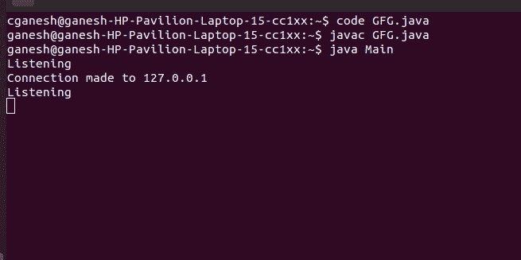
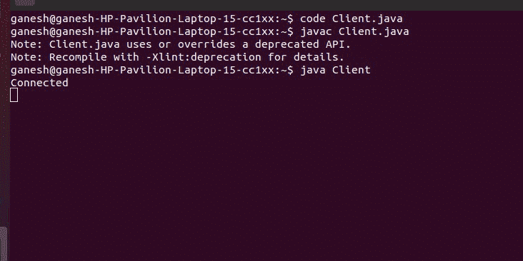

# 如何让服务器允许连接到 Java 中的 Socket 6123？

> 原文:[https://www . geeksforgeeks . org/如何让服务器连接到 java 中的套接字 6123/](https://www.geeksforgeeks.org/how-to-make-a-server-to-allow-the-connection-to-the-socket-6123-in-java/)

套接字连接是指两台机器拥有彼此的网络位置(IP 地址)和 TCP 端口的信息。java.net.Socket 类表示一个 Socket。这里我们来看看连接到 socket 6123 的方法。

**进场:**

*   创建一个 [Socket](https://www.google.com/url?client=internal-element-cse&cx=009682134359037907028:tj6eafkv_be&q=https://www.geeksforgeeks.org/socket-programming-in-java/&sa=U&ved=2ahUKEwjZsouMnvXsAhXQzjgGHVA4DT4QFjAAegQIABAC&usg=AOvVaw1O-M3Ylzkzy7sEk0sy1aN8) 类的对象，并传递 6123 作为参数。
*   使用 ServerSocket 类的 **accept()** 方法接受连接。
*   用 Socket 类的**getnetaddress()**方法和 [InetAddress](https://www.google.com/url?client=internal-element-cse&cx=009682134359037907028:tj6eafkv_be&q=https://www.geeksforgeeks.org/networking-class-in-java/&sa=U&ved=2ahUKEwiosu-4nvXsAhX_zzgGHfEEBDMQFjAAegQIABAC&usg=AOvVaw1WezNmCi5iAjKrsUoI-GDH) 类的 **getHostAddress()** 获取连接的地址。

**服务器代码:**

## Java 语言(一种计算机语言，尤用于创建网站)

```java
// Make a server to allow the connection to the socket 6123

import java.io.IOException;
import java.net.InetAddress;
import java.net.ServerSocket;
import java.net.Socket;

public class Server {
    public static void main(String[] args) { check(); }
    private static void check()
    {
        try {
            // Creating object of ServerSocket class
            ServerSocket connection
                = new ServerSocket(6123);

            while (true) {
                System.out.println("Listening");

                // Creating object of Socket class
                Socket socket = connection.accept();

                // Creating object of InetAddress class
                InetAddress address
                    = socket.getInetAddress();

                System.out.println(
                    "Connection made to "
                    + address.getHostAddress());
                pause(1000);

                  // close the socket
                socket.close();
            }
        }
        catch (IOException e) {
            System.out.println("Exception detected: " + e);
        }
    }
    private static void pause(int ms)
    {
        try {
            Thread.sleep(ms);
        }
        catch (InterruptedException e) {
        }
    }
}
```

**输出**



**客户代码:**

## Java 语言(一种计算机语言，尤用于创建网站)

```java
// A Java program for a Client

import java.net.*;
import java.io.*;

public class Client {
    // initialize socket and input output streams
    private Socket socket = null;
    private DataInputStream input = null;
    private DataOutputStream out = null;

    // constructor to put ip address and port
    public Client(String address, int port)
    {
        // establish a connection
        try {
            socket = new Socket(address, port);
            System.out.println("Connected");

            // takes input from terminal
            input = new DataInputStream(System.in);

            // sends output to the socket
            out = new DataOutputStream(
                socket.getOutputStream());
        }
        catch (UnknownHostException u) {
            System.out.println(u);
        }
        catch (IOException i) {
            System.out.println(i);
        }

        // string to read message from input
        String line = "";

        // keep reading until "Over" is input
        while (!line.equals("Over")) {
            try {
                line = input.readLine();
                out.writeUTF(line);
            }
            catch (IOException i) {
                System.out.println(i);
            }
        }

        // close the connection
        try {
            input.close();
            out.close();
            socket.close();
        }
        catch (IOException i) {
            System.out.println(i);
        }
    }

    public static void main(String args[])
    {
        Client client = new Client("127.0.0.1", 6123);
    }
}
```

**输出**

