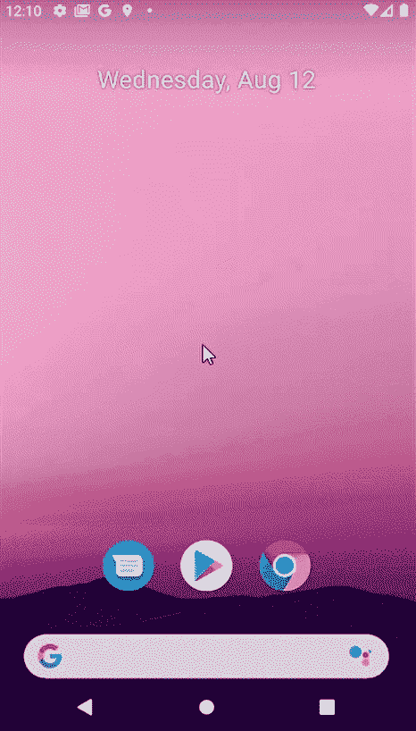

# 如何让一个活动在安卓中只出现一次？

> 原文:[https://www . geesforgeks . org/如何让一项活动在安卓系统中只出现一次/](https://www.geeksforgeeks.org/how-to-make-an-activity-appear-only-once-in-android/)

有许多安卓应用程序要求用户第一次打开应用程序时，某个活动只出现一次。在这里，让我们学习如何在我们自己的安卓应用程序中实现这一点。

**为什么我们可能需要一个活动只出现一次？**

*   它可以用于获取用户的登录信息或其他一次性信息，这样用户就不需要在每次打开应用程序时都经历输入信息的麻烦。
*   它可以用来显示用户可能不希望每次都看到的关于应用的一些信息。
*   它可能用于显示一次性动画，为应用程序添加更好的用户界面。



在这个例子中，让我们使用**shared references**来实现这个项目。参考本文详细了解**共享参考**:[**安卓共享偏好，示例**](https://www.geeksforgeeks.org/shared-preferences-in-android-with-examples/) 。

### 方法

**第一步:创建新项目**

在安卓工作室创建新项目请参考 [**【如何在安卓工作室创建/启动新项目】**](https://www.geeksforgeeks.org/android-how-to-create-start-a-new-project-in-android-studio/) 。注意，选择 [**Java**](https://www.geeksforgeeks.org/java/) 作为编程语言。

**第二步:处理只出现一次的活动**

**使用 activity_main.xml 文件:**

让我们从应该只出现一次的活动开始。在这个例子中， **activity_main.xml** 将只包含一个[**ImageView**](https://www.geeksforgeeks.org/imageview-in-kotlin/)**和一个 [**TextView**](https://www.geeksforgeeks.org/textview-widget-in-android-using-java-with-examples/) **。**下面是 **activity_main.xml** 文件的外观:**

## **activity_main.xml**

```
<?xml version="1.0" encoding="utf-8"?>
<LinearLayout 
    xmlns:android="http://schemas.android.com/apk/res/android"
    xmlns:tools="http://schemas.android.com/tools"
    android:layout_width="match_parent"
    android:layout_height="match_parent"
    android:background="#388e3c"
    android:orientation="vertical"
    tools:context=".MainActivity">

    <ImageView
        android:layout_width="wrap_content"
        android:layout_height="wrap_content"
        android:src="@drawable/gfglog" />

    <TextView
        android:layout_width="wrap_content"
        android:layout_height="wrap_content"
        android:layout_gravity="center_horizontal"
        android:fontFamily="sans-serif-condensed"
        android:text="Thanks for visiting GeeksforGeeks.\n\nI will be launched only once!"
        android:textColor="#f5f5f5"
        android:textSize="35sp" />

</LinearLayout>
```

**该活动如下所示:**

**

activity_main.xml** 

****与**合作**MainActivity.java 文件:****

**在本例中，**MainActivity.java**文件将包含应用程序的大部分逻辑。让我们从创建一个名为**的**字符串**开始，并将其设置为某个值。现在在**onResume()****方法中，检查我们是否已经在**shared references**中有 **prevStarted** 的值。由于第一次启动应用时会评估为假，所以启动**主活动**(我们只希望出现一次)，并在**共享引用**中设置**的值**。现在，每当应用程序再次启动时，它总是会检查我们是否已经在**shared references**中存储了 **prevStarted** 的值，从现在开始，该值将始终评估为 true。所以从现在开始，它会一直启动**辅助活动**(我们希望它一直出现)。我们的**MainActivity.java**文件是这样的:******

## **MainActivity.java**

```
import androidx.appcompat.app.AppCompatActivity;
import android.content.Context;
import android.content.Intent;
import android.content.SharedPreferences;
import android.os.Bundle;

public class MainActivity extends AppCompatActivity {
    String prevStarted = "yes";
    @Override
    protected void onResume() {
        super.onResume();
        SharedPreferences sharedpreferences = getSharedPreferences(getString(R.string.app_name), Context.MODE_PRIVATE);
        if (!sharedpreferences.getBoolean(prevStarted, false)) {
            SharedPreferences.Editor editor = sharedpreferences.edit();
            editor.putBoolean(prevStarted, Boolean.TRUE);
            editor.apply();
        } else {
            moveToSecondary();
        }
    }

    @Override
    protected void onCreate(Bundle savedInstanceState) {
        super.onCreate(savedInstanceState);
        setContentView(R.layout.activity_main);
    }

    public void moveToSecondary(){
        // use an intent to travel from one activity to another.
        Intent intent = new Intent(this,SecondaryActivity.class);
        startActivity(intent);
    }
}
```

****步骤 3:创建总是出现的活动****

****使用 activity_secondary.xml 文件:****

**现在，我们已经完成了应用程序的几乎所有逻辑，并将创建我们希望始终出现的活动， **activity_secondary.xml** 。例如，它将只包含**图像视图**和一个**文本视图**。我们的 **activity_secondary.xml** 是这样的:**

## **activity_secondary.xml**

```
<?xml version="1.0" encoding="utf-8"?>
<LinearLayout 
    xmlns:android="http://schemas.android.com/apk/res/android"
    xmlns:tools="http://schemas.android.com/tools"
    android:layout_width="match_parent"
    android:layout_height="match_parent"
    tools:context=".MainActivity"
    android:background="#388e3c"
    android:orientation="vertical">

    <ImageView
        android:layout_width="wrap_content"
        android:layout_height="wrap_content"
        android:src="@drawable/gfg"
        android:layout_gravity="center_horizontal"/>

    <TextView
        android:layout_width="match_parent"
        android:layout_height="match_parent"
        android:padding="15dp"
        android:gravity="center_horizontal"
        android:text="I will be launched always.\nJust as you can count on GeeksforGeeks always!"
        android:textColor="#f5f5f5"
        android:textSize="30sp"/>

</LinearLayout>
```

**该活动如下所示:**

**

activity_secondary.xml** 

****与**合作**SecondaryActivity.java 文件:****

**与**SecondaryActivity.java**文件无关。这就是**SecondaryActivity.java**文件的样子:**

## **SecondaryActivity.java**

```
import androidx.appcompat.app.AppCompatActivity;
import android.os.Bundle;

public class SecondaryActivity extends AppCompatActivity {

    @Override
    protected void onCreate(Bundle savedInstanceState) {
        super.onCreate(savedInstanceState);
        setContentView(R.layout.activity_secondary);
    }
}
```

****步骤 4:配置 AndroidManifest.xml****

**重要的是要检查应用启动时打开的第一个活动是**MainActivity.java**(我们只想出现一次的活动)。为此，打开 **AndroidManifest.xml** 文件，确保我们在**活动**标签中有**意图过滤器**标签，该标签应该只出现一次。我们的 **AndroidManifest.xml** 文件是这样的:**

## **AndroidManifest.xml**

```
<?xml version="1.0" encoding="utf-8"?>
<manifest xmlns:android="http://schemas.android.com/apk/res/android"
    package="yourPackageName">

    <application
        android:allowBackup="true"
        android:icon="@mipmap/ic_launcher"
        android:label="@string/app_name"
        android:roundIcon="@mipmap/ic_launcher_round"
        android:supportsRtl="true"
        android:theme="@style/AppTheme">
        <activity android:name=".SecondaryActivity"></activity>
        <activity android:name=".MainActivity">
            <intent-filter>
                <action android:name="android.intent.action.MAIN" />

                <category android:name="android.intent.category.LAUNCHER" />
            </intent-filter>
        </activity>
    </application>

</manifest>
```

#### **输出:在模拟器上运行**

**<video class="wp-video-shortcode" id="video-478063-1" width="640" height="360" preload="metadata" controls=""><source type="video/mp4" src="https://media.geeksforgeeks.org/wp-content/uploads/20200812123401/Android-Emulator---Pixel_2_API_29_5554-2020-08-12-12-10-07_Trim.mp4?_=1">[https://media.geeksforgeeks.org/wp-content/uploads/20200812123401/Android-Emulator---Pixel_2_API_29_5554-2020-08-12-12-10-07_Trim.mp4](https://media.geeksforgeeks.org/wp-content/uploads/20200812123401/Android-Emulator---Pixel_2_API_29_5554-2020-08-12-12-10-07_Trim.mp4)</video>**