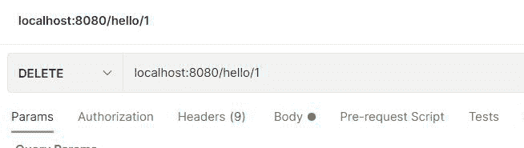

# 春天怎么做删除请求？

> 原文:[https://www . geesforgeks . org/如何在春季提出删除请求/](https://www.geeksforgeeks.org/how-to-make-delete-request-in-spring/)

**Java 语言**是所有编程语言中最流行的语言之一。使用 java 编程语言有几个优点，无论是出于安全目的还是构建大型分发项目。使用 Java 的优势之一是 JAVA 试图借助类、继承、多态等概念将语言中的每个概念与现实世界联系起来。

java 中还有其他几个概念，增加了 java 代码和程序员之间的用户友好交互，例如泛型、访问说明符、注释等。这些特性为类以及 java 程序的方法增加了一个额外的属性。在本文中，我们将讨论如何在 SpringBoot 中使用 PostMapping()注释发出 post 请求

**DeleteMapping()注释**主要用在 spring boot 应用程序中，用于处理客户端发出的删除请求，该请求的头部包含 JSON 数据

**在项目中初始化弹簧网**

Spring Initializr 是一个基于网络的工具，使用它我们可以很容易地生成 Spring Boot 项目的结构。它还为元数据模型中表达的项目提供了各种不同的特性。这个模型允许我们配置 JVM 支持的依赖列表。在这里，我们将使用 spring 初始化器创建应用程序的结构，然后使用 IDE 创建一个示例 GET 路由。

**所需步骤如下:**

1.  转至[弹簧初始化器](https://www.geeksforgeeks.org/spring-initializr/)
2.  按照要求填写细节。
3.  让我们考虑下面的应用程序，对于这个应用程序，如下所示:

```java
Project: Maven
Language: Java 
Spring Boot: 2.2.8 
Packaging: JAR 
Java: 8 
Dependencies: Spring Web
```

**注:**出于说明目的，我们将考虑

```java
Project: Maven 
Language: Java 
Spring Boot: 2.2.8 
Packaging: JAR 
Java: 8 
Dependencies: Spring Web 
```

让我们按照上文在标题中提出的顺序描述这三个步骤，如下所示:

**第 1 步:**点击生成，将下载启动项目。


**第二步:**提取 zip 文件。现在打开一个合适的 IDE，然后转到文件- >新建- >现有来源的项目- > Spring-boot-app，并选择 pom.xml。在提示符下单击导入更改，等待项目同步。


> **注意:**在 Maven 的导入项目窗口中，确保选择了与创建项目时选择的 JDK 相同的版本。

**第三步:**转到**src–>main–>java–>*****com . gfg . spring . boot . app***，创建一个名为 Controller 的 Java 类，并添加注释@RestController。项目结构看起来像。

项目结构如下所示:


例 1:Controller.java

```java
// Annotation
@RestController

// Controller class
public class Controller {

    // Creating an empty ArrayList
    ArrayList<Integer> a = new ArrayList<>();

    // Constructor
    Controller() {
        a.add(1);
        a.add(2);
    }

    // Annotation
    @DeleteMapping("/hello/{id}")

    // Method
    public void deleteById(@PathVariable("id") int id) {

        a.remove(new Integer((id)));

        print();
    }

    // Method
    void print() {
        for (int elements : a) {
            System.out.print(elements);
        }
    }
```

> 这个应用程序现在可以运行了。运行 Springbootapp 类，等待 Tomcat 服务器启动。


> **注意:**Tomcat 服务器的默认端口是 8080，可以在 application.properties 文件中更改。

在[之间，Postman 是一个 API 开发工具](https://www.geeksforgeeks.org/introduction-postman-api-development/)，帮助构建、测试和修改 API。几乎任何开发人员可能需要的任何功能都封装在这个工具中。每月有 500 多万开发人员使用它，使他们的应用编程接口开发变得简单易行。它能够发出各种类型的 HTTP 请求(GET、POST、PUT、PATCH)，保存环境以备后用，将 API 转换为各种语言的代码(如 JavaScript、Python)。

最后，我们将使用 Postman 进行删除请求，我们可以以 JSON 的形式发送数据，如下文所示:



**输出:**在控制台上生成

```java
2021-10-14 1
2
```