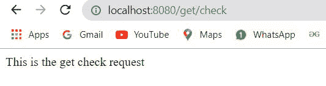

# 如何在 Java Spring 中发出 get()方法请求？

> 原文:[https://www . geesforgeks . org/how-to-make-get-method-request-in-Java-spring/](https://www.geeksforgeeks.org/how-to-make-get-method-request-in-java-spring/)

Java 语言是所有编程语言中最流行的语言之一。使用 java 编程语言有几个优点，无论是出于安全目的还是构建大型分发项目。使用 Java 的优势之一是 JAVA 试图借助类、继承、多态等概念将语言中的每个概念与现实世界联系起来。

java 中还有其他几个概念，增加了 java 代码和程序员之间的用户友好交互，例如泛型、访问说明符、注释等。这些特性为类以及 java 程序的方法增加了一个额外的属性。在本文中，我们将讨论什么是 java 中的 GetMapping()注释。

**GetMapping()注释**主要用在 spring boot 应用中，通过匹配来自客户端的传入请求头来处理来自客户端的传入请求

**语法:**

```
@GetMapping()
```

**参数:**标注包含 URL 表达式

现在让我们讨论如何在 web 项目中初始化 Spring。 [Spring Initializr](https://www.geeksforgeeks.org/spring-initializr/) 是一个基于 web 的工具，使用它我们可以很容易地生成 Spring Boot 项目的结构。它还为元数据模型中表达的项目提供了各种不同的特性。这个模型允许我们配置 [JVM](https://www.geeksforgeeks.org/jvm-works-jvm-architecture/) 支持的依赖列表。在这里，我们将使用 spring 初始化器创建一个应用程序的结构，然后使用一个 [IDE](https://www.geeksforgeeks.org/what-will-be-the-best-java-ides-in-2020/) 来创建一个示例 GET 路径。

**在 web 项目中初始化 Spring 的步骤**

下面按顺序提供了它们，并配有如下视觉辅助:

1.  转至[弹簧初始化器](https://start.spring.io/)
2.  按照要求填写细节。对于如下所示的应用:

```
Project: Maven
Language: Java 
Spring Boot: 2.2.8 
Packaging: JAR 
Java: 8 
Dependencies: Spring Web
```

**第 1 步:**点击生成，将下载启动项目。


**第二步:**提取 zip 文件。现在打开一个合适的 IDE，然后转到*文件* - > *新建* - > *现有来源的项目*->*Spring-boot-app*，选择 pom.xml，在提示上点击导入更改，等待项目同步。


> **注意:**在 Maven 的导入项目窗口中，确保选择了与创建项目时选择的 JDK 相同的版本。

**第三步:**转到***src*****->*****主*****->*****java*****->***T21】com . gfg . spring . boot . app*创建一个名称为 **Controller** 的 Java 类，并添加注释**现在创建一个 GET 应用编程接口，如下所示:"**

```
@RestController

public class Controller {

  @GetMapping("/get") public String home() {
    return "This is the get request";
  }

  @GetMapping("/get/check") public String home1() {

    return "This is the get check request";
  }
}
```

**步骤 4:** 该应用程序现在可以运行了。运行*回弹应用*类，等待 Tomcat 服务器启动。


> **注意:**Tomcat 服务器的默认端口是 8080，可以在 *application.properties* 文件中更改。

**第五步:**现在进入浏览器，输入网址**本地主机:8080** 。观察输出，现在对**本地主机:8080/获取/检查**进行同样的操作



极客们，从上面的弹出窗口中可以看出，我们已经完成了 Spring 中的 get()方法请求。因此，这些是所有的步骤。