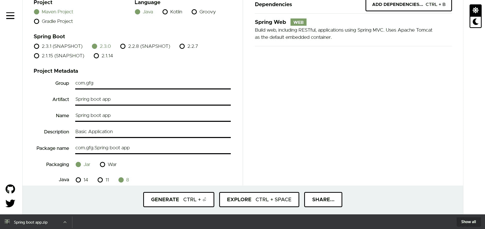
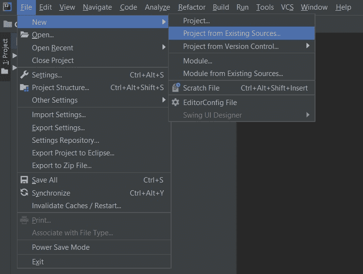
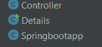
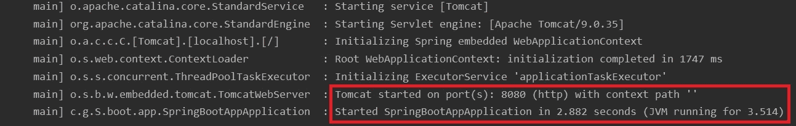
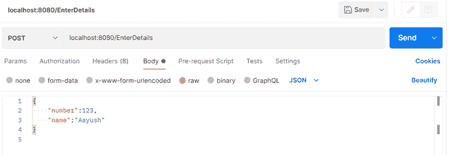
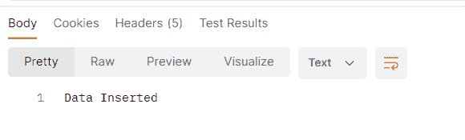
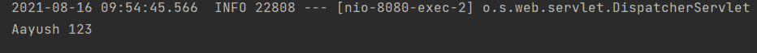

# 如何在 Java Spring 中进行 Post 请求？

> 原文:[https://www . geesforgeks . org/how-to-make-post-request-in-Java-spring/](https://www.geeksforgeeks.org/how-to-make-post-request-in-java-spring/)

Java 语言是所有编程语言中最流行的语言之一。使用 java 编程语言有几个优点，无论是出于安全目的还是构建大型分发项目。使用 Java 的优势之一是 JAVA 试图借助类、继承、多态等概念将语言中的每个概念与现实世界联系起来。

java 中还有其他几个概念，增加了 java 代码和程序员之间的用户友好交互，例如泛型、访问说明符、注释等。这些特性为类以及 java 程序的方法增加了一个额外的属性。在本文中，我们将讨论如何在 SpringBoot 中使用 PostMapping()注释发出 post 请求

> PostMapping()注释主要用在 spring boot 应用程序中，用于处理包含头中 JSON 数据的客户端发出的 post 请求

**在项目中初始化弹簧网**

[**Spring Initializr**](https://www.geeksforgeeks.org/spring-initializr/) 是一个基于 web 的工具，使用它我们可以很容易地生成 Spring Boot 项目的结构。它还为元数据模型中表达的项目提供了各种不同的特性。这个模型允许我们配置 JVM 支持的依赖列表。在这里，我们将使用 spring 初始化器创建应用程序的结构，然后使用 IDE 创建一个示例 GET 路由。

所需步骤如下:

1.  转到 spring 初始化
2.  按照要求填写细节。

让我们考虑下面的应用程序，对于这个应用程序，如下所示:

```java
Project: Maven Language: Java Spring Boot: 2.2.8 Packaging: JAR Java: 8 Dependencies: Spring Web 
```

**第 1 步:**点击生成，将下载启动项目。



**第二步:**提取 zip 文件。现在打开一个合适的 IDE，然后转到 ***文件- >从现有来源新建- >项目- > Spring-boot-app*** 并选择 pom.xml。在提示符下单击导入更改并等待项目同步。



> **注:**
> 
> 在“为 Maven 导入项目”窗口中，确保选择了与创建项目时选择的 JDK 相同的版本。

**第三步:**转到***src->main->java->com . gfg . spring . boot . app***，创建一个名为 Controller 的 Java 类，并添加注释@RestController。项目结构看起来像。

项目结构如下所示:



**例 1:**Controller.java

```java
@RestController

public class Controller {

    // Handling post request
    @PostMapping("/EnterDetails")

    String insert(@RequestBody Details ob)
    {
        // Storing the incoming data in the list
        Data.add(new Details(ob.number, ob.name));

        // Iterating using foreach loop
        for (Details obd : Data) {
            System.out.println(obd.name + " " + ob.number);
        }
        return "Data Inserted";
    }
}
```

**例 2:**Details.java

```java
public class Details {

    // Creating an object of ArrayList
    static ArrayList<Details> Data
        = new ArrayList<Details>();
    int number;
    String name;
    Details(int number, String name)
    {
        // This keyword refers to parent instance itself
        this.number = number;
        this.name = name;
    }
}
```

> 这个应用程序现在可以运行了。运行 Springbootapp 类，等待 Tomcat 服务器启动。



> **注意:**Tomcat 服务器的默认端口是 8080，可以在 application.properties 文件中更改。

在之间，波兹曼是一个应用编程接口开发工具，由帮助构建、测试、和修改应用编程接口。几乎任何开发人员可能需要的任何功能都封装在这个工具中。每月有 500 多万开发人员使用它，使他们的应用编程接口开发变得简单易行。它能够发出各种类型的 HTTP 请求(GET、POST、PUT、PATCH)，保存环境以备后用，将 API 转换为各种语言的代码(如 JavaScript、Python)。

现在 w e 将使用[邮差](https://www.geeksforgeeks.org/introduction-postman-api-development/)进行邮寄请求，我们可以以 JSON 的形式发送数据，如下图所示

*   邮递员发出邮寄请求



*   现在按下发送按钮，如上图所示，我们将获得以下输出:



该输出将在控制台上生成

