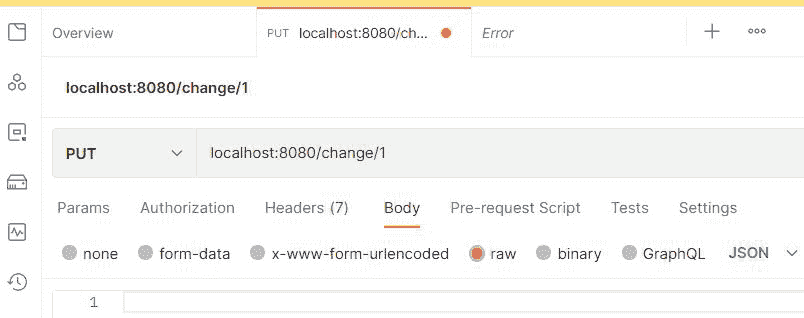

# 如何在 Spring Boot 进行投放请求？

> 原文:[https://www . geeksforgeeks . org/如何在春季开机时提出请求/](https://www.geeksforgeeks.org/how-to-make-put-request-in-spring-boot/)

**Java 语言**是所有编程语言中最流行的语言之一。使用 java 编程语言有几个优点，无论是出于安全目的还是构建大型分发项目。使用 Java 的优势之一是 JAVA 试图借助类、继承、多态等概念将语言中的每个概念与现实世界联系起来。

java 中还有其他几个概念，增加了 java 代码和程序员之间的用户友好交互，例如泛型、访问说明符、注释等。这些特性为类以及 java 程序的方法增加了一个额外的属性。在本文中，我们将讨论如何在春季启动时发出 put 请求。

**Put 和 post 请求的区别:** Put 请求一般在我们必须更新特定数据时使用，而 post 请求则在我们必须添加数据库中不存在的新数据时使用。

**@PutMapping** :这个春季开机标注用于处理客户端传入的 put 请求。

> **注意:**首先我们需要在我们的项目中建立 spring 应用。

[Spring Initializr](https://www.geeksforgeeks.org/spring-initializr/) 是一个基于 web 的工具，使用它我们可以很容易地生成 Spring Boot 项目的结构。它还为元数据模型中表达的项目提供了各种不同的特性。这个模型允许我们配置 JVM 支持的依赖列表。在这里，我们将使用 spring 初始化器创建应用程序的结构。

因此，要做到这一点，以下步骤如下所示，介质顺序如下:

**步骤 1:** 转到春季初始化


**第二步:**按要求填写详细内容。对于此应用:

```
Project: Maven
Language: Java
Spring Boot: 2.2.8
Packaging: JAR
Java: 8
Dependencies: Spring Web
```

**第 3 步:**点击生成，将下载启动项目。

**第 4 步:**提取 zip 文件。现在打开一个合适的 IDE，然后转到文件- >新建- >现有来源的项目- > Spring-boot-app，并选择 pom.xml。在提示符下单击导入更改，等待项目同步。


> **注意:**在 Maven 的导入项目窗口中，确保选择了与创建项目时选择的 JDK 相同的版本。

**第五步:**转到***src->main->java->com . gfg . spring . boot . app***，创建一个名为 Controller 的 Java 类，并添加注释@RestController。现在创建一个如下所示的 put API:

```
// Annotation
@RestController

// Class
public class Controller {

    ArrayList<Integer>ans;

    // Constructor of this class
    Controller() {

        ans = new ArrayList<Integer>();
        ans.add(1);
        ans.add(2);
        ans.add(3);
    }

    // Annotation
    @PutMapping("/change/{id}")

    // Method
    void change(@PathVariable int id) {

        System.out.println(ans);
        ans.remove(id);
        ans.add(id, 45);

        System.out.println(ans);
    }
}
```

这个应用程序现在可以运行了。运行 SpringBootAppApplication 类，等待 Tomcat 服务器启动。

> **注意:**Tomcat 服务器的默认端口是 8080，可以在 application.properties 文件中更改。

**第六步:**现在去[邮差](https://www.geeksforgeeks.org/introduction-postman-api-development/)添加网址并发出投放请求，如下图所示:



**输出:**最后在终端/ CMD 产生输出

```
[1, 2, 3]
[1, 45, 3] 
```