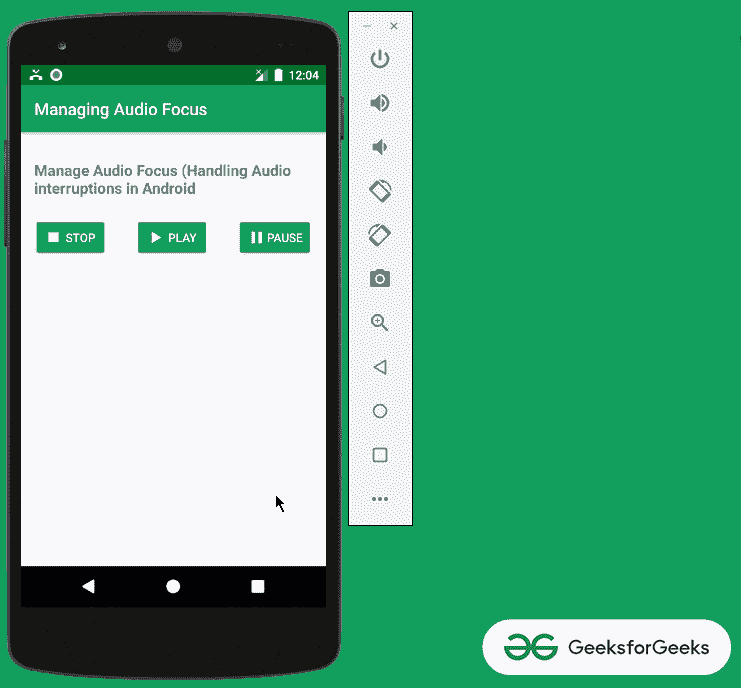
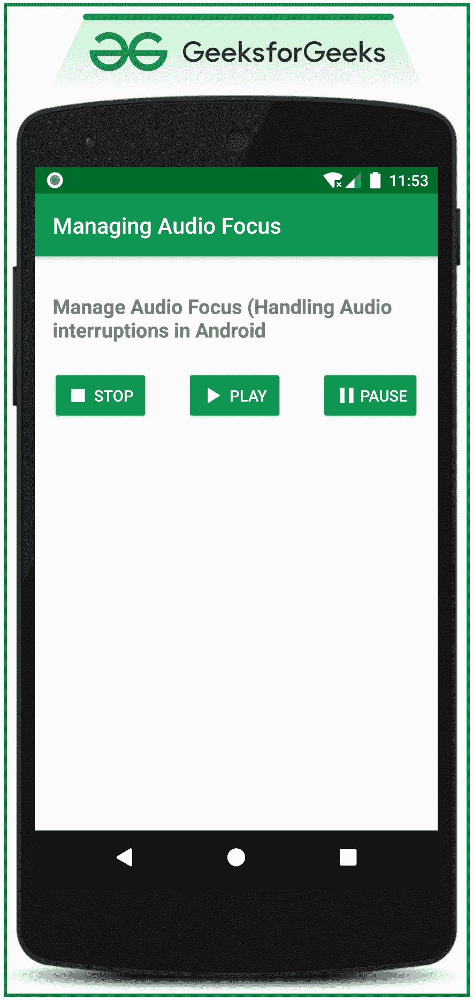

# 安卓如何管理音频焦点？

> 原文:[https://www . geeksforgeeks . org/如何在安卓中管理音频焦点/](https://www.geeksforgeeks.org/how-to-manage-audio-focus-in-android/)

安卓中的**音频焦点**需要管理，处理音频中断是其中一个重要环节。在安卓系统中，许多应用程序同时播放媒体，为了提高用户体验，音频中断会得到处理。例如，如果应用程序正在播放音频，突然有一个来电，那么音频文件需要停止，在呼叫结束后，音频应该从停止的地方继续播放。在本文中，已经讨论了如何处理音频中断或者如何在安卓系统中实现音频聚焦。请看下图，了解将要讨论的内容。注意，我们将使用 **Java** 语言来实现这个项目。



## **实施音频聚焦或处理音频中断的步骤**

**第一步:创建一个空的活动项目**

*   创建一个空的活动安卓工作室项目。并选择 **Java** 作为编程语言。
*   要知道如何创建一个空的活动安卓工作室项目，请参考[安卓|如何在安卓工作室创建/启动一个新项目？](https://www.geeksforgeeks.org/android-how-to-create-start-a-new-project-in-android-studio/)

**步骤 2:使用 activity_main.xml 文件**

*   该项目的主布局仅包括三个按钮，用于播放、暂停和停止应用程序中的音频文件播放。
*   调用下面的代码来实现用户界面。

## 可扩展标记语言

```
<?xml version="1.0" encoding="utf-8"?>
<RelativeLayout 
    xmlns:android="http://schemas.android.com/apk/res/android"
    xmlns:tools="http://schemas.android.com/tools"
    android:layout_width="match_parent"
    android:layout_height="match_parent"
    tools:context=".MainActivity"
    tools:ignore="HardcodedText">

    <TextView
        android:layout_width="wrap_content"
        android:layout_height="wrap_content"
        android:layout_centerHorizontal="true"
        android:layout_marginStart="16dp"
        android:layout_marginTop="32dp"
        android:layout_marginEnd="16dp"
        android:text="Manage Audio Focus (Handling Audio interruptions in Android"
        android:textSize="18sp"
        android:textStyle="bold" />

    <LinearLayout
        android:layout_width="match_parent"
        android:layout_height="wrap_content"
        android:layout_marginTop="100dp"
        android:gravity="center_horizontal"
        android:orientation="horizontal">

        <Button
            android:id="@+id/stopButton"
            android:layout_width="wrap_content"
            android:layout_height="wrap_content"
            android:layout_marginEnd="32dp"
            android:backgroundTint="@color/colorPrimary"
            android:drawableStart="@drawable/ic_stop"
            android:text="STOP"
            android:textColor="@android:color/white" />

        <Button
            android:id="@+id/playButton"
            android:layout_width="wrap_content"
            android:layout_height="wrap_content"
            android:layout_marginEnd="32dp"
            android:backgroundTint="@color/colorPrimary"
            android:drawableStart="@drawable/ic_play"
            android:text="PLAY"
            android:textColor="@android:color/white" />

        <Button
            android:id="@+id/pasueButton"
            android:layout_width="wrap_content"
            android:layout_height="wrap_content"
            android:backgroundTint="@color/colorPrimary"
            android:drawableStart="@drawable/ic_pause"
            android:text="PAUSE"
            android:textColor="@android:color/white" />

    </LinearLayout>

</RelativeLayout>
```

**输出 UI:**



**步骤 3:使用 MainActivity.java 文件**

*   当音频焦点发生变化时，需要实现主回调。意味着系统已经将音频焦点转移到应用程序使用的另一个服务，在这种情况下， **Phone** 应用程序从正在播放音频的当前应用程序获取音频焦点。

> **音频管理器。OnAudioFocusChangeListener AudioFocusChangeListener->**这处理音频焦点是否有变化，根据来自音频管理器的焦点变化，回调是否需要实现。

*   当呼叫被挂断时，焦点将转移到当前应用程序，MediaPlayer 将继续运行。
*   安卓系统返回的焦点请求结果与以下常量进行比较。

> 1.  **audiofocus _ gain:** If the system grants audio focus gain, it can continue playing after the audio focus is temporarily lost.
> 2.  **Audio focus _ loss _ transient:** If the audio focus is temporarily lost, the audio playback should be paused.
> 3.  **audiofocus _ loss:** If the audio is permanently lost, the mediaplayer should be released (completely stopped).

*   要在如上所述的应用程序中实现音频焦点，请调用**MainActivity.java**文件中的以下代码。添加注释是为了更好地理解。

## Java 语言(一种计算机语言，尤用于创建网站)

```
import androidx.annotation.RequiresApi;
import androidx.appcompat.app.AppCompatActivity;
import android.content.Context;
import android.media.AudioAttributes;
import android.media.AudioFocusRequest;
import android.media.AudioManager;
import android.media.MediaPlayer;
import android.os.Build;
import android.os.Bundle;
import android.view.View;
import android.widget.Button;
import java.io.IOException;

@RequiresApi(api = Build.VERSION_CODES.O)
public class MainActivity extends AppCompatActivity {

    // media player instance to playback 
      // the media file from the raw folder
    MediaPlayer mediaPlayer;

    // Audio manager instance to manage or 
      // handle the audio interruptions
    AudioManager audioManager;

    // Audio attributes instance to set the playback 
      // attributes for the media player instance
    // these attributes specify what type of media is 
      // to be played and used to callback the audioFocusChangeListener
    AudioAttributes playbackAttributes;

    // media player is handled according to the 
      // change in the focus which Android system grants for
    AudioManager.OnAudioFocusChangeListener audioFocusChangeListener = new AudioManager.OnAudioFocusChangeListener() {
        @Override
        public void onAudioFocusChange(int focusChange) {
            if (focusChange == AudioManager.AUDIOFOCUS_GAIN) {
                mediaPlayer.start();
            } else if (focusChange == AudioManager.AUDIOFOCUS_LOSS_TRANSIENT) {
                mediaPlayer.pause();
                mediaPlayer.seekTo(0);
            } else if (focusChange == AudioManager.AUDIOFOCUS_LOSS) {
                mediaPlayer.release();
            }
        }
    };

    @Override
    protected void onCreate(Bundle savedInstanceState) {
        super.onCreate(savedInstanceState);
        setContentView(R.layout.activity_main);

        // get the audio system service for 
          // the audioManger instance
        audioManager = (AudioManager) getSystemService(Context.AUDIO_SERVICE);

        // initiate the audio playback attributes
        playbackAttributes = new AudioAttributes.Builder()
                .setUsage(AudioAttributes.USAGE_GAME)
                .setContentType(AudioAttributes.CONTENT_TYPE_MUSIC)
                .build();

        // set the playback attributes for the focus requester
        AudioFocusRequest focusRequest = new AudioFocusRequest.Builder(AudioManager.AUDIOFOCUS_GAIN)
                .setAudioAttributes(playbackAttributes)
                .setAcceptsDelayedFocusGain(true)
                .setOnAudioFocusChangeListener(audioFocusChangeListener)
                .build();

        // request the audio focus and
          // store it in the int variable
        final int audioFocusRequest = audioManager.requestAudioFocus(focusRequest);

        // register all three buttons
        Button bPlay = findViewById(R.id.playButton);
        Button bPause = findViewById(R.id.pasueButton);
        Button bStop = findViewById(R.id.stopButton);

        // initiate the media player instance with
          // the media file from the raw folder
        mediaPlayer = MediaPlayer.create(getApplicationContext(), R.raw.music);

        // handle the PLAY button to play the audio
        bPlay.setOnClickListener(new View.OnClickListener() {
            @Override
            public void onClick(View v) {
                // request the audio focus by the Android system
                  // if the system grants the permission
                // then start playing the audio file
                if (audioFocusRequest == AudioManager.AUDIOFOCUS_REQUEST_GRANTED) {
                    mediaPlayer.start();
                }
            }
        });

        // handle the PAUSE button to pause the media player
        bPause.setOnClickListener(new View.OnClickListener() {
            @Override
            public void onClick(View v) {
                mediaPlayer.pause();
            }
        });

        // handle the STOP button to stop the media player
        bStop.setOnClickListener(new View.OnClickListener() {
            @Override
            public void onClick(View v) {
                mediaPlayer.stop();

                try {
                    // if the mediaplayer is stopped then
                      // it should be again prepared for
                    // next instance of play
                    mediaPlayer.prepare();
                } catch (IOException e) {
                    e.printStackTrace();
                }
            }
        });

    }
}
```

> **注意:**当没有音频聚焦要求时，需要用 AudioManager 实例调用 **abandonAudioFocusRequest** 方法，需要传递参数**audio focusRequest focusRequest**。

### **输出:在仿真器上运行**

<video class="wp-video-shortcode" id="video-526203-1" width="640" height="360" preload="metadata" controls=""><source type="video/mp4" src="https://media.geeksforgeeks.org/wp-content/uploads/20201213001047/Untitled-Project.mp4?_=1">[https://media.geeksforgeeks.org/wp-content/uploads/20201213001047/Untitled-Project.mp4](https://media.geeksforgeeks.org/wp-content/uploads/20201213001047/Untitled-Project.mp4)</video>