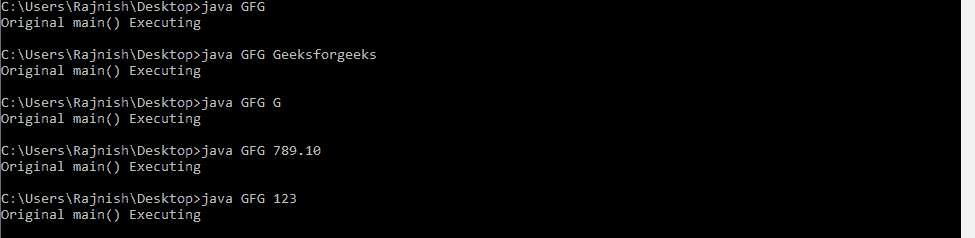

# 如何在 Java 中重载和覆盖主方法

> 原文:[https://www . geesforgeks . org/how-override-main-method-in-Java/](https://www.geeksforgeeks.org/how-to-overload-and-override-main-method-in-java/)

### 如何在 java 中霸王主方法？

[方法重载](https://www.geeksforgeeks.org/overloading-in-java/)可以定义为一个特征，其中一个类可以有多个同名的方法，如果且仅当它们在参数数量或参数类型或两者上有所不同，那么它们可能有也可能没有相同的返回类型。方法重载是 java 支持多态性的方式之一。
**是的**，我们可以在 java 中重载 main 方法，但是 JVM 只调用原来的 main 方法，它永远不会调用我们重载的 main 方法。
以下示例说明 java 中 main()的重载
**示例 1:**

```java
// Java program to demonstrate
// Overloading of main()

public class GFG {

    // Overloaded main method 1
    // According to us this overloaded method
    // Should be executed when int value is passed
    public static void main(int args)
    {
        System.out.println("main() overloaded"
                           + " method 1 Executing");
    }

    // Overloaded main method 2
    // According to us this overloaded method
    // Should be executed when character is passed
    public static void main(char args)
    {
        System.out.println("main() overloaded"
                           + " method 2 Executing");
    }

    // Overloaded main method 3
    // According to us this overloaded method
    // Should be executed when double value is passed
    public static void main(Double[] args)
    {
        System.out.println("main() overloaded"
                           + " method 3 Executing");
    }

    // Original main()
    public static void main(String[] args)
    {
        System.out.println("Original main()"
                           + " Executing");
    }
}
```

**输出:**


从上面的例子中可以清楚地看到，每次原始 main 方法执行时，重载的方法不会执行，因为 JVM 默认只执行原始 main 方法，而不执行重载的方法。
所以，要执行 main 的重载方法，必须从原来的 main 方法调用它们。
**示例 2:**
在本例中，我们将逐一执行主方法的所有重载

```java
// Java program to demonstrate
// Overloading of main()

public class GFG {

    // Overloaded main method 1
    public static void main(boolean args)
    {
        if (args) {
            System.out.println("main() overloaded"
                               + " method 1 Executing");
            System.out.println(args);

            // Calling overloaded main method 2
            GFG.main("Geeks", "For Geeks");
        }
    }

    // Overloaded main method 2
    public static void main(String a, String b)
    {
        System.out.println("main() overloaded"
                           + " method 2 Executing");
        System.out.println(a + " " + b);
    }

    // Overloaded main method 3
    public static void main(int args)
    {
        System.out.println("main() overloaded"
                           + " method 3 Executing");
        System.out.println(args);
    }

    // Original main()
    public static void main(String[] args)
    {
        System.out.println("Original main()"
                           + " Executing");
        System.out.println("Hello");

        // Calling overloads of the main method

        // Calling overloaded main method 1
        GFG.main(true);

        // Calling overloaded main method 3
        GFG.main(987654);
    }
}
```

**输出:**

```java
Original main() Executing
Hello
main() overloaded method 1 Executing
true
main() overloaded method 2 Executing
Geeks For Geeks
main() overloaded method 3 Executing
987654

```

### 在 java 中重写 main()方法？

每当我们在 java 中进行继承时，如果子类中的方法与其父类或超类中的方法具有相同的名称和类型签名，那么就说子类中的方法覆盖了父类的方法。[方法覆盖](https://www.geeksforgeeks.org/overriding-in-java/)是 java 支持运行时多态性的方式之一。
**不**，我们不能覆盖 java 的 main 方法，因为静态方法不能被覆盖。
Java 中的静态方法与类相关联，而非静态方法与对象相关联。静态属于类的范畴，静态方法不需要对象来调用。静态方法可以通过使用类名(classname.static_method_name())直接调用。
所以，每当我们尝试执行派生类静态方法时，它都会自动执行基类静态方法。
因此，在 java 中不可能覆盖 main 方法。
要了解更多关于在 java 中重写静态方法的信息[请访问这里](https://www.geeksforgeeks.org/can-we-overload-or-override-static-methods-in-java/)