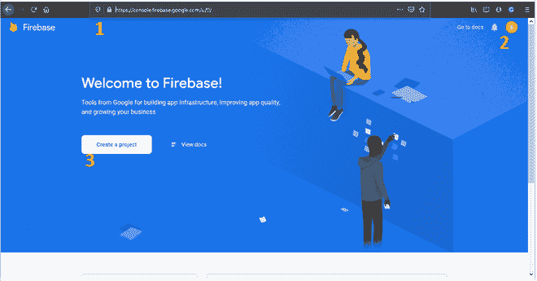
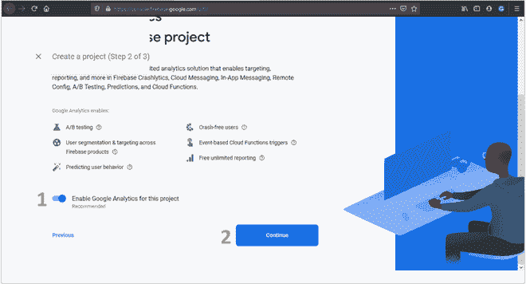
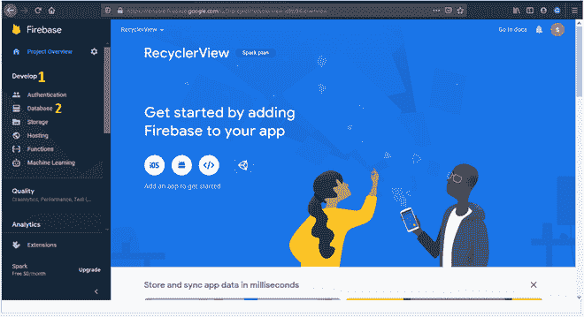
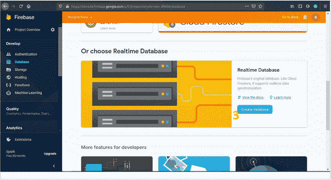
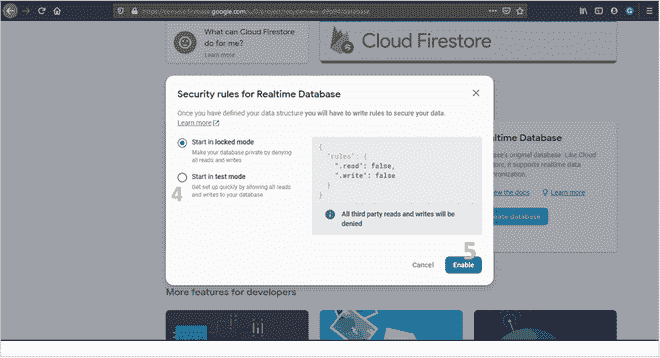
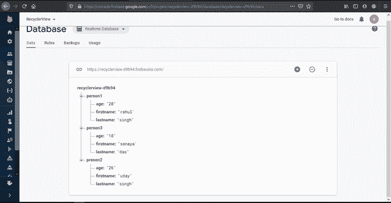

# 如何在 Android Studio

中使用 FirebaseUI 用 Firebase 数据填充 RecyclerView

> 原文:[https://www . geeksforgeeks . org/如何用 firebase-data-use-fire basei-in-Android-studio/](https://www.geeksforgeeks.org/how-to-populate-recyclerview-with-firebase-data-using-firebaseui-in-android-studio/)填充-回收视图

[**Firebase**](https://www.geeksforgeeks.org/adding-firebase-to-android-app/)**是目前使用的最受欢迎的在线数据库之一，至少在未来几年内将保持不变。Firebase 提供了一个实时数据库，可用于向所有用户实时存储和检索数据。在这篇文章中，让我们将实时数据库与一个[安卓应用程序](https://www.geeksforgeeks.org/introduction-to-android-development/)连接起来，并使用 **FirebaseUI** 在[回收视图](https://www.geeksforgeeks.org/android-recyclerview/)中显示数据。FirebaseUI 是一个面向 Android 的开源库，提供了将常见 UI 元素快速连接到 Firebase APIs 的功能。我们将在本文中介绍以下内容。**

1.  **如何创建一个 Firebase 项目并手动添加一些数据以在应用程序中显示。**
2.  **如何创建一个安卓项目，并在其中添加 Firebase 和 FirebaseUI 支持。**
3.  **如何在安卓应用中添加 RecyclerView，并在 Firebase 实时数据库中显示数据。**

### **如何创建 Firebase 项目并手动添加数据以在应用程序中显示**

*   ****Step 1: Create a Firebase Project**

    1.  前往[https://console.firebase.google.com/u/0/](https://console.firebase.google.com/u/0/)
    2.  如果您尚未登录，请使用您的谷歌帐户登录 Firebase。
    3.  点击创建项目。

    ** 
*   ****Step 2: Give a name to the project**

    1.  写下名字。
    2.  点击继续。

    ** 
*   ****Step 3: Disable Google Analytics(There is no need to do this for this project)**

    1.  点击切换按钮。
    2.  单击继续。

    

    Firebase 将为您创建一个项目，并为您打开它。** 
*   ****Step 4: Create a Realtime Database:**

    1.  转到边栏上的开发选项。
    2.  单击数据库。
    3.  在新屏幕中向下滚动，然后单击在实时数据库上创建数据库。
    4.  选择“在测试模式下启动”(以便获得对数据库的读写权限)。
    5.  单击启用。

      ** 
*   ****Step 5:** Add data to the database using the ‘+’ symbol in the database in the same manner as given in the picture.

    

    > **注:**
    > 
    > *   为了方便起见，所有数据值都以字符串格式存储。
    > *   键值可以是任何字符串，但不应包含空格“”。
    > *   相同的子键应该出现在父键中，这样它们就可以被回收器视图读取而没有任何错误。** 

### **如何创建一个 android 项目并在其中添加 Firebase 和 FirebaseUI 支持**

*   ****第一步:**打开 Android Studio，创建一个名为“**【recycle view】**”的新项目，活动为空。**
*   ****第二步:** [将你的 Firebase 项目与你的应用程序连接起来。](https://www.geeksforgeeks.org/adding-firebase-to-android-app/)**
*   ****第三步:**在你的 **应用程序/build.gradle** 文件中添加以下依赖项，以便在应用程序中获得 FirebaseUI 和 Firebase 实时数据库支持。

    ```
    dependencies {
       // Dependency FirebaseUI for Firebase Realtime Database
       implementation 'com.firebaseui:firebase-ui-database:6.2.1'

       // Dependency for Firebase REaltime Database
       implementation 'com.google.firebase:firebase-database:19.3.1'
       }
    ```** 

### **如何在安卓应用中添加回收视图，并在 Firebase 实时数据库中显示数据**

*   ****第一步:**添加以下依赖项，获得 app 中 **Cardview** 的支持。

    ```
    dependencies {
        // This dependency includes all material components of the android app.
        implementation 'com.google.android.material:material:1.1.0'
       }
    ```** 
*   ****第二步:**首先，在 **activity_main.xml** 中添加 Recycler 视图，并将其命名为 **recycler1** 在 activity_main.xml 文件中粘贴给定的代码。

    ## 可扩展标记语言

    ```
    <?xml version="1.0" encoding="utf-8"?>
    <androidx.constraintlayout.widget.ConstraintLayout 
        xmlns:android="http://schemas.android.com/apk/res/android"
        xmlns:app="http://schemas.android.com/apk/res-auto"
        xmlns:tools="http://schemas.android.com/tools"
        android:layout_width="match_parent"
        android:layout_height="match_parent"
        tools:context=".MainActivity">

        <androidx.recyclerview.widget.RecyclerView
            android:id="@+id/recycler1"
            android:layout_width="match_parent"
            android:layout_height="match_parent"
            android:background="#65E4A6"/>

    </androidx.constraintlayout.widget.ConstraintLayout>
    ```** 
*   ****步骤 3:** 现在，让我们在布局目录中创建另一个 XML 文件，以存储来自特定人员数据库的数据。我们将文件命名为 **person.xml** 。在创建的文件中复制以下代码。

    ## 可扩展标记语言

    ```
    <?xml version="1.0" encoding="utf-8"?>
    <androidx.cardview.widget.CardView 
        xmlns:android="http://schemas.android.com/apk/res/android"
        xmlns:app="http://schemas.android.com/apk/res-auto"
        xmlns:tools="http://schemas.android.com/tools"
        android:layout_width="match_parent"
        android:layout_height="wrap_content"
        android:layout_marginHorizontal="10dp"
        android:layout_marginTop="10dp"
        android:layout_marginBottom="20dp"
        android:scrollbars="vertical"
        app:cardCornerRadius="20dp">

        <androidx.constraintlayout.widget.ConstraintLayout
            android:layout_width="match_parent"
            android:layout_height="match_parent">

            <TextView
                android:id="@+id/textView1"
                android:layout_width="wrap_content"
                android:layout_height="wrap_content"
                android:layout_marginStart="16dp"
                android:layout_marginTop="16dp"
                android:text="First name: "
                android:textStyle="bold"
                app:layout_constraintStart_toStartOf="parent"
                app:layout_constraintTop_toTopOf="parent" />

            <TextView
                android:id="@+id/firstname"
                android:layout_width="0dp"
                android:layout_height="wrap_content"
                android:layout_marginStart="16dp"
                android:layout_marginTop="16dp"
                android:layout_marginEnd="16dp"
                android:text="TextView"
                app:layout_constraintEnd_toEndOf="parent"
                app:layout_constraintStart_toEndOf="@+id/textView1"
                app:layout_constraintTop_toTopOf="parent" />

            <TextView
                android:id="@+id/textView2"
                android:layout_width="wrap_content"
                android:layout_height="wrap_content"
                android:layout_marginStart="16dp"
                android:layout_marginTop="16dp"
                android:text="Last name:"
                android:textStyle="bold"
                app:layout_constraintStart_toStartOf="parent"
                app:layout_constraintTop_toBottomOf="@+id/textView1" />

            <TextView
                android:id="@+id/lastname"
                android:layout_width="0dp"
                android:layout_height="wrap_content"
                android:layout_marginStart="16dp"
                android:layout_marginTop="16dp"
                android:layout_marginEnd="16dp"
                android:text="TextView"
                app:layout_constraintEnd_toEndOf="parent"
                app:layout_constraintStart_toEndOf="@+id/textView2"
                app:layout_constraintTop_toBottomOf="@+id/firstname" />

            <TextView
                android:id="@+id/textView3"
                android:layout_width="wrap_content"
                android:layout_height="wrap_content"
                android:layout_marginStart="16dp"
                android:layout_marginTop="16dp"
                android:layout_marginBottom="16dp"
                android:text="Age"
                android:textStyle="bold"
                app:layout_constraintBottom_toBottomOf="parent"
                app:layout_constraintStart_toStartOf="parent"
                app:layout_constraintTop_toBottomOf="@+id/textView2" />

            <TextView
                android:id="@+id/age"
                android:layout_width="0dp"
                android:layout_height="wrap_content"
                android:layout_marginStart="16dp"
                android:layout_marginTop="16dp"
                android:layout_marginEnd="16dp"
                android:layout_marginBottom="16dp"
                android:text="TextView"
                app:layout_constraintBottom_toBottomOf="parent"
                app:layout_constraintEnd_toEndOf="parent"
                app:layout_constraintStart_toEndOf="@+id/textView3"
                app:layout_constraintTop_toBottomOf="@+id/lastname" />

        </androidx.constraintlayout.widget.ConstraintLayout>
    </androidx.cardview.widget.CardView>
    ```** 
*   ****第四步:**在这之后，我们必须创建一个 java 文件，从数据库中获取并存储特定人员的数据，并将其逐个提供给 Recycler View。在存在****MainActivity.java**文件的同一文件夹中创建**。将以下代码粘贴到文件中。

    ## 爪哇语言（一种计算机语言,尤用于创建网站)

    ```
    // Your package name can be different depending
    // on your project name
    package com.example.recyclerview;

    public class person 
    {
        // Variable to store data corresponding
        // to firstname keyword in database
        private String firstname;

        // Variable to store data corresponding
        // to lastname keyword in database
        private String lastname;

        // Variable to store data corresponding
        // to age keyword in database
        private String age;

        // Mandatory empty constructor
        // for use of FirebaseUI
        public person() {}

        // Getter and setter method
        public String getFirstname() 
        { 
          return firstname;
        }
        public void setFirstname(String firstname)
        {
            this.firstname = firstname;
        }
        public String getLastname() 
        { 
          return lastname;
        }
        public void setLastname(String lastname)
        {
            this.lastname = lastname;
        }
        public String getAge() 
        { 
          return age; 
        }
        public void setAge(String age) 
        { 
          this.age = age;
        }
    }
    ```****** 
*   ********第五步:**为了在 **person.xml** 中显示来自**【person.java】**的数据，我们必须创建一个 Adapter 类。在与**【MainActivity.java】**相同的文件夹中创建另一个名为**【personAdapter.java】**的 java 文件，并粘贴以下代码。

    ## 爪哇语言（一种计算机语言,尤用于创建网站)

    ```
    package com.example.recyclerview;
    import android.view.LayoutInflater;
    import android.view.View;
    import android.view.ViewGroup;
    import android.widget.TextView;
    import androidx.annotation.NonNull;
    import androidx.recyclerview.widget.RecyclerView;
    import com.firebase.ui.database.FirebaseRecyclerAdapter;
    import com.firebase.ui.database.FirebaseRecyclerOptions;

    // FirebaseRecyclerAdapter is a class provided by
    // FirebaseUI. it provides functions to bind, adapt and show
    // database contents in a Recycler View
    public class personAdapter extends FirebaseRecyclerAdapter<
        person, personAdapter.personsViewholder> {

        public personAdapter(
            @NonNull FirebaseRecyclerOptions<person> options)
        {
            super(options);
        }

        // Function to bind the view in Card view(here
        // "person.xml") iwth data in
        // model class(here "person.class")
        @Override
        protected void
        onBindViewHolder(@NonNull personsViewholder holder,
                         int position, @NonNull person model)
        {

            // Add firstname from model class (here
            // "person.class")to appropriate view in Card
            // view (here "person.xml")
            holder.firstname.setText(model.getFirstname());

            // Add lastname from model class (here
            // "person.class")to appropriate view in Card
            // view (here "person.xml")
            holder.lastname.setText(model.getLastname());

            // Add age from model class (here
            // "person.class")to appropriate view in Card
            // view (here "person.xml")
            holder.age.setText(model.getAge());
        }

        // Function to tell the class about the Card view (here
        // "person.xml")in
        // which the data will be shown
        @NonNull
        @Override
        public personsViewholder
        onCreateViewHolder(@NonNull ViewGroup parent,
                           int viewType)
        {
            View view
                = LayoutInflater.from(parent.getContext())
                      .inflate(R.layout.person, parent, false);
            return new personAdapter.personsViewholder(view);
        }

        // Sub Class to create references of the views in Crad
        // view (here "person.xml")
        class personsViewholder
            extends RecyclerView.ViewHolder {
            TextView firstname, lastname, age;
            public personsViewholder(@NonNull View itemView)
            {
                super(itemView);

                firstname
                    = itemView.findViewById(R.id.firstname);
                lastname = itemView.findViewById(R.id.lastname);
                age = itemView.findViewById(R.id.age);
            }
        }
    }
    ```****** 
*   ******第六步:**然后我们调用了数据库，并向它请求数据。这将在**本身完成。

    ## Java 语言（一种计算机语言,尤用于创建网站)

    ```
    package com.example.recyclerview;
    import androidx.appcompat.app.AppCompatActivity;
    import androidx.recyclerview.widget.LinearLayoutManager;
    import androidx.recyclerview.widget.RecyclerView;
    import android.os.Bundle;
    import com.firebase.ui.database.FirebaseRecyclerOptions;
    import com.google.firebase.database.DatabaseReference;
    import com.google.firebase.database.FirebaseDatabase;
    import com.google.firebase.database.Query;

    public class MainActivity extends AppCompatActivity {

        private RecyclerView recyclerView;
        personAdapter
            adapter; // Create Object of the Adapter class
        DatabaseReference mbase; // Create object of the
                                 // Firebase Realtime Database

        @Override
        protected void onCreate(Bundle savedInstanceState)
        {
            super.onCreate(savedInstanceState);
            setContentView(R.layout.activity_main);

            // Create a instance of the database and get
            // its reference
            mbase
                = FirebaseDatabase.getInstance().getReference();

            recyclerView = findViewById(R.id.recycler1);

            // To display the Recycler view linearly
            recyclerView.setLayoutManager(
                new LinearLayoutManager(this));

            // It is a class provide by the FirebaseUI to make a
            // query in the database to fetch appropriate data
            FirebaseRecyclerOptions<person> options
                = new FirebaseRecyclerOptions.Builder<person>()
                      .setQuery(mbase, person.class)
                      .build();
            // Connecting object of required Adapter class to
            // the Adapter class itself
            adapter = new personAdapter(options);
            // Connecting Adapter class with the Recycler view*/
            recyclerView.setAdapter(adapter);
        }

        // Function to tell the app to start getting
        // data from database on starting of the activity
        @Override protected void onStart()
        {
            super.onStart();
            adapter.startListening();
        }

        // Function to tell the app to stop getting
        // data from database on stopping of the activity
        @Override protected void onStop()
        {
            super.onStop();
            adapter.stopListening();
        }
    }
    ```****** 
*   ********第七步:**运行项目前在 **AndroidManifest.xml** 中，需要在下方包含权限，才能访问互联网:
    T5

    “使用-权限安卓:name =”安卓。允许。

    INternet "******

******输出:******

****<video class="wp-video-shortcode" id="video-455188-1" width="640" height="360" preload="metadata" controls=""><source type="video/mp4" src="https://media.geeksforgeeks.org/wp-content/uploads/20200713154440/Screenrecorder-2020-07-13-15-37-21-156.mp4?_=1">[https://media.geeksforgeeks.org/wp-content/uploads/20200713154440/Screenrecorder-2020-07-13-15-37-21-156.mp4](https://media.geeksforgeeks.org/wp-content/uploads/20200713154440/Screenrecorder-2020-07-13-15-37-21-156.mp4)</video>****