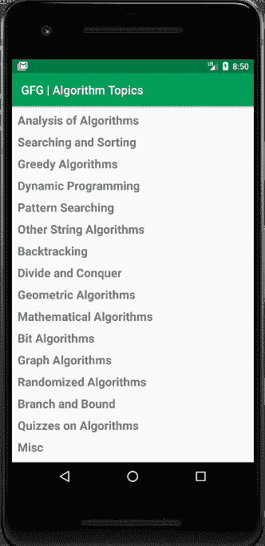

# 如何使用 SQLite 数据库

在安卓系统中预填充数据库

> 原文:[https://www . geesforgeks . org/如何使用 sqlite 数据库预填充安卓数据库/](https://www.geeksforgeeks.org/how-to-pre-populate-database-in-android-using-sqlite-database/)

通常，需要用已经存在的数据库启动一个[安卓应用程序](https://www.geeksforgeeks.org/android-app-development-fundamentals-for-beginners/)。这叫做**预填充数据库**。在本文中，我们将看到如何使用 [SQLite 数据库](https://www.geeksforgeeks.org/introduction-to-sqlite/)在安卓系统中预填充数据库。本例使用的数据库可以下载为[演示数据库](https://github.com/Madhav20/Demo-Database)。

**进场:**

1.  在 **[build.gradle](https://www.geeksforgeeks.org/android-build-gradle/)** 文件中添加支持库，在依赖项部分添加 [Recycler View](https://www.geeksforgeeks.org/android-recyclerview/) 依赖项。

    ```java
    dependencies{
           implementation 'androidx.recyclerview:recyclerview:1.1.0'
    }
    ```

2.  确保将数据库添加到资产文件夹中。要创建资产文件夹，右键单击**应用目录- >新建- >文件夹- >(选择)资产文件夹**。然后简单的粘贴你的**。数据库文件**在资产文件夹中。
3.  在 **activity_main.xml** 中，添加以下代码。

    ```java
    <?xml version="1.0" encoding="utf-8"?>
    <LinearLayout
        xmlns:android="http://schemas.android.com/apk/res/android"
        android:layout_width="match_parent"
        android:layout_height="match_parent"
        android:paddingStart="5dp"
        android:paddingTop="5dp">

        <androidx.recyclerview.widget.RecyclerView
            android:id="@+id/my_recycler_view"
            android:layout_width="match_parent"
            android:layout_height="match_parent"
            android:scrollbars="vertical"/>

    </LinearLayout>
    ```

4.  使用以下代码创建一个新的 **custom_layout.xml** 文件。

    ```java
    <?xml version="1.0" encoding="utf-8"?>
    <LinearLayout
        xmlns:android="http://schemas.android.com/apk/res/android"
        android:layout_width="match_parent"
        android:layout_height="wrap_content"
        android:layout_marginTop="3dp"
        >
        <TextView
            android:textStyle="bold"
            android:layout_margin="5dp"
            android:textSize="20sp"
            android:layout_width="match_parent"
            android:layout_height="wrap_content"
            android:id="@+id/textView"/>
    </LinearLayout>
    ```

5.  创建一个**数据库助手类**并添加以下代码。

    ```java
    package org.geeksforgeeks.dictionary;

    import android.app.Activity;
    import android.content.Context;
    import android.database.Cursor;
    import android.database.sqlite.SQLiteDatabase;
    import android.database.sqlite.SQLiteException;
    import android.database.sqlite.SQLiteOpenHelper;
    import android.util.Log;

    import java.io.FileOutputStream;
    import java.io.IOException;
    import java.io.InputStream;
    import java.io.OutputStream;
    import java.sql.SQLException;
    import java.util.ArrayList;
    import java.util.List;

    public class DatabaseHelper
        extends SQLiteOpenHelper {

        // The Android's default system path
        // of your application database.
        private static String DB_PATH = "";
        private static String DB_NAME = "database.db";
        private SQLiteDatabase myDataBase;
        private final Context myContext;
        private SQLiteOpenHelper sqLiteOpenHelper;

        // Table name in the database.
        public static final String
            ALGO_TOPICS
            = "algo_topics";

        /**
         * Constructor
         * Takes and keeps a reference of 
         * the passed context in order 
         * to access the application assets and resources. */
        public DatabaseHelper(Context context)
        {

            super(context, DB_NAME, null, 1);
            this.myContext = context;
            DB_PATH = myContext.getDatabasePath(DB_NAME)
                          .toString();
        }

        // Creates an empty database
        // on the system and rewrites it
        // with your own database.
        public void createDataBase()
            throws IOException
        {

            boolean dbExist = checkDataBase();

            if (dbExist) {
                // do nothing - database already exist
            }
            else {
                // By calling this method and
                // the empty database will be
                // created into the default system
                // path of your application
                // so we are gonna be able
                // to overwrite that database
                // with our database.
                this.getWritableDatabase();
                try {
                    copyDataBase();
                }
                catch (IOException e) {
                    throw new Error(
                        "Error copying database");
                }
            }
        }
        // Check if the database already exist
        // to avoid re-copying the file each
        // time you open the application
        // return true if it exists
        // false if it doesn't.
        private boolean checkDataBase()
        {
            SQLiteDatabase checkDB = null;
            try {
                String myPath = DB_PATH;
                checkDB
                    = SQLiteDatabase
                          .openDatabase(
                              myPath, null,
                              SQLiteDatabase.OPEN_READONLY);
            }
            catch (SQLiteException e) {

                // database doesn't exist yet.
                Log.e("message", "" + e);
            }
            if (checkDB != null) {
                checkDB.close();
            }
            return checkDB != null;
        }

        /**
         * Copies your database from your
         * local assets-folder to the just 
         * created empty database in the
         * system folder, from where it 
         * can be accessed and handled.
         * This is done by transferring bytestream.
         * */
        private void copyDataBase()
            throws IOException
        {
            // Open your local db as the input stream
            InputStream myInput
                = myContext.getAssets()
                      .open(DB_NAME);

            // Path to the just created empty db
            String outFileName = DB_PATH;

            // Open the empty db as the output stream
            OutputStream myOutput
                = new FileOutputStream(outFileName);

            // transfer bytes from the
            // inputfile to the outputfile
            byte[] buffer = new byte[1024];
            int length;
            while ((length = myInput.read(buffer)) > 0) {
                myOutput.write(buffer, 0, length);
            }

            // Close the streams
            myOutput.flush();
            myOutput.close();
            myInput.close();
        }

        public void openDataBase()
            throws SQLException
        {
            // Open the database
            String myPath = DB_PATH;
            myDataBase = SQLiteDatabase
                             .openDatabase(
                                 myPath, null,
                                 SQLiteDatabase.OPEN_READONLY);
        }

        @Override
        public synchronized void close()
        {
            // close the database.
            if (myDataBase != null)
                myDataBase.close();
            super.close();
        }

        @Override
        public void onCreate(SQLiteDatabase db)
        {
            // It is an abstract method
            // but we define our own method here.
        }

        @Override
        public void onUpgrade(SQLiteDatabase db,
                              int oldVersion,
                              int newVersion)
        {
            // It is an abstract method which is
            // used to perform different task
            // based on the version of database.
        }

        // This method is used to get the
        // algorithm topics from the database.
        public List<String> getAlgorithmTopics(
            Activity activity)
        {
            sqLiteOpenHelper
                = new DatabaseHelper(activity);
            SQLiteDatabase db
                = sqLiteOpenHelper
                      .getWritableDatabase();

            List<String> list
                = new ArrayList<>();

            // query help us to return all data
            // the present in the ALGO_TOPICS table.
            String query = "SELECT * FROM " + ALGO_TOPICS;
            Cursor cursor = db.rawQuery(query, null);

            if (cursor.moveToFirst()) {
                do {
                    list.add(cursor.getString(1));
                } while (cursor.moveToNext());
            }
            return list;
        }
    }
    ```

6.  创建一个**MyAdapter.java**类，并添加以下代码。

    ```java
    package org.geeksforgeeks.dictionary;

    import android.app.Activity;
    import android.view.LayoutInflater;
    import android.view.View;
    import android.view.ViewGroup;
    import android.widget.TextView;

    import androidx.annotation.NonNull;
    import androidx.recyclerview.widget.RecyclerView;
    import java.util.List;

    public class MyAdapter
        extends RecyclerView.Adapter<MyAdapter.ViewHolder> {

        private List<String> data;
        Activity activity;

        public MyAdapter(Activity activity,
                         List<String> data)
        {
            this.data = data;
            this.activity = activity;
        }

        // This method is used to attach
        // custom layout to the recycler view
        @NonNull
        @Override
        public ViewHolder onCreateViewHolder(
            @NonNull ViewGroup parent,
            int viewType)
        {
            LayoutInflater LI
                = activity.getLayoutInflater();
            View vw = LI.inflate(
                R.layout.custom_layout, null);
            return new ViewHolder(vw);
        }

        // This method is used to set the action
        // to the widgets of our custom layout.
        @Override
        public void onBindViewHolder(
            @NonNull ViewHolder holder,
            int position)
        {
            holder.topic_name
                .setText(data.get(position));
        }

        @Override
        public int getItemCount()
        {
            return data.size();
        }

        class ViewHolder
            extends RecyclerView.ViewHolder {
            TextView topic_name;
            public ViewHolder(View itemView)
            {
                super(itemView);
                this.topic_name
                    = itemView.findViewById(R.id.textView);
            }
        }
    }
    ```

7.  最后，在**MainActivity.java**中添加以下代码。

    ```java
    package org.geeksforgeeks.algorithmTopics;

    import androidx.appcompat.app.AppCompatActivity;
    import androidx.recyclerview.widget.DefaultItemAnimator;
    import androidx.recyclerview.widget.LinearLayoutManager;
    import androidx.recyclerview.widget.RecyclerView;
    import android.os.Bundle;
    import java.util.ArrayList;
    import java.util.List;

    public class MainActivity
        extends AppCompatActivity {

        private static RecyclerView.Adapter adapter;
        private static RecyclerView recyclerView;
        public static List<String> data;
        DatabaseHelper db;

        @Override
        protected void onCreate(Bundle savedInstanceState)
        {
            super.onCreate(savedInstanceState);
            setContentView(R.layout.activity_main);
            recyclerView
                = findViewById(R.id.my_recycler_view);

            db = new DatabaseHelper(this);
            recyclerView.setLayoutManager(
                new LinearLayoutManager(this));
            data = new ArrayList<>();
            fetchData();
        }

        public void fetchData()
        {
            // Before fetching the data
            // directly from the database.
            // first we have to creates an empty
            // database on the system and
            // rewrites it with your own database.
            // Then we have to open the
            // database to fetch the data from it.
            db = new DatabaseHelper(this);
            try {
                db.createDataBase();
                db.openDataBase();
            }
            catch (Exception e) {
                e.printStackTrace();
            }

            data = db.getAlgorithmTopics(this);
            adapter = new MyAdapter(this, data);
            recyclerView.setAdapter(adapter);
        }
    }
    ```

**输出:**
[](https://media.geeksforgeeks.org/wp-content/uploads/20200416085808/Screenshot-2672.png)