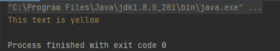
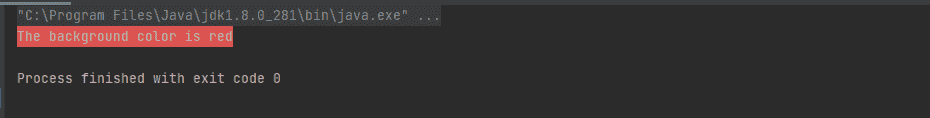

# 如何在 Java 控制台打印彩色文本？

> 原文:[https://www . geesforgeks . org/how-print-color-text-in-Java-console/](https://www.geeksforgeeks.org/how-to-print-colored-text-in-java-console/)

请记住，在 Java 编程中，输出屏幕的背景颜色和文本颜色默认为黑色或白色。如果我们想在输出屏幕上突出显示一些文本，那么我们可以使用 ANSI 颜色代码并突出显示特定的文本。人们可以参考 ANSI 转义码来探索更多。

**语法:**

```
System.out.println(ANSI_COLORNAME + "This text is colored" + ANSI_RESET);
```

从上面的语法可以看出，该语法包含 3 个部分:

*   在 **ANSI_COLORNAME** 中，我们必须写下给定特定 ANSI 代码的名称。例如，公共静态最终字符串 ANSI _ BLack = \ u001B[30m]；

> 以上是伪码是打印黑色文字。所以这里我们可以用 ANSI_BLACK 代替 ANSI_COLORNAME 来打印黑色的文本。

*   第二部分是写下我们想用那种颜色打印的文字。
*   **ANSI_RESET** 代码关闭了目前为止设置的所有 ANSI 属性，这应该会使控制台恢复到默认值。

下面是 ANSI 色码表:

<figure class="table">T28】BLACK _ Background

| **Color name** | **color code** | **Background color** | **background color code** |
| --- | --- | --- | --- |
| 黑色 | \ u001B【30m】 | \ u000 |
| yellow | \ u01b【33m | Yellow _ background | \ u01b【43m |
| blue | \ u01b【34m | Blue _ background | \ u01b【44m |

</figure>

**插图:**Java 中的文本着色:

**例 1:**

## Java 语言(一种计算机语言，尤用于创建网站)

```
// Java Program to Print Colored Text in Console

// Importing input output classes
import java.io.*;

// Main class
public class GFG {

    // Declaring ANSI_RESET so that we can reset the color
    public static final String ANSI_RESET = "\u001B[0m";

    // Declaring the color
    // Custom declaration
    public static final String ANSI_YELLOW = "\u001B[33m";

    // Main driver method
    public static void main(String[] args)
    {
        // Printing the text on console prior adding
        // the desired color
        System.out.println(ANSI_YELLOW
                           + "This text is yellow"
                           + ANSI_RESET);
    }
}
```

**输出:**



**例 2:**

## Java 语言(一种计算机语言，尤用于创建网站)

```
// Java Program to Print Colored Text in Console

// Importing required classes
import java.io.*;

// Main class
class GFG {

    // Declaring ANSI_RESET so that we can reset the color
    public static final String ANSI_RESET = "\u001B[0m";
    // Declaring the background color
    public static final String ANSI_RED_BACKGROUND
        = "\u001B[41m";

    // Main driver method
    public static void main(String[] args)
    {
        // Now add the particular background color
        System.out.println(ANSI_RED_BACKGROUND
                           + "The background color is red"
                           + ANSI_RESET);
    }
}
```

**输出:**

