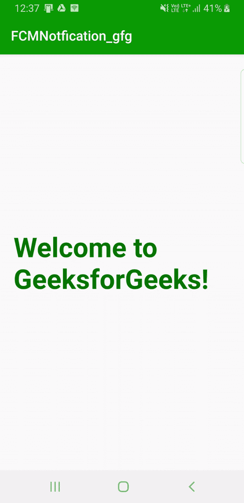
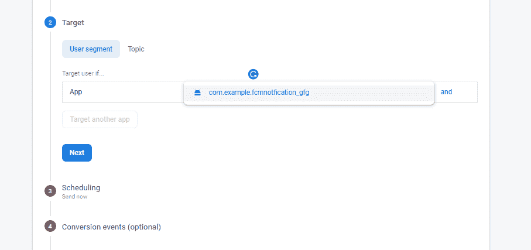
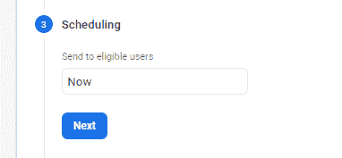

# 如何使用 Firebase 云消息在安卓系统中推送通知？

> 原文:[https://www . geeksforgeeks . org/如何使用 firebase-cloud-messaging 在 android 中推送通知/](https://www.geeksforgeeks.org/how-to-push-notification-in-android-using-firebase-cloud-messaging/)

[Firebase 云消息](https://firebase.google.com/docs/cloud-messaging)是一个向客户端应用程序发送通知的实时解决方案，不收取任何费用。 **FCM** 可以可靠地传输高达 4Kb 有效负载的通知。在本文中，开发了一个示例应用程序，展示了如何利用这项服务。虽然 FCM 也允许使用应用服务器发送通知，这里使用的是 Firebase 管理软件开发工具包。按照完整的文章来实现一个 FCM 的例子。


#### 方法

**第一步:向项目中添加 Firebase 和所需权限**

要将 firebase 添加到项目中，请参考[将 Firebase 添加到安卓应用中。](https://www.geeksforgeeks.org/adding-firebase-to-android-app/)以下是在 app 中添加 FCM 的要点。前往**工具- >火基地- >云消息- >设置火基地云消息**

1.  将您的应用程序连接到 Firebase:完成创建 Firebase 项目的三个步骤。
2.  将 FCM 添加到应用程序中。

由于接收 FCM 通知需要使用互联网，请在**</应用程序>** 和**</清单>** 标签之间的任意位置向 **AndroidManifest.xml** 文件添加以下权限。

> **注:**
> 编译“……”
> 不推荐使用这种设置依赖关系的格式，而是使用
> 实现“…..”
> 在出现任何差异时声明依赖关系。

**第二步:添加所有需要的可抽取资源**

这里，以下图标已被用作可绘制资源。将所有可绘制资源添加到**可绘制资源文件夹中。**


**第三步:自定义 activity_main.xml**

这里，应用程序的主屏幕上只有一个[文本视图](https://www.geeksforgeeks.org/textview-in-kotlin/)，但是可以根据需要定制应用程序。

## activity_main.xml

```java
<?xml version="1.0" encoding="utf-8"?>
<androidx.constraintlayout.widget.ConstraintLayout 
    xmlns:android="http://schemas.android.com/apk/res/android"
    xmlns:app="http://schemas.android.com/apk/res-auto"
    xmlns:tools="http://schemas.android.com/tools"
    android:layout_width="match_parent"
    android:layout_height="match_parent"
    tools:context=".MainActivity">

    <TextView
        android:layout_width="wrap_content"
        android:layout_height="wrap_content"
        android:padding="20dp"
        android:text="Welcome to GeeksforGeeks!"
        android:textColor="#006600"
        android:textSize="40dp"
        android:textStyle="bold"
        app:layout_constraintBottom_toBottomOf="parent"
        app:layout_constraintLeft_toLeftOf="parent"
        app:layout_constraintRight_toRightOf="parent"
        app:layout_constraintTop_toTopOf="parent" />

</androidx.constraintlayout.widget.ConstraintLayout>
```

**步骤 4:创建通知布局**

创建一个新的 **notification.xml** 文件来设计通知的布局。这个步骤被描述为可选的，因为内容和标题也可以直接设置，而不需要定制通知的外观，但是这里的通知具有以下布局。此处的通知包括:

1.  an〔t0〕image view〔t1〕
2.  标题的文本视图
3.  消息的文本视图。

## notification.xml

```java
<?xml version="1.0" encoding="utf-8"?>
<LinearLayout 
    xmlns:android="http://schemas.android.com/apk/res/android"
    android:id="@+id/linear_layout"
    android:layout_width="match_parent"
    android:layout_height="wrap_content"
    android:orientation="horizontal"
    android:padding="20dp">

    <!-- Parent Layout of ImageView -->
    <LinearLayout
        android:layout_width="wrap_content"
        android:layout_height="wrap_content">

        <!--Image to be displayed beside the notification text-->
        <ImageView
            android:id="@+id/icon"
            android:layout_width="50dp"
            android:layout_height="50dp"
            android:padding="5dp"
            android:src="@drawable/gfg" />
    </LinearLayout>

    <!-- Parent layout for holding the Title and the Body-->
    <LinearLayout
        android:layout_width="0dp"
        android:layout_height="wrap_content"
        android:layout_weight="1"
        android:orientation="vertical"
        android:padding="5dp">

        <!-- TextView for Title -->
        <TextView
            android:id="@+id/title"
            android:layout_width="match_parent"
            android:layout_height="wrap_content"
            android:text="Title"
            android:textColor="#000"
            android:textStyle="bold" />

        <!-- TextView for Body -->
        <TextView
            android:id="@+id/message"
            android:layout_width="match_parent"
            android:layout_height="wrap_content"
            android:text="Message"
            android:textSize="15sp" />

    </LinearLayout>

</LinearLayout>
```

**第五步:创建消息接收类**

创建一个**FirebaseMessageReceiver.java**类。这个类扩展了 **FirebaseMessagingService。**在 **< /activity >** 和 **< /application >** 标签之间的 **AndroidManifest.xml** 文件中添加以下代码，将 FirebaseMessagingService 识别为应用程序中的服务。

## AndroidManifest.xml

```java

<service android:name=".FirebaseMessageReceiver">
            <intent-filter>
                <action android:name="com.google.firebase.MESSAGING_EVENT" />
            </intent-filter>
</service>
```

这里属性**‘Android:name’**被赋予了扩展**firebasemissiongservice**的 Java 文件的名称，所以传递类名 **FirebaseMessageReceiver** 。当客户端应用程序在后台运行时，除了接收通知之外，该服务还需要进行任何类型的消息处理。它还可以在前台应用程序等中接收通知。完整的 **AndroidManifest.xml** 文件如下。

## AndroidManifest.xml

```java

<?xml version="1.0" encoding="utf-8"?>
<manifest 
    xmlns:android="http://schemas.android.com/apk/res/android"
    package="com.example.pushnotification">

    <uses-permission android:name="android.permission.INTERNET" />

    <application
        android:allowBackup="true"
        android:icon="@mipmap/ic_launcher"
        android:label="@string/app_name"
        android:roundIcon="@mipmap/ic_launcher_round"
        android:supportsRtl="true"
        android:theme="@style/AppTheme">
        <activity android:name=".MainActivity">
            <intent-filter>
                <action android:name="android.intent.action.MAIN" />

                <category android:name="android.intent.category.LAUNCHER" />
            </intent-filter>
        </activity>

        <service android:name=".FirebaseMessageReceiver">
            <intent-filter>
                <action android:name="com.google.firebase.MESSAGING_EVENT" />
            </intent-filter>
        </service>

    </application>

</manifest>
```

**第六步:与 FirebaseMessageReceiver.java 班合作**

**FirebaseMessageReceiver.java**类覆盖了 **`onMessageReceived()`** 方法来处理 2 个事件:

1.  如果通知包含任何数据负载，即它是从应用服务器接收的。
2.  如果通知包含任何通知负载，即它是通过 Firebase Admin SDK 发送的。

该方法以**远程消息**为参数。远程消息是一个扩展对象类并实现可调用接口的类。它只不过是使用 FCM 传递的消息的对象。然后，上述方法调用用户定义的方法 **`showNotification()`** ，该方法依次接受两个参数。代码本身的注释提供了详细的解释。安卓版本大于奥利奥的[通知需要通知渠道。](https://www.geeksforgeeks.org/notifications-in-android-oreo-8/)

在本例中，由于设计了定制的通知，因此定义并调用了方法 **`getCustomDesign()`** 来相应地设置资源。此方法为收到的通知的显示设置自定义布局。假设从通知中只接收到标题和正文，它会根据标识适当地映射**文本视图**，并为通知设置图像资源。下面给出了该文件的完整代码。

## firebasemessagereceiver . java

```java
package com.example.fcmnotfication_gfg;

import android.app.NotificationChannel;
import android.app.NotificationManager;
import android.app.PendingIntent;
import android.content.Context;
import android.content.Intent;
import android.os.Build;
import android.widget.RemoteViews;

import androidx.core.app.NotificationCompat;

import com.google.firebase.messaging.FirebaseMessagingService;
import com.google.firebase.messaging.RemoteMessage;

public class FirebaseMessageReceiver
        extends FirebaseMessagingService {

    // Override onMessageReceived() method to extract the
    // title and
    // body from the message passed in FCM
    @Override
    public void
    onMessageReceived(RemoteMessage remoteMessage) {
        // First case when notifications are received via
        // data event
        // Here, 'title' and 'message' are the assumed names
        // of JSON
        // attributes. Since here we do not have any data
        // payload, This section is commented out. It is
        // here only for reference purposes.
        /*if(remoteMessage.getData().size()>0){
            showNotification(remoteMessage.getData().get("title"),
                          remoteMessage.getData().get("message"));
        }*/

        // Second case when notification payload is
        // received.
        if (remoteMessage.getNotification() != null) {
            // Since the notification is received directly from
            // FCM, the title and the body can be fetched
            // directly as below.
            showNotification(
                    remoteMessage.getNotification().getTitle(),
                    remoteMessage.getNotification().getBody());
        }
    }

    // Method to get the custom Design for the display of
    // notification.
    private RemoteViews getCustomDesign(String title,
                                        String message) {
        RemoteViews remoteViews = new RemoteViews(
                getApplicationContext().getPackageName(),
                R.layout.notification);
        remoteViews.setTextViewText(R.id.title, title);
        remoteViews.setTextViewText(R.id.message, message);
        remoteViews.setImageViewResource(R.id.icon,
                R.drawable.gfg);
        return remoteViews;
    }

    // Method to display the notifications
    public void showNotification(String title,
                                 String message) {
        // Pass the intent to switch to the MainActivity
        Intent intent
                = new Intent(this, MainActivity.class);
        // Assign channel ID
        String channel_id = "notification_channel";
        // Here FLAG_ACTIVITY_CLEAR_TOP flag is set to clear
        // the activities present in the activity stack,
        // on the top of the Activity that is to be launched
        intent.addFlags(Intent.FLAG_ACTIVITY_CLEAR_TOP);
        // Pass the intent to PendingIntent to start the
        // next Activity
        PendingIntent pendingIntent
                = PendingIntent.getActivity(
                this, 0, intent,
                PendingIntent.FLAG_ONE_SHOT);

        // Create a Builder object using NotificationCompat
        // class. This will allow control over all the flags
        NotificationCompat.Builder builder
                = new NotificationCompat
                .Builder(getApplicationContext(),
                channel_id)
                .setSmallIcon(R.drawable.gfg)
                .setAutoCancel(true)
                .setVibrate(new long[]{1000, 1000, 1000,
                        1000, 1000})
                .setOnlyAlertOnce(true)
                .setContentIntent(pendingIntent);

        // A customized design for the notification can be
        // set only for Android versions 4.1 and above. Thus
        // condition for the same is checked here.
        if (Build.VERSION.SDK_INT
                >= Build.VERSION_CODES.JELLY_BEAN) {
            builder = builder.setContent(
                    getCustomDesign(title, message));
        } // If Android Version is lower than Jelly Beans,
        // customized layout cannot be used and thus the
        // layout is set as follows
        else {
            builder = builder.setContentTitle(title)
                    .setContentText(message)
                    .setSmallIcon(R.drawable.gfg);
        }
        // Create an object of NotificationManager class to
        // notify the
        // user of events that happen in the background.
        NotificationManager notificationManager
                = (NotificationManager) getSystemService(
                Context.NOTIFICATION_SERVICE);
        // Check if the Android Version is greater than Oreo
        if (Build.VERSION.SDK_INT
                >= Build.VERSION_CODES.O) {
            NotificationChannel notificationChannel
                    = new NotificationChannel(
                    channel_id, "web_app",
                    NotificationManager.IMPORTANCE_HIGH);
            notificationManager.createNotificationChannel(
                    notificationChannel);
        }

        notificationManager.notify(0, builder.build());
    }
}
```

> **注意:**当应用在后台时，点击时的通知将总是重定向到应用的启动器活动，如果在前台，则重定向到意图中传递的**活动**。要将用户总是重定向到启动器以外的其他活动，您必须使用服务器应用程序发送数据负载，使用 Firebase SDK 发送消息不支持这一点。

**第七步:完成 MainActivity.java 文件**

由于这里 activity_main.xml 中没有什么内容，MainActivity 文件不需要任何额外的代码。

## MainActivity.java

```java
package com.example.fcmnotfication_gfg;

import androidx.appcompat.app.AppCompatActivity;
import android.os.Bundle;

public class MainActivity extends AppCompatActivity {

    @Override
    protected void onCreate(Bundle savedInstanceState)
    {
        super.onCreate(savedInstanceState);
        setContentView(R.layout.activity_main);
    }
}
```

现在在模拟器或移动设备上运行该应用程序。

**步骤 8:使用 FCM** 发送通知

*   转到 Firebase 控制台并选择适当的项目。
*   选择**云消息**。
    T3】

*   选择**发送你的第一条信息**。弹出如下窗口。填写细节。虽然文本字段是必需的，但其余的都是可选的。也可以使用链接添加或上传图像，但是上传图像需要额外的存储费用。
    T3】*   在目标部分，选择应用程序域。
    *   你可以现在就发出通知，也可以安排在将来的某个时间。
    *   其余所有其他字段都是可选的，可以留空。点击**查看**，然后**发布**。

    #### 输出：在模拟器上运行

    <video class="wp-video-shortcode" id="video-476977-1" width="640" height="360" preload="metadata" controls=""><source type="video/mp4" src="https://media.geeksforgeeks.org/wp-content/uploads/20200825124020/gfg-not.mp4?_=1">[https://media . geeksforgeeks . org/WP-content/uploads/20200825124020/gfg-not . MP4](https://media.geeksforgeeks.org/wp-content/uploads/20200825124020/gfg-not.mp4)</video>