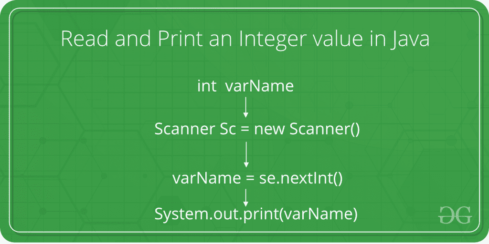

# 如何在 Java 中读取和打印整数值

> 原文:[https://www . geesforgeks . org/如何在 java 中读取和打印整数值/](https://www.geeksforgeeks.org/how-to-read-and-print-an-integer-value-in-java/)

给定的任务是从用户那里获取一个整数作为输入，并用 Java 语言打印该整数。



在下面的程序中，将整数作为用户输入的语法和过程用 Java 语言显示。

**步骤:**

1.  当被询问时，用户输入整数值。
2.  This value is taken from the user with the help of **nextInt()** method of **Scanner Class**. The nextInt() method, in Java, reads the next integer value from the console into the specified variable.

    **语法:**

    ```
    variableOfIntType = ScannerObject.nextInt();

    where variableOfIntType is the variable
    in which the input value is to be stored.
    And ScannerObject is the beforehand created 
    object of the Scanner class.

    ```

3.  该输入值现在存储在**变量类型**中。
4.  Now to print this value, **System.out.println()** or **System.out.print()** method is used. The System.out.println() method, in Java, prints the value passed as the parameter to it, on the console screen and the changes the cursor to the next line on the console. Whereas System.out.print() method, in Java, prints the value passed as the parameter to it, on the console screen and the cursor remains on the next character of the last printed character on the console.

    **语法:**

    ```
    System.out.println(variableOfXType);

    ```

5.  因此，整数值被成功读取和打印。

**程序:**

## Java 语言(一种计算机语言，尤用于创建网站)

```
// Java program to take an integer
// as input and print it

import java.io.*;
import java.util.Scanner;

class GFG {
    public static void main(String[] args)
    {

        // Declare the variables
        int num;

        // Input the integer
        System.out.println("Enter the integer: ");

        // Create Scanner object
        Scanner s = new Scanner(System.in);

        // Read the next integer from the screen
        num = s.nextInt();

        // Display the integer
        System.out.println("Entered integer is: "
                           + num);
    }
}
```

**输出:**

```
Enter the integer: 10
Entered integer is: 10

```