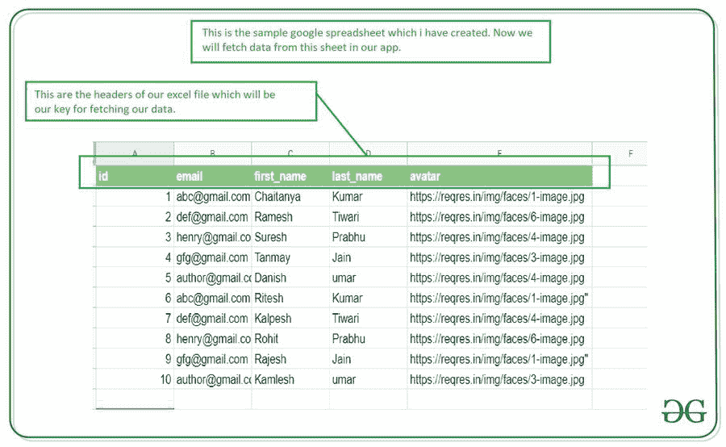
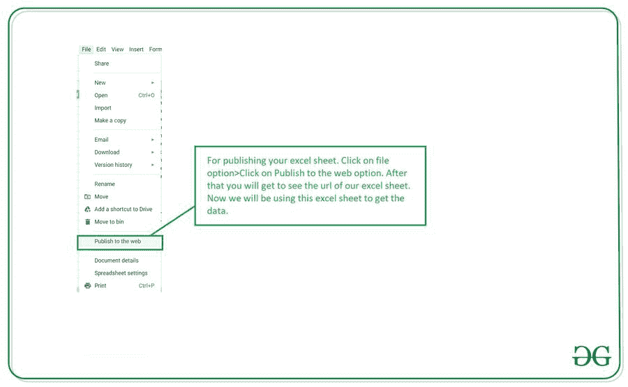
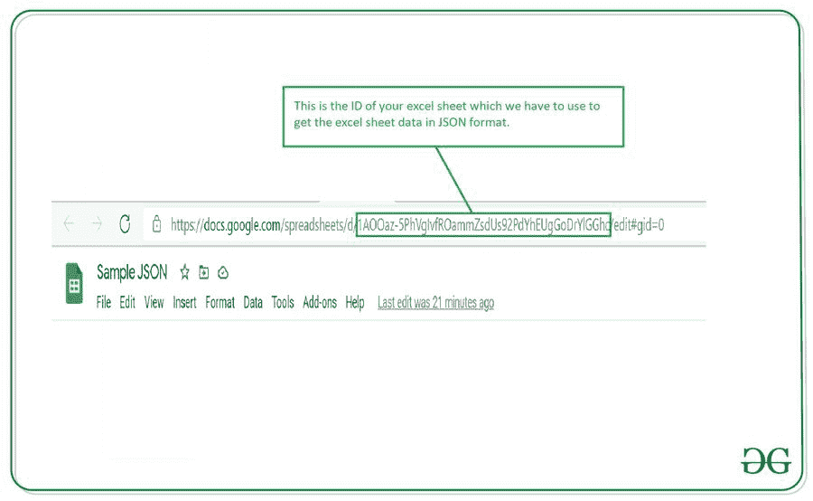

# 如何在安卓系统中读取谷歌电子表格中的数据？

> 原文:[https://www . geesforgeks . org/如何从谷歌读取数据-安卓电子表格/](https://www.geeksforgeeks.org/how-to-read-data-from-google-spreadsheet-in-android/)

许多应用程序必须在应用程序中显示统计数据，并将所有数据存储在 excel 文件或电子表格中。但是，并不是每次都可以将数据库中的全部数据添加到我们的应用程序中。在本文中，我们将从安卓工作室的安卓应用程序中的 Excel 表中读取这些数据。

### 我们将在本文中构建什么？

我们将构建一个简单的应用程序，其中我们将显示我们已经创建的 excel 表中的数据，我们将读取该 excel 表中的条目，并在回收视图中显示该数据列表。下面给出了一个示例视频，让我们了解一下在本文中要做什么。请注意，我们将使用 **Java** 语言来实现这个项目。

<video class="wp-video-shortcode" id="video-569423-1" width="640" height="360" preload="metadata" controls=""><source type="video/mp4" src="https://media.geeksforgeeks.org/wp-content/uploads/20210305144209/Screenrecorder-2021-03-05-14-41-07-147.mp4?_=1">[https://media.geeksforgeeks.org/wp-content/uploads/20210305144209/Screenrecorder-2021-03-05-14-41-07-147.mp4](https://media.geeksforgeeks.org/wp-content/uploads/20210305144209/Screenrecorder-2021-03-05-14-41-07-147.mp4)</video>

### **分步实施**

**第一步:创建新项目**

要在安卓工作室创建新项目，请参考[如何在安卓工作室创建/启动新项目](https://www.geeksforgeeks.org/android-how-to-create-start-a-new-project-in-android-studio/)。注意选择 **Java** 作为编程语言。

**第二步:在你的 build.gradle 文件**中添加下面的依赖项

下面是凌空的依赖，我们将使用它从应用编程接口获取数据。要添加此依赖项，请导航至**应用程序>渐变脚本> build.gradle(应用程序)**，并在依赖项部分添加以下依赖项。

> 实现‘com . Android .凌空:凌空:1 . 1 . 1’
> 
> //下面一行用于图像加载库
> 
> 实现' com.squareup .毕加索:毕加索:2.71828 '

添加此依赖项后，同步您的项目，现在转到 AndroidManifest.xml 部分。

**第三步:向 AndroidManifest.xml 文件**添加互联网权限

导航到**应用程序> AndroidManifest.xml** ，并添加以下代码。

## 可扩展标记语言

```java
<!--permissions for INTERNET-->
<uses-permission android:name="android.permission.INTERNET"/>
```

**第四步:创建一个从谷歌电子表格获取数据的网址**

创建一个简单的谷歌电子表格，如下所示。确保使用与下面文件中所示相同的标题。



创建好我们的 excel 文件后。现在我们必须发布这个 excel 文件，以便在我们的应用程序中使用它。出版它。



现在我们将创建一个网址，在其中我们将以 JSON 格式获取数据。转到您的 excel 工作表，复制您的工作表 id，如下图所示。



> https://spreadsheets.google.com/feeds/list/**“在这里输入你的 ID”**/od6/公共/价值观？alt=json

复制此 id 后，将该 id 粘贴到下面的网址中，并在浏览器中运行该网址。您将看到 JSON 格式的所有 excel 数据。现在我们将在我们的应用程序中使用 JSON 格式的数据。确保您已经发布了 Excel 工作表。否则，这种方法将不起作用。现在我们将在我们的应用程序中使用这个网址来获取 JSON 格式的数据。

**第 5 步:使用 activity_main.xml 文件**

导航到**应用程序> res >布局> activity_main.xml** 并将下面的代码添加到该文件中。下面是 **activity_main.xml** 文件的代码。

## 可扩展标记语言

```java
<?xml version="1.0" encoding="utf-8"?>
<!--in this we are displaying a nested scroll view-->
<RelativeLayout
    xmlns:android="http://schemas.android.com/apk/res/android"
    xmlns:tools="http://schemas.android.com/tools"
    android:id="@+id/idNestedSV"
    android:layout_width="match_parent"
    android:layout_height="match_parent"
    tools:context=".MainActivity">

    <!--recycler view for displaying our list of data
        and we are making nested scroll for our
        recycler view as false-->
    <androidx.recyclerview.widget.RecyclerView
        android:id="@+id/idRVUsers"
        android:layout_width="match_parent"
        android:layout_height="match_parent"
        tools:listitem="@layout/user_rv_item" />

    <!--we are adding progress bar for thepurpose of loading-->
    <ProgressBar
        android:id="@+id/idPBLoading"
        android:layout_width="wrap_content"
        android:layout_centerInParent="true"
        android:layout_height="wrap_content" />

</RelativeLayout>
```

**第 6 步:创建一个模态类来存储我们的数据**

为了存储数据，我们必须创建一个新的 java 类。要创建一个新的 java 类，导航到**应用程序> java >你的应用程序的包名>右键单击它>新建> Java 类**并将其命名为**用户模式**并添加下面的代码。

## Java 语言(一种计算机语言，尤用于创建网站)

```java
public class UserModal {

    // variables for our first name,
    // last name, email and avatar
    private String first_name;
    private String last_name;
    private String email;
    private String avatar;

    public String getFirst_name() {
        return first_name;
    }

    public void setFirst_name(String first_name) {
        this.first_name = first_name;
    }

    public String getLast_name() {
        return last_name;
    }

    public void setLast_name(String last_name) {
        this.last_name = last_name;
    }

    public String getEmail() {
        return email;
    }

    public void setEmail(String email) {
        this.email = email;
    }

    public String getAvatar() {
        return avatar;
    }

    public void setAvatar(String avatar) {
        this.avatar = avatar;
    }

    public UserModal(String first_name, String last_name, String email, String avatar) {
        this.first_name = first_name;
        this.last_name = last_name;
        this.email = email;
        this.avatar = avatar;
    }
}
```

**第 7 步:为我们的回收视图**的每个项目创建一个布局文件

导航至 **app > res >布局>右键单击>新建>布局资源文件**并将文件名命名为 **user_rv_item** ，并在其中添加以下代码。

## 可扩展标记语言

```java
<?xml version="1.0" encoding="utf-8"?>
<androidx.cardview.widget.CardView
    xmlns:android="http://schemas.android.com/apk/res/android"
    xmlns:app="http://schemas.android.com/apk/res-auto"
    android:layout_width="match_parent"
    android:layout_height="wrap_content"
    android:elevation="8dp"
    app:cardCornerRadius="8dp">

    <RelativeLayout
        android:layout_width="match_parent"
        android:layout_height="wrap_content"
        android:layout_margin="2dp">

        <!--image view for displaying user image-->
        <ImageView
            android:id="@+id/idIVUser"
            android:layout_width="100dp"
            android:layout_height="100dp"
            android:layout_margin="10dp" />

        <!--text view for displaying first name-->
        <TextView
            android:id="@+id/idTVFirstName"
            android:layout_width="match_parent"
            android:layout_height="wrap_content"
            android:layout_marginTop="10dp"
            android:layout_toEndOf="@id/idIVUser"
            android:layout_toRightOf="@id/idIVUser"
            android:text="First Name"
            android:textColor="@color/black"
            android:textSize="15sp" />

        <!--text view for displaying last name-->
        <TextView
            android:id="@+id/idTVLastName"
            android:layout_width="match_parent"
            android:layout_height="wrap_content"
            android:layout_below="@id/idTVFirstName"
            android:layout_marginTop="10dp"
            android:layout_toEndOf="@id/idIVUser"
            android:layout_toRightOf="@id/idIVUser"
            android:text="Last Name"
            android:textColor="@color/black"
            android:textSize="15sp" />

        <!--text view for displaying user email-->
        <TextView
            android:id="@+id/idTVEmail"
            android:layout_width="match_parent"
            android:layout_height="wrap_content"
            android:layout_below="@id/idTVLastName"
            android:layout_marginTop="10dp"
            android:layout_toEndOf="@id/idIVUser"
            android:layout_toRightOf="@id/idIVUser"
            android:text="Email"
            android:textColor="@color/black"
            android:textSize="15sp" />

    </RelativeLayout>

</androidx.cardview.widget.CardView>
```

**第 8 步:创建一个适配器类，用于将数据设置到我们的回收视图项**

用于创建新的适配器类。导航到**应用> java >你的应用的包名>右键点击它>新建> Java 类**并将其命名为 **UserRVAdapter** 并添加下面的代码。

## Java 语言(一种计算机语言，尤用于创建网站)

```java
import android.content.Context;
import android.view.LayoutInflater;
import android.view.View;
import android.view.ViewGroup;
import android.widget.ImageView;
import android.widget.TextView;

import androidx.annotation.NonNull;
import androidx.recyclerview.widget.RecyclerView;

import com.squareup.picasso.Picasso;

import java.util.ArrayList;

public class UserRVAdapter extends RecyclerView.Adapter<UserRVAdapter.ViewHolder> {

    // variable for our array list and context.
    private ArrayList<UserModal> userModalArrayList;
    private Context context;

    // creating a constructor.
    public UserRVAdapter(ArrayList<UserModal> userModalArrayList, Context context) {
        this.userModalArrayList = userModalArrayList;
        this.context = context;
    }

    @NonNull
    @Override
    public ViewHolder onCreateViewHolder(@NonNull ViewGroup parent, int viewType) {
        // inflating our layout file on below line.
        View view = LayoutInflater.from(context).inflate(R.layout.user_rv_item, parent, false);
        return new ViewHolder(view);
    }

    @Override
    public void onBindViewHolder(@NonNull ViewHolder holder, int position) {

        // getting data from our array list in our modal class.
        UserModal userModal = userModalArrayList.get(position);

          // on the below line we are setting data to our text view.
        holder.firstNameTV.setText(userModal.getFirst_name());
        holder.lastNameTV.setText(userModal.getLast_name());
        holder.emailTV.setText(userModal.getEmail());

        // on below line we are loading our image from the URL
        // in our image view using Picasso.
        Picasso.get().load(userModal.getAvatar()).into(holder.userIV);
    }

    @Override
    public int getItemCount() {
        // returning the size of array list.
        return userModalArrayList.size();
    }

    public class ViewHolder extends RecyclerView.ViewHolder {

        // creating a variable for our text view and image view.
        private TextView firstNameTV, lastNameTV, emailTV;
        private ImageView userIV;

        public ViewHolder(@NonNull View itemView) {
            super(itemView);

            // initializing our variables.
            firstNameTV = itemView.findViewById(R.id.idTVFirstName);
            lastNameTV = itemView.findViewById(R.id.idTVLastName);
            emailTV = itemView.findViewById(R.id.idTVEmail);
            userIV = itemView.findViewById(R.id.idIVUser);
        }
    }
}
```

**第九步:使用****MainActivity.java 文件**

转到**MainActivity.java**文件，参考以下代码。以下是**MainActivity.java**文件的代码。代码中添加了注释，以更详细地理解代码。

## Java 语言(一种计算机语言，尤用于创建网站)

```java
import android.os.Bundle;
import android.view.View;
import android.widget.ProgressBar;
import android.widget.Toast;

import androidx.appcompat.app.AppCompatActivity;
import androidx.core.widget.NestedScrollView;
import androidx.recyclerview.widget.LinearLayoutManager;
import androidx.recyclerview.widget.RecyclerView;

import com.android.volley.Request;
import com.android.volley.RequestQueue;
import com.android.volley.Response;
import com.android.volley.VolleyError;
import com.android.volley.toolbox.JsonObjectRequest;
import com.android.volley.toolbox.Volley;

import org.json.JSONArray;
import org.json.JSONException;
import org.json.JSONObject;

import java.util.ArrayList;

public class MainActivity extends AppCompatActivity {

    // creating a variable for our array list, adapter class,
    // recycler view, progressbar, nested scroll view
    private ArrayList<UserModal> userModalArrayList;
    private UserRVAdapter userRVAdapter;
    private RecyclerView userRV;
    private ProgressBar loadingPB;

    @Override
    protected void onCreate(Bundle savedInstanceState) {
        super.onCreate(savedInstanceState);
        setContentView(R.layout.activity_main);

        // creating a new array list.
        userModalArrayList = new ArrayList<>();

        // initializing our views.
        userRV = findViewById(R.id.idRVUsers);
        loadingPB = findViewById(R.id.idPBLoading);

        // calling a method to load our API.
        getDataFromAPI();
    }

    private void getDataFromAPI() {

        // creating a string variable for URL.
        String url = "https://spreadsheets.google.com/feeds/list/1AOOaz-5PhVgIvfROammZsdUs92PdYhEUgGoDrYlGGhc/od6/public/values?alt=json";

          // creating a new variable for our request queue
        RequestQueue queue = Volley.newRequestQueue(MainActivity.this);

        // creating a variable for our JSON object request and passing our URL to it.
        JsonObjectRequest jsonObjectRequest = new JsonObjectRequest(Request.Method.GET, url, null, new Response.Listener<JSONObject>() {
            @Override
            public void onResponse(JSONObject response) {
                loadingPB.setVisibility(View.GONE);
                try {
                    JSONObject feedObj = response.getJSONObject("feed");
                    JSONArray entryArray = feedObj.getJSONArray("entry");
                    for(int i=0; i<entryArray.length(); i++){
                        JSONObject entryObj = entryArray.getJSONObject(i);
                        String firstName = entryObj.getJSONObject("gsx$firstname").getString("$t");
                        String lastName = entryObj.getJSONObject("gsx$lastname").getString("$t");
                        String email = entryObj.getJSONObject("gsx$email").getString("$t");
                        String avatar = entryObj.getJSONObject("gsx$avatar").getString("$t");
                        userModalArrayList.add(new UserModal(firstName, lastName, email, avatar));

                        // passing array list to our adapter class.
                        userRVAdapter = new UserRVAdapter(userModalArrayList, MainActivity.this);

                        // setting layout manager to our recycler view.
                        userRV.setLayoutManager(new LinearLayoutManager(MainActivity.this));

                        // setting adapter to our recycler view.
                        userRV.setAdapter(userRVAdapter);
                    }

                } catch (JSONException e) {
                    e.printStackTrace();
                }

            }
        }, new Response.ErrorListener() {
            @Override
            public void onErrorResponse(VolleyError error) {
                // handline on error listener method.
                Toast.makeText(MainActivity.this, "Fail to get data..", Toast.LENGTH_SHORT).show();
            }
        });
        // calling a request queue method
        // and passing our json object
        queue.add(jsonObjectRequest);
    }
}
```

现在运行您的应用程序，并查看应用程序的输出。

**输出:**

<video class="wp-video-shortcode" id="video-569423-2" width="640" height="360" preload="metadata" controls=""><source type="video/mp4" src="https://media.geeksforgeeks.org/wp-content/uploads/20210305144209/Screenrecorder-2021-03-05-14-41-07-147.mp4?_=2">[https://media.geeksforgeeks.org/wp-content/uploads/20210305144209/Screenrecorder-2021-03-05-14-41-07-147.mp4](https://media.geeksforgeeks.org/wp-content/uploads/20210305144209/Screenrecorder-2021-03-05-14-41-07-147.mp4)</video>