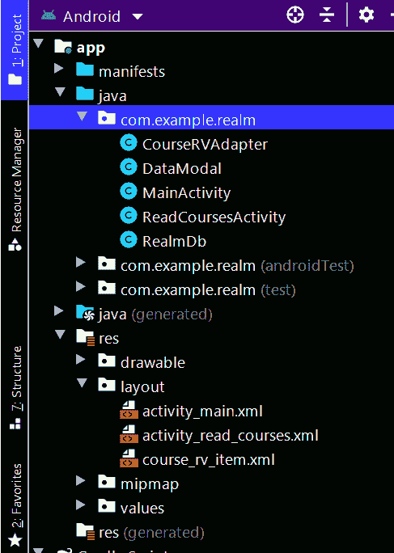

# 如何在安卓中读取领域数据库的数据？

> 原文:[https://www . geesforgeks . org/如何从安卓领域数据库读取数据/](https://www.geeksforgeeks.org/how-to-read-data-from-realm-database-in-android/)

在前一篇文章中，我们已经看到[在安卓](https://www.geeksforgeeks.org/how-to-install-and-add-data-to-realm-database-in-android/)中向领域数据库添加数据。在本文中，我们将看一下**在安卓应用程序中从我们的领域数据库中读取这些数据。**

### 我们将在本文中构建什么？

在本文中，我们将简单地添加一个**按钮**来打开我们在上一篇文章中创建的项目中的一个新活动。在新活动中，我们将以[回收视图](https://www.geeksforgeeks.org/android-recyclerview/)的形式显示数据。下面是视频，我们将在其中看到我们将在本文中构建的内容。

<video class="wp-video-shortcode" id="video-580196-1" width="640" height="360" preload="metadata" controls=""><source type="video/mp4" src="https://media.geeksforgeeks.org/wp-content/uploads/20210319223942/20210319_222916.mp4?_=1">[https://media.geeksforgeeks.org/wp-content/uploads/20210319223942/20210319_222916.mp4](https://media.geeksforgeeks.org/wp-content/uploads/20210319223942/20210319_222916.mp4)</video>

### **分步实施**

**第一步:在应用项目的 build.gradle 文件中添加 google repository。**

> buildscript {
> 
> 存储库{
> 
> 谷歌()
> 
> mavenuentral _)
> 
> }

**所有的 Jetpack 组件都可以在 Google Maven 存储库中找到，包括在 build.gradle 文件中。**

> 所有项目{
> 
> 存储库{
> 
> 谷歌()
> 
> mavenuentral _)
> 
> }
> 
> }

**步骤 2:使用 activity_main.xml 文件**

转到 **activity_main.xml** 文件，添加一个新的 [<u>按钮</u>](https://www.geeksforgeeks.org/button-in-kotlin/) 打开一个新的活动来显示我们的课程列表。

## 可扩展标记语言

```
<!--Button for reading your course to database-->
<Button
  android:id="@+id/idBtnReadData"
  android:layout_width="match_parent"
  android:layout_height="wrap_content"
  android:visibility="visible"
  android:layout_margin="10dp"
  android:text="Read Course Details"
  android:textAllCaps="false" />
```

下面是添加上述代码片段后 **activity_main.xml** 文件的更新代码。

## 可扩展标记语言

```
<?xml version="1.0" encoding="utf-8"?>
<LinearLayout
    xmlns:android="http://schemas.android.com/apk/res/android"
    xmlns:tools="http://schemas.android.com/tools"
    android:layout_width="match_parent"
    android:layout_height="match_parent"
    android:orientation="vertical"
    tools:context=".MainActivity">

    <!--Edit text to enter course name-->
    <EditText
        android:id="@+id/idEdtCourseName"
        android:layout_width="match_parent"
        android:layout_height="wrap_content"
        android:layout_margin="10dp"
        android:hint="Enter course Name" />

    <!--edit text to enter course duration-->
    <EditText
        android:id="@+id/idEdtCourseDuration"
        android:layout_width="match_parent"
        android:layout_height="wrap_content"
        android:layout_margin="10dp"
        android:hint="Enter Course Duration" />

    <!--edit text to display course tracks-->
    <EditText
        android:id="@+id/idEdtCourseTracks"
        android:layout_width="match_parent"
        android:layout_height="wrap_content"
        android:layout_margin="10dp"
        android:hint="Enter Course Tracks" />

    <!--edit text for course description-->
    <EditText
        android:id="@+id/idEdtCourseDescription"
        android:layout_width="match_parent"
        android:layout_height="wrap_content"
        android:layout_margin="10dp"
        android:hint="Enter Course Description" />

    <!--button for adding new course-->
    <Button
        android:id="@+id/idBtnAddCourse"
        android:layout_width="match_parent"
        android:layout_height="wrap_content"
        android:layout_margin="10dp"
        android:text="Add Course"
        android:textAllCaps="false" />

    <!--Button for reading your course to database-->
    <Button
        android:id="@+id/idBtnReadData"
        android:layout_width="match_parent"
        android:layout_height="wrap_content"
        android:layout_margin="10dp"
        android:text="Read Course Details"
        android:textAllCaps="false"
        android:visibility="visible" />

</LinearLayout>
```

**步骤 3:使用 MainActivity.java 文件**

由于我们在 **activity_main.xml** 文件中添加了一个新按钮，因此我们必须在**MainActivity.java**文件中的那个按钮上添加 **setOnClickListener()** 。

## Java 语言(一种计算机语言，尤用于创建网站)

```
readCourseBtn.setOnClickListener(new View.OnClickListener() {
            @Override
            public void onClick(View v) {
                Intent i = new Intent(MainActivity.this, ReadCoursesActivity.class);
                startActivity(i);
        }
});
```

以下是添加上述代码片段后**MainActivity.java**文件的更新代码。

## Java 语言(一种计算机语言，尤用于创建网站)

```
import android.content.Intent;
import android.os.Bundle;
import android.text.TextUtils;
import android.view.View;
import android.widget.Button;
import android.widget.EditText;
import android.widget.Toast;

import androidx.appcompat.app.AppCompatActivity;

import io.realm.Realm;

public class MainActivity extends AppCompatActivity {

    // creating variables for our edit text
    private EditText courseNameEdt, courseDurationEdt, courseDescriptionEdt, courseTracksEdt;
    private Realm realm;
    private Button readCourseBtn;

    // creating a strings for storing
    // our values from edittext fields.
    private String courseName, courseDuration, courseDescription, courseTracks;

    @Override
    protected void onCreate(Bundle savedInstanceState) {
        super.onCreate(savedInstanceState);
        setContentView(R.layout.activity_main);

        // initializing our edittext and buttons
        realm = Realm.getDefaultInstance();
        courseNameEdt = findViewById(R.id.idEdtCourseName);
        courseDescriptionEdt = findViewById(R.id.idEdtCourseDescription);
        courseDurationEdt = findViewById(R.id.idEdtCourseDuration);
        readCourseBtn = findViewById(R.id.idBtnReadData);

        // creating variable for button
        Button submitCourseBtn = findViewById(R.id.idBtnAddCourse);
        courseTracksEdt = findViewById(R.id.idEdtCourseTracks);
        submitCourseBtn.setOnClickListener(new View.OnClickListener() {
            @Override
            public void onClick(View v) {

                // getting data from edittext fields.
                courseName = courseNameEdt.getText().toString();
                courseDescription = courseDescriptionEdt.getText().toString();
                courseDuration = courseDurationEdt.getText().toString();
                courseTracks = courseTracksEdt.getText().toString();

                // validating the text fields if empty or not.
                if (TextUtils.isEmpty(courseName)) {
                    courseNameEdt.setError("Please enter Course Name");
                } else if (TextUtils.isEmpty(courseDescription)) {
                    courseDescriptionEdt.setError("Please enter Course Description");
                } else if (TextUtils.isEmpty(courseDuration)) {
                    courseDurationEdt.setError("Please enter Course Duration");
                } else if (TextUtils.isEmpty(courseTracks)) {
                    courseTracksEdt.setError("Please enter Course Tracks");
                } else {
                    // calling method to add data to Realm database..
                    addDataToDatabase(courseName, courseDescription, courseDuration, courseTracks);
                    Toast.makeText(MainActivity.this, "Course added to database..", Toast.LENGTH_SHORT).show();
                    courseNameEdt.setText("");
                    courseDescriptionEdt.setText("");
                    courseDurationEdt.setText("");
                    courseTracksEdt.setText("");
                }
            }
        });

        readCourseBtn.setOnClickListener(new View.OnClickListener() {
            @Override
            public void onClick(View v) {
                Intent i = new Intent(MainActivity.this, ReadCoursesActivity.class);
                startActivity(i);
            }
        });
    }

    private void addDataToDatabase(String courseName, String courseDescription, String courseDuration, String courseTracks) {

        // on below line we are creating
        // a variable for our modal class.
        DataModal modal = new DataModal();

        // on below line we are getting id for the course which we are storing.
        Number id = realm.where(DataModal.class).max("id");

        // on below line we are
        // creating a variable for our id.
        long nextId;

        // validating if id is null or not.
        if (id == null) {
            // if id is null
            // we are passing it as 1.
            nextId = 1;
        } else {
            // if id is not null then
            // we are incrementing it by 1
            nextId = id.intValue() + 1;
        }
        // on below line we are setting the
        // data entered by user in our modal class.
        modal.setId(nextId);
        modal.setCourseDescription(courseDescription);
        modal.setCourseName(courseName);
        modal.setCourseDuration(courseDuration);
        modal.setCourseTracks(courseTracks);

        // on below line we are calling a method to execute a transaction.
        realm.executeTransaction(new Realm.Transaction() {
            @Override
            public void execute(Realm realm) {
                // inside on execute method we are calling a method
                // to copy to real m database from our modal class.
                realm.copyToRealm(modal);
            }
        });
    }
}
```

**第 4 步:创建一个新的活动来显示我们的课程列表**

要创建新的活动，我们必须导航到**应用程序> java >您的应用程序的包名>右键单击包名>新建>空活动**并将您的活动命名为**readcourses 活动**并创建新的活动。确保选择**空活动**。

**第五步:为我们的回收视图**创建一个新的布局文件

导航至 **app > res >布局>右键点击>新建>布局资源文件**并将其命名为 **course_rv_item** 并添加以下代码。

## 可扩展标记语言

```
<?xml version="1.0" encoding="utf-8"?>
<androidx.cardview.widget.CardView
    xmlns:android="http://schemas.android.com/apk/res/android"
    xmlns:app="http://schemas.android.com/apk/res-auto"
    android:layout_width="match_parent"
    android:layout_height="wrap_content"
    android:layout_margin="5dp"
    android:elevation="8dp"
    app:cardCornerRadius="4dp">

    <LinearLayout
        android:layout_width="match_parent"
        android:layout_height="wrap_content"
        android:layout_margin="3dp"
        android:orientation="vertical">

        <!--text view for our course name-->
        <TextView
            android:id="@+id/idTVCourseName"
            android:layout_width="match_parent"
            android:layout_height="wrap_content"
            android:padding="3dp"
            android:text="Course Name"
            android:textColor="@color/black" />

        <LinearLayout
            android:layout_width="match_parent"
            android:layout_height="wrap_content"
            android:orientation="horizontal"
            android:weightSum="2">

            <!--text view for our course tracks-->
            <TextView
                android:id="@+id/idTVCourseTracks"
                android:layout_width="0dp"
                android:layout_height="wrap_content"
                android:layout_weight="1"
                android:padding="3dp"
                android:text="Course Tracks"
                android:textColor="@color/black" />

            <!--text view for our course duration-->
            <TextView
                android:id="@+id/idTVCourseDuration"
                android:layout_width="0dp"
                android:layout_height="wrap_content"
                android:layout_weight="1"
                android:padding="3dp"
                android:text="Duration"
                android:textColor="@color/black" />

        </LinearLayout>

        <!--text view for our course description-->
        <TextView
            android:id="@+id/idTVCourseDescription"
            android:layout_width="match_parent"
            android:layout_height="wrap_content"
            android:layout_weight="1"
            android:padding="3dp"
            android:text="Description"
            android:textColor="@color/black" />

    </LinearLayout>

</androidx.cardview.widget.CardView>
```

**第 6 步:创建一个适配器类，用于将数据设置到我们的 RecyclerView 项目中**

导航到**应用> java >你的应用的包名>右键点击它>新建> Java 类**并将其命名为 **CourseRVAdapter** 并添加下面的代码。代码中添加了注释，以更详细地理解代码。

## Java 语言(一种计算机语言，尤用于创建网站)

```
import android.content.Context;
import android.view.LayoutInflater;
import android.view.View;
import android.view.ViewGroup;
import android.widget.TextView;

import androidx.annotation.NonNull;
import androidx.recyclerview.widget.RecyclerView;

import java.util.List;

public class CourseRVAdapter extends RecyclerView.Adapter<CourseRVAdapter.ViewHolder> {

    // variable for our array list and context
    private List<DataModal> dataModalArrayList;
    private Context context;

    public CourseRVAdapter(List<DataModal> dataModalArrayList, Context context) {
        this.dataModalArrayList = dataModalArrayList;
        this.context = context;
    }

    @NonNull
    @Override
    public CourseRVAdapter.ViewHolder onCreateViewHolder(@NonNull ViewGroup parent, int viewType) {
        // on below line we are inflating our layout
        // file for our recycler view items.
        View view = LayoutInflater.from(parent.getContext()).inflate(R.layout.course_rv_item, parent, false);
        return new ViewHolder(view);
    }

    @Override
    public void onBindViewHolder(@NonNull CourseRVAdapter.ViewHolder holder, int position) {
        DataModal modal = dataModalArrayList.get(position);
        holder.courseNameTV.setText(modal.getCourseName());
        holder.courseDescTV.setText(modal.getCourseDescription());
        holder.courseDurationTV.setText(modal.getCourseDuration());
        holder.courseTracksTV.setText(modal.getCourseTracks());
    }

    @Override
    public int getItemCount() {
        return dataModalArrayList.size();
    }

    public class ViewHolder extends RecyclerView.ViewHolder {
        // creating variables for our text views.
        private TextView courseNameTV, courseDescTV, courseDurationTV, courseTracksTV;

        public ViewHolder(@NonNull View itemView) {
            super(itemView);
            // initializing our text views
            courseNameTV = itemView.findViewById(R.id.idTVCourseName);
            courseDescTV = itemView.findViewById(R.id.idTVCourseDescription);
            courseDurationTV = itemView.findViewById(R.id.idTVCourseDuration);
            courseTracksTV = itemView.findViewById(R.id.idTVCourseTracks);
        }
    }
}
```

**第 7 步:使用 activity_read_courses.xml 文件**

导航到**应用程序> res >布局>activity _ read _ courses . XML**并将下面的代码添加到该文件中。下面是**活动文件的代码。**

## 可扩展标记语言

```
<?xml version="1.0" encoding="utf-8"?>
<RelativeLayout
    xmlns:android="http://schemas.android.com/apk/res/android"
    xmlns:tools="http://schemas.android.com/tools"
    android:layout_width="match_parent"
    android:layout_height="match_parent"
    tools:context=".ReadCoursesActivity">

    <!--recycler view for displaying list of courses-->
    <androidx.recyclerview.widget.RecyclerView
        android:id="@+id/idRVCourses"
        android:layout_width="match_parent"
        android:layout_height="match_parent" />

</RelativeLayout>
```

**步骤 8:使用 ReadCoursesActivity.java 文件**

导航到**应用程序> java >你的应用程序的包名>ReadCoursesActivity.java**文件，并添加下面的代码。代码中添加了注释，以更详细地理解代码。

## Java 语言(一种计算机语言，尤用于创建网站)

```
import android.os.Bundle;

import androidx.appcompat.app.AppCompatActivity;
import androidx.recyclerview.widget.LinearLayoutManager;
import androidx.recyclerview.widget.RecyclerView;

import java.util.ArrayList;
import java.util.List;

import io.realm.Realm;

public class ReadCoursesActivity extends AppCompatActivity {

    List<DataModal> dataModals;

    // creating variables for realm,
    // recycler view, adapter and our list.
    private Realm realm;
    private RecyclerView coursesRV;
    private CourseRVAdapter courseRVAdapter;

    @Override
    protected void onCreate(Bundle savedInstanceState) {
        super.onCreate(savedInstanceState);
        setContentView(R.layout.activity_read_courses);

        // on below lines we are initializing our variables.
        coursesRV = findViewById(R.id.idRVCourses);
        realm = Realm.getDefaultInstance();
        dataModals = new ArrayList<>();

        // calling a method to load
        // our recycler view with data.
        prepareRecyclerView();
    }

    private void prepareRecyclerView() {
        // on below line we are getting data from realm database in our list.
        dataModals = realm.where(DataModal.class).findAll();
        // on below line we are adding our list to our adapter class.
        courseRVAdapter = new CourseRVAdapter(dataModals, this);
        // on below line we are setting layout manager to our recycler view.
        coursesRV.setLayoutManager(new LinearLayoutManager(this));
        // at last we are setting adapter to our recycler view.
        coursesRV.setAdapter(courseRVAdapter);
    }
}
```

现在运行您的应用程序，并查看应用程序的输出。

**输出:**

<video class="wp-video-shortcode" id="video-580196-2" width="640" height="360" preload="metadata" controls=""><source type="video/mp4" src="https://media.geeksforgeeks.org/wp-content/uploads/20210319223942/20210319_222916.mp4?_=2">[https://media.geeksforgeeks.org/wp-content/uploads/20210319223942/20210319_222916.mp4](https://media.geeksforgeeks.org/wp-content/uploads/20210319223942/20210319_222916.mp4)</video>

**以下是执行读取操作后的完整项目文件结构:**

