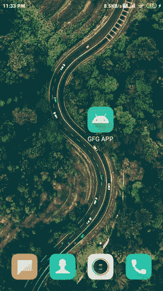

# 如何在安卓系统中使用 CAMView 库读取二维码？

> 原文:[https://www . geesforgeks . org/how-read-QR-code-use-camview-library-in-Android/](https://www.geeksforgeeks.org/how-to-read-qr-code-using-camview-library-in-android/)

**CAMView** Library 是访问用户设备摄像头的简单解决方案。通过使用这个库，我们可以访问用户的相机，并使用来执行相机的许多功能，例如扫描条形码，这些都是通过使用内置的 ZXing 解码引擎来完成的。该库包含一组组件，这些组件已准备好放入您的布局中，以便即时访问如此多的功能。该库处理低级例程，如相机、配置、流、方向等。我们只需要遵循一些基本步骤来使用这个库。

https://www.youtube.com/watch?v=5DEHmN4PmA0

### 重要方法

<figure class="table">

| 

方法

 | 

描述

 |
| --- | --- |
| onScannerStarted() | 当扫描仪启动时，可以使用这种方法。 |
| onScannerStopped() | 扫描仪停止时调用此方法。 |
| onscanneverror _) | 当扫描仪出现错误时，使用这种方法。 |
| onCodeScanned() | 当扫描仪扫描来自相机的数据时，调用此方法。 |

</figure>

## CAMView 库的实现

使用这个库，我们将创建一个简单的二维码扫描应用程序，它将扫描二维码的数据，并将其显示在[文本视图](https://www.geeksforgeeks.org/textview-widget-in-android-using-java-with-examples/)中。下面给出了一个 GIF 示例，来了解一下我们将在本文中做什么。注意，我们将使用 **Java** 语言来实现这个项目。



### 分步实施

**第一步:创建新项目**

要在安卓工作室创建新项目，请参考[如何在安卓工作室创建/启动新项目](https://www.geeksforgeeks.org/android-how-to-create-start-a-new-project-in-android-studio/)。注意选择 **Java** 作为编程语言。

**第二步:添加依赖项进行构建. gradle(模块:app)**

导航到**渐变脚本>构建.渐变(模块:应用)**，并在依赖项部分添加以下依赖项。

> 实现(' eu . livotov . labs . Android:CAMView:2 . 0 . 1 @ AAR '){ transitive = true }

现在同步选项会出现在右上角点击**现在同步**选项。

**第三步:修改 strings.xml 文件**

下面是 **strings.xml** 文件的代码。

## 可扩展标记语言

```
<resources>
    <string name="app_name">GFG APP</string>
    <string name="toggle_flash">Toggle Flash</string>
    <string name="action_settings">Settings</string>
    <string name="scanned_data">Scanned Data</string>
</resources>
```

**第四步:在清单文件**
中添加相机权限我们正在清单文件中添加相机和震动权限。导航到**应用程序>清单**找到**安卓清单. xml** 。下面是 AndroidManifest.xml 的代码片段

## 可扩展标记语言

```
<?xml version="1.0" encoding="utf-8"?>
<manifest xmlns:android="http://schemas.android.com/apk/res/android"
    package="com.gtappdevelopers.camviewlibrary">

    <!--Permission for camera-->
    <uses-permission android:name="android.permission.CAMERA" />
    <!--Permission to vibrate-->
    <uses-permission android:name="android.permission.VIBRATE"/>

    <application
        android:allowBackup="true"
        android:icon="@mipmap/ic_launcher"
        android:label="@string/app_name"
        android:roundIcon="@mipmap/ic_launcher_round"
        android:supportsRtl="true"
        android:theme="@style/Theme.CamViewLibrary">
        <activity android:name=".MainActivity">
            <intent-filter>
                <action android:name="android.intent.action.MAIN" />

                <category android:name="android.intent.category.LAUNCHER" />
            </intent-filter>
        </activity>
    </application>

</manifest>
```

**第 5 步:使用 activity_main.xml 文件**

导航到**应用程序> res >布局> activity_main.xml** 并将下面的代码添加到该文件中。下面是 **activity_main.xml** 文件的代码。

## 可扩展标记语言

```
<?xml version="1.0" encoding="utf-8"?>
<FrameLayout
    xmlns:android="http://schemas.android.com/apk/res/android"
    xmlns:tools="http://schemas.android.com/tools"
    android:layout_width="match_parent"
    android:layout_height="match_parent"
    tools:context=".MainActivity">

    <!--Frame layout is required as we are using camera view-->
    <!--Below is the scannerliveview which will scan QR code-->
    <eu.livotov.labs.android.camview.ScannerLiveView
        android:id="@+id/camview"
        android:layout_width="match_parent"
        android:layout_height="match_parent" />

    <!--TextView to display the scanned data-->
    <TextView
        android:id="@+id/idTVscanned"
        android:layout_width="match_parent"
        android:layout_height="wrap_content"
        android:layout_gravity="bottom"
        android:background="@color/white"
        android:padding="5dp"
        android:text="@string/scanned_data"
        android:textColor="@color/black" />

</FrameLayout>
```

**步骤 6:使用 MainActivity.java 文件**

导航到**应用程序> java >您的应用程序包名称>MainActivity.java**文件。以下是**MainActivity.java**文件的代码。代码中添加了注释，以更详细地理解代码。

## Java 语言(一种计算机语言，尤用于创建网站)

```
import android.content.pm.PackageManager;
import android.os.Bundle;
import android.widget.TextView;
import android.widget.Toast;

import androidx.appcompat.app.AppCompatActivity;
import androidx.core.app.ActivityCompat;
import androidx.core.content.ContextCompat;

import eu.livotov.labs.android.camview.ScannerLiveView;
import eu.livotov.labs.android.camview.scanner.decoder.zxing.ZXDecoder;

import static android.Manifest.permission.CAMERA;
import static android.Manifest.permission.VIBRATE;

public class MainActivity extends AppCompatActivity {
    private ScannerLiveView camera;
    private TextView scannedTV;

    @Override
    protected void onCreate(Bundle savedInstanceState) {
        super.onCreate(savedInstanceState);
        setContentView(R.layout.activity_main);

        // check permission method is to check that the
        // camera permission is granted by user or not.
        // request permission method is to request the
        // camera permission if not given.
        if (checkPermission()) {
            // if permission is already granted display a toast message
            Toast.makeText(this, "Permission Granted..", Toast.LENGTH_SHORT).show();
        } else {
            requestPermission();
        }

        // initialize scannerLiveview and textview.
        scannedTV = findViewById(R.id.idTVscanned);
        camera = (ScannerLiveView) findViewById(R.id.camview);

        camera.setScannerViewEventListener(new ScannerLiveView.ScannerViewEventListener() {
            @Override
            public void onScannerStarted(ScannerLiveView scanner) {
                // method is called when scanner is started
                Toast.makeText(MainActivity.this, "Scanner Started", Toast.LENGTH_SHORT).show();
            }

            @Override
            public void onScannerStopped(ScannerLiveView scanner) {
                // method is called when scanner is stopped.
                Toast.makeText(MainActivity.this, "Scanner Stopped", Toast.LENGTH_SHORT).show();
            }

            @Override
            public void onScannerError(Throwable err) {
                // method is called when scanner gives some error.
                Toast.makeText(MainActivity.this, "Scanner Error: " + err.getMessage(), Toast.LENGTH_SHORT).show();
            }

            @Override
            public void onCodeScanned(String data) {
                // method is called when camera scans the
                // qr code and the data from qr code is
                // stored in data in string format.
                scannedTV.setText(data);
            }
        });
    }

    @Override
    protected void onResume() {
        super.onResume();
        ZXDecoder decoder = new ZXDecoder();
        // 0.5 is the area where we have
        // to place red marker for scanning.
        decoder.setScanAreaPercent(0.8);
        // below method will set secoder to camera.
        camera.setDecoder(decoder);
        camera.startScanner();
    }

    @Override
    protected void onPause() {
        // on app pause the
        // camera will stop scanning.
        camera.stopScanner();
        super.onPause();
    }

    private boolean checkPermission() {
        // here we are checking two permission that is vibrate
        // and camera which is granted by user and not.
        // if permission is granted then we are returning
        // true otherwise false.
        int camera_permission = ContextCompat.checkSelfPermission(getApplicationContext(), CAMERA);
        int vibrate_permission = ContextCompat.checkSelfPermission(getApplicationContext(), VIBRATE);
        return camera_permission == PackageManager.PERMISSION_GRANTED && vibrate_permission == PackageManager.PERMISSION_GRANTED;
    }

    private void requestPermission() {
        // this method is to request
        // the runtime permission.
        int PERMISSION_REQUEST_CODE = 200;
        ActivityCompat.requestPermissions(this, new String[]{CAMERA, VIBRATE}, PERMISSION_REQUEST_CODE);
    }

    @Override
    public void onRequestPermissionsResult(int requestCode, String permissions[], int[] grantResults) {
        // this method is called when user
        // allows the permission to use camera.
        if (grantResults.length > 0) {
            boolean cameraaccepted = grantResults[0] == PackageManager.PERMISSION_GRANTED;
            boolean vibrateaccepted = grantResults[1] == PackageManager.PERMISSION_GRANTED;
            if (cameraaccepted && vibrateaccepted) {
                Toast.makeText(this, "Permission granted..", Toast.LENGTH_SHORT).show();
            } else {
                Toast.makeText(this, "Permission Denined \n You cannot use app without providing permission", Toast.LENGTH_SHORT).show();
            }
        }
    }
}
```

### 输出:在真实设备上运行

现在在一个真实的设备上运行你的应用程序，扫描一些二维码样本，你就可以测试这个应用程序了。**确保在应用启动时允许相机权限。**

<video class="wp-video-shortcode" id="video-525761-1" width="640" height="360" preload="metadata" controls=""><source type="video/mp4" src="https://media.geeksforgeeks.org/wp-content/uploads/20201129233812/Screenrecorder-2020-11-29-23-33-27-447.mp4?_=1">[https://media.geeksforgeeks.org/wp-content/uploads/20201129233812/Screenrecorder-2020-11-29-23-33-27-447.mp4](https://media.geeksforgeeks.org/wp-content/uploads/20201129233812/Screenrecorder-2020-11-29-23-33-27-447.mp4)</video>

**本项目 GitHub 链接:**[https://github.com/ChaitanyaMunje/QR_Code_Scanner](https://github.com/ChaitanyaMunje/QR_Code_Scanner)