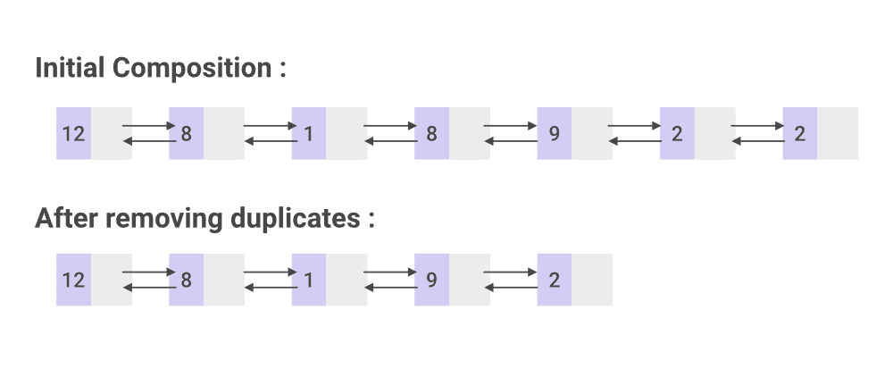

# 如何从 Java LinkedList 中移除重复元素？

> 原文:[https://www . geesforgeks . org/how-to-remove-replicate-elements-from-Java-linked list/](https://www.geeksforgeeks.org/how-to-remove-duplicate-elements-from-java-linkedlist/)

[链表](https://www.geeksforgeeks.org/linked-list-in-java/)是 [java.util 包](https://www.geeksforgeeks.org/java-util-package-java/)中集合的一部分。LinkedList 类是 [LinkedList 数据结构](https://www.geeksforgeeks.org/data-structures/linked-list/)的一个实现，它是一个线性数据结构。在链表中，由于内存的动态分配，插入和删除是很容易的过程。用于从中删除重复项

**示例:**

```
Initial composition : 
7 2 3 3 2 7 6 2 
After removing duplicates : 
7 2 3 6
```

**图示**:(链接列表中的节点有两部分:数据和到下一个节点的链接(最后一个元素为空)



#### **算法:**

1.  最初，创建一个指向头部的新节点。
2.  临时节点将指向当前，索引节点将指向当前。
3.  如果索引节点和当前节点的数据相同，即如果发现重复的元素，则 temp.next 指向 index.next，即跳过重复的元素。
4.  如果不满足上述条件，则使 temp 指向索引的前一个节点。
5.  索引节点迭代直到结束，重复步骤 3 和 4。
6.  执行步骤 2 至 5，直到当前节点指向终点，即到达终点。

下面是上述方法的实现:

## Java 语言(一种计算机语言，尤用于创建网站)

```
// Java Program to Remove Duplicate Elements From LinkedList
import java.io.*;

// Creating the node class for a singly linkedlist
class Node {
    Node next;
    int data;

    public Node(int data)
    {
        this.data = data;
        this.next = null;
    }
}

public class singlyLinkedList {

    // Defining the head and tail of a singly linkedlist
    public Node head = null;
    public Node tail = null;

    // creating add() that enables addition
    // of a new node to the list
    public void add(int data)
    {
        // Creating a new node
        Node newNode = new Node(data);

        // Checking whether the list is empty or not
        if (head == null) {
            // If the list is found to be empty, both head
            // and tail are made to point to  the new node
            head = newNode;
            tail = newNode;
        }
        else {
            // newNode is added after tail in such a way
            // that next node of the tail points to newNode
            tail.next = newNode;
            // newNode becomes the new tail of the list
            tail = newNode;
        }
    }

    // Creating removeDuplicates() to remove
    // duplicates from the linkedlist
    public void removeDuplicates()
    {
        // current node points to the head element
        Node current = head, index = null, temp = null;

        if (head == null) {
            return;
        }
        else {
            while (current != null) {
                // temp node points to the previous node
                temp = current;
                // index node points to node next to current
                index = current.next;

                while (index != null) {
                    // checking if node of current data is
                    // equal to index node data
                    if (current.data == index.data) {

                        // duplicate node is skipped
                        temp.next = index.next;
                    }
                    else {
                        // temp node points to the previous
                        // node of index node
                        temp = index;
                    }
                    index = index.next;
                }
                current = current.next;
            }
        }
    }

    // creating print() to print all the data
    // of nodes present in the list
    public void print()
    {
        // Node current will point to head
        Node current = head;
        if (head == null) {
            System.out.println(
                "Empty list please insert some elements first");
            return;
        }
        while (current != null) {

            System.out.print(current.data + " ");
            // incrementing pointer
            current = current.next;
        }
        System.out.println();
    }

    public static void main(String[] args)
    {

        singlyLinkedList List = new singlyLinkedList();

        // Adding data to the list
        List.add(9);
        List.add(1);
        List.add(1);
        List.add(3);
        List.add(4);
        List.add(8);
        List.add(2);
        List.add(1);

        System.out.println("Initial composition : ");
        List.print();

        // removing duplicate nodes
        List.removeDuplicates();

        System.out.println("After removing duplicates : ");
        List.print();
    }
}
```

**Output**

```
Initial composition : 
9 1 1 3 4 8 2 1 
After removing duplicates : 
9 1 3 4 8 2 

```

时间复杂度:O(N <sup>2</sup> )