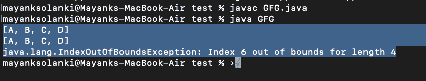

# 如何替换 Java 数组列表中的一个元素？

> 原文:[https://www . geesforgeks . org/如何替换 java 中的元素-arraylist/](https://www.geeksforgeeks.org/how-to-replace-a-element-in-java-arraylist/)

要替换 Java 数组列表中的元素，可以使用 **java.util.** 的 **set()** 方法来替换数组列表类。set()方法接受两个参数——需要替换的元素的索引和新元素。数组列表的索引是从零开始的。因此，要替换第一个元素，0 应该是作为参数传递的索引。

**申报:**

```
public Object set(int index, Object element)
```

**返回值:**位于指定索引处的元素

**异常抛出:**[**indexout of boundsexception**](https://www.geeksforgeeks.org/understanding-array-indexoutofbounds-exception-in-java/) **当指数超出范围时，就会出现这种情况。**

```
index < 0 or index >= size()
```

****实施:****

**在这里，我们将提出两个例子，其中一个例子中，我们将设置范围内的索引，另一个例子中，我们将设置范围外的索引。**

****示例 1:** 其中索引在界限内**

## **Java 语言(一种计算机语言，尤用于创建网站)**

```
// Java program to demonstrate set() Method of ArrayList
// Where Index is Within Bound

// Importing required classes
import java.io.*;
import java.util.*;

// Main class
class GFG {

  // Main driver method
  public static void main(String[] args) {

    // Try block to check for exceptions
    try {

      // Creating an object of Arraylist class
      ArrayList<String> list = new ArrayList<>();

      // Adding elements to the List
      // using add() method

      // Custom input elements
      list.add("A");
      list.add("B");
      list.add("C");
      list.add("D");

      // Print all the elements added in the above object
      System.out.println(list);

      // 2 is the index of the element "C".
      //"C" will be replaced by "E"
      list.set(2, "E");

      // Printing the newly updated List
      System.out.println(list);

    }

    // Catch block to handle the exceptions
    catch (Exception e) {

      // Display the exception on the console
      System.out.println(e);
    }
  }
}
```

****Output**

```
[A, B, C, D]
[A, B, E, D]

```** 

****示例 2:** 其中索引超出界限**

## **Java 语言(一种计算机语言，尤用于创建网站)**

```
// Java program to demonstrate set() Method of ArrayList
// Where Index is Out of Bound

// Importing required classes
import java.io.*;
import java.util.*;

// Main class
class GFG {

  // Main driver method
  public static void main(String[] args) {

    // Try block to check for exceptions
    try {

      // Creating an object of Arraylist class
      ArrayList<String> list = new ArrayList<>();

      // Adding elements to the List
      // using add() method

      // Custom input elements
      list.add("A");
      list.add("B");å
      list.add("C");
      list.add("D");

      // Print all the elements added in the above object
      System.out.println(list);

      // Settijg the element at the 6 th index which
      // does not exist in our input list object
      list.set(6);

      // Printing the newly updated List
      System.out.println(list);
    }

    // Catch block to handle the exceptions
    catch (Exception e) {

      // Display the exception on the console
      System.out.println(e);
    }
  }
}
```

****输出:****

****