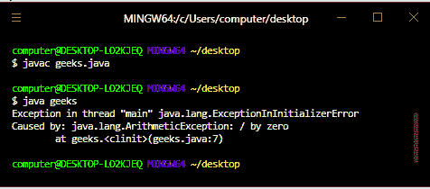
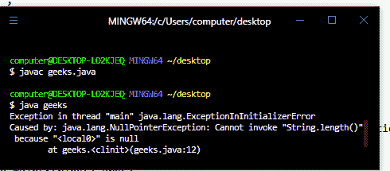

# 如何解析 Java 中的 Java . lang . exceptioniniinitializerererror？

> 原文:[https://www . geesforgeks . org/how-resolve-Java-lang-exceptioniniinitializererror-in-Java/](https://www.geeksforgeeks.org/how-to-resolve-java-lang-exceptionininitializererror-in-java/)

扰乱程序正常流程的未被接受的、不需要的事件称为异常。

Java 中的异常主要有两种[类型:](https://www.geeksforgeeks.org/types-of-exception-in-java-with-examples/)

1.选中异常

2.未检查的异常

ExceptionInInitializerError 是错误类的子类，因此它是一个未检查的异常。当 JVM 试图加载一个新类时， [JVM](https://www.geeksforgeeks.org/jvm-works-jvm-architecture/) 会自动引发这个异常，因为在类加载期间，所有静态变量和静态初始化程序块 都在被评估。这个异常还充当一个信号，告诉我们在静态初始化器块中或者在静态变量的赋值中发生了意外的异常。

在 Java 程序中可能出现异常初始化错误的情况基本上有两种:

**1。为静态变量赋值时出现异常初始化错误**

在下面的例子中，我们将一个静态变量赋值为 20/0，其中 20/0 给出了一个未定义的算术行为，因此在[静态变量](https://www.geeksforgeeks.org/static-keyword-java/)赋值中出现了一个异常，最终我们将得到 ExceptionInInitializerError。

## Java 语言(一种计算机语言，尤用于创建网站)

```
// Java Program for showing the ExceptionInInitializerError
// While Assigning Value To The Static Variable
class GFG {
    // assignment of static variable
    static int x = 20 / 0;
    public static void main(String[] args)
    {
        // printing the value of x
        System.out.println("The value of x is " + x);
    }
}
```



**2。在静态块内分配空值时出现异常初始化错误**

在下面的例子中，我们已经声明了一个静态块，在其中我们创建了一个字符串 s，并为其分配了一个空值，然后我们正在打印字符串的长度，因此我们将获得[NullPointRexception](https://www.geeksforgeeks.org/null-pointer-exception-in-java/)，因为我们试图打印一个值为空的字符串的长度，并且我们看到这个异常发生在静态块中，因此我们将获得 ExceptionInInitializerError。

## Java 语言(一种计算机语言，尤用于创建网站)

```
// Java Program for showing the ExceptionInInitializerError
// While Assigning Null Value Inside A Static Block
class GFG {
    // declaring a static initializer  block
    static
    {
        // creating a string and assigning a null value to
        // it
        String s = null;
        // printing the length of string but as the string
        // is null so an exception occur in the static block
        System.out.println(s.length());
    }
    public static void main(String[] args)
    {
        System.out.println("GeeksForGeeks Is Best");
    }
}
```



**如何解析 Java . lang . exceptioninializerererror？**

*   我们可以通过确保类的静态初始值设定项块不会引发任何运行时异常来解决 Java . lang . exceptioniniinitializer 错误。
*   我们还可以通过确保初始化类的静态变量也不会引发任何运行时异常来解决这个异常。