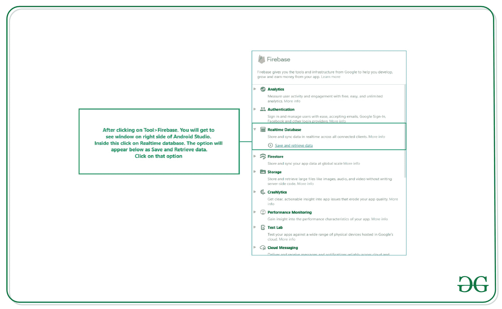
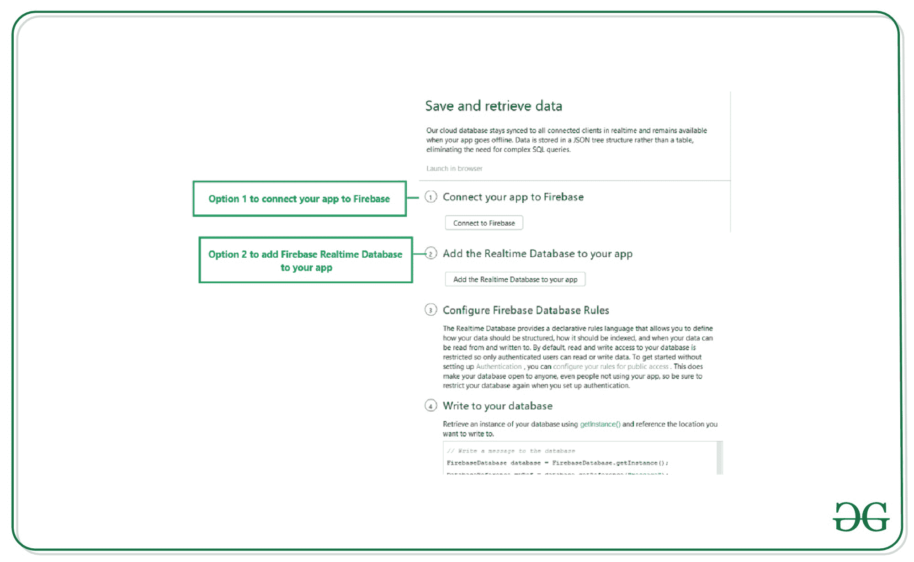
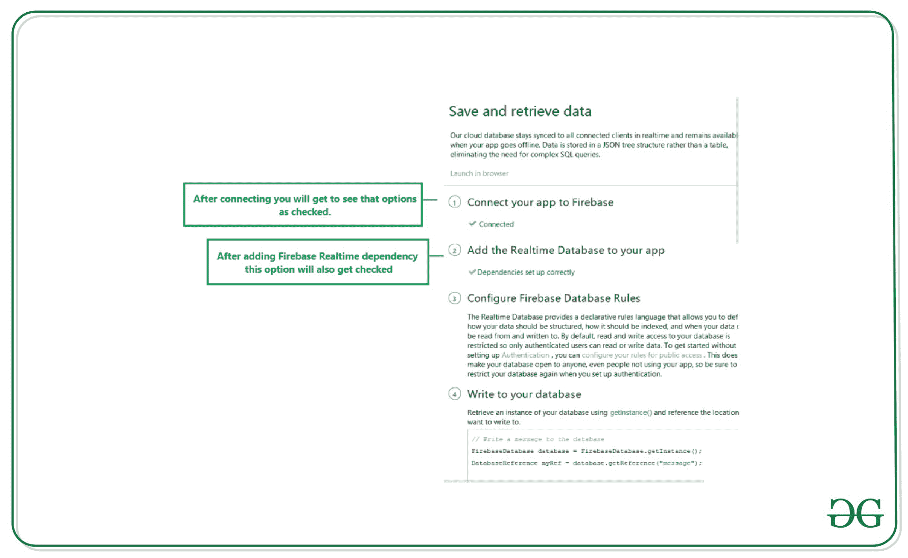
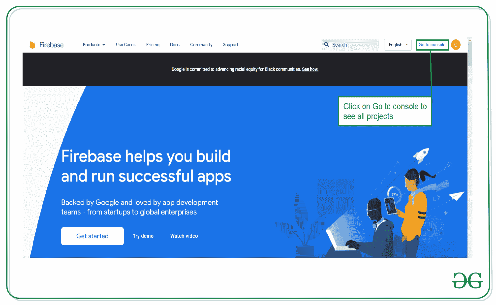
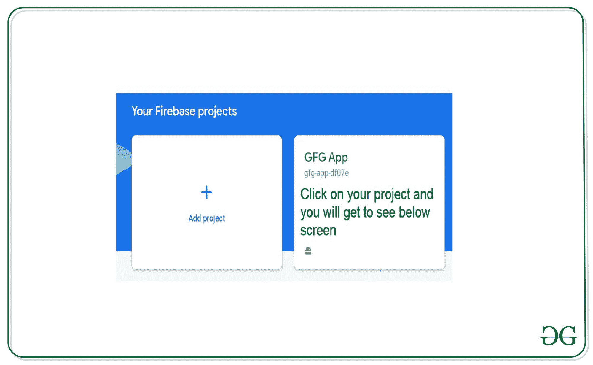
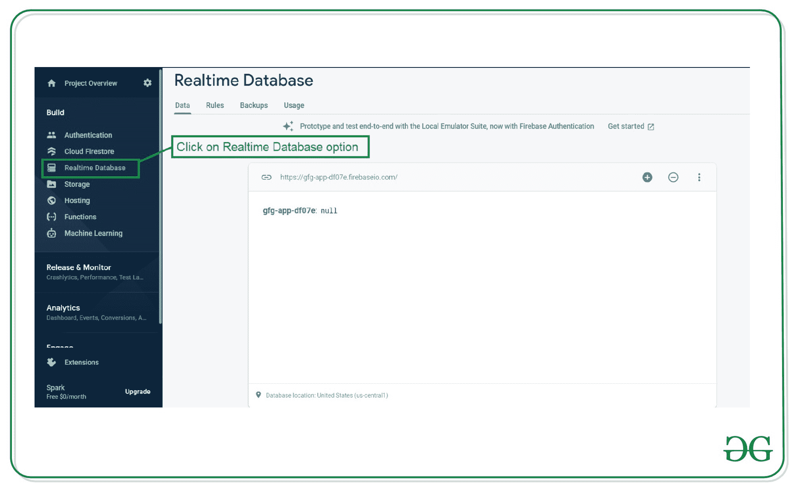
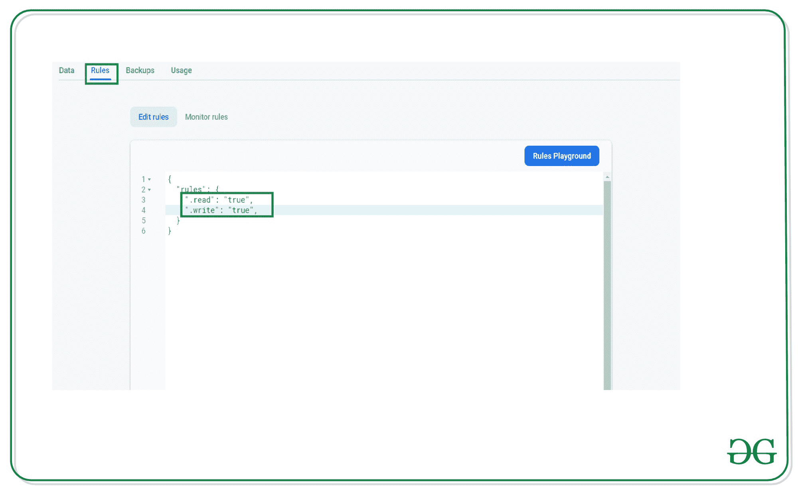
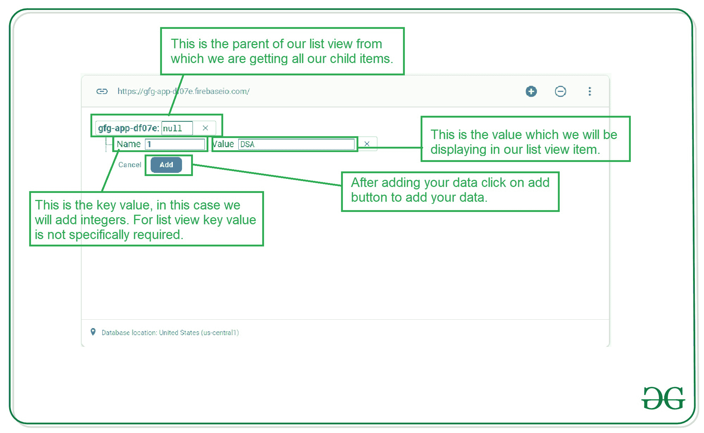
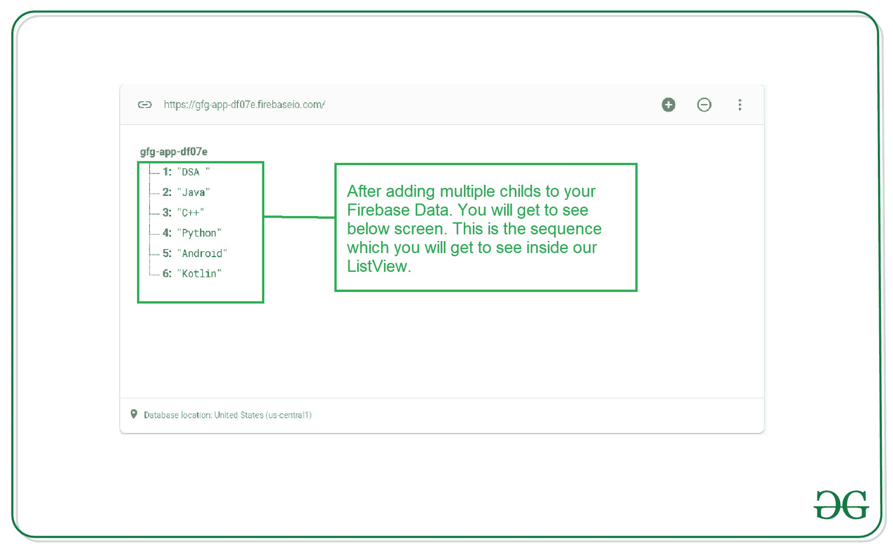

# 如何在安卓 ListView 中从 Firebase 实时数据库中检索数据？

> 原文:[https://www . geeksforgeeks . org/如何从 firebase-real-database-in-Android-listview 检索数据/](https://www.geeksforgeeks.org/how-to-retrieve-data-from-firebase-realtime-database-in-android-listview/)

[Firebase 实时数据库](https://www.geeksforgeeks.org/firebase-realtime-database-with-operations-in-android-with-examples/)为我们提供了一个功能，可以在几毫秒内对应用程序中的数据进行实时更新。借助 [Firebase](https://www.geeksforgeeks.org/firebase-introduction/) ，您可以为用户提供实时更新。在本文中，我们将看一下 Firebase 实时数据库在安卓系统中的实现。在这个列表视图中，我们将能够实时添加和删除列表项。让我们继续在列表视图中实现我们的 Firebase 实时数据库。

### 我们将在本文中构建什么？

我们将创建一个简单的应用程序，其中我们将创建一个列表视图，在该列表视图中，我们将从 Firebase 实时数据库中获取数据。从 Firebase 我们可以根据我们的要求更新或删除我们的列表项目，数据将实时更新。注意，我们将使用 **Java** 语言来实现这个项目。

### **分步实施**

**第一步:创建新项目**

要在安卓工作室创建新项目，请参考[如何在安卓工作室创建/启动新项目](https://www.geeksforgeeks.org/android-how-to-create-start-a-new-project-in-android-studio/)。注意选择 **Java** 作为编程语言。

**第二步:将你的应用连接到 Firebase**

创建新项目后。导航到顶部栏上的工具选项。点击火焰基地。点击 Firebase 后，你可以看到截图中下面提到的右栏。



在该列中，导航到 Firebase 实时数据库。点击那个选项，你会看到两个选项:连接应用程序到 Firebase 和添加 Firebase 实时数据库到你的应用程序。单击立即连接，您的应用程序将连接到 Firebase。之后点击第二个选项，现在你的应用程序连接到 Firebase。



完成此过程后，您将看到下面的屏幕。



现在验证您的应用程序是否连接到 Firebase。转到您的 build.gradle 文件。导航到**应用程序>渐变脚本>构建.渐变**文件，并确保以下依赖项已添加到您的依赖项部分。

> 实现' com . Google . firebase:firebase-数据库:19.6.0 '

如果上述依赖项没有添加到您的依赖项部分。添加此依赖项并同步您的项目。现在，我们将转向应用程序的 XML 部分。

**步骤 3:使用 activity_main.xml 文件**

转到 **activity_main.xml** 文件，参考以下代码。下面是 **activity_main.xml** 文件的代码。

## 可扩展标记语言

```java
<?xml version="1.0" encoding="utf-8"?>
<RelativeLayout 
    xmlns:android="http://schemas.android.com/apk/res/android"
    xmlns:tools="http://schemas.android.com/tools"
    android:layout_width="match_parent"
    android:layout_height="match_parent"
    tools:context=".MainActivity">

    <!--ListView for displaying 
        our list of courses-->
    <ListView
        android:id="@+id/idLVCourses"
        android:layout_width="match_parent"
        android:layout_height="match_parent" />

</RelativeLayout>
```

**第四步:在你的 AndroidManifest.xml 文件**中添加互联网权限

在 AndroidManifest.xml 文件中添加互联网权限。

## 可扩展标记语言

```java
<uses-permission android:name="android.permission.INTERNET" />
<uses-permission android:name="android.permission.ACCESS_NETWORK_STATE" />
```

**步骤 5:使用 MainActivity.java 文件**

转到**MainActivity.java**文件，参考以下代码。以下是**MainActivity.java**文件的代码。代码中添加了注释，以更详细地理解代码。

## Java 语言(一种计算机语言，尤用于创建网站)

```java
import android.os.Bundle;
import android.widget.ArrayAdapter;
import android.widget.ListView;

import androidx.annotation.NonNull;
import androidx.annotation.Nullable;
import androidx.appcompat.app.AppCompatActivity;

import com.google.firebase.database.ChildEventListener;
import com.google.firebase.database.DataSnapshot;
import com.google.firebase.database.DatabaseError;
import com.google.firebase.database.DatabaseReference;
import com.google.firebase.database.FirebaseDatabase;

import java.util.ArrayList;

public class MainActivity extends AppCompatActivity {

    // creating variables for our list view.
    private ListView coursesLV;

    // creating a new array list.
    ArrayList<String> coursesArrayList;

    // creating a variable for database reference.
    DatabaseReference reference;

    @Override
    protected void onCreate(Bundle savedInstanceState) {
        super.onCreate(savedInstanceState);
        setContentView(R.layout.activity_main);

        // initializing variables for listviews.
        coursesLV = findViewById(R.id.idLVCourses);

        // initializing our array list
        coursesArrayList = new ArrayList<String>();

        // calling a method to get data from
        // Firebase and set data to list view
        initializeListView();
    }

    private void initializeListView() {
        // creating a new array adapter for our list view.
        final ArrayAdapter<String> adapter = new ArrayAdapter<String>(this, android.R.layout.simple_dropdown_item_1line, coursesArrayList);

        // below line is used for getting reference
        // of our Firebase Database.
        reference = FirebaseDatabase.getInstance().getReference();

        // in below line we are calling method for add child event 
        // listener to get the child of our database.
        reference.addChildEventListener(new ChildEventListener() {
            @Override
            public void onChildAdded(@NonNull DataSnapshot snapshot, @Nullable String previousChildName) {
                // this method is called when new child is added to 
                // our data base and after adding new child
                // we are adding that item inside our array list and
                // notifying our adapter that the data in adapter is changed.
                coursesArrayList.add(snapshot.getValue(String.class));
                adapter.notifyDataSetChanged();
            }

            @Override
            public void onChildChanged(@NonNull DataSnapshot snapshot, @Nullable String previousChildName) {
                // this method is called when the new child is added.
                // when the new child is added to our list we will be 
                // notifying our adapter that data has changed.
                adapter.notifyDataSetChanged();
            }

            @Override
            public void onChildRemoved(@NonNull DataSnapshot snapshot) {
                // below method is called when we remove a child from our database.
                // inside this method we are removing the child from our array list 
                // by comparing with it's value.
                // after removing the data we are notifying our adapter that the 
                // data has been changed.
                coursesArrayList.remove(snapshot.getValue(String.class));
                adapter.notifyDataSetChanged();
            }

            @Override
            public void onChildMoved(@NonNull DataSnapshot snapshot, @Nullable String previousChildName) {
                // this method is called when we move our 
                // child in our database.
                // in our code we are note moving any child.
            }

            @Override
            public void onCancelled(@NonNull DatabaseError error) {
                // this method is called when we get any 
                // error from Firebase with error.
            }
        });
        // below line is used for setting 
        // an adapter to our list view.
        coursesLV.setAdapter(adapter);
    }
}
```

将此代码添加到您的应用程序后。现在转到 [Firebase](https://firebase.google.com/) ，点击右上角的转到控制台选项。



点击此屏幕后，您将看到下面的屏幕，其中包含您选择项目的所有项目。



在该屏幕中，单击左侧窗口中的实时数据库。



点击此选项后，您将看到右侧的屏幕。在此页面上，单击顶部栏中的规则选项。你会看到下面的屏幕。



在这个项目中，我们将我们的规则作为读写规则添加，因为我们不使用任何身份验证来验证我们的用户。因此，我们目前将其设置为 true 以测试我们的应用程序。改变规则后。点击右上角的发布按钮，您的规则将保存在那里。现在再次回到数据选项卡。现在，我们将从 Firebase 本身手动向 Firebase 添加数据。

**第六步:在 Firebase 控制台**添加数据

在 Firebase 数据库中，我们将看到的父节点是一个父节点。在这个父项中，我们必须添加子项。这个子项目将显示在我们的列表视图中。我们将在数据库中添加新的子项目。为我们的列表视图添加数据。我们只需点击右侧的“+”选项来添加一个项目，然后将该项目添加到我们的数据库中。以类似的方式向数据库添加多个项目。这些项目将显示在我们的列表视图中。



上面提到的是你将会知道如何在你的列表视图中添加一个项目的图片。同样，在数据库中添加多个项目，您将看到下面的屏幕。



添加这些数据后，运行您的应用程序并查看应用程序的输出。运行应用程序后，更新 Firebase 中的数据。您可以添加、删除任何子节点或更新任何子节点，您将在列表视图中看到实时更新。

### 输出:

<video class="wp-video-shortcode" id="video-538691-1" width="640" height="360" preload="metadata" controls=""><source type="video/mp4" src="https://media.geeksforgeeks.org/wp-content/uploads/20201230185845/Screenrecorder-2020-12-30-18-56-23-138.mp4?_=1">[https://media.geeksforgeeks.org/wp-content/uploads/20201230185845/Screenrecorder-2020-12-30-18-56-23-138.mp4](https://media.geeksforgeeks.org/wp-content/uploads/20201230185845/Screenrecorder-2020-12-30-18-56-23-138.mp4)</video>