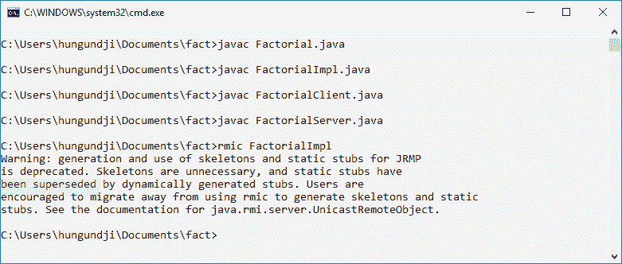
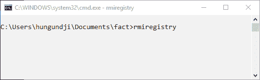
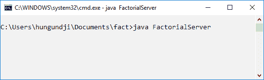
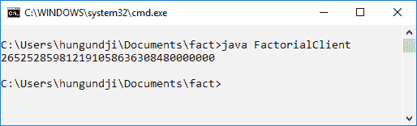

# 如何运行 Java RMI 应用程序

> 原文:[https://www . geesforgeks . org/how-run-Java-RMI-application/](https://www.geeksforgeeks.org/how-to-run-java-rmi-application/)

**先决条件:** [**RMI**](https://www.geeksforgeeks.org/remote-method-invocation-in-java/)

**RMI(远程方法调用)**用于分布式对象引用系统。分布式对象是在其他机器上发布其接口的对象。远程对象是一个分布式对象，其状态被封装。存根和框架是用于与远程对象通信的两个对象。

**Stub:** Stub 是客户端程序的网关，用于通过在它们之间建立连接来与骨架对象进行通信。

**骨架:**驻留在服务器程序上，用于将请求从存根传递到远程接口。

### 马绍尔群岛如何进行交流和处理:


### 在控制台中运行 Java RMI 应用程序的步骤

1.  **为问题陈述**创建类和接口:涉及的步骤如下:
    *   **Create a Remote Interface which extends java.rmi.Remote**:

        远程接口决定了客户端可以远程调用的对象。这个接口可以与客户的程序通信。该接口必须扩展 **java.rmi.Remote** 接口。

        ***问题陈述:*** 创建一个 RMI 应用程序来寻找一个数的阶乘

        ## 接口程序

        ```java
        import java.math.BigInteger;

        // Creating an Interface
        public interface Factorial
            extends java.rmi.Remote {

            // Declaring the method
            public BigInteger fact(int num)
                throws java.rmi.RemoteException;
        }
        ```

    *   **Create a class which extends java.rmi.server.UnicastRemoteObject and implements the previous interface.**

        这个类将实现远程接口。对问题陈述进行必要的计算。

        ## 接口的实现

        ```java
        import java.math.BigInteger;

        // Extends and Implement the class
        // and interface respectively
        public class FactorialImpl
            extends java.rmi.server.UnicastRemoteObject
            implements Factorial {

            // Constructor Declaration
            public FactorialImpl()
                throws java.rmi.RemoteException
            {
                super();
            }

            // Calculation for the problem statement
            // Implementing the method fact()
            // to find factorial of a number
            public BigInteger fact(int num)
                throws java.rmi.RemoteException
            {
                BigInteger factorial = BigInteger.ONE;

                for (int i = 1; i <= num; ++i) {
                    factorial = factorial
                                    .multiply(
                                        BigInteger
                                            .valueOf(i));
                }
                return factorial;
            }
        }
        ```

    *   **Create a Server Class (with localhost and service name)**

        为了托管服务，创建了服务器程序，由此可以调用 java.rmi.Naming.rebind()方法，该方法采用两个参数，即对象引用(服务名)和实例引用。

        ## 服务器程序

        ```java
        import java.rmi.Naming;

        public class FactorialServer {

            // Implement the constructor of the class
            public FactorialServer()
            {
                try {
                    // Create a object reference for the interface
                    Factorial c = new FactorialImpl();

                    // Bind the localhost with the service
                    Naming.rebind("rmi:// localhost/FactorialService", c);
                }
                catch (Exception e) {
                    // If any error occur
                    System.out.println("ERR: " + e);
                }
            }

            public static void main(String[] args)
            {
                // Create an object
                new FactorialServer();
            }
        }
        ```

    *   **Create a Client Class (with localhost and service name)**

        客户端程序将为 RMI URL 调用 java.rmi.Naming.lookup()方法，并返回一个对象类型的实例(阶乘接口)。所有的 RMI 都是在这个对象上完成的

        ## 客户程序

        ```java
        import java.net.MalformedURLException;
        import java.rmi.Naming;
        import java.rmi.NotBoundException;
        import java.rmi.RemoteException;

        public class FactorialClient {
            public static void main(String[] args)
            {

                try {
                    // Create an remote object with the same name
                    // Cast the lookup result to the interface
                    Factorial c = (Factorial);
                    Naming.lookup("rmi:// localhost/FactorialService");

                    // Call the method for the results
                    System.out.println(c.fact(30));
                }

                // If any error occur
                catch (MalformedURLException murle) {
                    System.out.println("\nMalformedURLException: "
                                       + murle);
                }

                catch (RemoteException re) {
                    System.out.println("\nRemoteException: "
                                       + re);
                }

                catch (NotBoundException nbe) {
                    System.out.println("\nNotBoundException: "
                                       + nbe);
                }

                catch (java.lang.ArithmeticException ae) {
                    System.out.println("\nArithmeticException: " + ae);
                }
            }
        }
        ```

2.  **Compilation of all program**

    使用 javac 编译所有四个程序，使用 rmic (RMI 编译器)创建一个存根和框架类文件。

    

3.  **Running the system:**

    在编译阶段之后，系统现在可以运行了。要运行系统，请打开三个控制台屏幕(移动到程序所在的路径)。一个用于客户端，一个用于服务器，一个用于 RMI 注册表。

    *   Start with a registry, use **`rmiregistry`**, if there is no error registry will start running and now move to second screen.

        

    *   In the second console run the server program and host the FactorialService. It will start and wait for the client connection and it will load the implementation into memory.

        

    *   In the third console, run the client program.

        

这样，RMI 可以在本地主机三个控制台中运行。RMI 使用网络栈和 TCP/IP 栈进行三个不同 JVM 的通信。