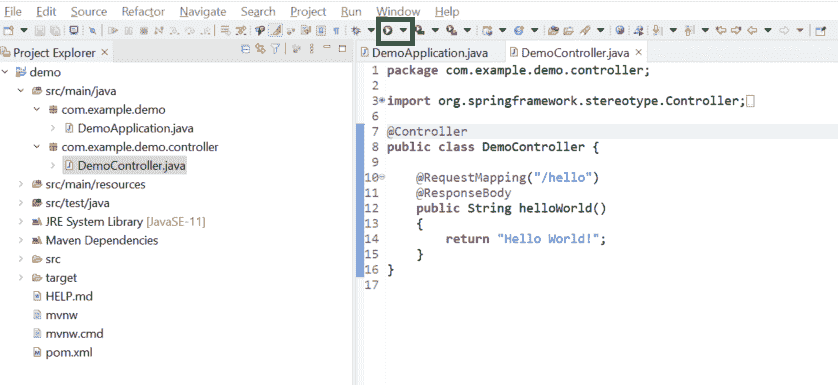
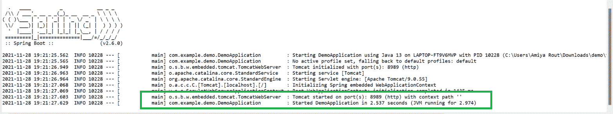
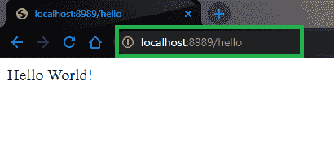

# 如何运行 Spring Boot 应用？

> 原文:[https://www . geesforgeks . org/how-run-spring-boot-application/](https://www.geeksforgeeks.org/how-to-run-spring-boot-application/)

Spring Boot 建在春天的顶端，包含了春天的所有特征。由于其快速的生产就绪环境，开发人员能够直接专注于逻辑，而不是纠结于配置和设置，因此正成为开发人员的最爱。Spring Boot 是一个基于微服务的框架，在其中制作一个生产就绪的应用程序只需要很少的时间。以下是 Spring Boot 的一些特色:

*   它允许避免春季出现的 XML 的繁重配置
*   它提供了 REST 端点的简单维护和创建
*   它包括嵌入式 Tomcat 服务器
*   部署非常容易，war 和 jar 文件可以很容易地部署在 tomcat 服务器中

更多信息请参考本文:[Spring Boot 简介](https://www.geeksforgeeks.org/introduction-to-spring-boot/)

一般来说，要开发一个 Spring Boot 应用程序，我们选择 **Eclipse、Spring Tool Suite** 、**T3】和 **IntelliJ IDEA** IDE。因此，在本文中，我们将在这 3 个 IDEs 中运行我们的应用程序。**

### 在 Eclipse 集成开发环境中运行 Spring Boot 应用程序

Eclipse IDE 以 Java 集成开发环境(IDE)而闻名，但是它有许多非常酷的 IDE，包括 C/C++ IDE、JavaScript/TypeScript IDE、PHP IDE 等等。

**分步实施:**

1.  创建和设置 Spring Boot 项目。
2.  在您的 [pom.xml](https://www.geeksforgeeks.org/page-object-model-pom/) 文件中添加 spring-web 依赖项。
3.  创建一个包并将该包命名为“控制器”
4.  运行 Spring Boot 应用程序

**步骤 1:** 在 Eclipse IDE 中创建和设置 Spring Boot 项目

一个人应该知道如何在 Eclipse IDE 中[创建和](https://www.geeksforgeeks.org/how-to-create-and-setup-spring-boot-project-in-eclipse-ide/)设置 [Spring Boot 项目，并在 **Eclipse IDE 中创建你的第一个 Spring Boot 应用程序。**](https://www.geeksforgeeks.org/how-to-create-and-setup-spring-boot-project-in-eclipse-ide/)

**步骤 2:** 在您的 [pom.xml](https://www.geeksforgeeks.org/page-object-model-pom/) 文件中添加 spring-web 依赖项。转到项目内部的 pom.xml 文件，并添加以下 spring-web 依赖项。

## 可扩展标记语言

```
<dependency>
    <groupId>org.springframework.boot</groupId>
    <artifactId>spring-boot-starter-web</artifactId>
</dependency>
```

**步骤 3:** 在您的项目中创建一个包，并将该包命名为“控制器”。在控制器包中创建一个类，并将其命名为**演示控制器**。以下是**DemoController.java**文件的代码。

## Java 语言(一种计算机语言，尤用于创建网站)

```
package com.example.demo.controller;

import org.springframework.stereotype.Controller;
import org.springframework.web.bind.annotation.RequestMapping;
import org.springframework.web.bind.annotation.ResponseBody;

@Controller
public class DemoController {

    @RequestMapping("/hello")
    @ResponseBody
    public String helloWorld()
    {
        return "Hello World!";
    }
}
```

我们已经在我们的控制器层中使用了下面的注释。在这个例子中，URI 路径是***/你好*** 。

*   **@控制器:**用于指定控制器。
*   **@RequestMapping:** 这是用来映射到 Spring MVC 控制器的方法。
*   **@ResponseBody:** 用于将 HTTP 响应体与返回类型中的域对象绑定。

现在，我们的控制器准备好了。让我们在 DemoApplication.java 文件中运行我们的应用程序。没有必要更改**DemoApplication.java**文件中的任何内容。

## Java 语言(一种计算机语言，尤用于创建网站)

```
package com.example.demo;

import org.springframework.boot.SpringApplication;
import org.springframework.boot.autoconfigure.SpringBootApplication;

@SpringBootApplication
public class DemoApplication {

    public static void main(String[] args) {
        SpringApplication.run(DemoApplication.class, args);
    }

}
```

**步骤 4:** 运行 Spring Boot 应用程序

要运行应用程序，请点击**绿色图标**，如下图所示。



成功运行应用程序后，您可以看到控制台，如下图所示。您的 Tomcat 服务器在端口 **8989** 上启动。



试试这个运行在 ***上的 Tomcat URL http://localhost:8989/hello***



**在 IntelliJ IDEA 中运行 Spring Boot 应用程序**

**IntelliJ IDEA** 是用 Java 编写的集成开发环境(IDE)。它用于开发计算机软件。这个 IDE 是由 Jetbrains 开发的，有 Apache 2 授权社区版和商业版。这是一个智能的、上下文感知的集成开发环境，用于在各种应用程序中使用 Java 和其他 JVM 语言，如 Kotlin、Scala 和 Groovy。此外，IntelliJ IDEA Ultimate 可以帮助您开发全栈网络应用程序，这得益于其强大的集成工具、对 JavaScript 和相关技术的支持，以及对流行框架(如 Spring、Spring Boot、Jakarta EE、Micronaut、Quarkus、Helidon)的高级支持。因此，在本文中，我们将讨论如何在 IntelliJ IDEA 中运行您的第一个春季启动应用程序。

> **先决条件:**在系统中下载并安装 IntelliJ IDEA。请参考本文[安装 IntelliJ IDEA 的分步指南](https://www.geeksforgeeks.org/step-by-step-guide-to-install-intellij-idea/)在您的系统中安装 Intellij Idea。

**程序:**

1.  创建和设置 Spring Boot 项目
2.  创建或导入名为 Application.java 的 spring boot 项目
3.  运行 Spring Boot 应用程序
4.  [Tomcat 服务器](https://www.geeksforgeeks.org/difference-between-apache-tomcat-server-and-apache-web-server/)将启动。
5.  再次重新运行应用程序

**步骤 1:** 在 IntelliJ IDEA 中创建并设置 Spring Boot 项目

您可以参考这篇文章如何在 IntelliJ IDEA 中创建和设置 Spring Boot 项目，并在 IntelliJ IDEA 中创建您的第一个 Spring Boot 应用程序。

**步骤 2:** 成功创建或导入 spring boot 项目后，将自动创建一个名为**Application.java(Herre demo application**)的文件，这是您的入口点。您可以将其视为 Spring Boot 应用程序的**主要方法。**


**步骤 3:** 运行 Spring Boot 应用程序

**方法 1:** 要立即运行此应用程序**右键单击 Application.java>运行“demo application . main()”**如下图所示。或者您可以键入快捷键组合( **Ctrl + Shift + F10** )来运行应用程序。


**方法二:**直接点击下图所示的绿色三角形按钮，然后选择**运行‘demo application . main()’。**


**步骤 4:** 成功运行应用程序后，您可以看到控制台，如下图所示。您的 Tomcat 服务器在端口 8080 上启动。


Tomcat 服务器的默认端口是 8080，可以在 **application.properties** 文件中使用下面这一行代码进行更改。

```
server.port=8989
```

**步骤 5:** 现在再次重新运行应用程序，您可以看到您的 Tomcat 服务器在您给出的端口上启动，如下图所示。


您可以通过以下网址访问输出屏幕:***http://localhost:8989/***。请注意，最后提供您的端口号。

## 在 Spring 工具套件中运行 Spring Boot 应用程序

**Spring 工具套件(STS)** 是一个为开发基于 Spring 的企业应用而量身定制的 java IDE。它更容易、更快、更方便。最重要的是，它基于 Eclipse 集成开发环境。STS 是免费的、开源的，并且由 VMware 提供支持。Spring Tools 4 是下一代 Spring 工具，适合最喜欢的编码环境。很大程度上是从零开始重建的，它为开发基于 Spring 的企业应用程序提供了世界级的支持，无论您更喜欢 Eclipse、Visual Studio Code 还是忒伊亚 IDE。因此，在本文中，我们将讨论如何在 STS 中运行您的第一个春季启动应用程序。

> **先决条件:**在系统中下载并安装 Spring 工具套件(适用于 Eclipse 的 Spring Tools 4)IDE。你可以参考这篇文章:[如何下载和安装 Spring 工具套件(Eclipse 的 Spring Tools 4)IDE？](https://www.geeksforgeeks.org/how-to-download-and-install-spring-tool-suite-spring-tools-4-for-eclipse-ide/)

**程序:**

1.  在春季工具套件中创建 Spring Boot 项目
2.  将项目导入到 STS IDE 中
3.  将为 STS 创建一个名为应用程序文件的条目文件
4.  在服务器上运行应用程序。

**步骤 1:在 Spring 工具套件**中创建您的 Spring Boot 项目

您可以参考本文**如何在 Spring Tool Suite** 中创建和设置 Spring Boot 项目，并创建您的第一个 Spring Boot 应用程序。或者你可以**在春季初始化器**中创建你的 Spring Boot 项目，并将该项目导入到你的 STS IDE 中。请参考本文 [**在 Spring initiator**](https://www.geeksforgeeks.org/spring-initializr/)**中创建 Spring Boot 项目。**

**步骤 2:如何将项目导入到您的 STS IDE 中？**

**2.1:** 从文件系统转到您的 **STS IDE >文件>打开项目，如下图所示。**


**2.2:** 将出现如下弹出窗口。在这里，您必须选择在 Spring Initializer 中创建 spring boot 项目时生成的目录。然后点击**完成**按钮。


**步骤 3:** 成功创建或导入 spring boot 项目后，将自动创建一个文件名**【Application.java】***(Herre demo application)*，这是您的入口点。您可以将其视为 Spring Boot 应用程序的主要方法。


**第 4 步:**为了让立即运行该应用程序，**右键单击 Application.java>运行方式> Spring Boot App** ，如下图所示。


**步骤 5:** 成功运行应用程序后，您可以看到 Tomcat 服务器在默认端口号 8080 上启动的控制台，如下图所示。


现在，极客们，你们一定想知道，如果我们不希望它在默认端口号上运行，那会怎么样，因为 Tomcat 服务器的默认端口是 8080。我们可以使用下面一行代码来更改**应用程序.属性**文件中的端口号，如下所示:

```
***server.port=8989***
```

**A.** 现在再次重新运行应用程序，您可以看到您的 Tomcat 服务器在您给出的端口上启动，如下图所示。


**B.** 如果遇到以下错误，强烈建议您更改端口号。


> 您可以通过以下网址访问输出屏幕:***http://localhost:8080/***。请注意，最后提供您的端口号。