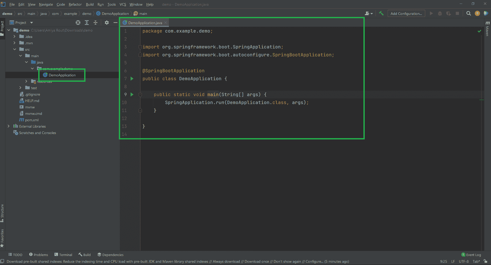
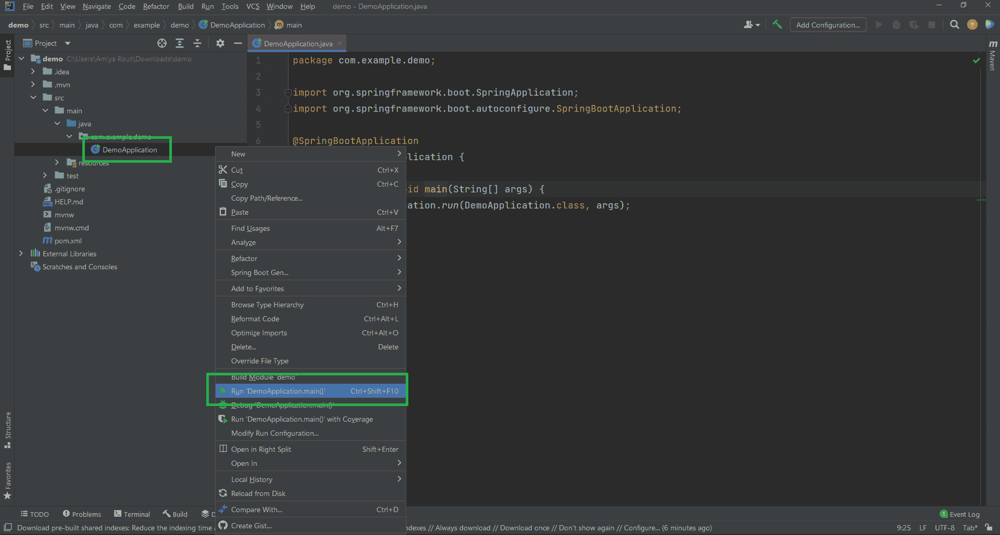
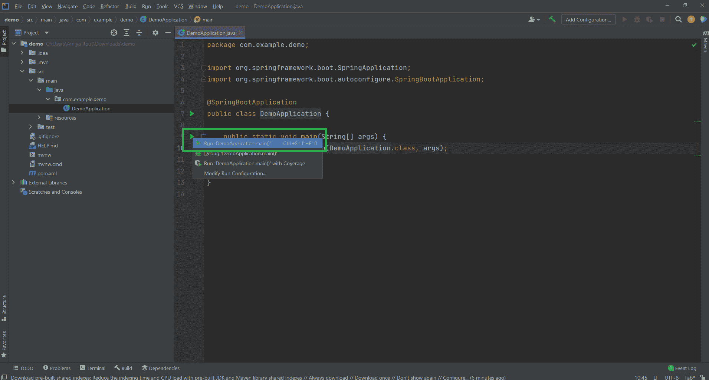
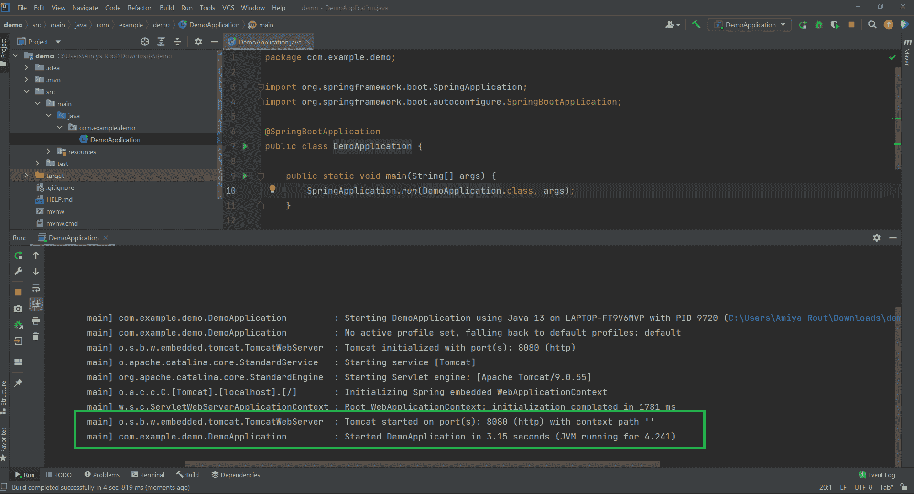
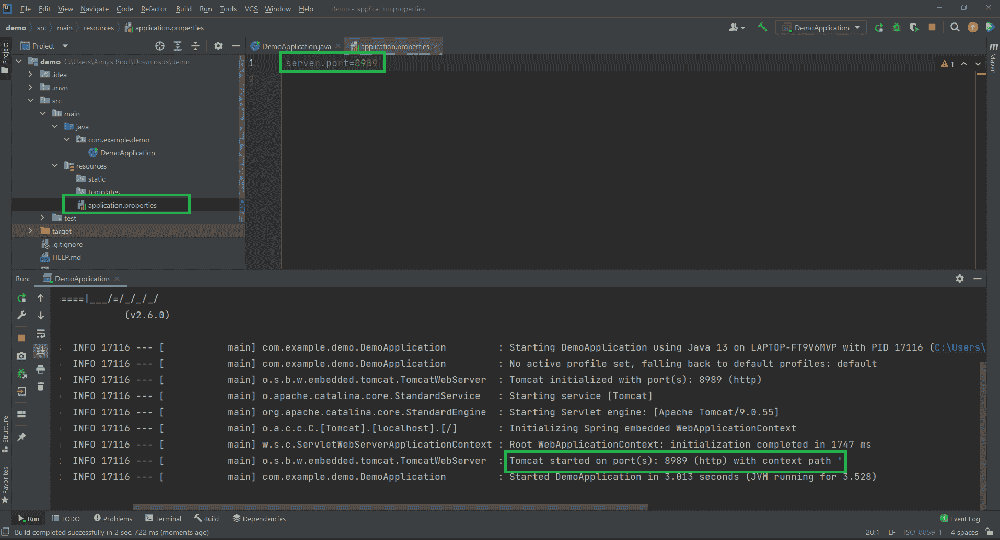

# 如何在 IntelliJ IDEA 中运行您的第一个 Spring Boot 应用程序？

> 原文:[https://www . geesforgeks . org/如何运行您的第一个春季启动应用程序 in-intellij-idea/](https://www.geeksforgeeks.org/how-to-run-your-first-spring-boot-application-in-intellij-idea/)

**IntelliJ IDEA** 是用 Java 编写的集成开发环境(IDE)。它用于开发计算机软件。这个 IDE 是由 Jetbrains 开发的，有 Apache 2 授权社区版和商业版。这是一个智能的、上下文感知的集成开发环境，用于在各种应用程序中使用 Java 和其他 JVM 语言，如 Kotlin、Scala 和 Groovy。此外，IntelliJ IDEA Ultimate 可以帮助您开发全栈网络应用程序，这得益于其强大的集成工具、对 JavaScript 和相关技术的支持，以及对流行框架(如 Spring、Spring Boot、Jakarta EE、Micronaut、Quarkus、Helidon)的高级支持。因此，在本文中，我们将讨论如何在 IntelliJ IDEA 中运行您的第一个春季启动应用程序。

> **先决条件:**在系统中下载并安装 IntelliJ IDEA。请参考本文[安装 IntelliJ IDEA 的分步指南](https://www.geeksforgeeks.org/step-by-step-guide-to-install-intellij-idea/)在您的系统中安装 Intellij Idea。

### 逐步实施

1.  在 IntelliJ IDEA 中创建和设置 Spring Boot 项目
2.  创建或导入 Spring Boot 项目
3.  运行 Spring Boot 应用程序
4.  再次重新运行应用程序

**步骤 1:** 在 IntelliJ IDEA 中创建并设置 Spring Boot 项目

您可以参考这篇文章如何在 IntelliJ IDEA 中创建和设置 Spring Boot 项目，并在 IntelliJ IDEA 中创建您的第一个 Spring Boot 应用程序。

**步骤 2:** 创建或导入 Spring Boot 项目

成功创建或导入 spring boot 项目后，将自动创建一个名为**Application.java(Herre demo application**)的文件，这是您的入口点。您可以将其视为 Spring Boot 应用程序的**主要方法。**



**步骤 3:** 运行 Spring Boot 应用程序

确实存在两种运行 Spring 启动应用程序的方法，稍后将讨论如下:

*   使用项目浏览器
*   右键直接运行演示应用文件

**3.1:** 方法 1

要立即运行此应用程序**右键单击 Application.java>运行“demo application . main()”**，如下图所示。或者您可以键入快捷键组合( **Ctrl + Shift + F10** )来运行应用程序。



**3.2:** 方法 2

这更像是一种直接的方法，我们直接点击绿色三角形按钮，然后选择**运行**‘demo application . main()’。



成功运行应用程序后，您可以看到控制台，如下图所示。您的 Tomcat 服务器在端口 8080 上启动，如下图所示。



> ***注意:***Tomcat 服务器的默认端口是 8080，可以使用下面这一行代码在 **application.properties** 文件中进行更改。
> 
> ```
> *server.port=8989*
> ```

**步骤 4:** 现在再次重新运行应用程序，您可以看到 [Tomcat 服务器](https://www.geeksforgeeks.org/difference-between-apache-tomcat-server-and-apache-web-server/)在您给出的端口上启动，如下图所示。



您可以通过以下网址访问输出屏幕:***http://localhost:8989/***。请注意，最后提供您的端口号。