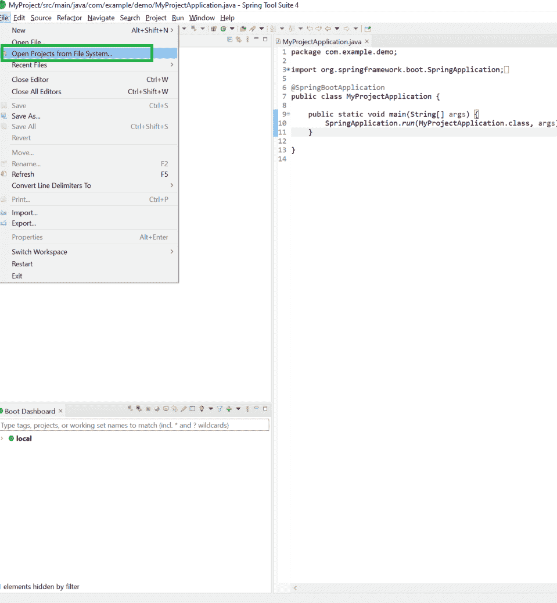
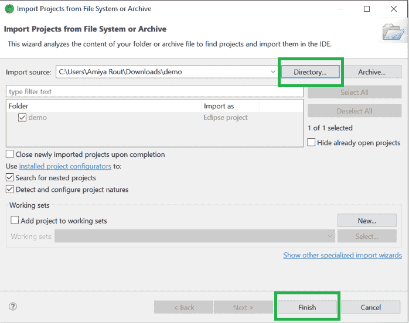
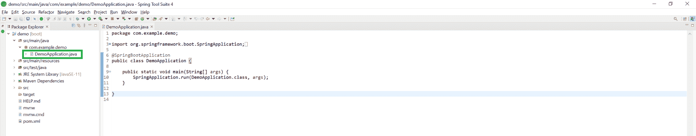
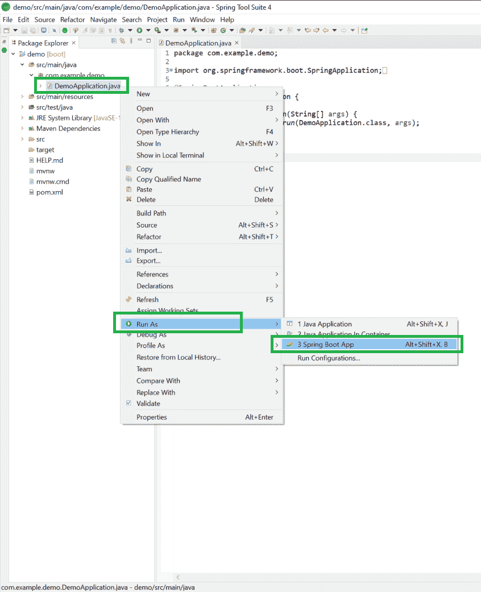
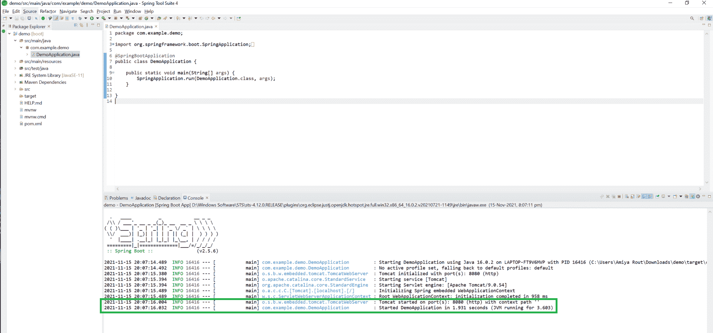
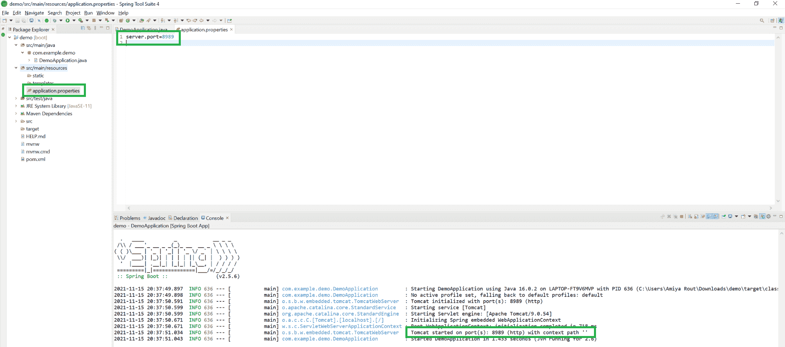
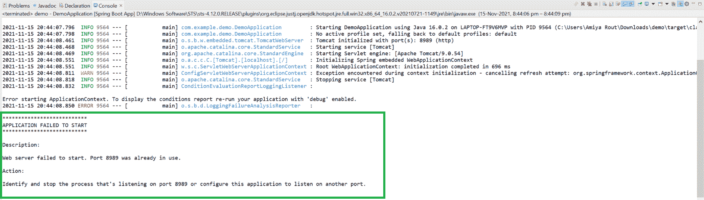

# 如何在 Spring 工具套件中运行您的第一个 Spring Boot 应用程序？

> 原文:[https://www . geesforgeks . org/如何运行您的第一个春季启动应用程序春季工具套件/](https://www.geeksforgeeks.org/how-to-run-your-first-spring-boot-application-in-spring-tool-suite/)

**Spring 工具套件(STS)** 是一个为开发基于 Spring 的企业应用而量身定制的 java IDE。它更容易、更快、更方便。最重要的是，它基于 Eclipse 集成开发环境。STS 是免费的、开源的，并且由 VMware 提供支持。Spring Tools 4 是下一代 Spring 工具，适合最喜欢的编码环境。很大程度上是从零开始重建的，它为开发基于 Spring 的企业应用程序提供了世界级的支持，无论您更喜欢 Eclipse、Visual Studio Code 还是忒伊亚 IDE。因此，在本文中，我们将讨论如何在 STS 中运行您的第一个春季启动应用程序。

> **先决条件:**在系统中下载并安装 Spring 工具套件(适用于 Eclipse 的 Spring Tools 4)IDE。您可以参考这篇文章:如何下载和安装 Spring 工具套件(适用于 Eclipse 的 Spring Tools 4)IDE？

**程序:**

1.  在春季工具套件中创建 Spring Boot 项目
2.  将项目导入到 STS IDE 中
3.  将为 STS 创建一个名为应用程序文件的条目文件
4.  在服务器上运行应用程序。

**步骤 1:在 Spring 工具套件**中创建您的 Spring Boot 项目

您可以参考本文**如何在 Spring Tool Suite** 中创建和设置 Spring Boot 项目，并创建您的第一个 Spring Boot 应用程序。或者你可以**在春季初始化器**中创建你的 Spring Boot 项目，并将该项目导入到你的 STS IDE 中。请参考本文 [**在 Spring initiator**](https://www.geeksforgeeks.org/spring-initializr/)**中创建 Spring Boot 项目。**

**步骤 2:如何将项目导入到您的 STS IDE 中？**

**2.1:** 从文件系统转到您的 **STS IDE >文件>打开项目，如下图所示。**



**2.2:** 将出现如下弹出窗口。在这里，您必须选择在 Spring Initializer 中创建 spring boot 项目时生成的目录。然后点击**完成**按钮。



**步骤 3:** 成功创建或导入 spring boot 项目后，将自动创建一个文件名**【Application.java】***(Herre demo application)*，这是您的入口点。您可以将其视为 Spring Boot 应用程序的主要方法。



**第四步:在**命令立即运行该应用时，**右键点击 Application.java>运行方式> Spring Boot App** 如下图所示。



**步骤 4:** 成功运行应用程序后，您可以看到 Tomcat 服务器在默认端口号 8080 上启动的控制台，如下图所示。



现在，极客们，你们一定想知道，如果我们不希望它在默认端口号上运行，那会怎么样，因为 Tomcat 服务器的默认端口是 8080。我们可以使用下面一行代码来更改**应用程序.属性**文件中的端口号，如下所示:

```java
***server.port=8989***
```

**A.** 现在再次重新运行应用程序，您可以看到您的 Tomcat 服务器在您给出的端口上启动，如下图所示。



**B.** 如果遇到以下错误，强烈建议您更改端口号。



> 您可以通过以下网址访问输出屏幕:***http://localhost:8080/***。请注意，最后提供您的端口号。