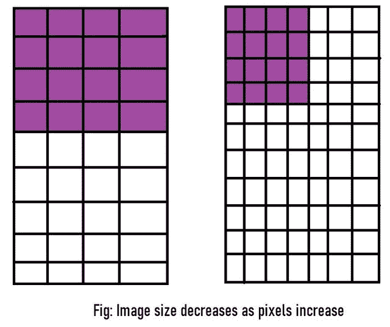
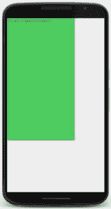
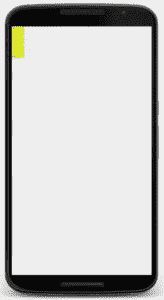
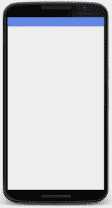
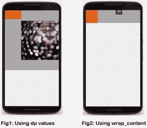
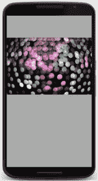
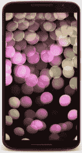

# 如何在 Android Studio 中将不同的视图缩放到所有屏幕大小？

> 原文:[https://www . geeksforgeeks . org/如何在安卓工作室中将不同视图缩放到所有屏幕尺寸/](https://www.geeksforgeeks.org/how-to-scale-different-views-to-all-screen-sizes-in-android-studio/)

本文展示了如何在安卓应用程序开发中更改视图的大小(如文本视图等)，以便他们可以修改屏幕上显示的内容。

**注:**本文用 [XML 可视化工具](https://labs.udacity.com/android-visualizer/)代替[安卓工作室](https://www.geeksforgeeks.org/guide-to-install-and-set-up-android-studio/)。

以下是在安卓系统中改变视图大小的各种方法:

1.  **Hard-coding the values in dp (density pixel):** We know that [pixels](https://www.geeksforgeeks.org/image-processing-java-set-2-get-set-pixels/) are a unit of measure for an image or any object that appears on a computer screen. But if we specify the size of a View in pixels, there’s a very big problem which will arise since every device has a different pixel screen ratio. The more the number of pixel a device has, the more crisper and better quality images can be seen.

    例如，如果我们将视图指定为*4 像素* 4 像素*，它可能会根据相关设备以不同的大小显示。
    [](https://media.geeksforgeeks.org/wp-content/uploads/20200129181630/and1.jpg)

    我们可以通过在**密度-像素(dp)** 而不是像素中指定视图来克服这个问题。当在 dp 中指定时，设备本身会调整视图，使视图占据其预期的空间。

    [](https://media.geeksforgeeks.org/wp-content/uploads/20200129181634/and2.jpg)

    既然我们知道了使用密度像素胜过像素的优势，让我们来看看这样做的代码:

    ```
    <TextView
        android:text="You are in GeeksforGeeks!"
        android:background="#66bb6a"
        android:layout_width="250dp"
        android:layout_height="450dp" />
    ```

    **注意:**要运行此代码，请从 [XML 可视化工具](https://labs.udacity.com/android-visualizer/)中删除之前编写的任何代码，并粘贴上述代码。

    **输出:**

    [](https://media.geeksforgeeks.org/wp-content/uploads/20200129181638/and3.jpg)

    我们在一个绿色的大矩形里看到一个非常小的字。长方形是我们规定的尺寸: **450dp*250dp** 。从代码中可以明显看出，在指定视图的大小时(在上面的例子中是一个文本视图)，我们需要设置两个参数的值:高度和宽度。如果它们中的任何一个不存在，代码就不会运行。

2.  **Using wrap_content:** Generally, hard-coding the values in dp isn’t a good practice. Take the above output as an example: our text is quite tiny but we are using a gigantic green box to enclose it. Not only it looks weird but it also takes a lot of unnecessary space. Also, many times we don’t know how much content will there be in the view; say user-input, if it’s a long input then the size which we specified in dp might be small to hold the content thus cutting it off and if the input is very small, there will be a lot of space left inside the specified view thus resulting in poor design.

    ```
    <TextView
        android:text="This is a very very large input in a very very small view size!"
        android:background="#ffff00"
        android:layout_width="30dp"
        android:layout_height="80dp" />
    ```

    **输出:**
    [](https://media.geeksforgeeks.org/wp-content/uploads/20200129181641/and4.jpg)

    为了解决这个问题，我们使用`wrap_content`函数。它使视图的大小受限于它所覆盖的内容。因此，视图大小将随着其覆盖的内容的增长或缩小而增长和缩小。让我们看看它的代码:

    ```
    <TextView
        android:text="This is a very very large input in a view size which will grow accordingly!"
        android:background="#42a5f5"
        android:layout_width="wrap_content"
        android:layout_height="wrap_content" />
    ```

    **输出:**
    [](https://media.geeksforgeeks.org/wp-content/uploads/20200129181643/and5.jpg)

    然而，当我们处理多个视图时，还有一种方法会派上用场。

3.  **Using match_parent:** When we have **more than one view** on the screen, we use [layouts](https://www.geeksforgeeks.org/android-ui-layouts/) to arrange the views. The layout which we use is also a view and is known as **parent view** and all the views which it contains are known as **child views**.

    在指定布局的同时，我们还需要像指定任何其他视图一样指定它的大小。我们可以通过对 dp 中的值进行硬编码或使用`wrap_content`来做到这一点。然而，使用`wrap_content`进行布局可能会使设计不佳，因为它有时会使孩子的视图比预期的更小或更大。

    [](https://media.geeksforgeeks.org/wp-content/uploads/20200129181645/and6.jpg)

    如果我们想要布局尺寸与设备尺寸相匹配，我们需要使用`match_parent`。它不仅可以用于布局，也就是父视图，还可以用于子视图。如果我们将它用于子视图，它将是父视图的大小。

    下面是显示上述方法的代码:

    ```
    <LinearLayout
        xmlns:android="http://schemas.android.com/apk/res/android"
        android:orientation="horizontal"
        android:layout_width="match_parent"
        android:layout_height="match_parent"
        android:background="@android:color/darker_gray">

        <ImageView
            android:src="@drawable/rainbow"
            android:layout_width="wrap_content"
            android:layout_height="wrap_content"/>
    </LinearLayout>
    ```

    现在布局将延伸到整个显示屏。这里，我们在布局中使用了“深灰色”，这样我们就可以看到它覆盖了整个设备。如果没有指定颜色，布局将不可见。

    **输出:**
    [](https://media.geeksforgeeks.org/wp-content/uploads/20200129181647/and7.jpg)

    如果我们在图像视图中使用 match_parent，它将采用整个设备显示的大小，从而创建一个全出血图像:

    ```
    <ImageView
            android:src="@drawable/rainbow"
            android:layout_width="match_parent"
            android:layout_height="match_parent"
            android:scaleType="centerCrop"/>
    ```

    **输出:**
    [](https://media.geeksforgeeks.org/wp-content/uploads/20200129181649/and8.jpg)