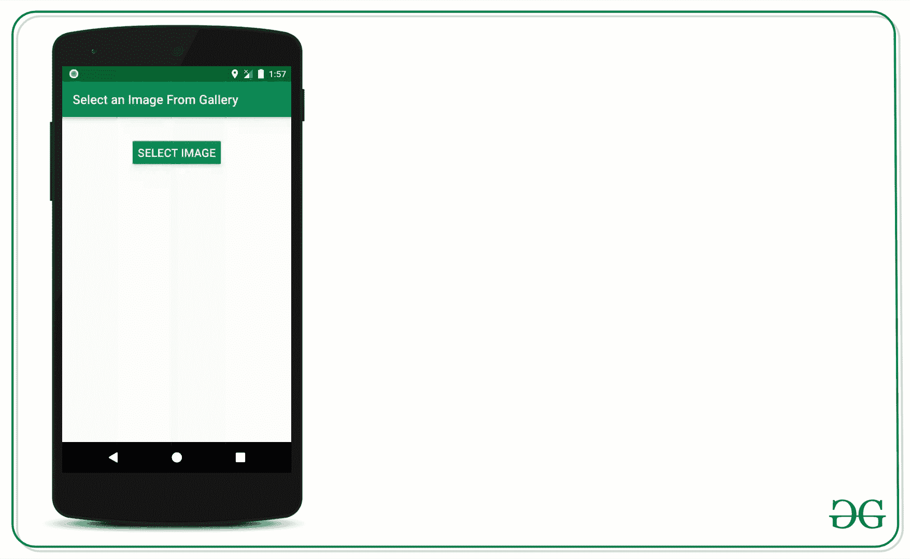
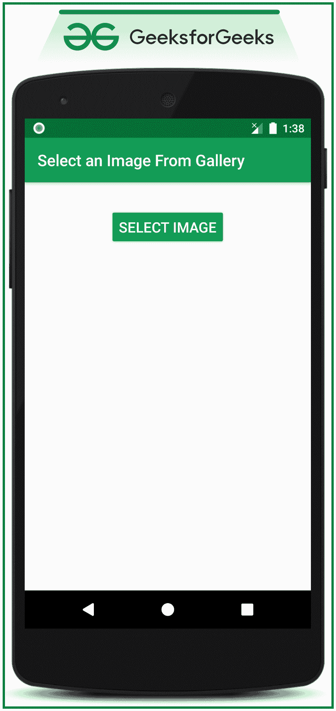

# 如何在安卓中从图库中选择图像？

> 原文:[https://www . geesforgeks . org/如何从安卓图库中选择图像/](https://www.geeksforgeeks.org/how-to-select-an-image-from-gallery-in-android/)

当用户必须上传或将其图像设置为个人资料图片或用户想要向其他人发送图片时，需要从安卓图库中选择图像。因此，在本文中，已经逐步讨论了如何从图库中选择图像并预览所选图像。看看下面这张图片，这篇文章已经进一步讨论过了。



## **从图库中选择图像的步骤**

**第一步:创建一个空的活动项目**

*   创建一个空的活动安卓工作室项目。并选择 **Java** 作为编程语言。
*   参考[安卓|如何在安卓工作室创建/启动新项目？](https://www.geeksforgeeks.org/android-how-to-create-start-a-new-project-in-android-studio/)了解如何创建一个空的活动 Android Studio Project。

**步骤 2:使用 activity_main.xml**

*   应用程序的主布局包括一个打开图像选择器的按钮和一个预览图库中所选图像的图像视图。
*   要实现应用程序的布局，在 **activity_main.xml** 文件中调用以下代码。

## 可扩展标记语言

```
<?xml version="1.0" encoding="utf-8"?>
<RelativeLayout 
    xmlns:android="http://schemas.android.com/apk/res/android"
    xmlns:tools="http://schemas.android.com/tools"
    android:layout_width="match_parent"
    android:layout_height="match_parent"
    tools:context=".MainActivity"
    tools:ignore="HardcodedText">

    <!--Button to open the image selector-->
    <Button
        android:id="@+id/BSelectImage"
        android:layout_width="wrap_content"
        android:layout_height="wrap_content"
        android:layout_centerHorizontal="true"
        android:layout_marginTop="32dp"
        android:backgroundTint="@color/colorPrimary"
        android:text="SELECT IMAGE"
        android:textColor="@android:color/white"
        android:textSize="18sp" />

    <!--ImageView to preview the selected image-->
    <ImageView
        android:id="@+id/IVPreviewImage"
        android:layout_width="match_parent"
        android:layout_height="300dp"
        android:layout_below="@id/BSelectImage"
        android:layout_marginStart="16dp"
        android:layout_marginTop="16dp"
        android:layout_marginEnd="16dp" />

</RelativeLayout>
```

**输出 UI:**



**步骤 3:使用 MainActivity.java 文件**

*   在这种情况下，触发图像选择器的意图是输入**“图像”**，动作为**动作 _ 获取 _ 内容。**
*   调用下面的代码来实现相同的。添加注释是为了更好地理解。

## Java 语言(一种计算机语言，尤用于创建网站)

```
import androidx.appcompat.app.AppCompatActivity;
import android.content.Intent;
import android.net.Uri;
import android.os.Bundle;
import android.view.View;
import android.widget.Button;
import android.widget.ImageView;

public class MainActivity extends AppCompatActivity {

    // One Button
    Button BSelectImage;

    // One Preview Image
    ImageView IVPreviewImage;

    // constant to compare 
      // the activity result code
    int SELECT_PICTURE = 200;

    @Override
    protected void onCreate(Bundle savedInstanceState) {
        super.onCreate(savedInstanceState);
        setContentView(R.layout.activity_main);

        // register the UI widgets with their appropriate IDs
        BSelectImage = findViewById(R.id.BSelectImage);
        IVPreviewImage = findViewById(R.id.IVPreviewImage);

        // handle the Choose Image button to trigger 
          // the image chooser function
        BSelectImage.setOnClickListener(new View.OnClickListener() {
            @Override
            public void onClick(View v) {
                imageChooser();
            }
        });
    }

    // this function is triggered when
      // the Select Image Button is clicked
    void imageChooser() {

        // create an instance of the 
          // intent of the type image
        Intent i = new Intent();
        i.setType("image/*");
        i.setAction(Intent.ACTION_GET_CONTENT);

        // pass the constant to compare it 
          // with the returned requestCode
        startActivityForResult(Intent.createChooser(i, "Select Picture"), SELECT_PICTURE);
    }

    // this function is triggered when user
      // selects the image from the imageChooser
    public void onActivityResult(int requestCode, int resultCode, Intent data) {
        super.onActivityResult(requestCode, resultCode, data);

        if (resultCode == RESULT_OK) {

            // compare the resultCode with the
              // SELECT_PICTURE constant
            if (requestCode == SELECT_PICTURE) {
                // Get the url of the image from data
                Uri selectedImageUri = data.getData();
                if (null != selectedImageUri) {
                    // update the preview image in the layout
                    IVPreviewImage.setImageURI(selectedImageUri);
                }
            }
        }
    }
}
```

### **输出:在仿真器上运行**

<video class="wp-video-shortcode" id="video-530532-1" width="640" height="360" preload="metadata" controls=""><source type="video/mp4" src="https://media.geeksforgeeks.org/wp-content/uploads/20201217140541/GFG_nexus_5.mp4?_=1">[https://media.geeksforgeeks.org/wp-content/uploads/20201217140541/GFG_nexus_5.mp4](https://media.geeksforgeeks.org/wp-content/uploads/20201217140541/GFG_nexus_5.mp4)</video>