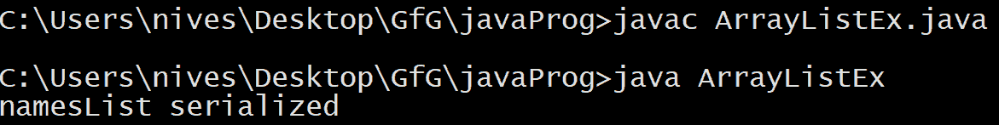

# 如何在 Java 中序列化 ArrayList？

> 原文:[https://www . geesforgeks . org/how-serialize-ArrayList-in-Java/](https://www.geeksforgeeks.org/how-to-serialize-arraylist-in-java/)

[**ArrayList**](https://www.geeksforgeeks.org/arraylist-in-java/)**是 java 的**集合**框架下的一个类。它存在于 **java.util** 包中。在 java 中，数组列表是一个可重新调整大小的数组，也就是说，与数组不同，数组列表的大小可以根据我们的需求动态修改。此外，ArrayList 类提供了许多有用的方法来对大量数据执行插入、删除和许多其他操作。**

****什么是** [**序列化**](https://www.geeksforgeeks.org/serialization-in-java/) **？****

**序列化对象意味着将其状态转换为字节流，以便字节流可以还原为对象的副本。如果一个 Java 对象的类或其任何超类实现了 **java.io.Serializable** 接口或其子接口 **java.io.Externalizable.** 则该对象是可序列化的。当一个对象被序列化时，标识其类的信息被记录在序列化流中。**

****序列化数组列表:****

**在 Java 中，ArrayList 类默认实现了一个 **Serializable** 接口，即 ArrayList 默认是序列化的。我们可以直接使用 [**对象输出流**](https://www.geeksforgeeks.org/java-io-objectoutputstream-class-java-set-1/) 来序列化它。**

## **Java 语言(一种计算机语言，尤用于创建网站)**

```java
// Java program to demonstrate serialization of ArrayList

import java.io.FileOutputStream;
import java.io.IOException;
import java.io.ObjectOutputStream;
import java.util.ArrayList;

public class ArrayListEx {

    // method to serialize an ArrayList object
    static void serializeArrayList()
    {

        // an ArrayList
        // object "namesList"
        // is created
        ArrayList<String> namesList
            = new ArrayList<String>();

        // adding the data into the ArrayList
        namesList.add("Geeks");
        namesList.add("for");
        namesList.add("Geeks");

        try {
            // an OutputStream file
            // "namesListData" is
            // created
            FileOutputStream fos
                = new FileOutputStream("namesListData");

            // an ObjectOutputStream object is
            // created on the FileOutputStream
            // object
            ObjectOutputStream oos
                = new ObjectOutputStream(fos);

            // calling the writeObject()
            // method of the
            // ObjectOutputStream on the
            // OutputStream file "namesList"
            oos.writeObject(namesList);

            // close the ObjectOutputStream
            oos.close();

            // close the OutputStream file
            fos.close();

            System.out.println("namesList serialized");
        }
        catch (IOException ioe) {
            ioe.printStackTrace();
        }
    }

    // Driver method
    public static void main(String[] args) throws Exception
    {
        // calling the
        // serializeArrayList() method
        serializeArrayList();
    }
}
```

****输出:**** 

****

****注意:**
数组列表中存储的所有元素也应该是可序列化的，这样才能序列化数组列表，否则会抛出 NotSerializableException。**