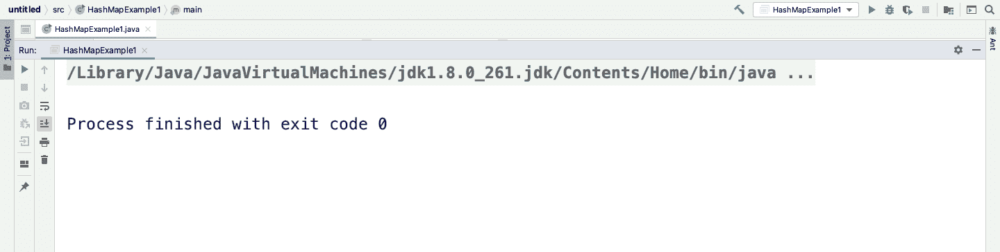
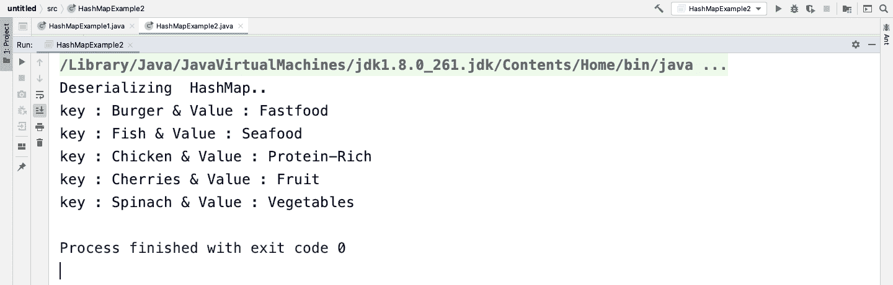

# 如何在 Java 中序列化 HashMap？

> 原文:[https://www . geesforgeks . org/how-serialize-hashmap-in-Java/](https://www.geeksforgeeks.org/how-to-serialize-hashmap-in-java/)

**序列化**是我们将一个对象转换成字节流，并将这些字节存储在文件系统/数据库中，或者将它们放在网络上从一个位置移动到另一个位置的过程。

**反序列化**是序列化的逆过程。[反序列化](https://www.geeksforgeeks.org/serialization-in-java/)包括从字节流中检索对象。

**Hashmap**:Hashmap 以键/值对的形式存储项目，我们可以通过另一种类型的索引(比如字符串)来访问它们。

现在要序列化任何东西，必须实现 [java.io.Serializable](https://www.geeksforgeeks.org/serializable-interface-in-java/) 接口，HashMap 也实现 Serializable 接口。然后在序列化 hashmap 之后，我们将学习如何在 Java 中反序列化 HashMap。

**示例 1:** 序列化字符串键和字符串值的 HashMap

在这个例子中，我们正在序列化 HashMap，其中键和值是字符串。我们正在使用 [ObjectOutputStream](https://www.geeksforgeeks.org/java-io-objectoutputstream-class-java-set-1/) 的 **writeObject()** 方法来序列化 Java 中的 HashMap。在下面的程序中，我们将 hashmap 内容保存在一个序列化的 **newHashMap** 文件中。运行以下代码后，将创建一个**新哈希表**文件。该文件用于下一个即将到来的程序中的反序列化。

## Java 语言(一种计算机语言，尤用于创建网站)

```
// Java program on how to Serialize HashMap in Java

import java.io.FileOutputStream;
import java.io.IOException;
import java.io.ObjectOutputStream;
import java.util.HashMap;

public class HashMapExample1 {
    public static void main(String[] args)
    {
        HashMap<String, String> foodType = new HashMap<>();

        // storing data in HashMap
        foodType.put("Burger", "Fastfood");
        foodType.put("Cherries", "Fruit");
        foodType.put("Fish", "Seafood");
        foodType.put("Spinach", "Vegetables");
        foodType.put("Chicken", "Protein-Rich");

        // try catch block
        try {
            FileOutputStream myFileOutStream
                = new FileOutputStream(
                    "/Users/piyushkumar/Downloads/Java/newHashMap.txt");

            ObjectOutputStream myObjectOutStream
                = new ObjectOutputStream(myFileOutStream);

            myObjectOutStream.writeObject(foodType);

            // closing FileOutputStream and
            // ObjectOutputStream
            myObjectOutStream.close();
            myFileOutStream.close();
        }
        catch (IOException e) {
            e.printStackTrace();
        }
    }
}
```

**输出**



在上面的例子中，我们使用 writeObject()方法序列化了 foodType 的 HashMap。

运行这个程序，在你的文件系统中看到一个名为“newHashMap.txt”的文件被创建，整个 HashMap(以编码形式)被保存。现在，我们将学习如何读取这个文件并反序列化 HashMap。

**示例 2:** 反序列化字符串键和值的 HashMap

需要注意的是，我们只能将反序列化的 [HashMap](https://www.geeksforgeeks.org/java-util-hashmap-in-java-with-examples/) 存储到 HashMap 的引用变量或其任何父类中。除此之外**Java . lang . class castexception**异常将会出现。

## Java 语言(一种计算机语言，尤用于创建网站)

```
// Deserializing HashMap in Java

import java.io.FileInputStream;
import java.io.IOException;
import java.io.ObjectInputStream;
import java.util.HashMap;
import java.util.Iterator;
import java.util.Map;
import java.util.Set;

public class HashMapExample2 {
    public static void main(String[] args)
    {
        HashMap<String, String> newHashMap = null;

        try {
            FileInputStream fileInput = new FileInputStream(
                "/Users/piyushkumar/Downloads/Java/newHashMap.txt");

            ObjectInputStream objectInput
                = new ObjectInputStream(fileInput);

            newHashMap = (HashMap)objectInput.readObject();

            objectInput.close();
            fileInput.close();
        }

        catch (IOException obj1) {
            obj1.printStackTrace();
            return;
        }

        catch (ClassNotFoundException obj2) {
            System.out.println("Class not found");
            obj2.printStackTrace();
            return;
        }

        System.out.println("Deserializing  HashMap..");

        // Displaying content in "newHashMap.txt" using
        // Iterator
        Set set = newHashMap.entrySet();
        Iterator iterator = set.iterator();

        while (iterator.hasNext()) {
            Map.Entry entry = (Map.Entry)iterator.next();

            System.out.print("key : " + entry.getKey()
                             + " & Value : ");
            System.out.println(entry.getValue());
        }
    }
}
}
```

**输出**

