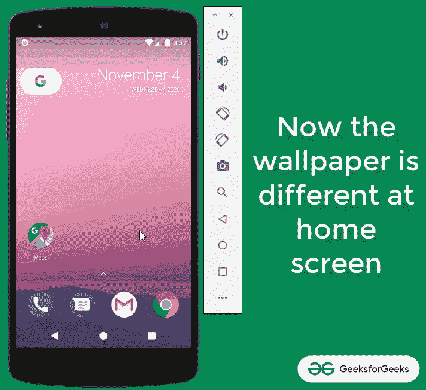
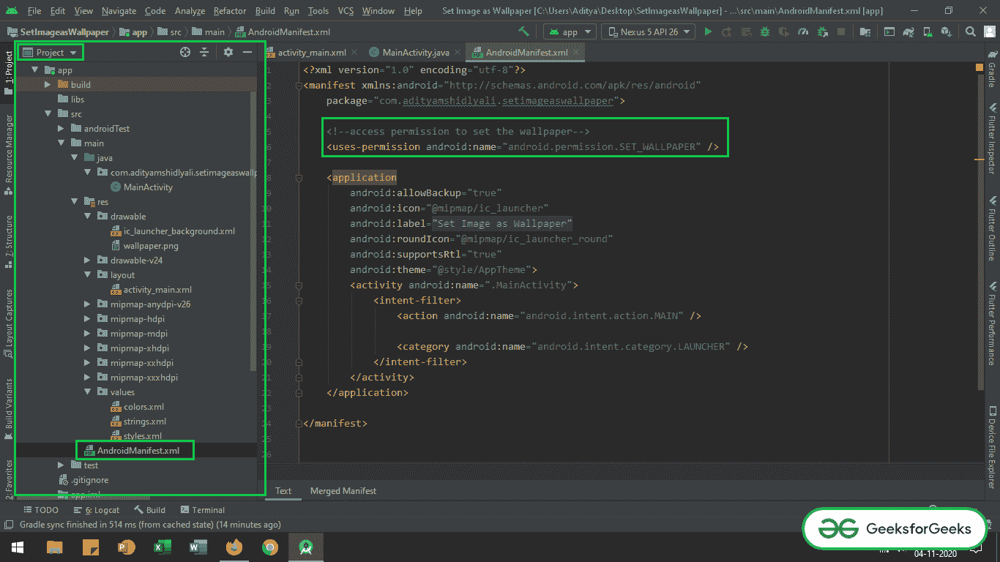
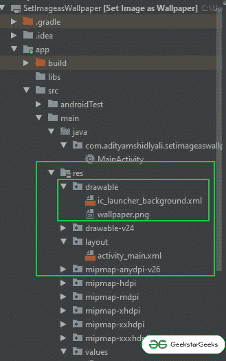
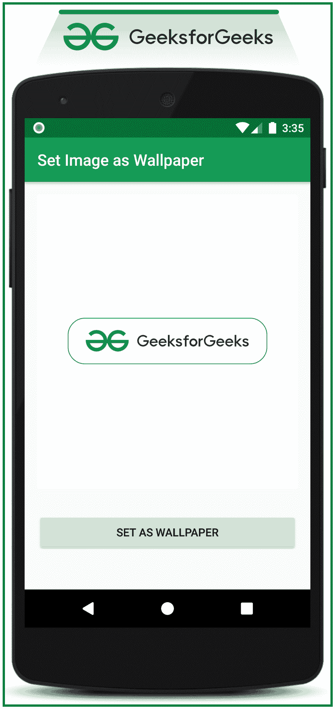

# 如何在安卓系统中编程设置一张图片为壁纸？

> 原文:[https://www . geeksforgeeks . org/如何在安卓中以编程方式将图像设置为壁纸/](https://www.geeksforgeeks.org/how-to-set-an-image-as-wallpaper-programmatically-in-android/)

当应用程序从 API 库中获取壁纸并询问用户是否为主屏幕设置壁纸时，以编程方式在 Android 中设置壁纸很有帮助。在本文中，已经讨论了如何以编程方式将示例图像设置为主屏幕壁纸。看看下面的图片，了解一下实现后将如何工作。注意，我们将使用 **Java** 语言来实现这个项目。



### **以编程方式设置壁纸的步骤**

**第一步:创建新项目**

*   要在安卓工作室创建新项目，请参考[如何在安卓工作室创建/启动新项目](https://www.geeksforgeeks.org/android-how-to-create-start-a-new-project-in-android-studio/)。
*   注意选择 **Java** 作为编程语言。

**步骤 2:现在将权限添加到 AndroidManifest.xml 文件**

*   调用 [**和**](https://www.geeksforgeeks.org/application-manifest-file-android/) 文件中的以下代码。

## 可扩展标记语言

```
<?xml version="1.0" encoding="utf-8"?>
<manifest xmlns:android="http://schemas.android.com/apk/res/android"
    package="com.adityamshidlyali.setimageaswallpaper">

    <!--access permission to set the wallpaper-->
    <uses-permission android:name="android.permission.SET_WALLPAPER" />

    <application
        android:allowBackup="true"
        android:icon="@mipmap/ic_launcher"
        android:label="@string/app_name"
        android:roundIcon="@mipmap/ic_launcher_round"
        android:supportsRtl="true"
        android:theme="@style/AppTheme">
        <activity android:name=".MainActivity">
            <intent-filter>
                <action android:name="android.intent.action.MAIN" />

                <category android:name="android.intent.category.LAUNCHER" />
            </intent-filter>
        </activity>
    </application>

</manifest>
```

*   如果找不到 **AndroidManifest.xml** 文件来调用权限，请参考下图。



**第三步:现在导入一些图片到可绘制文件夹**

*   将一些图像导入到可绘制的文件夹中，或者可以从应用编程接口库中获取图像。
*   在这种情况下，一个示例 GeeksforGeeks 徽标图像已导入到可绘制文件夹中。
*   可抽文件夹可以在 **app > src >主> res >可抽**下获取
*   如果找不到可绘制文件夹，请参考下图。



**第 4 步:使用 activity_main.xml 文件**

*   在 **activity_main.xml** 文件中调用下面给出的简单布局。代码中添加了注释，以更详细地理解代码。

## 可扩展标记语言

```
<?xml version="1.0" encoding="utf-8"?>
<LinearLayout 
    xmlns:android="http://schemas.android.com/apk/res/android"
    xmlns:tools="http://schemas.android.com/tools"
    android:layout_width="match_parent"
    android:layout_height="match_parent"
    android:orientation="vertical"
    tools:context=".MainActivity"
    tools:ignore="HardcodedText">

    <!--layout to bound the width and height of the wallpaper preview-->
    <LinearLayout
        android:layout_width="match_parent"
        android:layout_height="400dp">
        <!--a sample image view for the preview purpose-->
        <ImageView
            android:id="@+id/wallpaper_image"
            android:layout_width="match_parent"
            android:layout_height="wrap_content"
            android:layout_margin="16dp"
            android:scaleType="centerCrop"
            android:src="@drawable/wallpaper" />
    </LinearLayout>

    <!--button which sets the image as wallpaper-->
    <Button
        android:id="@+id/set_wallpaper_button"
        android:layout_width="match_parent"
        android:layout_height="wrap_content"
        android:layout_margin="16dp"
        android:text="Set As Wallpaper" />

</LinearLayout>
```

**产生以下输出界面:**



**步骤 5:使用 MainActivity.java 文件**

*   使用壁纸管理器处理按钮来设置所需的壁纸。
*   在**MainActivity.java**文件中调用以下代码。代码中添加了注释，以更详细地理解代码。

## Java 语言(一种计算机语言，尤用于创建网站)

```
import androidx.appcompat.app.AppCompatActivity;
import android.annotation.SuppressLint;
import android.app.WallpaperManager;
import android.os.Bundle;
import android.view.View;
import android.widget.Button;
import java.io.IOException;

public class MainActivity extends AppCompatActivity {

    // button to set the home screen wallpaper when clicked
    Button bSetWallpaper;

    @Override
    protected void onCreate(Bundle savedInstanceState) {
        super.onCreate(savedInstanceState);
        setContentView(R.layout.activity_main);

        // creating the instance of the WallpaperManager
        final WallpaperManager wallpaperManager = WallpaperManager.getInstance(getApplicationContext());

        // handle the set wallpaper button to set the desired wallpaper for home screen
        bSetWallpaper = findViewById(R.id.set_wallpaper_button);
        bSetWallpaper.setOnClickListener(new View.OnClickListener() {
            @SuppressLint("ResourceType")
            @Override
            public void onClick(View v) {
                try {
                    // set the wallpaper by calling the setResource function and 
                      // passing the drawable file
                    wallpaperManager.setResource(R.drawable.wallpaper);
                } catch (IOException e) {
                    // here the errors can be logged instead of printStackTrace
                    e.printStackTrace();
                }
            }
        });
    }
}
```

### **输出:在仿真器上运行**

<video class="wp-video-shortcode" id="video-510792-1" width="640" height="360" preload="metadata" controls=""><source type="video/mp4" src="https://media.geeksforgeeks.org/wp-content/uploads/20201104154738/Untitled-Project.mp4?_=1">[https://media.geeksforgeeks.org/wp-content/uploads/20201104154738/Untitled-Project.mp4](https://media.geeksforgeeks.org/wp-content/uploads/20201104154738/Untitled-Project.mp4)</video>