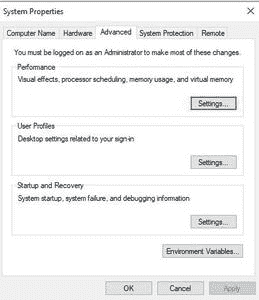
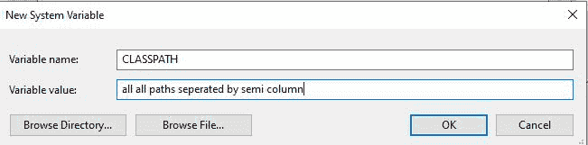

# 类文件在时如何设置类路径。Java 中的 jar 文件？

> 原文:[https://www . geesforgeks . org/如何设置类路径-当类文件在 jar 中时-文件在 java 中/](https://www.geeksforgeeks.org/how-to-set-classpath-when-class-files-are-in-jar-file-in-java/)

[类路径](https://www.geeksforgeeks.org/how-to-set-classpath-in-java/)是 JVM 或 java 编译器中的一个参数，它指定用户**–**定义的类和包的位置。在用 Java 编程时，我们多次使用导入语句。

插图:

```java
import java.util.ArrayList;
```

它使 ArrayList 类在当前类的包 *java.util* 中可用。

```java
ArrayList<Integer> list = new ArrayList<>()  ;
```

这样当我们作为 JVM 调用时，就知道在哪里可以找到类数组列表。现在，让它浏览系统上的每个文件夹并搜索它是不切实际的。因此，在 java 中确实存在一个类路径变量，当我们向它提供我们希望它出现的位置时，它会被直接使用。目录和 jar 直接放在 CLASSPATH 变量中。

我们可以在调用 JDK 工具(推荐的方法)或设置类路径环境变量时，使用–class path 选项来设置类路径。首选-classpath 选项，因为您可以为每个应用程序独立设置它，而不会影响其他应用程序，也不会改变它对其他应用程序的意义。

**方法:**

1.  将类路径设置为命令行
2.  将类路径设置为环境变量

**方法 1:** 将 CLASSPATH 设置为命令行

*   每个类路径都应该以文件名或目录结尾，这取决于您设置的类路径。
    *   为了一个罐子或者。包含的 zip 文件。类文件，类路径以。zip 或。jar 文件。为了。类文件，类路径以包含。类文件。
    *   为了。类文件在命名包中，类路径以包含“根”包(完整包名中的第一个包)的目录结束。

> 分号分隔多个路径条目。使用 set 命令时，省略等号(=)周围的空格非常重要。

**实施:**

下面的特定命令用于为任何由半列分隔的 jar 文件设置类路径。

```java
C:> set CLASSPATH=classpath1;classpath2...
```

```java
1\. C:> set CLASSPATH=.;C:\dependency\framework.jar

2\. //Add multiple jars
$ set CLASSPATH=C:\dependency\framework.jar;C:\location\otherFramework.jar  

3\. //* means all the files with .jar extension
$ set CLASSPATH=C:\dependency\framework.jar;C:\location\*.jar
```

**方法 2:** 将类路径设置为环境变量

为了将类路径设置为环境变量，只需找到逐步讨论的用户环境变量窗口。

**程序:**

1.  在桌面上，右键单击计算机图标。
2.  从上下文菜单中选择属性。
3.  单击高级系统设置链接(将打开一个弹出框)。
4.  单击环境变量。在系统变量一节中，找到类路径环境变量并选择它。单击编辑。(如果类路径环境变量不存在，请单击新建并创建一个名为类路径的新变量)
5.  添加所有用分隔符分隔的文件夹。单击确定。
6.  单击确定关闭所有剩余窗口。

下面也用图片描述了在寻找用户环境变量窗口时清晰的思维导图。

 

