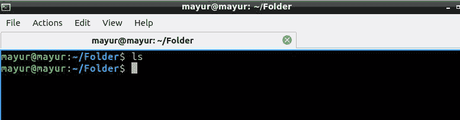
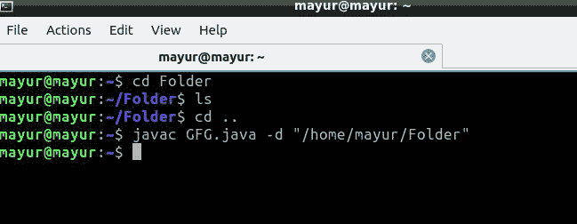
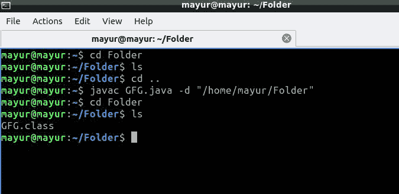

# 如何在 Java 中设置类文件的目的地？

> 原文:[https://www . geesforgeks . org/如何设置 java 类文件的目标位置/](https://www.geeksforgeeks.org/how-to-set-destination-of-the-class-file-in-java/)

在本文中，让我们学习如何在 Java 中设置类文件的目标。在此之前，我们先来了解一下什么是类文件。当我们编译一个 java 文件时，我们得到一个类文件。[一个 Java 类](https://www.geeksforgeeks.org/java-class-file/)文件是一个包含 Java 字节码并且具有*的文件。类“*可由 JVM 执行的扩展。

java 文件是使用 javac 命令编译的，如下所示。

```java
javac filename.java
```

一般来说，当编译一个 java 文件时，生成的*。类“*文件也会保存在同一个文件夹中。以便设置的目的地。类文件我们在编译*时使用-d 选项。java"* 文件，如下所示:

```java
javac filename.java -d "path to store the .class file"
```

**示例:**

```java
Source         :Gfg.java file in "/home/mayur/" directory
Destination     :"/home/mayur/folder" directory
Command        : javac Gfg.java -d "/home/mayur/folder"
```

实施:

## Java 语言(一种计算机语言，尤用于创建网站)

```java
// How to Set Destination of the Class File in Java?
public class demo {
    public static void main()
    {
        System.out.println(
            ".class file will be saved in destinated folder");
    }
}
```

**程序执行前的文件夹:**



**执行期间:**



**执行后:**

