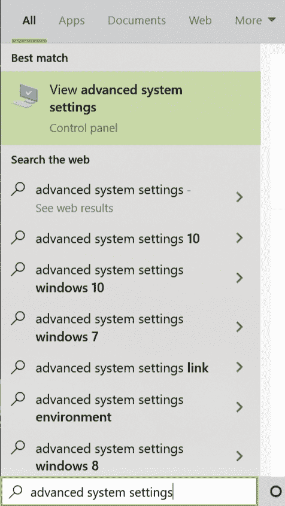
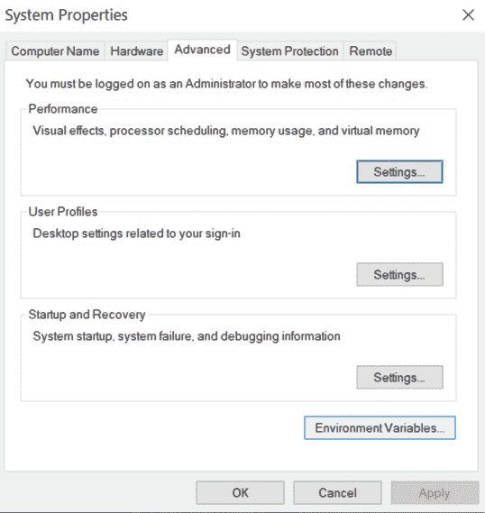
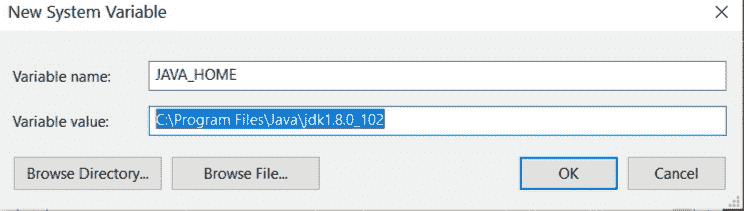
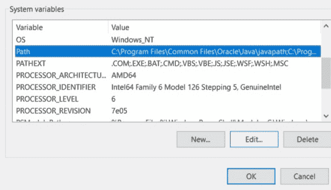
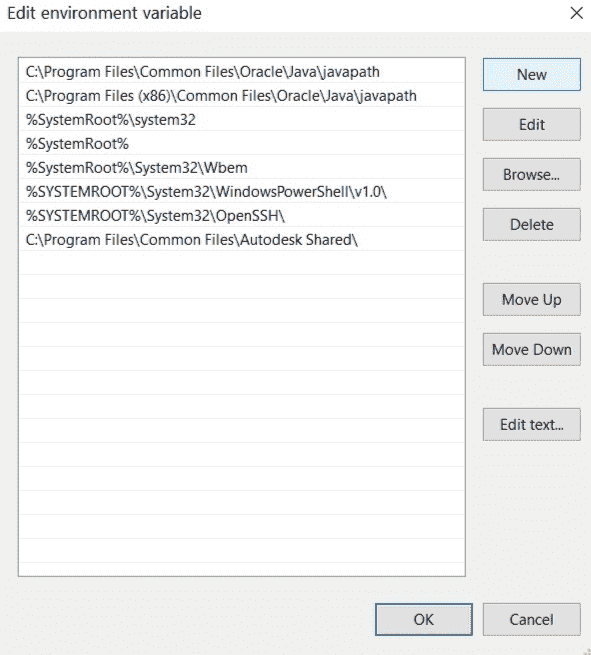
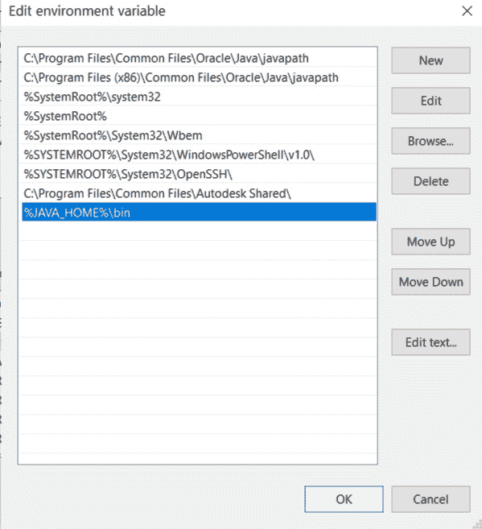

# 如何在 Windows 和 Linux 中设置 Java 路径？

> 原文:[https://www . geesforgeks . org/如何在 windows 和 linux 中设置 java 路径/](https://www.geeksforgeeks.org/how-to-set-java-path-in-windows-and-linux/)

路径是操作系统用来定位 exe 文件的环境变量。exe)或 java 二进制文件(java 或 javac 命令)。路径一旦设置，就不能被覆盖。PATH 变量防止我们每次运行程序时都必须在命令行界面上写出程序的整个路径。而且，路径只是一个存储了一堆快捷方式的变量。

为了在 windows 或 Linux 环境中执行基于 java 控制台的程序，我们必须使用 java 和 javac 命令。操作系统不知道 java 和 javac 这两个命令，因为我们没有指定可执行文件的位置。因此，我们需要指定可执行文件所在的路径。这就是我们设置路径并指定 bin 文件夹路径的原因，因为 bin 包含所有二进制可执行文件。设置路径后，它可以加载程序中所有必要的项目，包括编译器或解释器本身。

以下是为 Windows 和 Linux 设置路径的过程:

### 在窗口中设置 Java 路径

**1。**进入搜索框，输入高级系统设置。现在点击查看高级系统设置。



**2。**选择高级选项卡，然后单击环境变量。



**3。**在系统中，变量点击新建按钮。现在在编辑系统变量中，键入变量名为 JAVA_PATH，变量路径为保存 JDK 文件夹的路径，然后点击确定按钮。通常 JDK 文件的路径是 C:\ Program Files \ JAVA \ JDK 1 . 8 . 0 _ 60。



**4。**现在在系统变量中转到路径并点击编辑按钮。



**5。**点击新建按钮。



**6。**现在添加以下路径:%JAVA_HOME%\bin



### **在 Linux** 中设置 Java 路径

*   **打开终端，输入以下命令:**

```java
sudo nano /etc/environment.
```

*   **将打开一个文件，并向该文件添加以下命令:**

```java
JAVA_HOME = "YOUR_PATH". 
```

*   **用 JDK 箱文件路径替换您的路径。**
*   **现在重新启动您正在使用的计算机或虚拟机(或)重新加载文件:源/etc/环境**
*   **您可以通过执行以下命令来测试路径**

```java
 echo $JAVA_HOME
```

*   **如果您没有任何错误地获得输出，那么您已经正确地设置了路径。**
*   **如果出现任何错误，请尝试再次重复该过程。**