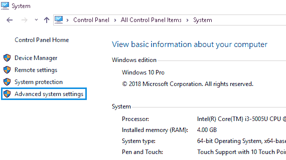
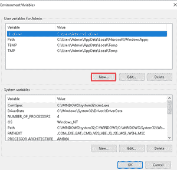
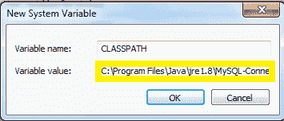
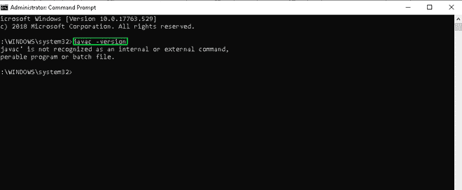
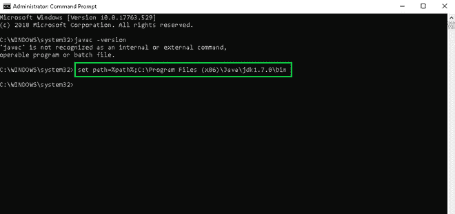
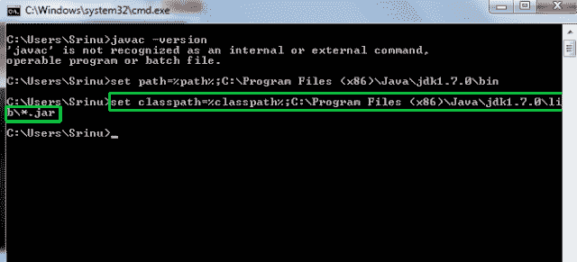
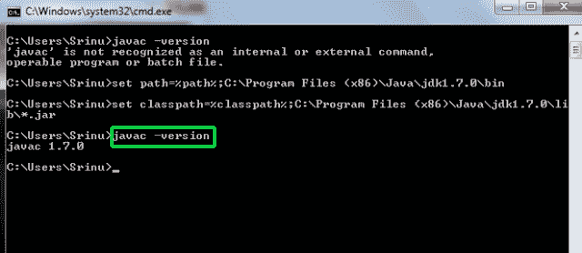
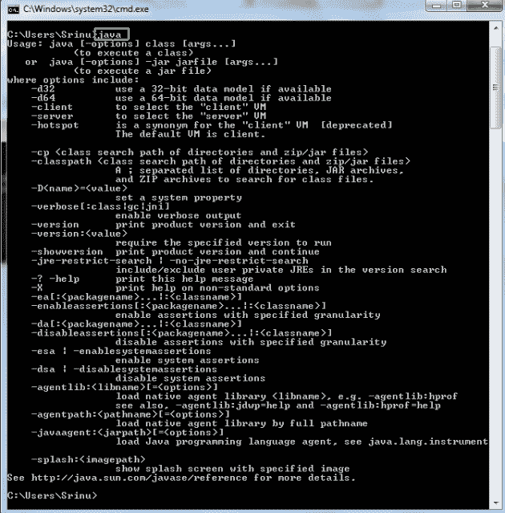

# 如何在 Windows 中用 Java 设置多个类路径？

> 原文:[https://www . geesforgeks . org/如何在 windows 中设置多个 java 类路径/](https://www.geeksforgeeks.org/how-to-set-multiple-classpath-in-java-in-windows/)

在 java 中，您必须在运行任何 JAVA 程序之前正确设置 PATH 和 CLASSPATH 变量。安装 JDK 后，下一步是在 Windows 系统环境变量中设置路径和类路径变量。类路径是一个环境变量，应用程序类加载器使用它来定位和加载类文件。

要设置类路径，有以下方法:

**A.** 可以在环境中永久设置 CLASSPATH。

*   点击窗口按钮，选择控制面板选择系统。

*   单击高级系统设置。

*   将会打开一个对话框。单击环境变量。

*   如果系统变量中已经存在类路径，单击编辑按钮，然后放一个分号(；)结尾。粘贴 MySQL-Connector Java.jar 文件的路径。
    否则点击新建按钮。

*   将变量名键入为 CLASSPATH，变量值键入为 C:\ Program Files \ Java \ JRE 1.8 \ MySQL-Connector Java . jar；。；
    注:放；。；在类路径的末尾。

**B.** 可以使用命令提示符设置类路径:

*   安装最新的 JDK
*   打开命令提示符，输入命令:javac -version，显示如下错误。

*   设置路径:

> 设置路径= % path %<java installed="" directory=""></java>
> 
> 例如:设置路径= % path %c:\程序文件(x86)\Java\jdk1.7.0\bin

*   现在设置类路径，即

> 设置类路径= % classpath %<java installed="" directory=""></java>
> 
> 例如:设置类路径= % classpath %c:\程序文件(x86)\Java\jdk1.7.0\lib\*。冲突

*   测试 **javac** 和 **java** 命令

 

*   现在在 cmd 中键入 java

*   现在 java 已经为你准备好了。