# 如何设置安卓的处理？

> 原文:[https://www . geeksforgeeks . org/如何为 android 设置处理/](https://www.geeksforgeeks.org/how-to-set-up-processing-for-android/)

**Processing** 是一个免费的图形库， **I** 集成了 **D** 开发 **E** 环境(IDE)，专为电子艺术和视觉设计社区打造。它是当今最强大的用于创建视觉算法艺术作品的库之一，包括 2D 和 3D。它是开源的，基于 Java，并带有各种各样的功能，旨在使绘图和绘画代码既有趣又容易。我们可以使用我们的编码技巧创建不同类型的艺术，例如游戏、动画和物理引擎等。

在你的安卓应用程序中使用 Processing 的核心库，你可以创建高性能的图形和动画，而不用处理安卓的 OpenGL 或 Canvas APIs。通常，您甚至不需要为管理线程、创建渲染循环或保持帧速率等低级任务而烦恼。在本文中，我们将讨论如何为安卓设置[处理](https://processing.org/)。

### **分步实施**

**第一步:**从[这个链接](https://processing.org/download/)下载适合你的操作系统(OSX、Windows 或 Linux)的 Processing 3.0。

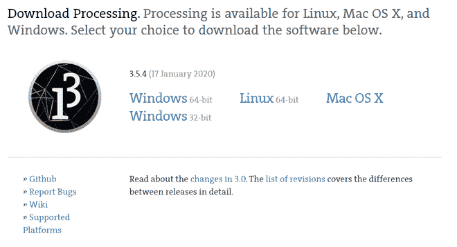

**第二步:**提取任意文件夹中的 Zip 文件，打开**processing.exe**文件。

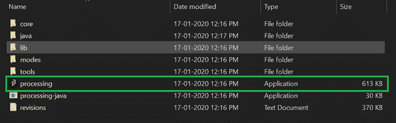

**第三步:**应用程序打开后，点击如下图所示的图标‘**添加更多**。

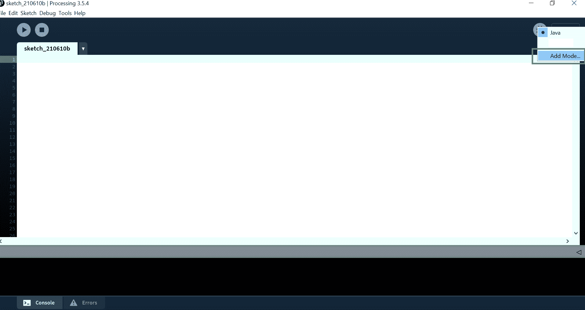

**第四步:**现在安装**安卓模式**。

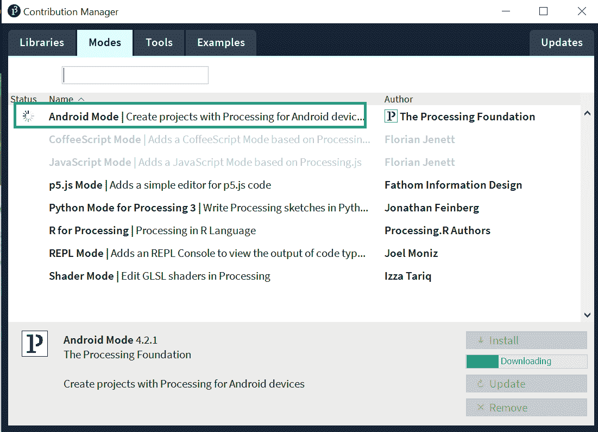

**第五步:**如果电脑上没有**安卓 SDK** 安装。

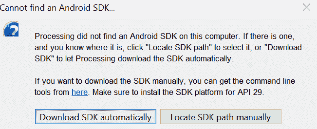

安装[安卓 SDK](https://www.geeksforgeeks.org/android-sdk-and-its-components/) 后，我们的安卓处理安装部分就完成了，现在我们在上面做项目。

### **启动设备**

现在，为了在我们的设备上运行，我们必须让我们的设备保持在开发者模式，就像我们在安卓系统和通过 USB 一样。

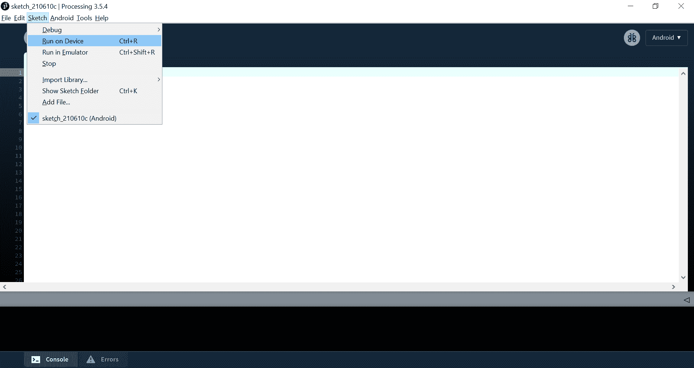

**示例代码:**

## Java 语言(一种计算机语言，尤用于创建网站)

```java
// Program to show moving Ball and changing colour.

// Set up variable position,colour and velocity.
PVector pos;
PVector vel;
int col;

// Function to set up size of canvas
// and position,velocity and colour.
void setup(){
  size(600, 600);
  pos = new PVector(width/2, height/2);
  vel = new PVector(random(-4, 4), random(-4, 4));
  col = floor(random(0, 255));
}

// Function to draw eclipse.
void draw(){
  background(col);
  fill(231);
  checkValid();
  fill(204, 102, 0);
  ellipse(pos.x, pos.y, 50, 50);
  pos.add(vel);
}

// Function to check the position
// of ball must be within screen.
void checkValid(){
  if(pos.x <= 25 || pos.x >= width - 25){
    vel.x *= -1;

    // Change in colour when it hit the wall.
    col = floor(random(0 ,255));
  }
  if(pos.y <=25 || pos.y >= height - 25){
    vel.y *= -1;

    // Change in colour when it hit the wall.
    col = floor(random(0 ,255));
  }
}
```

**输出:**

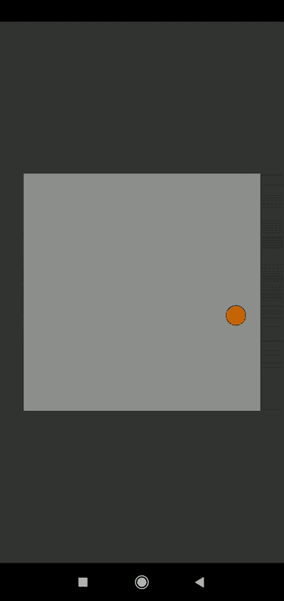

### **在仿真器上运行**

要在模拟器上运行，我们必须安装它。

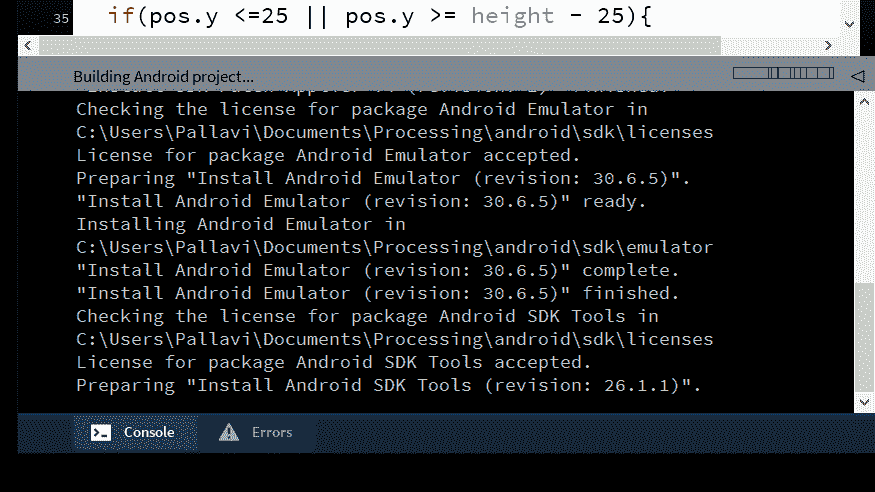

要查看是否安装，请转到**C:\ user \ Documents \ Processing \ Android \ SDK**必须有一个文件夹名 Emulator。要运行，请单击“**在仿真器**上运行”。

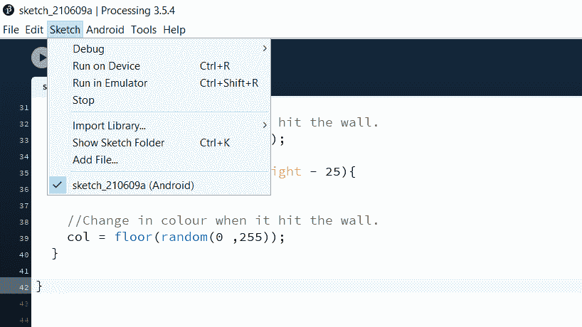

**控制台中:**

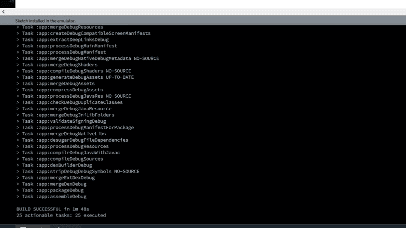

**输出:**

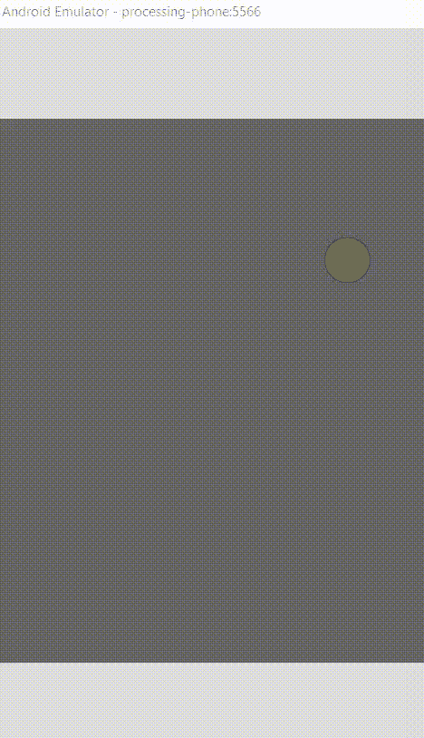

> **注意:**如果你不能在模拟器上运行，那么在**管理员模式下打开 processing.exe。**