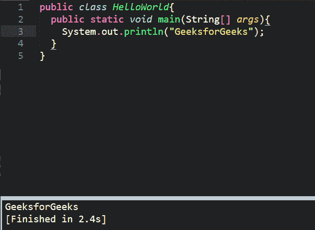

# 如何在 Windows 中为 Java 设置崇高文字 3？

> 原文:[https://www . geesforgeks . org/如何设置-崇高-文本-3-for-Java-in-window/](https://www.geeksforgeeks.org/how-to-setup-sublime-text-3-for-java-in-windows/)

[Java](https://www.geeksforgeeks.org/java/) 是最流行、使用最广泛的面向对象编程语言之一。Java 语法类似于 C/C++。但是 Java 不提供像指针这样的低级编程功能。此外，Java 代码总是以类和对象的形式编写。Java 代码首先被编译成字节代码(独立于机器的代码)。然后字节码在 Java 虚拟机(JVM)上运行，而不考虑底层架构。

由谷歌工程师编写的崇高文本是一个用 C++和 Python 开发的跨平台 IDE。它对 Python 有基本的内置支持。崇高的文本是快速的，你可以根据需要定制这个编辑器来创建一个完整的 Python 开发环境。您可以安装调试、自动完成、代码林挺等软件包。还有各种科学发展包，Django，Flask 等等。

#### 下载和安装

Java 可以从[oracle.com](https://www.oracle.com/java/technologies/javase-downloads.html)下载。要在 Windows 上安装 Java 编译器，请通过[如何在 Windows 上安装 Java？](https://www.geeksforgeeks.org/how-to-download-and-install-java-for-64-bit-machine/)

崇高文本 3 可以从其官方网站[sublimetext.com](https://www.sublimetext.com/3)下载。要在 Windows 上安装崇高文字 3，请通过[如何在 Windows 中安装崇高文字 3？](https://www.geeksforgeeks.org/how-to-install-sublime-text-3-in-windows/)

#### 设置环境变量

*   **第一步:**点击**高级系统设置**链接。
    
*   **Step 2:** Click **Environment Variables**. In the section System Variables, find the PATH environment variable and select it. Click Edit. If the PATH environment variable does not exist, click New.
    

    

*   **步骤 3:** 在编辑系统变量(或新系统变量)窗口中，指定**路径环境变量**的值。单击确定。单击确定关闭所有剩余窗口。

#### 致力于卓越的文本 3

安装过程结束后，我们完成了环境设置，我们需要测试我们的编译器和 IDE 是否工作。为此，我们将编写一个简单的基于输出的程序:

```
public class HelloWorld 
{
    public static void main(String[] args)
    {
        System.out.println("GeeksforGeeks");
    }
}
```

