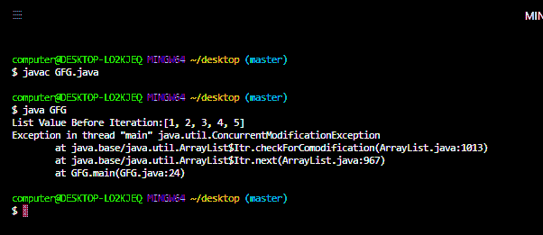

# 如何解决 Java 中的 ConcurrentModificationException？

> 原文:[https://www . geesforgeks . org/how-solve-concurrentmodification exception-in-Java/](https://www.geeksforgeeks.org/how-to-solve-concurrentmodificationexception-in-java/)

扰乱程序正常流程的未被接受的、不想要的事件称为[异常](https://www.geeksforgeeks.org/exceptions-in-java/)。大多数时候异常是由我们的程序引起的，这些是可以恢复的。例如:如果我们的程序要求从位于美国的远程文件中读取数据。在运行时，如果远程文件不可用，那么我们将得到[运行时异常](https://www.geeksforgeeks.org/java-program-to-handle-runtime-exceptions/)表示[文件未找到异常](https://www.geeksforgeeks.org/java-io-filenotfoundexception-in-java/)。如果出现 FileNotFoundException，我们可以向程序提供本地文件，以便正常读取和继续程序的其余部分。


java 中异常主要有两种[类型，如下所示:](https://www.geeksforgeeks.org/checked-vs-unchecked-exceptions-in-java/)

1.  **检查异常**是编译器在运行时为程序的顺利执行而检查的异常，称为检查异常。在我们的程序中，如果有机会出现检查异常，那么我们应该强制处理该检查异常(通过 try-catch 或 throws 关键字)，否则我们将得到**一个**编译时错误。
2.  **未检查异常**是指编译器未检查的异常，无论程序员是否处理这类异常都称为未检查异常。未检查异常的例子有[算术异常](https://www.geeksforgeeks.org/types-of-exception-in-java-with-examples/)、[数组异常](https://www.geeksforgeeks.org/arraystoreexception-in-java/)、**、**等。

> **注意:**是否检查异常只有在编译时不可能出现任何异常的情况下，每个异常才会在运行时出现。

**实施:**

**ConcurrentModificationException**是 [RuntimeException](https://www.geeksforgeeks.org/java-program-to-handle-runtime-exceptions/) 的子类，因此它是一个未检查的异常。当一个对象试图在不允许的情况下被同时修改时，即当一个线程正在迭代某个集合类对象时，如果其他线程试图修改或试图对该集合对象进行一些更改，那么我们将得到 ConcurrentModificationException。当我们使用 Java 集合类时，通常会出现这种异常。

**例**

## Java 语言(一种计算机语言，尤用于创建网站)

```
// Java program to illustrate
// ConcurrentModificationException

// Importing all classes from java.util package
// Importing input output classes
import java.io.*;
import java.util.*;

// Main Class
class GFG {

    // Main driver method
    public static void main(String[] args)
    {

        // Creating an object of ArrayList
        // Declaring object of Integer type
        ArrayList<Integer> list = new ArrayList<>();

        // Adding element to ArrayList object created above
        // using the add() method
        // Custom input elements
        list.add(1);
        list.add(2);
        list.add(3);
        list.add(4);
        list.add(5);

        // Display all the elements of ArrayList object
        System.out.println("List Value Before Iteration:"
                           + list);

        // Creating an iterator object to
        // iterate over the ArrayList
        Iterator<Integer> it = list.iterator();

        // Condition check
        // It holds true till there is single element
        // remaining in the List
        while (it.hasNext()) {
            Integer value = it.next();

            // Here we are trying to remove the one entry of
            // ArrayList base on the if condition and hence

            // We will get Concurrent ModificationException
            if (value.equals(3))
                list.remove(value);
        }

        // Print and display the value of ArrayList object
        System.out.println("List Value After Iteration:"
                           + list);
    }
}
```

**输出:**



输出解释:

上面的程序是一个单线程程序，这里我们可以通过使用迭代器的 remove()函数来避免 ConcurrentModificationException，我们可以从底层集合对象中移除一个对象，而不会得到任何异常。

**例 2**

## Java 语言(一种计算机语言，尤用于创建网站)

```
// Java Program to illustrate
// ConcurrentModificationException

// Importing the required packages
import java.io.*;
import java.util.*;
import java.util.Iterator;

// Main Class
class GFG {

    // Main driver method
    public static void main(String[] args)
    {

        // Creating an collection class object
        // Declaring object of integer type
        ArrayList<Integer> list = new ArrayList<>();

        // Adding element to ArrayList
        // using add() method

        // Custom integer input entries
        list.add(1);
        list.add(2);
        list.add(3);
        list.add(4);
        list.add(5);

        // Display the value of ArrayList
        System.out.println("List Value Before Iteration:"
                           + list);

        // Creating an iterator object
        // to iterate over the ArrayList
        Iterator<Integer> itr = list.iterator();

        // Condition check
        // it holds true till there is single element
        // remaining in the List
        while (itr.hasNext()) {

            // next() method() loos out for next element in
            // the List
            Integer value = itr.next();

            // Here we are trying to remove the one entry of
            // ArrayList base on the given if condition and
            // hence

            // We will get Concurrent ModificationException
            if (value.equals(3))
                itr.remove();
        }
        // Display the value of ArrayList
        System.out.println("List Value After iteration:"
                           + list);
    }
}
```

**Output**

```
List Value Before Iteration:[1, 2, 3, 4, 5]
List Value After iteration:[1, 2, 4, 5]
```

> **注意:**在多线程程序中，我们可以通过使用[concurrentmodificationexception](https://www.geeksforgeeks.org/concurrenthashmap-in-java/)和 [CopyOnWriteArrayList 类](https://www.geeksforgeeks.org/copyonwritearraylist-in-java/)来避免 concurrentmodificationexception。这些类帮助我们避免 concurrentmodificationexception。