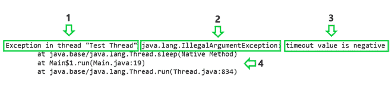

# 如何解决 Java 中的 IllegalArgumentException？

> 原文:[https://www . geesforgeks . org/how-solution-illegalargumentexception-in-Java/](https://www.geeksforgeeks.org/how-to-solve-illegalargumentexception-in-java/)

程序执行过程中发生的意外事件称为 [**异常**](https://www.geeksforgeeks.org/exceptions-in-java/) 。这可能是由多种因素造成的，如无效的用户输入、网络故障、内存限制、试图打开不存在的文件等。

如果发生异常，将生成一个异常对象，包含异常的位置、名称和类型。这必须由程序来处理。如果不处理，它会传递到默认的异常处理程序，导致程序异常终止。

**非法引数异常**

IllegalArgumentException 是 java.lang.RuntimeException 的子类。RuntimeException，顾名思义，在程序运行时发生。因此，它不会在编译时被检查。

**非法引数异常原因**

当方法被传递非法或不合适的参数时，将引发 IllegalArgumentException。

下面的程序有一个单独的线程，暂停一下，然后尝试打印一个句子。这种暂停是使用睡眠方法实现的，该方法接受以毫秒为单位的暂停时间。Java 明确定义这个时间必须是非负数。让我们看看传入负值的结果。

演示非法文档异常的程序:

## Java 语言(一种计算机语言，尤用于创建网站)

```java
// Java program to demonstrate IllegalArgumentException
public class Main {

    public static void main(String[] args)
    {

        // Create a simple Thread by
        // implementing Runnable interface
        Thread t1 = new Thread(new Runnable() {
            public void run()
            {
                try {
                    // Try to make the thread sleep for -10
                    // milliseconds
                    Thread.sleep(-10);
                }
                catch (InterruptedException e) {
                    e.printStackTrace();
                }
                System.out.println(
                    "Welcome To GeeksforGeeks!");
            }
        });

        // Name the thread as "Test Thread"
        t1.setName("Test Thread");

        // Start the thread
        t1.start();
    }
}
```

**输出:**

```java
Exception in thread "Test Thread" java.lang.IllegalArgumentException: 
timeout value is negative
    at java.base/java.lang.Thread.sleep(Native Method)
    at Main$1.run(Main.java:19)
    at java.base/java.lang.Thread.run(Thread.java:834)
```

> **在上述情况下，异常未被捕获。因此，程序突然终止，生成的堆栈跟踪被打印出来。**

**诊断&解决方案**

堆栈跟踪是调查异常问题根本原因的最终资源。上面的堆栈跟踪可以分解如下。



**第 1 部分:**该部分命名异常发生的线程。在我们的例子中，异常发生在“测试线程”中。

**第 2 部分:**该部分命名异常的类。“Java . lang . illegalargumentexception”类的一个异常对象在上面的示例中生成。

**第三部分:**该部分陈述了异常发生的原因。在上面的示例中，出现异常是因为使用了非法的负超时值。

**第 4 部分:**这一部分列出了导致异常发生的所有方法调用，从异常首次发生的方法开始。在上例中，异常首先发生在[**thread . sleep()**](https://www.geeksforgeeks.org/java-concurrency-yield-sleep-and-join-methods/)**方法。**

**从上面的分析中，我们得出结论，在 Thread.sleep()方法中发生了一个 IllegalArgumentException，因为它被传递了一个负超时值。这些信息足以解决问题。让我们相应地对上面的代码进行修改，并传递一个正的超时值。**

**下面是问题陈述的实现:**

## **Java 语言(一种计算机语言，尤用于创建网站)**

```java
// Java program to demonstrate Solution to
// IllegalArgumentException

public class Main {

    public static void main(String[] args)
    {

        // Create a simple Thread by
        // implementing Runnable interface
        Thread t1 = new Thread(new Runnable() {
            public void run()
            {
                try {
                    // Try to make the thread sleep for 10
                    // milliseconds
                    Thread.sleep(10);
                }
                catch (InterruptedException e) {
                    e.printStackTrace();
                }
                System.out.println(
                    "Welcome To GeeksforGeeks!");
            }
        });

        // Name the thread as "Test Thread"
        t1.setName("Test Thread");
        // Start the thread
        t1.start();
    }
}
```

****Output**

```java
Welcome To GeeksforGeeks!
```**