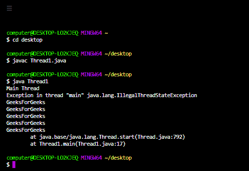
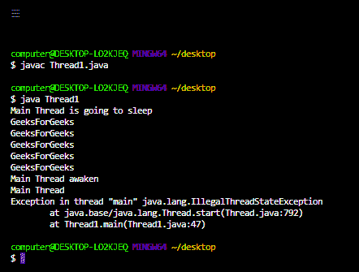

# 如何解决 java 主线程中的 Java . lang . illegalsteexception？

> 原文:[https://www . geesforgeks . org/how-solution-Java-lang-illegalstatexception-in-Java-main-thread/](https://www.geeksforgeeks.org/how-to-solve-java-lang-illegalstateexception-in-java-main-thread/)

扰乱程序正常流程的未被接受的、不想要的事件称为[](https://www.geeksforgeeks.org/exceptions-in-java/)****。****

**大多数时候异常是由我们的程序引起的，这些是可以恢复的。例如:如果我们的程序要求从位于美国的远程文件中读取数据。在运行时，如果远程文件不可用，那么我们将得到一个 RuntimeException，表示 fileNotFoundException。如果出现 fileNotFoundException，我们可以向程序提供本地文件，以便正常读取和继续程序的其余部分。**

**java 中主要有[两种异常类型](https://www.geeksforgeeks.org/checked-vs-unchecked-exceptions-in-java/)，如下:**

****1。选中异常:****

**编译器在运行时为程序的顺利执行而检查的异常称为检查异常。在我们的程序中，如果有机会出现检查异常，那么我们应该强制处理该检查异常(通过 try-catch 或 throws 关键字)，否则我们将得到编译时错误。**

**被检查的异常的例子有 ClassNotFoundException、IOException、SQLException 等。**

****2。未选中异常:****

**编译器不检查的异常，无论程序员是否处理这种类型的异常，都被称为未检查的异常。**

**未检查异常的例子有算术异常、数组异常等。**

> **是否检查异常只有在编译时不可能出现任何异常时，每个异常才会在运行时出现。**

****illegalsteexception**是 RuntimeException 的子类，因此它是一个未检查的异常。程序员或应用编程接口开发人员会显式地引发此异常，以指示某个方法在错误的时间被调用。通常，此方法用于指示在非法或不适当的时间调用方法。**

**示例:在启动一个线程后，我们不允许再次重新启动同一个线程，否则我们将得到运行时异常，提示 IllegalStateException。**

****示例 1:** 当 start()方法已经在执行 run()方法时，我们调用它。**

## **Java 语言(一种计算机语言，尤用于创建网站)**

```
// Java program to show the occurrence of
// IllegalStateException.

// Import required packages

import java.io.*;
import java.util.*;

// Creating a thread in our myThread class by extending the
// Thread class
// class 1
// Helper class

class myThread extends Thread {

    // Method in helper class
    // declaring run method
    public void run()
    {

        for (int i = 0; i < 5; i++) {

            // Display message
            System.out.println("GeeksForGeeks");
        }
    }
}

// class 2
// Main class
class Thread1 {

    // Main driver method
    public static void main(String[] args)
    {
        // creating a thread object  in the main() method
        // of our helper class above
        myThread t = new myThread();

        // Starting the above created thread
        // using the start() method
        t.start();

        // Display Message
        System.out.println("Main Thread");

        // starting the thread again when it is already
        // running and hence it cause an exception
        t.start();
    }
}
```

 **

**示例 2:** 当线程已经执行完 run()方法时，我们在线程上调用 start()方法。

## Java 语言(一种计算机语言，尤用于创建网站)

```
// Java program to show the occurrence of
// IllegalStateException.

// Import required packages
import java.io.*;
import java.util.*;

// Creating a thread in our myThread class by extending the
// Thread class
// class 1
// Helper class
class myThread extends Thread {

    // Method in helper class
    // declaring run method
    public void run()
    {

        for (int i = 0; i < 5; i++) {

            // Display message
            System.out.println("GeeksForGeeks");
        }
    }
}

// class 2
// Main class
class Thread1 {

    // Main driver method
    public static void main(String[] args)
    {
        // creating a thread object  in the main() method
        // of our helper class above
        myThread t = new myThread();

        // Starting the above created thread
        // using the start() method
        t.start();

        try {
            System.out.println("Main Thread is going to sleep");

            // making main thread sleep for 2000ms
            t.sleep(2000);
            System.out.println("Main Thread awaken");
        }
        catch (Exception e) {
            System.out.println(e);
        }

        // Display Message
        System.out.println("Main Thread");

        // calling start( ) method on a dead thread
        // which causes exception
        t.start();
    }
}
```



**如何解决这个错误？**

为了避免 java 主线程中出现 Java . lang . illegalstatexception，我们必须确保代码中的任何方法都不能在非法或不适当的时间被调用。

在上面的例子中，如果我们在线程 t 上只调用 start()方法一次，那么我们将不会得到任何 any java.lang.IllegalStateException，因为我们没有在线程启动后调用 start()方法(即，我们没有在非法或不适当的时间调用 start()方法。)

## Java 语言(一种计算机语言，尤用于创建网站)

```
// Java program to demonstrate that the error
// does not occure in this program

// Import required packages
import java.io.*;
import java.util.*;

// Creating a thread in our myThread class by extending the
// Thread class
// class 1
// Helper class
class myThread extends Thread {

    // Method in helper class
    // declaring run method
    public void run()
    {

        for (int i = 0; i < 5; i++) {

            // Display message
            System.out.println("GeeksForGeeks");
        }
    }
}

// class 2
// Main class
class Thread1 {

    // Main driver method
    public static void main(String[] args)
    {
        // creating a thread object  in the main() method
        // of our helper class above
        myThread t = new myThread();

        // Starting the above created thread
        // using the start() method
        t.start();

        try {
            System.out.println("Main Thread is going to sleep");

            // making main thread sleep for 2000ms
            t.sleep(2000);

            System.out.println("Main Thread awaken");
        }
        catch (Exception e) {
            System.out.println(e);
        }

        // Display Message
        System.out.println("Main Thread");
    }
}
```

**