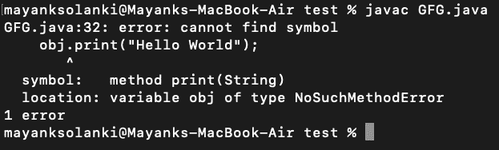

# 如何解决 java 中的 java.lang.NoSuchMethodError？

> 原文:[https://www . geesforgeks . org/how-solution-Java-lang-nosuchmethod error-in-Java/](https://www.geeksforgeeks.org/how-to-solve-java-lang-nosuchmethoderror-in-java/)

a***java . lang . nosuchmethod error***顾名思义，是 Java 中的一个运行时错误，当调用一个在编译时存在但在运行时不存在的方法时，就会出现这个错误。如果应用程序代码被部分编译，或者项目中的外部依赖关系不兼容地将代码从一个版本更改为另一个版本(例如，删除了调用方法)，就会出现 java.lang.NoSuchMethodError。如下图所示:

插图:

```
java.lang
Class NoSuchMethodError
    java.lang.Object
        java.lang.Throwable
            java.lang.Error
                java.lang.LinkageError
                    java.lang.IncompatibleClassChangeError
                        java.lang.NoSuchMethodError
```

> **注意:**所有实现的接口都是[Java 中的可序列化接口](https://www.geeksforgeeks.org/serializable-interface-in-java/)。

现在让我们讨论这个异常背后的原因，以便找出如何解决同一个问题。当找不到特定的方法时，就会发生这种情况。该方法可以是实例方法，也可以是静态方法。当应用程序在运行时找不到方法时，就会出现 java.lang.NoSuchMethodError。在大多数情况下，我们能够在编译时捕捉到这个错误。因此，这不是一个大问题。然而，有时它可能在运行时被抛出，然后发现它变得有点困难。根据 Oracle 文档，如果一个类发生了不可比拟的变化，那么这个错误可能会在运行时发生。因此，在以下情况下，我们可能会遇到此错误。首先，如果我们只是对代码进行部分重新编译。其次，如果我们的应用程序中存在版本不兼容的依赖项，比如外部 jar。

> **注意:**nosuchmethodserror 继承树包括不兼容类类变更错误和链接类错误。这些错误与编译后不兼容的类更改有关。

**实施:**

现在我们将提出两个例子，首先我们将说明抛出的异常，然后在后面的例子中，通过干净的 java 问题解决同样的问题。

**例 1**

## Java 语言(一种计算机语言，尤用于创建网站)

```
// Java Program to Demonstrate NoSuchMethodError by 
// throwing it due to a breaking change 
// introduced within an application

// Importingn I/O classes
import java.io.*;

// Class 1
// Helper class
class NoSuchMethodError {

    // Method 1
    // Void demo method created to be called
    // in another class containing main() method
    public void printer(String myString)
    {

        // Print statement
        System.out.println(myString);
    }
}

// Class 2
// Main class
public class GFG {

    // Main driver method
    public static void main(String[] args)
    {

        // Creating object of class 1
        NoSuchMethodError obj = new NoSuchMethodError();

        // Now calling print() method which is not present
        // in NoSuchMethodErrorExample class, hence throwing
        // exception
        obj.print("Hello World");
    }
}
```

**输出:**



> 现在，如果我们试图得出解决上述错误的可能解决方案的结论。为此，我们需要注意下面列出的两个参数:
> 
> *   调用课堂上出现的正确方法。
> *   检查您试图调用的方法的名称及其签名。

**例 2**

## Java 语言(一种计算机语言，尤用于创建网站)

```
// Java Program to Resolve NoSuchMethodError

// Importing input output classes
import java.io.*;

// Class 1
// Helper class
class NoSuchMethodError {
    // Defined printer method
    public void printer(String myString)
    {
        // Print the string which will be passed
        // in the main() method
        System.out.println(myString);
    }
}

// Class 2
// Main Class
public class GFG {

    // Main driver method
    public static void main(String[] args)
    {
        // Creating object of above class in
        // main() method of this class
        NoSuchMethodError obj
            = new NoSuchMethodError();

        // Calling printer() method which is  present in
        // NoSuchMethodErrorExample class
        obj.printer("Hello World");
    }
}
```

**Output**

```
Hello World

```