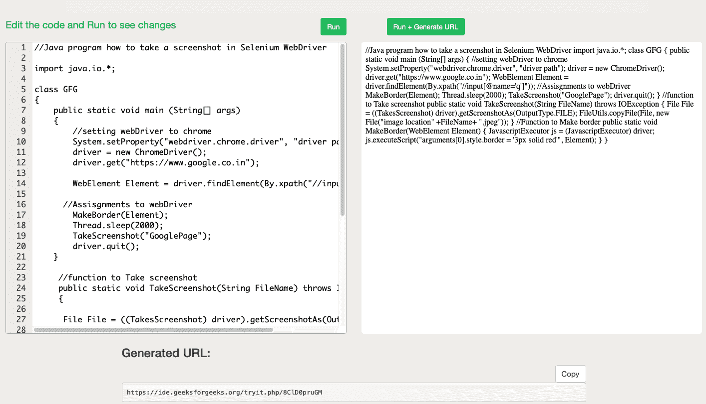

# 如何用 Java 在 Selenium 网络驱动中截图？

> 原文:[https://www . geesforgeks . org/如何截图-in-selenium-web driver-use-Java/](https://www.geeksforgeeks.org/how-to-take-a-screenshot-in-selenium-webdriver-using-java/)

硒[网络驱动](https://www.geeksforgeeks.org/applications-and-uses-of-selenium-webdriver/) 是一个开源应用程序接口的集合，用于自动化网络应用程序的测试。为了在硒中捕捉的截图，必须使用截图方法。这就通知 WebDriver 应该 **在 Selenium** 中取 一张 **截图保存。****Selenium**[**WebDriver**](https://www.geeksforgeeks.org/applications-and-uses-of-selenium-webdriver/)工具用于自动化 web 应用程序测试，以验证其是否按预期工作。它支持很多浏览器。这里我们将以 chrome 为例。

**语法:**

```java
File file = ((TakesScreenshot) driver) ;

```

在这里，我们将学习如何在 selenium web 驱动程序中截图，并使用 Java Binding 突出显示元素。

bug 分析需要截图，尤其是在测试用例失败的情况下。每当一个测试用例失败时，我们需要一些附件来验证这个失败。Selenium 可以在执行过程中自动截图，我们还可以标记一个边框来突出显示该元素。

**在 selenium web 驱动程序中截图的步骤:**

**1。**截图保存成文件格式

**2。**使用 CopyFile 方法将截图复制到某个位置

> 文件复制文件(文件，新文件(“您想要保存图像的位置”+文件名+)。JPEG "))；

**3。**在元素周围创建边框:使用 JavaScript 执行器，我们可以在想要的元素周围创建边框。

```java
JavascriptExecutor js = (JavascriptExecutor) driver;

js.executeScript("arguments[0].style.border = '3px solid red'", Element);

```

有关实现部分，请参考下面的完整代码

## Java 语言(一种计算机语言，尤用于创建网站)

```java
// Java program how to take
// a screenshot in Selenium
// WebDriver

import java.io.*;

class GFG {
    public static void main(String[] args)
    {
        // Setting webDriver to chrome
        System.setProperty("webdriver.chrome.driver",
                           "driver path");
        driver = new ChromeDriver();
        driver.get("https://www.google.co.in");

        WebElement Element = driver.findElement(
            By.xpath("//input[@name='q']"));

        // Assisgnments to webDriver
        MakeBorder(Element);
        Thread.sleep(2000);
        TakeScreenshot("GooglePage");
        driver.quit();
    }

    // Function to Take screenshot
    public static void TakeScreenshot(String FileName)
        throws IOException
    {
        // Creating instance of File
        File File = ((TakesScreenshot)driver)
                        .getScreenshotAs(OutputType.FILE);

        FileUtils.copyFile(File,
                           new File("image location"
                                    + FileName + ".jpeg"));
    }

    // Function to Make border
    public static void MakeBorder(WebElement Element)
    {

        JavascriptExecutor js = (JavascriptExecutor)driver;
        js.executeScript(
            "arguments[0].style.border = '3px solid red'",
            Element);
    }
}
```

**输出**:

